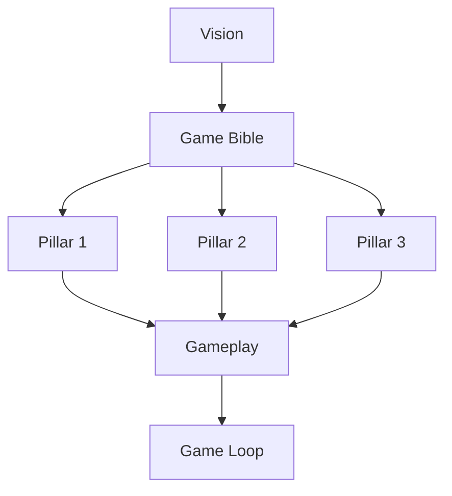

# Game Bible

| Field | Value |
|-------|-------|
| **Document** | Game Bible |
| **Path** | `docs/01_Game_Design/Game_Bible.md` |
| **Version** | 1.0.0 |
| **Status** | Draft — Future Executive Design Document |
| **Last Updated** | 2026-06-28 |
| **Authoritative Source** | ChatGPT (product design) |
| **Compiler** | Cursor |
| **Phase** | Documentation Phase 1 — Knowledge Base |
| **Priority** | 5 of 5 (authoritative writing order) |

## Navigation

| ← Previous | Next → | Index |
|------------|--------|-------|
| [LLDL](../02_Design_System/LLDL/LLDL.md) | — | [LLDS Home](../README.md) |

---

## Purpose

The **single narrative and design reference** for Labyrinth Legends gameplay identity — player fantasy, pillars, tone, and world framing. Expands [Vision](../00_Project/Vision.md) into game-facing language without duplicating mechanical rules.

## Scope

### In scope

- Elevator pitch and player fantasy
- Core design pillars
- Emotional tone and world tone
- Progression fantasy (narrative framing, not numbers)

### Out of scope

- Input rules and win conditions (see [Gameplay](Gameplay/Gameplay.md))
- Screen-by-screen flow (see [Game Loop](Game_Loop/Game_Loop.md))
- Cell types and interactions (see [Mechanics](Mechanics.md))
- World/level data (see [Worlds](Worlds.md), [Level_Design](Level_Design.md))
- Visual tokens (see [LLDL](../02_Design_System/LLDL/LLDL.md))

## Dependencies

| Depends on | Notes |
|------------|-------|
| [Vision](../00_Project/Vision.md) | Must be approved before Game Bible is finalized |

| Enables | Notes |
|---------|-------|
| [Gameplay](Gameplay/Gameplay.md) | Rules express pillars |
| [Game Loop](Game_Loop/Game_Loop.md) | Flow expresses session fantasy |
| [Worlds](Worlds.md) | World tone and naming |
| [Progression](Progression.md) | Meta progression framing |

## Related Documents

| Document | Relationship |
|----------|--------------|
| [Vision](../00_Project/Vision.md) | Parent product vision |
| [Gameplay](Gameplay/Gameplay.md) | Mechanical expression of pillars |
| [Game Loop](Game_Loop/Game_Loop.md) | Session structure |
| [Mechanics](Mechanics.md) | Tile and interaction detail |
| [LLDL](../02_Design_System/LLDL/LLDL.md) | Visual expression of tone |
| [Worlds](Worlds.md) | World structure |

## Pillar Dependency

---

## 1. Elevator Pitch

> **Pending ChatGPT specification.**

_[One to three sentences. To be provided by ChatGPT.]_

## 2. Player Fantasy

> **Pending ChatGPT specification.**

| Element | Description |
|---------|-------------|
| Who is the player? | _[To be specified]_ |
| What do they want? | _[To be specified]_ |
| What makes them feel capable? | _[To be specified]_ |

## 3. Core Design Pillars

> **Pending ChatGPT specification.**

| # | Pillar | Player promise | Design constraint |
|---|--------|----------------|-------------------|
| 1 | _[Name]_ | _[To be specified]_ | _[To be specified]_ |
| 2 | _[Name]_ | _[To be specified]_ | _[To be specified]_ |
| 3 | _[Name]_ | _[To be specified]_ | _[To be specified]_ |
| 4 | _[Name]_ | _[To be specified]_ | _[To be specified]_ |
| 5 | _[Name]_ | _[To be specified]_ | _[To be specified]_ |

## 4. Emotional Tone

> **Pending ChatGPT specification.**

| Dimension | Target feeling | Avoid |
|-----------|----------------|-------|
| Pacing | _[To be specified]_ | _[To be specified]_ |
| Tension | _[To be specified]_ | _[To be specified]_ |
| Reward | _[To be specified]_ | _[To be specified]_ |

## 5. World Tone

> **Pending ChatGPT specification.**

| Topic | Description |
|-------|-------------|
| Setting | _[To be specified]_ |
| Era / civilization | _[To be specified]_ |
| Magic / technology framing | _[To be specified]_ |
| Antagonists / threats | _[To be specified]_ |

## 6. Progression Fantasy

> **Pending ChatGPT specification.**

Narrative framing for how the player advances — not numeric curves (see [Progression](Progression.md)).

| Stage | Fantasy beat |
|-------|--------------|
| Early | _[To be specified]_ |
| Mid | _[To be specified]_ |
| Late | _[To be specified]_ |

## 7. Content Boundaries

> **Pending ChatGPT specification.**

| Topic | In / Out | Notes |
|-------|----------|-------|
| PvP | _[TBD]_ | |
| Real-time combat | _[TBD]_ | |
| Narrative cutscenes | _[TBD]_ | |

---

## Cross References

- Upstream: [Vision](../00_Project/Vision.md)
- Downstream: [Gameplay](Gameplay/Gameplay.md), [Game Loop](Game_Loop/Game_Loop.md), [Mechanics](Mechanics.md), [Worlds](Worlds.md)
- Visual: [LLDL](../02_Design_System/LLDL/LLDL.md)
- Archive (non-authoritative): `docs/second-brain/01_Vision/`

## Version History

| Version | Date | Author | Summary |
|---------|------|--------|---------|
| 1.0.0 | 2026-06-28 | Cursor | Phase 1 scaffold — metadata, navigation, placeholders. Awaiting ChatGPT specification. |

## Open Items

| ID | Item | Owner | Status |
|----|------|-------|--------|
| GB-001 | Core pillars definition | ChatGPT | Open |
| GB-002 | Player fantasy narrative | ChatGPT | Open |
| GB-003 | World tone and content boundaries | ChatGPT | Open |

---

## Navigation

| ← Previous | Next → | Index |
|------------|--------|-------|
| [LLDL](../02_Design_System/LLDL/LLDL.md) | — | [LLDS Home](../README.md) |
