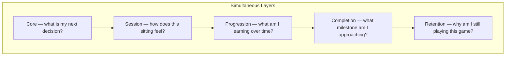
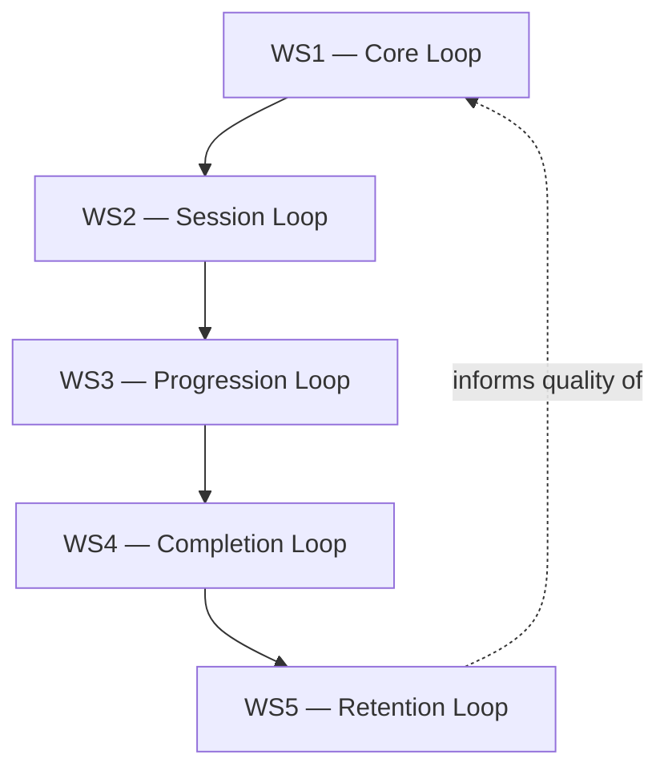
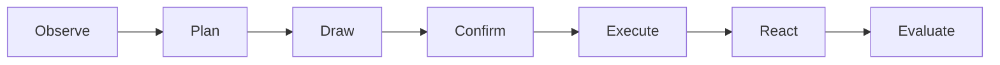
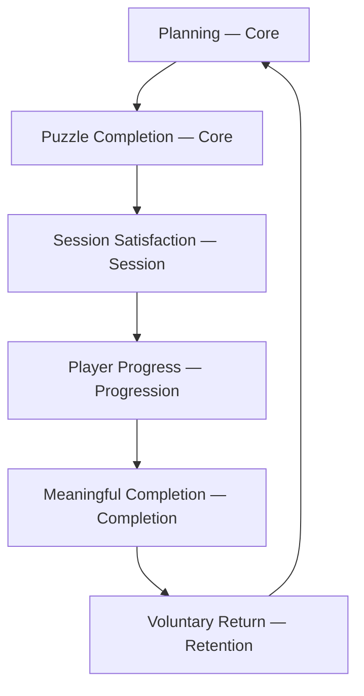
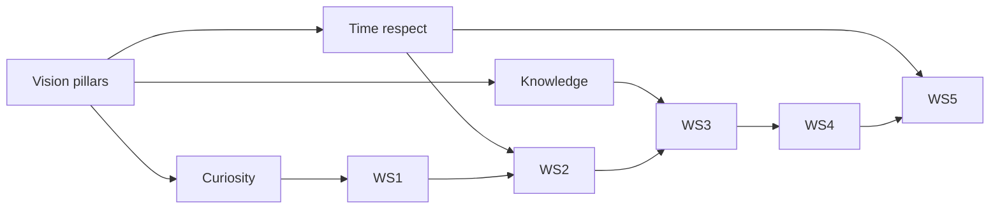
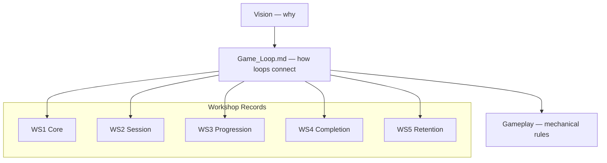

# Game Loop

| Field | Value |
|-------|-------|
| **Project** | Labyrinth Legends |
| **Document Name** | Game Loop |
| **Document ID** | LLDS-DOC-01-GL-001 |
| **Path** | `docs/01_Game_Design/Game_Loop.md` |
| **Version** | 2.0.0 |
| **Status** | Draft — Pending Review |
| **Owner** | Apoorv |
| **Prepared By** | ChatGPT (workshops) · Cursor (compiler) |
| **Last Updated** | 2026-06-29 |
| **Phase** | Documentation Phase 1 — Knowledge Base |
| **Priority** | 2 of 5 (authoritative writing order) |
| **Dependencies** | [Vision](../00_Project/Vision.md) · [WS1–WS5](Game_Loop/README.md) |
| **Related Documents** | [Gameplay Specs](Gameplay/README.md) · [GP1](Gameplay/Player_Explorer.md) · [GP2](Gameplay/Movement_System.md) · [GP3.1 Taxonomy](Gameplay/GP3/GP3.1_Puzzle_Taxonomy.md) · [Gameplay](Gameplay.md) · [Progression](Progression.md) · [Decisions](../00_Project/Decisions.md) |

## Navigation

| ← Previous | Next → | Index |
|------------|--------|-------|
| [Vision](../00_Project/Vision.md) | [Gameplay](Gameplay.md) | [LLDS Home](../README.md) · [Workshops WS1–WS5](Game_Loop/README.md) |

---

## Version History

| Version | Date | Author | Summary |
|---------|------|--------|---------|
| 1.0.0 | 2026-06-28 | Cursor | Phase 1 scaffold — placeholders |
| 1.1.0 | 2026-06-29 | Cursor | WS1–WS5 workshop outputs linked |
| 2.0.0 | 2026-06-29 | ChatGPT / Cursor | Consolidated gameplay loop architecture — synthesis of WS1–WS5 |

## Change Log

| Version | Change |
|---------|--------|
| 2.0.0 | Full architecture document: hierarchy, summaries, loop interaction, time scales, principles, failure cases, conclusions |

---

## Purpose

This document is the **primary reference for player flow** in Labyrinth Legends. It consolidates the five completed gameplay loop workshops into one unified architecture — explaining **how the loops work together** to create the complete player experience.

| Document | Role |
|----------|------|
| [WS1 — Core Loop](Game_Loop/WS1_Core_Loop.md) | Workshop record — moment-to-moment play |
| [WS2 — Session Loop](Game_Loop/WS2_Session_Loop.md) | Workshop record — single sitting |
| [WS3 — Progression Loop](Game_Loop/WS3_Progression_Loop.md) | Workshop record — long-term growth |
| [WS4 — Completion Loop](Game_Loop/WS4_Completion_Loop.md) | Workshop record — milestone closure |
| [WS5 — Retention Loop](Game_Loop/WS5_Retention_Loop.md) | Workshop record — voluntary return |
| **Game_Loop.md (this document)** | **Architecture synthesis — how all five connect** |

**Game_Loop.md** bridges [Vision](../00_Project/Vision.md) (philosophy) and [Gameplay](Gameplay.md) (mechanical rules). It does not redefine workshop content, mechanics, economy, story, UI, or implementation.

## Intended Audience

| Role | Use this document to… |
|------|------------------------|
| Game Designers | Place any feature within the loop hierarchy |
| Level Designers | Understand how chambers serve multiple time scales |
| Producers | Scope systems against architectural principles |
| Engineers | See where mechanics sit relative to player flow (detail in Gameplay) |
| UI/UX Designers | Understand flow without screen specs |
| QA Engineers | Evaluate builds against loop integrity |
| AI Coding Agents | Refuse features that break loop hierarchy or Vision alignment |

## Table of Contents

1. [Purpose of Game Loops](#1-purpose-of-game-loops)
2. [Gameplay Loop Architecture](#2-gameplay-loop-architecture)
3. [Core Loop Summary](#3-core-loop-summary)
4. [Session Loop Summary](#4-session-loop-summary)
5. [Progression Loop Summary](#5-progression-loop-summary)
6. [Completion Loop Summary](#6-completion-loop-summary)
7. [Retention Loop Summary](#7-retention-loop-summary)
8. [Interaction Between Loops](#8-interaction-between-loops)
9. [Time Scale of Loops](#9-time-scale-of-loops)
10. [Loop Design Principles](#10-loop-design-principles)
11. [Common Failure Cases](#11-common-failure-cases)
12. [Conclusions](#12-conclusions)

---

## 1. Purpose of Game Loops

### Why Gameplay Loops Exist

A gameplay loop is a **repeating unit of player experience** at a defined time scale. Loops give designers a shared language for *what the player is doing* and *why it should feel satisfying*.

Labyrinth Legends is not one loop — it is **five nested loops** operating simultaneously from seconds to months.

### Why Multiple Loops Are Required

| Single-loop thinking | Multi-loop architecture |
|----------------------|-------------------------|
| Optimizes one moment | Balances moment, session, career |
| Confuses puzzle quality with retention hacks | Separates craft from coercion |
| Collapses pacing | Each scale has its own design contract |

Without multiple loops, session design bleeds into core puzzle design, or retention systems compensate for weak moments — both violate [Vision](../00_Project/Vision.md).

### Simultaneous Operation Across Time Scales

At any moment, the player participates in all applicable layers:

The player draws a path (Core) inside a session (Session) that advances knowledge (Progression) toward a world completion (Completion) that supports voluntary return (Retention).

### Design Intent

Establish loops as **architectural layers**, not feature buckets. Every gameplay system must map to at least one layer.

---

## 2. Gameplay Loop Architecture

### Complete Hierarchy

| Layer | Depends on | Provides to next layer |
|-------|------------|------------------------|
| **Core** | [Vision](../00_Project/Vision.md) pillars | Repeatable satisfying moments |
| **Session** | Core moments that work | Composed sittings with pacing |
| **Progression** | Sessions that feel complete | Accumulated knowledge and access |
| **Completion** | Progress that matters | Emotional closure at milestones |
| **Retention** | Completion that satisfies | Voluntary return to Core |

Each layer **fails** if the layer below is weak. Retention cannot fix a broken core loop. A perfect core loop cannot excuse manipulative retention.

### Document Authority

| Question | Authoritative source |
|----------|---------------------|
| Loop philosophy and locked decisions | WS1–WS5 workshop documents |
| How loops connect (this document) | **Game_Loop.md** |
| Mechanical rules | [Gameplay](Gameplay.md) |
| Screen presentation | [LLDL](../02_Design_System/LLDL.md) · `docs/03_Screens/*` |

### Design Intent

Provide the **single hierarchy diagram** every team references before adding scope.

---

## 3. Core Loop Summary

> **Full specification:** [WS1 — Core Loop](Game_Loop/WS1_Core_Loop.md)

### Purpose

The atomic experience: **observe → plan → draw → confirm → execute → world reacts → evaluate**. The player thinks, commits, learns.

### Player Decisions

Meaningful route choices inside one labyrinth — priority, risk, optional treasure, path economy. Decisions matter more than rule count ([WS1-L04](Game_Loop/WS1_Core_Loop.md#10-workshop-conclusions)).

### Strategic Planning

Draw-and-confirm separates planning from outcome. No real-time steering in core puzzles ([WS1-L02](Game_Loop/WS1_Core_Loop.md#10-workshop-conclusions)). Failure instructs; it does not punish ([WS1-L03](Game_Loop/WS1_Core_Loop.md#10-workshop-conclusions)).

### At a Glance

### Design Intent

Core loop quality is **non-negotiable**. If this layer fails, no larger loop can save the product.

---

## 4. Session Loop Summary

> **Full specification:** [WS2 — Session Loop](Game_Loop/WS2_Session_Loop.md)

### Session Pacing

Easy opening → increasing complexity → mental breaks → peak challenge → relaxed ending ([WS2-L04](Game_Loop/WS2_Session_Loop.md#10-workshop-conclusions)). No artificial difficulty spikes.

### Session Rhythm

Typical flow: launch → continue → solve labyrinths → collect rewards → unlock progress → review → choose to continue or exit satisfied ([WS2-L03](Game_Loop/WS2_Session_Loop.md#10-workshop-conclusions)).

### Session Motivation

Continuation from curiosity — one more puzzle, next labyrinth, optional mastery — **not** timers, energy, daily obligation, or FOMO ([WS2-L05](Game_Loop/WS2_Session_Loop.md#10-workshop-conclusions)).

### Session Duration

A **10–15 minute** session should feel complete ([WS2-L02](Game_Loop/WS2_Session_Loop.md#10-workshop-conclusions)). Longer play is player choice.

### Design Intent

Sessions bundle Core loops into **satisfying arcs** with natural stopping points.

---

## 5. Progression Loop Summary

> **Full specification:** [WS3 — Progression Loop](Game_Loop/WS3_Progression_Loop.md)

### Long-Term Mastery

Mastery is the true progression system — better planning, exploration, optional excellence ([WS3-L09](Game_Loop/WS3_Progression_Loop.md#10-workshop-conclusions)). Not power inflation.

### Knowledge Progression

**Knowledge is the primary form of progression** ([WS3-L02](Game_Loop/WS3_Progression_Loop.md#10-workshop-conclusions)). Players grow as ruin-readers: New Player → Learner → Explorer → Puzzle Solver → Master Explorer → Completionist (behavioral stages).

### Unlock Philosophy

Unlocks expand **possibility and ideas** — not power ([WS3-L08](Game_Loop/WS3_Progression_Loop.md#10-workshop-conclusions)). Pacing over raw content quantity ([WS3-L07](Game_Loop/WS3_Progression_Loop.md#10-workshop-conclusions)).

### Design Intent

Progression measures **what the player understands**, not what the player accumulated.

---

## 6. Completion Loop Summary

> **Full specification:** [WS4 — Completion Loop](Game_Loop/WS4_Completion_Loop.md)

### Completion Philosophy

Completion means achievement, understanding, closure, satisfaction — **not checklist ticking** ([WS4-L02](Game_Loop/WS4_Completion_Loop.md#9-workshop-conclusions)). Emotional completion beats numerical completion ([WS4-L03](Game_Loop/WS4_Completion_Loop.md#9-workshop-conclusions)).

### Achievement and Closure

Nested layers from puzzle solve through full adventure ([WS4-L04](Game_Loop/WS4_Completion_Loop.md#9-workshop-conclusions)). Each layer valid on its own — higher layers invite, they do not gate.

### Optional Mastery

Optional content rewards curiosity; never punishes skipping ([WS4-L07](Game_Loop/WS4_Completion_Loop.md#9-workshop-conclusions)). End-of-world: continuation, not exhaustion ([WS4-L08](Game_Loop/WS4_Completion_Loop.md#9-workshop-conclusions)).

### Design Intent

Milestones must **land emotionally** before extrinsic rewards amplify them.

---

## 7. Retention Loop Summary

> **Full specification:** [WS5 — Retention Loop](Game_Loop/WS5_Retention_Loop.md)

### Long-Term Engagement

Phases over weeks/months: learning → exploring → mastering → completion → new handcrafted content ([WS5-L07](Game_Loop/WS5_Retention_Loop.md#9-workshop-conclusions)). Meaningful content outperforms artificial systems ([WS5-L08](Game_Loop/WS5_Retention_Loop.md#9-workshop-conclusions)).

### Player Trust

**Player trust is more valuable than artificial engagement** ([WS5-L09](Game_Loop/WS5_Retention_Loop.md#9-workshop-conclusions)). Return because they want to — never because they feel forced ([WS5-L02](Game_Loop/WS5_Retention_Loop.md#9-workshop-conclusions)).

### Curiosity and Meaningful Return

Drivers: curiosity, discovery, mastery, anticipation, exploration ([WS5-L03](Game_Loop/WS5_Retention_Loop.md#9-workshop-conclusions)). Post-completion retention extends from satisfaction ([WS5-L11](Game_Loop/WS5_Retention_Loop.md#9-workshop-conclusions)).

### Design Intent

Retention is the **outcome of craftsmanship** across WS1–WS4 — not a separate manipulation layer.

---

## 8. Interaction Between Loops

### How Loops Feed One Another

No loop exists independently. Value flows upward; quality constraints flow downward:

| Transition | What must be true |
|------------|-------------------|
| Planning → Puzzle completion | WS1 loop resolves with learning |
| Puzzle → Session satisfaction | Enough pacing and closure in WS2 |
| Session → Progress | Knowledge or access advanced per WS3 |
| Progress → Completion | Milestone feels earned per WS4 |
| Completion → Return | Trust and curiosity intact per WS5 |
| Return → Planning | Next session begins with engaged observation |

### Downward Dependency

| If this layer is weak… | Upper layers suffer… |
|------------------------|----------------------|
| Core | Sessions feel hollow regardless of meta |
| Session | Progression feels grindy or fragmented |
| Progression | Completion feels arbitrary |
| Completion | Retention requires coercion |
| Retention (coerced) | Core trust erodes on return |

### Design Intent

Feature reviews must trace **vertical slice** through all affected layers.

---

## 9. Time Scale of Loops

| Loop | Typical duration | Player focus | Workshop | Primary question |
|------|------------------|--------------|----------|------------------|
| **Core** | Seconds to minutes | Decisions | [WS1](Game_Loop/WS1_Core_Loop.md) | What is my next plan? |
| **Session** | 10–30+ minutes | Enjoyment | [WS2](Game_Loop/WS2_Session_Loop.md) | Is this sitting satisfying? |
| **Progression** | Hours to weeks | Mastery | [WS3](Game_Loop/WS3_Progression_Loop.md) | Am I becoming a better ruin-reader? |
| **Completion** | Milestones | Achievement | [WS4](Game_Loop/WS4_Completion_Loop.md) | Did this chapter land emotionally? |
| **Retention** | Weeks to months | Long-term relationship | [WS5](Game_Loop/WS5_Retention_Loop.md) | Do I freely choose to return? |

### Why Each Layer Exists

| Layer | Without it… |
|-------|-------------|
| Core | No distinctive puzzle identity |
| Session | Moments feel disconnected |
| Progression | No sense of growth |
| Completion | Achievements feel hollow |
| Retention | Product depends on hacks |

### Design Intent

Use this table in planning meetings to **label which loop** a proposal affects.

---

## 10. Loop Design Principles

Overarching principles binding all five workshops to [Vision](../00_Project/Vision.md):

| Principle | Application |
|-----------|-------------|
| **Every loop supports the previous one** | No layer compensates for a broken layer below |
| **No loop contradicts Vision** | Pillars and non-goals override feature requests |
| **Curiosity drives every layer** | From first plan to month-six return |
| **Knowledge is primary progression** | Understanding beats stats at every scale |
| **Respect for player time is constant** | Short sessions valid; obligation rejected |
| **Retention is earned through craft** | WS1–WS4 quality is the retention strategy |

### Design Intent

These principles are the **acceptance tests** for any future gameplay system.

---

## 11. Common Failure Cases

Architectural failures and how Labyrinth Legends philosophy avoids them:

| Failure | Symptom | Architectural response |
|---------|---------|------------------------|
| **Weak Core Loop** | Puzzles arbitrary; plans do not matter | WS1 locked decisions; Gameplay must implement draw-and-confirm |
| **Artificial Session Loop** | Sessions extended by timers or padding | WS2: 10–15 min complete sessions; voluntary exit |
| **Grinding replaces Progression** | Repeat solved content to advance | WS3: mastery over grind; knowledge as progression |
| **Checklist fatigue replaces Completion** | 100% meters without comprehension | WS4: emotional over numerical completion |
| **Manipulative Retention** | FOMO, daily chores, absence punishment | WS5: trust over metrics; voluntary return |
| **Layer inversion** | Meta systems fix core boredom | Hierarchy: fix lower layer first |
| **Vision drift** | Feature justified by competitors | Decision framework in Vision §13 |

### Mitigation Process

1. Identify affected loop layer(s)
2. Check relevant WS locked decisions
3. Run against [§10](#10-loop-design-principles) principles
4. Escalate conflicts to Apoorv via [Decisions](../00_Project/Decisions.md)

---

## 12. Conclusions

### Final Architecture

Labyrinth Legends player experience is **five nested gameplay loops** — Core, Session, Progression, Completion, Retention — consolidated from workshops WS1–WS5 and unified under [Vision](../00_Project/Vision.md).

**Writing order:** Vision → **Game Loop** → Gameplay → LLDL → Game Bible.

### Key Principles

1. Gameplay operates across **interconnected time scales**
2. Every larger loop builds on the smaller loop beneath it
3. **Curiosity** drives engagement at every level
4. **Knowledge** is the primary form of progression
5. **Respect for player time** is constant
6. **Long-term retention** is earned through craftsmanship, not manipulation

### Workshop References

| Workshop | Document | Scope |
|----------|----------|-------|
| WS1 | [WS1_Core_Loop.md](Game_Loop/WS1_Core_Loop.md) | Moment-to-moment |
| WS2 | [WS2_Session_Loop.md](Game_Loop/WS2_Session_Loop.md) | Single sitting |
| WS3 | [WS3_Progression_Loop.md](Game_Loop/WS3_Progression_Loop.md) | Long-term growth |
| WS4 | [WS4_Completion_Loop.md](Game_Loop/WS4_Completion_Loop.md) | Milestone closure |
| WS5 | [WS5_Retention_Loop.md](Game_Loop/WS5_Retention_Loop.md) | Voluntary return |
| Index | [Game_Loop/README.md](Game_Loop/README.md) | Workshop series overview |

### Downstream Documents

| Document | Receives from Game Loop |
|----------|-------------------------|
| [Gameplay](Gameplay.md) | Core loop mechanical implementation |
| [Progression](Progression.md) | Progression and completion hooks |
| [Level Design](Level_Design.md) | Multi-loop pacing per chamber |
| [LiveOps](LiveOps.md) | WS5 compliance requirement |
| `docs/03_Screens/*` | Session and completion presentation |

Every future gameplay system should be explainable in terms of **one or more loops** defined here and in WS1–WS5.

---

## Navigation

| ← Previous | Next → | Index |
|------------|--------|-------|
| [Vision](../00_Project/Vision.md) | [Gameplay](Gameplay.md) | [LLDS Home](../README.md) · [Workshops WS1–WS5](Game_Loop/README.md) |
