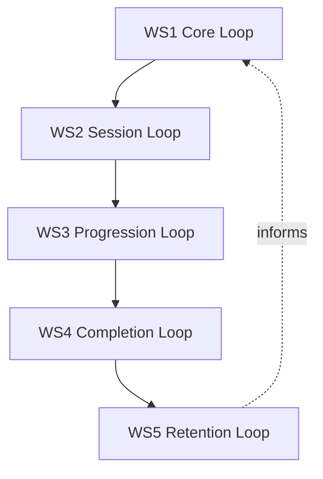
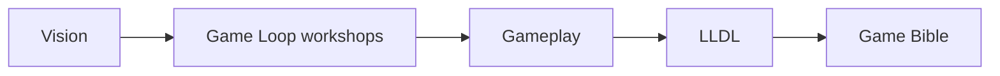

# Game Loop — Workshops

Workshop outputs for session and loop design under `docs/01_Game_Design/Game_Loop/`.

[Vision](../../00_Project/Vision.md) defines *why* the game exists. Workshop documents record *agreed gameplay decisions* from structured design sessions.

## Parent Document

| Document | Scope |
|----------|-------|
| [Game Loop](../Game_Loop.md) | **Consolidated architecture** — how WS1–WS5 connect (primary player-flow reference) |

## Workshop Index

| Workshop | Document | Status | Scope |
|----------|----------|--------|-------|
| **WS1** | [WS1_Core_Loop.md](WS1_Core_Loop.md) | Draft — Pending Review | Core gameplay loop — observe, plan, draw, confirm, execute, evaluate |
| **WS2** | [WS2_Session_Loop.md](WS2_Session_Loop.md) | Draft — Pending Review | Session loop — how multiple core loops form a satisfying play session |
| **WS3** | [WS3_Progression_Loop.md](WS3_Progression_Loop.md) | Draft — Pending Review | Progression loop — long-term mastery, unlocks, and player journey |
| **WS4** | [WS4_Completion_Loop.md](WS4_Completion_Loop.md) | Draft — Pending Review | Completion loop — milestone closure, optional mastery, end-of-world experience |
| **WS5** | [WS5_Retention_Loop.md](WS5_Retention_Loop.md) | Draft — Pending Review | Retention loop — voluntary long-term return, trust, post-completion engagement |

> **Series status:** WS1–WS5 complete at philosophy layer — pending Human review. Implementation lives in downstream docs ([Gameplay](../Gameplay.md), [Progression](../Progression.md), [LiveOps](../LiveOps.md), etc.).

## Workshop Stack

| Workshop | Horizon | Question answered |
|----------|---------|-------------------|
| WS1 | Seconds | What does the player do every few seconds? |
| WS2 | Minutes | What makes one sitting satisfying? |
| WS3 | Weeks | How does the player grow over time? |
| WS4 | Milestones | How does completion feel? |
| WS5 | Months+ | Why does the player freely return? |

## Writing Order Context

## Navigation

| ← Previous | Next → | Index |
|------------|--------|-------|
| [WS4 — Completion Loop](WS4_Completion_Loop.md) | [WS5 — Retention Loop](WS5_Retention_Loop.md) | [LLDS Home](../../README.md) |
