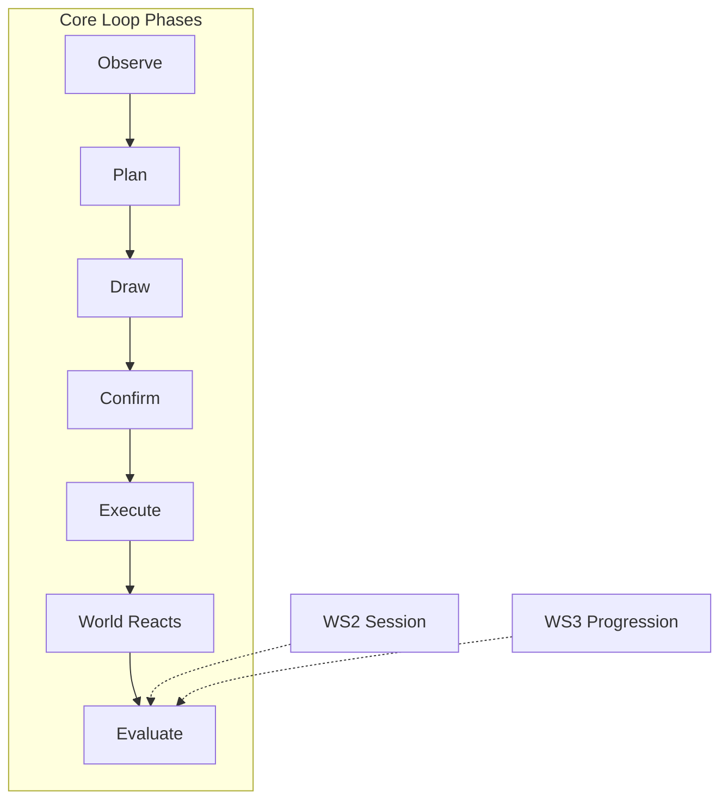
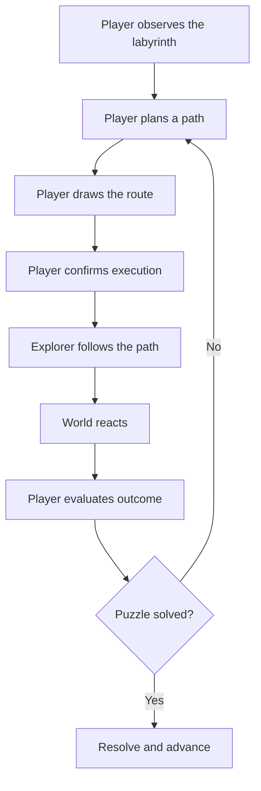
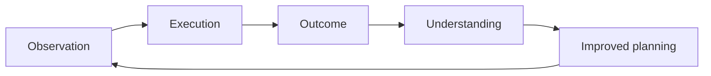
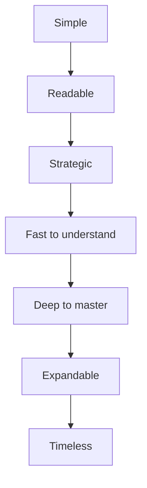

# WS1 — Core Loop

| Field                 | Value                                                                                                                                                          |
| --------------------- | -------------------------------------------------------------------------------------------------------------------------------------------------------------- |
| **Project**           | Labyrinth Legends                                                                                                                                              |
| **Document Name**     | WS1 — Core Loop                                                                                                                                                |
| **Document ID**       | LLDS-DOC-01-WS1-001                                                                                                                                            |
| **Version**           | 1.0.0                                                                                                                                                          |
| **Status**            | Approved                                                                                                                                                       |
| **Owner**             | Apoorv                                                                                                                                                         |
| **Prepared By**       | ChatGPT (workshop) · Cursor (compiler)                                                                                                                         |
| **Last Updated**      | 2026-06-28                                                                                                                                                     |
| **Workshop**          | WS1 — Core Gameplay Loop                                                                                                                                       |
| **Dependencies**      | [Vision](../../00_Project/Vision.md)                                                                                                                           |
| **Related Documents** | [Game Loop](Game_Loop.md) · [WS2–WS5](README.md) · [Gameplay](../Gameplay/Gameplay.md) · [Game Bible](../Game_Bible.md) · [Decisions](../../00_Project/Decisions.md) |

## Navigation

| ← Previous                           | Next →                                    | Index                                                           |
| ------------------------------------ | ----------------------------------------- | --------------------------------------------------------------- |
| [Vision](../../00_Project/Vision.md) | [WS2 — Session Loop](WS2_Session_Loop.md) | [Game Loop Workshops](README.md) · [LLDS Home](../../README.md) |

---

## Version History

| Version | Date       | Author           | Summary                                 |
| ------- | ---------- | ---------------- | --------------------------------------- |
| 1.0.0   | 2026-06-28 | ChatGPT / Cursor | Core Loop workshop decisions documented |

## Change Log

| Version | Change                                                                                                                          |
| ------- | ------------------------------------------------------------------------------------------------------------------------------- |
| 1.0.0   | Initial workshop record: loop definition, philosophy, decisions, feedback, failure/success, characteristics, risks, conclusions |

---

## Purpose

This document records the **approved decisions from WS1 — Core Gameplay Loop Workshop**. It does not invent gameplay. It professionally documents what the team agreed the player repeatedly does at the heart of Labyrinth Legends.

[Vision](../../00_Project/Vision.md) explains *why* the game exists. **WS1 explains what the player does every few seconds** — observe, plan, draw, confirm, execute, evaluate, and learn.

Mechanical rules belong in [Gameplay](../Gameplay/Gameplay.md). Session and meta flow belong in [Game Loop](Game_Loop.md). Narrative framing belongs in [Game Bible](../Game_Bible.md).

## Intended Audience

| Role                 | Use this document to…                                             |
| -------------------- | ----------------------------------------------------------------- |
| Game Designers       | Validate mechanics against the core loop contract                 |
| Level Designers      | Author puzzles that support meaningful decisions in the loop      |
| Gameplay Programmers | Understand loop phases before implementing rules                  |
| UI/UX Designers      | Present loop phases with clarity and readability                  |
| QA Engineers         | Evaluate whether builds preserve loop integrity                   |
| Producers            | Scope features against locked WS1 decisions                       |
| AI Coding Agents     | Refuse mechanics that break draw-and-confirm or learning feedback |

## Table of Contents

1. [Workshop Purpose](#1-workshop-purpose)
2. [Core Loop Definition](#2-core-loop-definition)
3. [Core Gameplay Philosophy](#3-core-gameplay-philosophy)
4. [Player Decisions](#4-player-decisions)
5. [Feedback Loop](#5-feedback-loop)
6. [Failure Philosophy](#6-failure-philosophy)
7. [Success Philosophy](#7-success-philosophy)
8. [Loop Characteristics](#8-loop-characteristics)
9. [Risks](#9-risks)
10. [Workshop Conclusions](#10-workshop-conclusions)

---

## 1. Workshop Purpose

### Why the Core Loop Exists

Every game has a repeating unit of play. In Labyrinth Legends, that unit is **not** movement per tap or combat per encounter. It is a complete cycle of **understanding a space, committing to a plan, and learning from the outcome**.

WS1 exists to lock this unit before later workshops add systems on top. Without a stable core loop, features accumulate without reinforcing what makes the game distinctive.

### Why It Is the Most Important Gameplay Loop

The core loop is the **atomic experience** of Labyrinth Legends:

| Reason      | Explanation                                                           |
| ----------- | --------------------------------------------------------------------- |
| Frequency   | It repeats many times within a single puzzle                          |
| Identity    | It expresses the Draw Your Fate contract                              |
| Filter      | Every proposed mechanic must justify its place in or around this loop |
| Quality bar | If the loop feels wrong, no amount of content fixes the product       |

Macro navigation, economy, and narrative matter — but players judge the game by what happens **inside one puzzle**.

### How Future Mechanics Support This Loop

Later workshops (WS2–WS3+) may introduce session pacing, progression, discovery rules, and presentation standards. Each must **strengthen** one or more loop phases:

Mechanics that do not serve observation, planning, commitment, execution, or learning **do not belong in core progression** without explicit approval.

### Design Intent

Establish WS1 as the gameplay foundation document. Later specs extend the loop; they do not replace it.

---

## 2. Core Loop Definition

### The Agreed Loop

The complete core gameplay loop:

| Phase            | Player state        | What happens                                                         |
| ---------------- | ------------------- | -------------------------------------------------------------------- |
| **Observe**      | Reading the space   | Player gathers information about layout, objectives, and constraints |
| **Plan**         | Thinking            | Player forms intent before irreversible commitment                   |
| **Draw**         | Expressing intent   | Player constructs the route through the labyrinth                    |
| **Confirm**      | Committing          | Player locks the plan; execution begins                              |
| **Execute**      | Watching            | Explorer follows the drawn path; player does not steer in real time  |
| **World reacts** | Consequences unfold | Environment responds to the path and interactions along it           |
| **Evaluate**     | Learning            | Player judges success, partial success, or need to replan            |

### Why This Creates Strategic Gameplay

Strategic play requires **separation between decision and outcome**. When the player must commit before seeing full consequences, each choice carries weight.

| Property                      | Strategic effect                             |
| ----------------------------- | -------------------------------------------- |
| Commitment before execution   | Plans must be complete enough to trust       |
| Visible execution             | Outcomes are legible, not mysterious         |
| Replanning without punishment | Failure teaches; it does not detain          |
| Information before action     | Skill is reading the labyrinth, not guessing |

This loop converts spatial reasoning into drama: the player thinks like a planner, then watches the ruin answer.

### Design Intent

Lock the eight-phase loop as the canonical micro-experience. [Gameplay](../Gameplay/Gameplay.md) will specify rules; this document specifies the **rhythm of play**.

---

## 3. Core Gameplay Philosophy

### Planning Over Reflexes

The primary skill is **forming a correct plan**, not executing it with speed. Reflex demand belongs outside core puzzle progression (see [Vision](../../00_Project/Vision.md) non-goals).

### Thinking Before Acting

The game creates a deliberate pause between understanding and commitment. That pause is not dead time — it is where Labyrinth Legends lives.

### Information-Driven Decisions

Players should act because they **read** the labyrinth, not because they brute-forced possibilities. Partial information is acceptable when it is fair and learnable.

### Visible Consequences

When a plan runs, the player must see **what happened and why**. Opaque resolution breaks the learning contract.

### Player Agency

The player chooses the route. Systems may constrain options, but the core loop rejects solutions where the game plays itself or randomness overrides planning.

### Draw-and-Confirm as the Heart

> **Locked Decision:** The defining interaction is **draw the route, then confirm execution**. The explorer does not accept real-time steering during core puzzle play.

This pattern:

- Honors the Planning Over Reflexes pillar
- Creates anticipation between confirm and outcome
- Makes mastery about better plans, not faster fingers
- Distinguishes Labyrinth Legends from action maze games

### Design Intent

Anchor all WS1 content to the philosophy already established in Vision. WS1 is the gameplay expression of those pillars inside one loop.

---

## 4. Player Decisions

### Meaningful Decisions Inside the Loop

Every puzzle should present decisions that matter **within the loop**, not only in meta systems:

| Decision type                 | Question the player asks                             |
| ----------------------------- | ---------------------------------------------------- |
| **Route priority**            | Where do I go first?                                 |
| **Interaction order**         | Which switches or mechanisms do I trigger, and when? |
| **Risk tolerance**            | Do I cross or avoid a hazard for a better line?      |
| **Optional objectives**       | Is optional treasure worth the detour?               |
| **Path economy**              | Shortest path vs safest path?                        |
| **Exploration vs efficiency** | Do I accept extra steps to see more of the space?    |

### Why Meaningful Decisions Beat Mechanical Complexity

| Complexity type         | Value                                     |
| ----------------------- | ----------------------------------------- |
| More rules              | High maintenance; often obscures the loop |
| More meaningful choices | Reuses the same loop; deepens mastery     |

A chamber with two genuine forks teaches more than a chamber with twelve rules and one obvious line.

### Decision Quality Criteria

A decision is **meaningful** when:

1. The player can explain why they chose it
2. A different choice would produce a different outcome
3. The outcome teaches something about the space
4. Neither option is clearly dominant without reading the labyrinth

### Design Intent

Give level designers a checklist for authoring choices. If a puzzle has no real decisions, it is decoration — not Labyrinth Legends gameplay.

---

## 5. Feedback Loop

### How the Player Learns

Learning is not a separate tutorial mode. It is embedded in the loop:

| Stage                 | Function                                            |
| --------------------- | --------------------------------------------------- |
| **Observation**       | Player notices layout, constraints, and cues        |
| **Execution**         | Plan becomes visible reality                        |
| **Outcome**           | Success, partial success, or failure state resolves |
| **Understanding**     | Player connects outcome to plan                     |
| **Improved planning** | Next attempt applies corrected reasoning            |

### Every Failed Attempt Teaches Something

> **Locked Decision:** Failure is instructive, not punitive.

| Principle       | Application                                              |
| --------------- | -------------------------------------------------------- |
| No punishment   | Failed plans restart quickly without unrelated penalties |
| Only learning   | Each failure should answer "what did I misread?"         |
| Readable causes | Player mistakes, not hidden rules, drive failure         |

### Design Intent

Ensure QA and design review evaluate puzzles by their **teaching curve**, not only by completion rate.

---

## 6. Failure Philosophy

### Failure Modes (Agreed)

| Failure type                  | Description                                                | Design response                         |
| ----------------------------- | ---------------------------------------------------------- | --------------------------------------- |
| **Player mistakes**           | Route error the player can trace                           | Clear replay; no obscurity              |
| **Puzzle misunderstanding**   | Player misread objective or constraint                     | Teach through layout and early chambers |
| **Environmental interaction** | Mechanism behaved as designed, plan did not account for it | Fair telegraphing; learnable rules      |
| **Planning errors**           | Incomplete or incorrect foresight                          | Core loop function — replan and improve |

### Why Failure Is Part of Learning

If the first plan always succeeds, there is no strategy — only execution. Failure proves the player **committed** to a testable hypothesis. The loop closes when understanding improves.

### Excluded Failure Patterns

| Anti-pattern          | Why excluded                                        |
| --------------------- | --------------------------------------------------- |
| Random punishment     | Breaks planning contract                            |
| Invisible rules       | Breaks fairness and readability                     |
| Artificial difficulty | Timers, noise, or opacity masquerading as challenge |

### Design Intent

Failure review must ask: "Was this fair, readable, and educational?" — not "Was this hard enough?"

---

## 7. Success Philosophy

### What Successful Completion Creates

| Outcome           | Description                                        |
| ----------------- | -------------------------------------------------- |
| **Understanding** | Player knows why the route worked                  |
| **Satisfaction**  | Commitment paid off; plan matched reality          |
| **Confidence**    | Player trusts their ability to read the next space |
| **Curiosity**     | Player wants the next puzzle, not only the reward  |

### Earned, Not Rewarded

Success should feel **earned through intelligence**, not granted by systems that bypass the loop.

| Earned success                   | Hollow success                      |
| -------------------------------- | ----------------------------------- |
| Route solved the puzzle          | Reward screen without comprehension |
| Player can explain the plan      | Player cannot recall why it worked  |
| Optional mastery paths available | Mandatory perfection to proceed     |

> **Note:** Reward presentation and meta outcomes belong in later documents. WS1 locks the *felt quality* of success inside the loop.

### Design Intent

Success criteria for level review include comprehension and curiosity — not only completion flags.

---

## 8. Loop Characteristics

The core loop must **always** retain these characteristics:

| Characteristic         | Meaning                                               | Why it matters             |
| ---------------------- | ----------------------------------------------------- | -------------------------- |
| **Simple**             | Few phases, clear names, learnable once               | Mobile sessions start fast |
| **Readable**           | Player always knows which phase they are in           | Trust and fairness         |
| **Strategic**          | Plans matter before execution                         | Product identity           |
| **Fast to understand** | First chamber teaches the loop                        | Low abandonment            |
| **Deep to master**     | Same loop supports harder composition                 | Long-term engagement       |
| **Expandable**         | New mechanics attach to phases without replacing loop | WS2–WS5 can build safely   |
| **Timeless**           | Not dependent on trends or gimmicks                   | Premium positioning        |

### Characteristic Interdependencies

Removing one characteristic weakens the others. Complexity that harms readability harms strategy.

### Design Intent

Use this table as a regression test when reviewing new mechanics or level types.

---

## 9. Risks

| Risk                         | Description                                  | Mitigation                                                                        |
| ---------------------------- | -------------------------------------------- | --------------------------------------------------------------------------------- |
| **Overcomplicated puzzles**  | Too many rules in one chamber                | One major new idea per teaching beat; compose complexity across worlds            |
| **Hidden information**       | Player cannot form a fair plan               | Distinguish mystery from opacity; reveal through observation and earned discovery |
| **Trial-and-error gameplay** | Success requires guessing, not planning      | Ensure failures are instructive; clues must be learnable                          |
| **Loss of player agency**    | Systems override drawn plans without consent | Player chooses route; automation only after confirm                               |
| **Visual clutter**           | Presentation obscures rules                  | Readability principle; detail in [LLDL](../../02_Design_System/LLDL/LLDL.md)           |

### Monitoring

During WS2–WS5 and level authoring, flag any feature that increases these risks without documented mitigation.

---

## 10. Workshop Conclusions

### Locked Decisions

| ID      | Decision                                                                                               | Source                                                                               |
| ------- | ------------------------------------------------------------------------------------------------------ | ------------------------------------------------------------------------------------ |
| WS1-L01 | Core loop: Observe → Plan → Draw → Confirm → Execute → World reacts → Evaluate → Replan or resolve     | WS1 workshop                                                                         |
| WS1-L02 | Draw-and-confirm is the heart of play; no real-time steering in core puzzles                           | WS1 workshop · aligns with [Decisions](../../00_Project/Decisions.md) Draw Your Fate |
| WS1-L03 | Failure is instructive, not punitive                                                                   | WS1 workshop · aligns with Vision pillar Respect Player Time                         |
| WS1-L04 | Meaningful route decisions matter more than rule complexity                                            | WS1 workshop                                                                         |
| WS1-L05 | Loop must remain Simple, Readable, Strategic, Fast to understand, Deep to master, Expandable, Timeless | WS1 workshop                                                                         |
| WS1-L06 | Learning cycle: Observation → Execution → Outcome → Understanding → Improved planning                  | WS1 workshop                                                                         |

### Future Decisions (Deferred to Later Workshops)

| Topic                                   | Target workshop / document                                                                 |
| --------------------------------------- | ------------------------------------------------------------------------------------------ |
| Session structure and pacing            | WS2 · [WS2 — Session Loop](WS2_Session_Loop.md)                                            |
| Tile types and interactions             | [Mechanics](../Mechanics.md) · [Gameplay](../Gameplay/Gameplay.md)                                  |
| Discovery and fog rules                 | WS3+ / dedicated workshop TBD                                                              |
| Presentation and phase UX               | [LLDL](../../02_Design_System/LLDL/LLDL.md) · screen specs                                      |
| Meta progression between puzzles        | WS3 · [WS3 — Progression Loop](WS3_Progression_Loop.md) · [Progression](../Progression.md) |
| Input affordances and validation detail | [Gameplay](../Gameplay/Gameplay.md)                                                                 |

### Open Questions

| ID      | Question                                                         | Owner            | Status     |
| ------- | ---------------------------------------------------------------- | ---------------- | ---------- |
| WS1-Q01 | How much partial information is default in early vs late worlds? | ChatGPT / Apoorv | Open — WS3 |
| WS1-Q02 | Standard replan friction (instant vs light transition)?          | ChatGPT / Apoorv | Open — WS4 |
| WS1-Q03 | Optional objectives: always visible or discovered in play?       | ChatGPT / Apoorv | Open — WS2 |

---

## Cross References

- Upstream: [Vision](../../00_Project/Vision.md)
- Parent: [Game Loop](Game_Loop.md)
- Siblings: [WS2 — Session Loop](WS2_Session_Loop.md), [WS3 — Progression Loop](WS3_Progression_Loop.md), [WS4 — Completion Loop](WS4_Completion_Loop.md), [WS5 — Retention Loop](WS5_Retention_Loop.md)
- Downstream: [Gameplay](../Gameplay/Gameplay.md), [Mechanics](../Mechanics.md)
- Governance: [Decisions](../../00_Project/Decisions.md)

---

## Navigation

| ← Previous                           | Next →                                    | Index                                                           |
| ------------------------------------ | ----------------------------------------- | --------------------------------------------------------------- |
| [Vision](../../00_Project/Vision.md) | [WS2 — Session Loop](WS2_Session_Loop.md) | [Game Loop Workshops](README.md) · [LLDS Home](../../README.md) |

