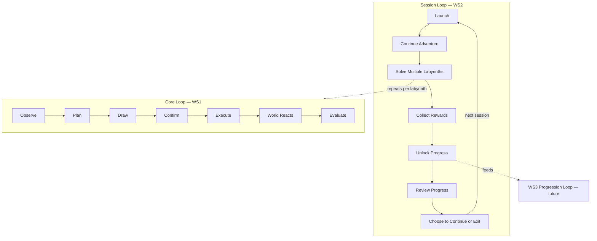
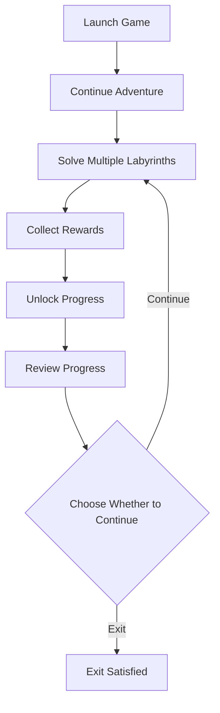
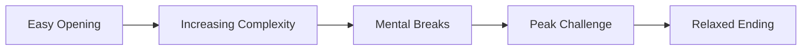

# WS2 — Session Loop

| Field                 | Value                                                                                                                                                                                                                                           |
| --------------------- | ----------------------------------------------------------------------------------------------------------------------------------------------------------------------------------------------------------------------------------------------- |
| **Project**           | Labyrinth Legends                                                                                                                                                                                                                               |
| **Document Name**     | WS2 — Session Loop                                                                                                                                                                                                                              |
| **Document ID**       | LLDS-DOC-01-WS2-001                                                                                                                                                                                                                             |
| **Version**           | 1.0.0                                                                                                                                                                                                                                           |
| **Status**            | Approved                                                                                                                                                                                                                                        |
| **Owner**             | Apoorv                                                                                                                                                                                                                                          |
| **Prepared By**       | ChatGPT (workshop) · Cursor (compiler)                                                                                                                                                                                                          |
| **Last Updated**      | 2026-06-29                                                                                                                                                                                                                                      |
| **Workshop**          | WS2 — Session Loop                                                                                                                                                                                                                              |
| **Dependencies**      | [Vision](../../00_Project/Vision.md) · [WS1 — Core Loop](WS1_Core_Loop.md)                                                                                                                                                                      |
| **Related Documents** | [Game Loop](../Game_Loop.md) · [WS3 — Progression Loop](WS3_Progression_Loop.md) · [WS4 — Completion Loop](WS4_Completion_Loop.md) · [Gameplay](../Gameplay.md) · [Progression](../Progression.md) · [Decisions](../../00_Project/Decisions.md) |

## Navigation

| ← Previous                                | Next →                                            | Index                                                           |
| ----------------------------------------- | ------------------------------------------------- | --------------------------------------------------------------- |
| [WS2 — Session Loop](WS2_Session_Loop.md) | [WS3 — Progression Loop](WS3_Progression_Loop.md) | [Game Loop Workshops](README.md) · [LLDS Home](../../README.md) |

---

## Version History

| Version | Date       | Author           | Summary                                    |
| ------- | ---------- | ---------------- | ------------------------------------------ |
| 1.0.0   | 2026-06-29 | ChatGPT / Cursor | Session Loop workshop decisions documented |

## Change Log

| Version | Change                                                                                                                                      |
| ------- | ------------------------------------------------------------------------------------------------------------------------------------------- |
| 1.0.0   | Initial workshop record: session definition, structure, pacing, motivation, rewards, ending philosophy, quality metrics, risks, conclusions |

---

## Purpose

This document records the **approved decisions from WS2 — Session Loop Workshop**. It does not invent gameplay. It professionally documents how multiple [WS1 — Core Loop](WS1_Core_Loop.md) cycles combine into a satisfying single play session.

[Vision](../../00_Project/Vision.md) explains *why* the game exists. **WS1 explains what the player does every few seconds.** **WS2 explains how those moments compose into a session the player remembers and chooses to return to.**

Long-term progression is documented in [WS3 — Progression Loop](WS3_Progression_Loop.md). Mechanical rules belong in [Gameplay](../Gameplay.md). Screen flow belongs in [Game Loop](../Game_Loop.md).

## Intended Audience

| Role               | Use this document to…                                            |
| ------------------ | ---------------------------------------------------------------- |
| Game Designers     | Validate session flow and pacing against locked decisions        |
| Level Designers    | Sequence chambers within a session arc                           |
| Producers          | Scope session length targets and content cadence                 |
| UI/UX Designers    | Design natural stopping points and session transitions           |
| Economy / Live Ops | Avoid systems that contradict session philosophy (deferred docs) |
| QA Engineers       | Evaluate whether builds support complete, satisfying sessions    |
| AI Coding Agents   | Refuse retention mechanics that violate Respect Player Time      |

## Table of Contents

1. [Workshop Purpose](#1-workshop-purpose)
2. [Session Definition](#2-session-definition)
3. [Session Structure](#3-session-structure)
4. [Session Pacing](#4-session-pacing)
5. [Motivation During a Session](#5-motivation-during-a-session)
6. [Rewards Within a Session](#6-rewards-within-a-session)
7. [Session Ending Philosophy](#7-session-ending-philosophy)
8. [Session Quality Metrics](#8-session-quality-metrics)
9. [Risks](#9-risks)
10. [Workshop Conclusions](#10-workshop-conclusions)

---

## 1. Workshop Purpose

### What Is a Session Loop?

A **session loop** is the repeating arc of play between **launch and voluntary exit** — not a single puzzle, and not lifetime progression. It answers: *What does the player do across several labyrinths in one sitting, and why does that sitting feel complete?*

| Loop level       | Horizon                          | Document                            |
| ---------------- | -------------------------------- | ----------------------------------- |
| Core loop        | Seconds to minutes (one puzzle)  | [WS1 — Core Loop](WS1_Core_Loop.md) |
| **Session loop** | **10–30+ minutes (one sitting)** | **This document**                   |
| Progression loop | Days to weeks                    | WS3 (future)                        |

### Why the Session Loop Matters

The core loop can be excellent in isolation and still fail if sessions feel fragmented, exhausting, or manipulative. Players judge Labyrinth Legends not only by individual chambers but by whether **an evening of play** felt worthwhile.

| Reason                     | Explanation                                            |
| -------------------------- | ------------------------------------------------------ |
| Retention without coercion | Curiosity sustains sessions; obligation erodes trust   |
| Premium positioning        | Thoughtful sessions signal craft, not engagement hacks |
| Mobile reality             | Play is interruptible; sessions need natural endpoints |
| Content efficiency         | Fewer, better chambers beat endless shallow repetition |

### How It Connects Core Loop to Long-Term Progression

Each labyrinth inside a session runs the WS1 core loop. The session loop **sequences, paces, and resolves** those loops so progress feels cumulative without demanding marathon play.

### Design Intent

Lock the session as the bridge between moment-to-moment puzzle craft (WS1) and long-horizon mastery (WS3). Every session feature must justify its place in this arc.

---

## 2. Session Definition

### A Typical Player Session

A typical session is a **self-contained adventure** — the player enters the ruins, advances through one or more labyrinths, absorbs rewards and progress, and leaves on their own terms.

| Attribute                      | Agreed target                                                                       |
| ------------------------------ | ----------------------------------------------------------------------------------- |
| **Expected duration**          | **10–15 minutes** feels complete; longer sessions are valid when the player chooses |
| **Minimum meaningful session** | One well-designed labyrinth with a satisfying resolution                            |
| **Extended session**           | Multiple labyrinths with rising complexity and clear rest points between            |

> **Locked Decision:** Every session should feel **complete**, even if only 10–15 minutes long.

### Natural Stopping Points

Sessions must offer **clean exit ramps** without punishing the player for stopping:

| Stopping point                     | Why it works                        |
| ---------------------------------- | ----------------------------------- |
| After completing a labyrinth       | Closure on a full WS1 cycle         |
| After unlocking new access         | Progress is tangible                |
| After reviewing collected progress | Player sees what they earned        |
| At hub / continue screen           | Explicit choice to continue or exit |

Stopping should never require finishing an arbitrarily long chain.

### Player Expectations

When opening Labyrinth Legends for a session, players expect:

- To **resume** where they left off without confusion
- To **understand** what one more puzzle will cost in time and attention
- To **feel progress** even in a short window
- To **not** be trapped by timers, energy gates, or daily punishment

This aligns with [Vision](../../00_Project/Vision.md) Pillar 4 — Respect Player Time.

### Session Pacing (Overview)

Sessions should feel **mentally engaging but relaxing** — challenge rises thoughtfully, then eases so the player can exit satisfied. [§4 Session Pacing](#4-session-pacing) details the arc.

### Design Intent

Define “session” as a completable unit of play, not a metric to maximize. Short sessions are first-class, not failures.

---

## 3. Session Structure

### Agreed Session Flow

A typical session follows this structure:

| Stage                          | Purpose                    | Why it exists                                    |
| ------------------------------ | -------------------------- | ------------------------------------------------ |
| **Launch Game**                | Entry into the product     | Brief orientation; respect returning players     |
| **Continue Adventure**         | Resume context             | Player picks up thread without re-teaching       |
| **Solve Multiple Labyrinths**  | Core value delivery        | WS1 loops repeated with intentional variety      |
| **Collect Rewards**            | Acknowledge accomplishment | Victories feel registered, not invisible         |
| **Unlock Progress**            | Forward motion             | Session advances something meaningful            |
| **Review Progress**            | Reflection                 | Player sees understanding and collection grow    |
| **Choose Whether to Continue** | Agency                     | “One more puzzle” is a choice, not a trap        |
| **Exit Satisfied**             | Trust                      | Player leaves curious for next time, not drained |

### Relationship to WS1

Each labyrinth in **Solve Multiple Labyrinths** is a full WS1 cycle. The session loop does not replace or shorten those phases — it **bundles** them with transitions, pacing, and meta-resolution between puzzles.

### Design Intent

Provide a canonical session skeleton for level sequencing, hub design, and progression hooks. Downstream screen specs implement this flow; they do not redefine it.

---

## 4. Session Pacing

### Pacing Arc

A well-paced session moves through recognizable phases:

| Phase                     | Description                                   | Design goal                                |
| ------------------------- | --------------------------------------------- | ------------------------------------------ |
| **Easy opening**          | First labyrinth(s) rebuild confidence         | Re-entry without friction                  |
| **Increasing complexity** | New ideas or combinations appear gradually    | Depth without overload                     |
| **Mental breaks**         | Lighter chambers or hub moments between peaks | Prevent fatigue                            |
| **Peak challenge**        | Session highlight — demanding but fair        | Memorable accomplishment                   |
| **Relaxed ending**        | Wind-down before natural stop                 | Satisfied exit, not cliffhanger exhaustion |

### Principles

| Principle                    | Application                                                            |
| ---------------------------- | ---------------------------------------------------------------------- |
| No artificial spikes         | Difficulty rises from design, not sudden rule changes or opaque tricks |
| One major new idea at a time | Carries forward from Vision teaching philosophy                        |
| Breaks are design            | Hub, review, and lighter chambers are pacing tools                     |
| Player controls extension    | After relaxed ending, continuing is optional                           |

### Anti-Patterns

| Anti-pattern                       | Why excluded                            |
| ---------------------------------- | --------------------------------------- |
| Front-loading hardest content      | Punishes returning players              |
| Endless escalation with no release | Forces exit from exhaustion, not choice |
| Padding chambers                   | Violates Quality Over Quantity pillar   |

### Design Intent

Give level designers and producers a pacing checklist. Sessions should feel like a composed journey, not a difficulty staircase with no landing.

---

## 5. Motivation During a Session

### Why Players Continue

Within a session, continuation should be driven by **genuine interest**, not manufactured pressure:

| Motivation                       | How it manifests                     |
| -------------------------------- | ------------------------------------ |
| **Curiosity**                    | “What is in the next chamber?”       |
| **One more puzzle**              | “I see the solution forming.”        |
| **Unlocking the next labyrinth** | Visible forward path                 |
| **Optional treasures**           | Worth pursuing when the route allows |
| **Improving previous solutions** | Mastery optional, not mandatory      |
| **Exploring new mechanics**      | Learning stays the reward            |

### Excluded Motivations

> **Locked Decision:** Session continuation must not rely on manipulation.

| Excluded driver     | Why                                        |
| ------------------- | ------------------------------------------ |
| Artificial timers   | Creates anxiety incompatible with planning |
| Energy systems      | Gates core puzzle play; disrespects time   |
| Daily obligations   | Manufactures guilt, not curiosity          |
| Fear of Missing Out | Coerces sessions; breaks premium trust     |

These align with [Vision](../../00_Project/Vision.md) anti-patterns under Respect Player Time.

### “One More Puzzle” Done Right

The phrase should mean: *the player wants another WS1 cycle because the last one taught something and the next one looks interesting* — not because a counter is about to expire.

### Design Intent

Filter retention and economy proposals: if a feature’s primary job is forcing another session, it conflicts with WS2.

---

## 6. Rewards Within a Session

### Reward Philosophy

Rewards acknowledge accomplishment. They must **amplify** understanding, not replace it.

### Intrinsic Rewards (Primary)

| Intrinsic reward    | Description                                   |
| ------------------- | --------------------------------------------- |
| Solving puzzles     | The plan worked; the space made sense         |
| Discovering secrets | Hidden structure revealed through observation |
| Mastering mechanics | Patterns become readable faster               |

> **Locked Decision:** Intrinsic rewards remain the **primary** motivation within a session.

### Extrinsic Rewards (Supporting)

| Extrinsic reward     | Role in session                   |
| -------------------- | --------------------------------- |
| New worlds / areas   | Marks session progress            |
| Collectibles         | Optional depth for explorers      |
| Cosmetic progression | Expression without power          |
| Achievements         | Recognition of mastery milestones |

Extrinsic rewards **support** the session arc — they do not substitute for puzzle satisfaction.

### Balance Rule

| If extrinsic rewards…               | Then…                  |
| ----------------------------------- | ---------------------- |
| Outshine puzzle completion          | Session feels hollow   |
| Gate core clarity                   | Player time is wasted  |
| Require repetition without learning | Grind replaces mastery |

### Design Intent

Economy and progression documents must subordinate extrinsic rewards to WS1 success feelings. A victory screen cannot rescue a puzzle that taught nothing.

---

## 7. Session Ending Philosophy

### How the Player Should Feel at Exit

| Goal                            | Description                             |
| ------------------------------- | --------------------------------------- |
| **Satisfaction**                | The session accomplished something real |
| **Curiosity**                   | The next chamber or world intrigues     |
| **Accomplishment**              | Progress and understanding grew         |
| **Excitement for next session** | Return is welcome, not obligatory       |

### Voluntary Stop

> **Locked Decision:** The player stops because they **choose to** — not because the game forces them to.

| Forced exit (rejected) | Voluntary exit (target)            |
| ---------------------- | ---------------------------------- |
| Energy depleted        | Player taps exit after review      |
| Session timer expired  | Player declines “one more”         |
| Punitive daily reset   | Player leaves after a complete arc |

### First Session Alignment

[Vision](../../00_Project/Vision.md) requires the first session to end with: *“I want to see the next chamber,” not “I am already behind.”* WS2 extends that standard to **every** session.

### Design Intent

Session-end UX and meta systems are successful when players describe their exit in terms of satisfaction and curiosity — never relief from obligation.

---

## 8. Session Quality Metrics

### Indicators of a Successful Session

Qualitative signals guide review — not raw playtime alone:

| Signal                                     | What it means                           |
| ------------------------------------------ | --------------------------------------- |
| **“I’ll solve one more puzzle.”**          | Curiosity-driven continuation           |
| **Player loses track of time**             | Engagement from flow, not pressure      |
| **Every completed level feels meaningful** | No filler chambers in the arc           |
| **Player remembers discoveries**           | Intrinsic rewards dominated the session |

### What We Do Not Optimize For

| Weak metric                              | Why                                |
| ---------------------------------------- | ---------------------------------- |
| Session length alone                     | Long confused play is not success  |
| Levels per session without comprehension | Quantity over quality              |
| Return caused by penalty                 | Coercion masquerading as retention |

### Review Questions

When evaluating a build or content slice, ask:

1. Could a 10–15 minute session feel complete?
2. Was there a clear peak and a relaxed ending?
3. Did the player learn something in each labyrinth?
4. Would continuation require manipulation if we removed extrinsic pressure?

### Design Intent

Give QA, producers, and product review a shared vocabulary for session quality beyond analytics dashboards.

---

## 9. Risks

| Risk                          | Description                              | Mitigation                                                                      |
| ----------------------------- | ---------------------------------------- | ------------------------------------------------------------------------------- |
| **Repetitive sessions**       | Same rhythm every sitting                | Vary chamber types, pacing phases, and discovery beats within WS1 contract      |
| **Excessive puzzle length**   | Single labyrinth consumes entire session | Respect completable arcs; split or streamline oversized chambers                |
| **Reward fatigue**            | Extrinsic rewards dilute intrinsic wins  | Lead with puzzle satisfaction; extrinsic rewards support, not replace           |
| **Poor pacing**               | No breaks, no wind-down                  | Apply easy opening → peak → relaxed ending arc                                  |
| **Cognitive overload**        | Too many new ideas in one session        | One major teaching beat per session segment; defer complexity to later sessions |
| **Manipulative continuation** | Timers, energy, FOMO creep in            | Reject features that fail [§5](#5-motivation-during-a-session) exclusion list   |

### Monitoring

Flag any milestone that increases these risks without documented mitigation — especially economy, live ops, and hub UX proposals.

---

## 10. Workshop Conclusions

### Locked Decisions

| ID      | Decision                                                                                                                    | Source                                                |
| ------- | --------------------------------------------------------------------------------------------------------------------------- | ----------------------------------------------------- |
| WS2-L01 | Session = launch through voluntary exit; composes multiple WS1 core loops                                                   | WS2 workshop                                          |
| WS2-L02 | Target complete session: **10–15 minutes** minimum meaningful arc; longer when player chooses                               | WS2 workshop · aligns with Vision Respect Player Time |
| WS2-L03 | Agreed flow: Launch → Continue → Solve labyrinths → Collect rewards → Unlock progress → Review → Continue or exit satisfied | WS2 workshop                                          |
| WS2-L04 | Pacing arc: easy opening → increasing complexity → mental breaks → peak challenge → relaxed ending                          | WS2 workshop                                          |
| WS2-L05 | Continuation driven by curiosity and mastery — not timers, energy, daily obligation, or FOMO                                | WS2 workshop · aligns with Vision anti-patterns       |
| WS2-L06 | Intrinsic rewards (solve, discover, master) primary; extrinsic rewards supporting                                           | WS2 workshop                                          |
| WS2-L07 | Player exits by choice; session ends with satisfaction, curiosity, accomplishment                                           | WS2 workshop                                          |
| WS2-L08 | Session quality judged by meaningful levels and remembered discoveries — not playtime alone                                 | WS2 workshop                                          |

### Future Decisions (Deferred)

| Topic                               | Target workshop / document                                  |
| ----------------------------------- | ----------------------------------------------------------- |
| Long-term progression and retention | [WS3 — Progression Loop](WS3_Progression_Loop.md)           |
| Macro economy and reward numbers    | [Economy](../Economy.md) · [Progression](../Progression.md) |
| Daily challenge session fit         | [LiveOps](../LiveOps.md) — must not violate WS2-L05         |
| Screen-level session UX             | [Game Loop](../Game_Loop.md) · `docs/03_Screens/`*          |
| Interrupt and resume mid-session    | [Game Loop](../Game_Loop.md) §5                             |
| Mechanics and tile interactions     | [Mechanics](../Mechanics.md) · [Gameplay](../Gameplay.md)   |

### Open Questions

| ID      | Question                                                                 | Owner            | Status                   |
| ------- | ------------------------------------------------------------------------ | ---------------- | ------------------------ |
| WS2-Q01 | Exact chamber count for a “standard” 10–15 minute session across worlds? | ChatGPT / Apoorv | Open — level design      |
| WS2-Q02 | How prominent should “improve previous solution” be in early worlds?     | ChatGPT / Apoorv | Open — WS3 / Progression |
| WS2-Q03 | Hub vs in-flow mental breaks — which is default between peak chambers?   | ChatGPT / Apoorv | Open — screen specs      |

---

## Cross References

- Upstream: [Vision](../../00_Project/Vision.md), [WS1 — Core Loop](WS1_Core_Loop.md)
- Parent: [Game Loop](../Game_Loop.md)
- Siblings: [WS3 — Progression Loop](WS3_Progression_Loop.md), [WS4 — Completion Loop](WS4_Completion_Loop.md), [WS5 — Retention Loop](WS5_Retention_Loop.md)
- Downstream: [Progression](../Progression.md), [Gameplay](../Gameplay.md), `docs/03_Screens/*`
- Governance: [Decisions](../../00_Project/Decisions.md)

---

## Navigation

| ← Previous                                | Next →                                            | Index                                                           |
| ----------------------------------------- | ------------------------------------------------- | --------------------------------------------------------------- |
| [WS2 — Session Loop](WS2_Session_Loop.md) | [WS3 — Progression Loop](WS3_Progression_Loop.md) | [Game Loop Workshops](README.md) · [LLDS Home](../../README.md) |

