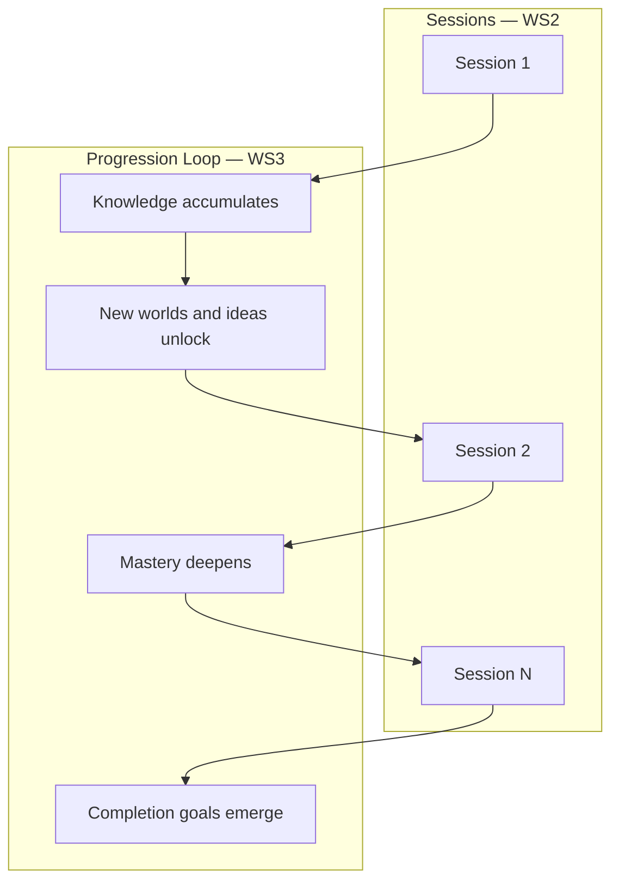
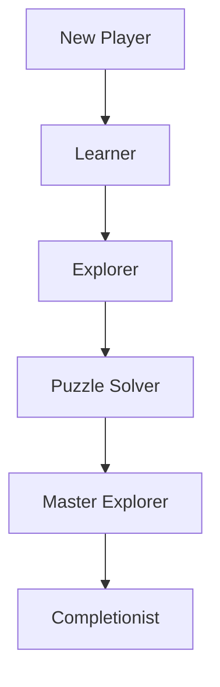

# WS3 — Progression Loop

| Field                 | Value                                                                                                                                                                                                                                                                        |
| --------------------- | ---------------------------------------------------------------------------------------------------------------------------------------------------------------------------------------------------------------------------------------------------------------------------- |
| **Project**           | Labyrinth Legends                                                                                                                                                                                                                                                            |
| **Document Name**     | WS3 — Progression Loop                                                                                                                                                                                                                                                       |
| **Document ID**       | LLDS-DOC-01-WS3-001                                                                                                                                                                                                                                                          |
| **Version**           | 1.0.0                                                                                                                                                                                                                                                                        |
| **Status**            | Approved                                                                                                                                                                                                                                                                     |
| **Owner**             | Apoorv                                                                                                                                                                                                                                                                       |
| **Prepared By**       | ChatGPT (workshop) · Cursor (compiler)                                                                                                                                                                                                                                       |
| **Last Updated**      | 2026-06-29                                                                                                                                                                                                                                                                   |
| **Workshop**          | WS3 — Progression Loop                                                                                                                                                                                                                                                       |
| **Dependencies**      | [Vision](../../00_Project/Vision.md) · [WS1 — Core Loop](WS1_Core_Loop.md) · [WS2 — Session Loop](WS2_Session_Loop.md)                                                                                                                                                       |
| **Related Documents** | [Game Loop](../Game_Loop.md) · [WS4 — Completion Loop](WS4_Completion_Loop.md) · [WS5 — Retention Loop](WS5_Retention_Loop.md) · [Progression](../Progression.md) · [Worlds](../Worlds.md) · [Level Design](../Level_Design.md) · [Decisions](../../00_Project/Decisions.md) |

## Navigation

| ← Previous                                | Next →                                          | Index                                                           |
| ----------------------------------------- | ----------------------------------------------- | --------------------------------------------------------------- |
| [WS2 — Session Loop](WS2_Session_Loop.md) | [WS4 — Completion Loop](WS4_Completion_Loop.md) | [Game Loop Workshops](README.md) · [LLDS Home](../../README.md) |

---

## Version History

| Version | Date       | Author           | Summary                                        |
| ------- | ---------- | ---------------- | ---------------------------------------------- |
| 1.0.0   | 2026-06-29 | ChatGPT / Cursor | Progression Loop workshop decisions documented |

## Change Log

| Version | Change                                                                                                                    |
| ------- | ------------------------------------------------------------------------------------------------------------------------- |
| 1.0.0   | Initial workshop record: philosophy, player journey, sources, pace, unlocks, mastery, quality metrics, risks, conclusions |

---

## Purpose

This document records the **approved decisions from WS3 — Progression Loop Workshop**. It does not invent gameplay systems. It professionally documents how players grow across many sessions and why long-term progression exists in Labyrinth Legends.

[Vision](../../00_Project/Vision.md) defines project philosophy. [WS1 — Core Loop](WS1_Core_Loop.md) defines moment-to-moment play. [WS2 — Session Loop](WS2_Session_Loop.md) defines a complete sitting. **WS3 explains progression across dozens of hours** — what motivates return, how mastery compounds, and why knowledge is the primary currency.

Implementation numbers, economy, and screen flows belong in downstream documents — not here.

## Intended Audience

| Role                   | Use this document to…                                                |
| ---------------------- | -------------------------------------------------------------------- |
| Game Designers         | Author worlds, unlocks, and mastery paths against locked philosophy  |
| Level Designers        | Sequence teaching and complexity across the player journey           |
| World Designers        | Ensure each world introduces meaningful ideas                        |
| Producers              | Scope content pipelines and long-term engagement without grind       |
| Economy / Monetization | Align future systems with mastery-first principles (deferred docs)   |
| QA Engineers           | Evaluate whether progression feels earned and varied                 |
| AI Coding Agents       | Reject power inflation, grind loops, and obligation-driven retention |

## Table of Contents

1. [Workshop Purpose](#1-workshop-purpose)
2. [Progression Philosophy](#2-progression-philosophy)
3. [Long-Term Player Journey](#3-long-term-player-journey)
4. [Sources of Progression](#4-sources-of-progression)
5. [Progression Pace](#5-progression-pace)
6. [Unlock Philosophy](#6-unlock-philosophy)
7. [Mastery Philosophy](#7-mastery-philosophy)
8. [Progression Quality Metrics](#8-progression-quality-metrics)
9. [Risks](#9-risks)
10. [Workshop Conclusions](#10-workshop-conclusions)

---

## 1. Workshop Purpose

### What Is a Progression Loop?

A **progression loop** is the long-horizon arc across **many sessions** — how the player’s relationship with the ruins deepens over days and weeks. It is not one puzzle (WS1) and not one sitting (WS2). It answers: *Why does the player return tomorrow, next week, and after dozens of hours — and what do they carry forward?*

| Loop level           | Horizon                             | Document                                  |
| -------------------- | ----------------------------------- | ----------------------------------------- |
| Core loop            | Seconds to minutes                  | [WS1 — Core Loop](WS1_Core_Loop.md)       |
| Session loop         | 10–30+ minutes                      | [WS2 — Session Loop](WS2_Session_Loop.md) |
| **Progression loop** | **Days to weeks / dozens of hours** | **This document**                         |

### Why Progression Exists

Without intentional progression design, a puzzle game becomes a flat list of chambers. Progression gives structure to the adventure:

| Reason                      | Explanation                                        |
| --------------------------- | -------------------------------------------------- |
| **Meaningful growth**       | Players feel they are becoming better ruin-readers |
| **Anticipation**            | New worlds and ideas create forward pull           |
| **Retention through craft** | Curiosity sustains engagement without coercion     |
| **Content orchestration**   | Teaching and complexity unfold in deliberate order |

### Connecting Sessions into a Long-Term Adventure

Each session (WS2) delivers WS1 loops. Progression **accumulates understanding and access** across sessions — not primarily bigger numbers.

### Mastery Over Grinding

> **Locked Decision:** Progression should encourage **mastery**, not grinding.

| Mastery progression              | Grinding progression                      |
| -------------------------------- | ----------------------------------------- |
| Player reads spaces faster       | Player repeats solved content for points  |
| New mechanics are understood     | New tiers inflate stats without new ideas |
| Optional depth rewards curiosity | Mandatory repetition gates forward motion |
| Completion feels earned          | Completion feels extracted                |

This aligns with [Vision](../../00_Project/Vision.md): *Knowledge is progression* and *Mastery beats power*.

### Design Intent

Establish WS3 as the long-term contract for worlds, unlocks, and optional depth. Downstream specs implement; they do not redefine what progression means in Labyrinth Legends.

---

## 2. Progression Philosophy

### Agreed Philosophy

Player progression should come **primarily** from:

| Source          | What grows                                    |
| --------------- | --------------------------------------------- |
| **Knowledge**   | Understanding how ruins behave                |
| **Experience**  | Familiarity with patterns and combinations    |
| **Exploration** | Breadth of spaces and secrets seen            |
| **Mastery**     | Efficiency, completeness, optional challenges |
| **Discovery**   | Revealed structure, lore, and hidden paths    |

### Excluded Primary Drivers

Progression must **not** rely primarily on:

| Excluded driver         | Why                                                             |
| ----------------------- | --------------------------------------------------------------- |
| **Statistics**          | Numbers do not teach reading a labyrinth                        |
| **Power inflation**     | Breaks puzzle fairness and Vision’s Clever, Not Powerful pillar |
| **Artificial grinding** | Repetition without learning disrespects time                    |
| **Numerical upgrades**  | Substitutes power for understanding                             |

### Why Understanding Beats Numbers

Labyrinth Legends is a **puzzle-adventure**, not a power curve simulator. When progression is measured in comprehension:

- Veterans and newcomers coexist through **optional depth**, not forced stat gaps
- Replay value comes from **better solutions and secrets**, not farming
- Every world can introduce **ideas**, not just higher integers
- Long-term trust remains intact — the game never sells its way past puzzles

> **Locked Decision:** **Knowledge is the primary form of progression.**

### Design Intent

Filter all future progression features: if the main payload is a bigger number, it conflicts with WS3.

---

## 3. Long-Term Player Journey

### Evolution of the Player

Progression changes **how the player thinks and behaves** — not their base statistics:

| Stage               | Behavioral shift                          | What progression means here              |
| ------------------- | ----------------------------------------- | ---------------------------------------- |
| **New Player**      | Learning the WS1 contract                 | Trust: observe, plan, commit             |
| **Learner**         | Reading layouts before drawing            | Fewer false plans; faster observation    |
| **Explorer**        | Seeking optional paths and secrets        | Breadth; curiosity-driven detours        |
| **Puzzle Solver**   | Composing multi-step plans confidently    | Depth; handles mechanic combinations     |
| **Master Explorer** | Efficient routes; advanced optional goals | Refinement; space reads quickly          |
| **Completionist**   | Pursuing full mastery standards           | Optional completeness; legacy challenges |

### Stages Are Not Gates

These stages describe **player identity over time**, not locked tiers with stat requirements. A player may be a Puzzle Solver in one world and a Learner in the next when new ideas appear.

### Alignment with Vision Endgame

[Vision](../../00_Project/Vision.md) describes endgame as feeling like a **seasoned ruin-reader** — complex spaces read faster because patterns are learned. WS3 formalizes that journey.

### Design Intent

Give narrative, level design, and tutorial teams a shared model of player evolution without tying it to power levels.

---

## 4. Sources of Progression

### Progression Channels

Long-term growth flows through:

| Channel                      | Progression delivered                    |
| ---------------------------- | ---------------------------------------- |
| **New worlds**               | New environments, tones, and idea sets   |
| **New mechanics**            | Fresh interactions to read and master    |
| **Environmental complexity** | Richer compositions of known rules       |
| **Optional exploration**     | Depth for curious players                |
| **Secrets**                  | Rewarded observation and investigation   |
| **Collectibles**             | Meta recognition of thorough exploration |
| **Personal mastery**         | Self-set improvement goals               |
| **Completion goals**         | Optional standards for thorough players  |

### Intrinsic vs Extrinsic Progression

| Type          | Examples                                                           | Role                     |
| ------------- | ------------------------------------------------------------------ | ------------------------ |
| **Intrinsic** | Understanding a mechanic; solving a secret; reading a space faster | **Primary driver**       |
| **Extrinsic** | New world access; collectible sets; achievement recognition        | **Supporting structure** |

Extrinsic progression **marks and organizes** intrinsic growth — it does not replace it.

> **Locked Decision:** Intrinsic progression remains the **primary driver** across the long term.

### Consistency with WS2

[WS2 — Session Loop](WS2_Session_Loop.md) locked intrinsic-first rewards within a session. WS3 extends that principle across the full adventure.

### Design Intent

World and level pipelines should ask: *What does the player understand after this that they did not before?* — before asking what they unlocked.

---

## 5. Progression Pace

### How Progression Should Feel

Pacing matters more than raw content quantity. A smaller set of excellent ideas, well staged, outperforms a flood of shallow chambers.

### Early Game

| Characteristic        | Target                                 |
| --------------------- | -------------------------------------- |
| **Frequent learning** | New concepts introduced clearly        |
| **Small victories**   | Completable arcs; trust in WS1 and WS2 |
| **Low friction**      | Front-loaded clarity per Vision        |

Players should feel: *I am learning to read these ruins.*

### Mid Game

| Characteristic                 | Target                            |
| ------------------------------ | --------------------------------- |
| **Increasing strategic depth** | Combinations of known mechanics   |
| **Expanded interactions**      | Ideas recombine; plans lengthen   |
| **Exploration pays off**       | Secrets and optional paths matter |

Players should feel: *The same loop, deeper composition.*

### Late Game

| Characteristic              | Target                                   |
| --------------------------- | ---------------------------------------- |
| **Complex problem solving** | Multi-layered spaces; fair difficulty    |
| **Mastery challenges**      | Optional efficiency and perfection goals |
| **Completion objectives**   | For players who want full mastery        |

Players should feel: *I am a ruin-reader; optional depth is mine to claim.*

### Pacing Over Quantity

| Quality pacing                             | Quantity without pacing            |
| ------------------------------------------ | ---------------------------------- |
| Each world introduces **meaningful ideas** | Worlds differ cosmetically only    |
| Difficulty rises from composition          | Difficulty rises from opaque rules |
| Player readiness is considered             | Content dumps overwhelm            |

> **Locked Decision:** **Pacing is more important than quantity** — aligns with Vision Quality Over Quantity pillar.

### Design Intent

Producers and world leads use this three-act pacing model when planning content slices and milestones.

---

## 6. Unlock Philosophy

### Principles Behind Unlocking

Unlocks structure the adventure. They must **expand what the player can experience and understand** — not inflate what the player can overpower.

### Unlocks Should Provide

| Unlock type                 | Value                                           |
| --------------------------- | ----------------------------------------------- |
| **New experiences**         | Fresh chambers, worlds, or modes worth playing  |
| **New ideas**               | Mechanics or constraints not seen before        |
| **New environments**        | Distinct spaces that teach through layout       |
| **New puzzle interactions** | Legible rules that combine with prior knowledge |

### Unlocks Should Not Provide

| Anti-pattern                           | Why excluded                               |
| -------------------------------------- | ------------------------------------------ |
| Larger numbers                         | No new player skill required               |
| Stronger abilities that bypass puzzles | Breaks mastery contract                    |
| Pure stat gates                        | Veterans bored; newcomers blocked unfairly |

> **Locked Decision:** Every unlock should **expand possibility**, not power.

### Exploration as Natural Unlock

[Vision](../../00_Project/Vision.md) treats the unknown as a feature. Exploration should **naturally** reveal new experiences — forced grinds to open doors violate WS3.

### Design Intent

Unlock design reviews ask: *Does this open a new idea or experience?* — not *Does this raise a tier?*

---

## 7. Mastery Philosophy

### Defining Mastery

In Labyrinth Legends, **mastery is the true progression system**. It is how players measure growth when numbers are deliberately de-emphasized.

### Mastery Includes

| Dimension                            | Expression                              |
| ------------------------------------ | --------------------------------------- |
| **Better planning**                  | Fewer revisions; stronger first plans   |
| **Efficient solutions**              | Shorter or cleaner routes when optional |
| **Complete exploration**             | Secrets found; spaces fully read        |
| **Understanding advanced mechanics** | Complex interactions feel legible       |
| **Solving optional challenges**      | Self-selected difficulty depth          |

### Mastery Is Optional Depth, Not Mandatory Perfection

Core progression must remain completable without perfect play. Mastery paths **reward** thorough players without **blocking** others — per Vision optional mastery standards.

### Why Mastery Is the Real Progression System

| Mastery-based long tail            | Power-based long tail               |
| ---------------------------------- | ----------------------------------- |
| Replay teaches something           | Replay farms something              |
| Skill expression stays in planning | Skill expression migrates to builds |
| Premium trust preserved            | Pay-to-skip temptation appears      |

> **Locked Decision:** **Mastery is more valuable than power.**

### Design Intent

Stars, collectibles, and completion metrics (when specified downstream) must reflect mastery and understanding — not DPS or stat checks.

---

## 8. Progression Quality Metrics

### Indicators of Successful Progression

Qualitative signals guide review — not resource totals or hours alone:

| Signal                                     | Healthy interpretation                       |
| ------------------------------------------ | -------------------------------------------- |
| **Players feel smarter, not stronger**     | Knowledge accumulation visible in play       |
| **New mechanics remain memorable**         | Ideas stick; not drowned in volume           |
| **Progress introduces meaningful variety** | Worlds differ in rules and reading, not skin |
| **Curiosity remains high**                 | Forward pull is wonder, not obligation       |
| **Completion feels earned**                | Thorough play or skill, not grind            |

### Weak Metrics

| Weak metric                     | Why                                       |
| ------------------------------- | ----------------------------------------- |
| Accumulated resources alone     | Hoarding ≠ mastery                        |
| Time played alone               | Long confused play is not success         |
| Unlock count without idea count | Feature creep masquerading as progression |

### Review Questions

1. After this world, what does the player **understand** that they did not before?
2. Can veterans and new players coexist without stat walls?
3. Does optional mastery feel rewarding without being mandatory?
4. Would progression still feel meaningful if extrinsic counters were hidden?

### Design Intent

Give product and QA a long-horizon quality bar beyond retention dashboards.

---

## 9. Risks

| Risk                        | Description                             | Mitigation                                                          |
| --------------------------- | --------------------------------------- | ------------------------------------------------------------------- |
| **Repetitive progression**  | Worlds feel samey; unlocks are cosmetic | One major new idea per world beat; compose complexity across worlds |
| **Content fatigue**         | Too much volume, too little craft       | Quality Over Quantity; pacing over dump                             |
| **Feature creep**           | Many parallel unlock systems            | Few clear channels; every system serves knowledge or mastery        |
| **Grinding**                | Repeat solved content to advance        | Optional replay for mastery only; no mandatory farming              |
| **Power inflation**         | Stats solve puzzles                     | Reject upgrades that bypass planning                                |
| **Poor pacing**             | Ideas stack too fast or stall           | Early / mid / late game targets in [§5](#5-progression-pace)        |
| **Too many unlock systems** | Player loses thread of growth           | Consolidate extrinsic markers; intrinsic growth stays primary       |

### Monitoring

Economy, live ops, and meta feature proposals must be checked against WS3 before approval — even when implementation lives in deferred documents.

---

## 10. Workshop Conclusions

### Locked Decisions

| ID      | Decision                                                                                                                       | Source                                                |
| ------- | ------------------------------------------------------------------------------------------------------------------------------ | ----------------------------------------------------- |
| WS3-L01 | Progression loop spans many sessions; accumulates knowledge, mastery, and access                                               | WS3 workshop                                          |
| WS3-L02 | **Knowledge is the primary form of progression**                                                                               | WS3 workshop · aligns with Vision                     |
| WS3-L03 | Progression encourages mastery, not grinding                                                                                   | WS3 workshop                                          |
| WS3-L04 | Primary drivers: knowledge, experience, exploration, mastery, discovery — not stats or power inflation                         | WS3 workshop                                          |
| WS3-L05 | Player journey: New Player → Learner → Explorer → Puzzle Solver → Master Explorer → Completionist (behavioral, not stat tiers) | WS3 workshop                                          |
| WS3-L06 | Intrinsic progression primary; extrinsic supports and organizes                                                                | WS3 workshop · extends WS2-L06                        |
| WS3-L07 | Pacing over quantity; early / mid / late game characteristics locked                                                           | WS3 workshop                                          |
| WS3-L08 | Unlocks expand possibility and ideas — not power                                                                               | WS3 workshop                                          |
| WS3-L09 | Mastery is the true long-term progression system                                                                               | WS3 workshop · aligns with Vision Mastery beats power |
| WS3-L10 | Long-term engagement from curiosity and discovery — not artificial retention                                                   | WS3 workshop · aligns with WS2-L05                    |

### Future Decisions (Deferred)

| Topic                            | Target document                                                   |
| -------------------------------- | ----------------------------------------------------------------- |
| Unlock thresholds and star rules | [Progression](../Progression.md)                                  |
| World count, themes, and gating  | [Worlds](../Worlds.md)                                            |
| Level sequencing within worlds   | [Level Design](../Level_Design.md)                                |
| Collectible and relic detail     | [Progression](../Progression.md) · [Game Bible](../Game_Bible.md) |
| Economy and currency             | [Economy](../Economy.md) — must not violate WS3-L02               |
| Daily and live structures        | [LiveOps](../LiveOps.md) — must not violate WS3-L10               |
| Mechanical rule detail           | [Gameplay](../Gameplay.md) · [Mechanics](../Mechanics.md)         |

### Open Questions

| ID      | Question                                                                          | Owner            | Status                        |
| ------- | --------------------------------------------------------------------------------- | ---------------- | ----------------------------- |
| WS3-Q01 | How many worlds for MVP vs full product?                                          | ChatGPT / Apoorv | Open — [Worlds](../Worlds.md) |
| WS3-Q02 | Standard mastery optional goals per world (efficiency, secrets, perfect)?         | ChatGPT / Apoorv | Open — level design           |
| WS3-Q03 | How visible is the behavioral journey to the player (explicit ranks vs implicit)? | ChatGPT / Apoorv | Open — UX / Game Bible        |
| WS3-Q04 | Collectibles: lore-only vs light mechanical recognition?                          | ChatGPT / Apoorv | Open — Progression            |

---

## Cross References

- Upstream: [Vision](../../00_Project/Vision.md), [WS1 — Core Loop](WS1_Core_Loop.md), [WS2 — Session Loop](WS2_Session_Loop.md)
- Parent: [Game Loop](../Game_Loop.md)
- Siblings: [WS4 — Completion Loop](WS4_Completion_Loop.md), [WS5 — Retention Loop](WS5_Retention_Loop.md)
- Downstream: [Progression](../Progression.md), [Worlds](../Worlds.md), [Level Design](../Level_Design.md)
- Governance: [Decisions](../../00_Project/Decisions.md)

---

## Navigation

| ← Previous                                | Next →                                          | Index                                                           |
| ----------------------------------------- | ----------------------------------------------- | --------------------------------------------------------------- |
| [WS2 — Session Loop](WS2_Session_Loop.md) | [WS4 — Completion Loop](WS4_Completion_Loop.md) | [Game Loop Workshops](README.md) · [LLDS Home](../../README.md) |

