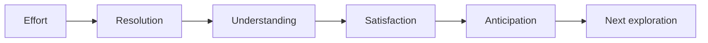
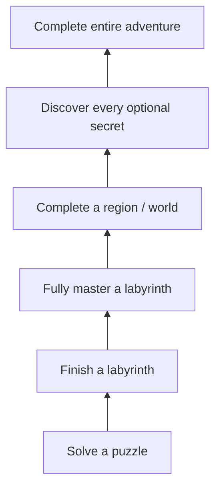

# WS4 — Completion Loop

| Field                 | Value                                                                                                                                                                                                                                      |
| --------------------- | ------------------------------------------------------------------------------------------------------------------------------------------------------------------------------------------------------------------------------------------ |
| **Project**           | Labyrinth Legends                                                                                                                                                                                                                          |
| **Document Name**     | WS4 — Completion Loop                                                                                                                                                                                                                      |
| **Document ID**       | LLDS-DOC-01-WS4-001                                                                                                                                                                                                                        |
| **Version**           | 1.0.0                                                                                                                                                                                                                                      |
| **Status**            | Approved                                                                                                                                                                                                                                   |
| **Owner**             | Apoorv                                                                                                                                                                                                                                     |
| **Prepared By**       | ChatGPT (workshop) · Cursor (compiler)                                                                                                                                                                                                     |
| **Last Updated**      | 2026-06-29                                                                                                                                                                                                                                 |
| **Workshop**          | WS4 — Completion Loop                                                                                                                                                                                                                      |
| **Dependencies**      | [Vision](../../00_Project/Vision.md) · [WS1 — Core Loop](WS1_Core_Loop.md) · [WS2 — Session Loop](WS2_Session_Loop.md) · [WS3 — Progression Loop](WS3_Progression_Loop.md)                                                                 |
| **Related Documents** | [Game Loop](Game_Loop.md) · [WS5 — Retention Loop](WS5_Retention_Loop.md) · [Progression](../Progression.md) · [Victory](../../03_Screens/Victory.md) · [Level Design](../Level_Design.md) · [Decisions](../../00_Project/Decisions.md) |

## Navigation

| ← Previous                                      | Next →                                        | Index                                                           |
| ----------------------------------------------- | --------------------------------------------- | --------------------------------------------------------------- |
| [WS4 — Completion Loop](WS4_Completion_Loop.md) | [WS5 — Retention Loop](WS5_Retention_Loop.md) | [Game Loop Workshops](README.md) · [LLDS Home](../../README.md) |

---

## Version History

| Version | Date       | Author           | Summary                                       |
| ------- | ---------- | ---------------- | --------------------------------------------- |
| 1.0.0   | 2026-06-29 | ChatGPT / Cursor | Completion Loop workshop decisions documented |

## Change Log

| Version | Change                                                                                                                                             |
| ------- | -------------------------------------------------------------------------------------------------------------------------------------------------- |
| 1.0.0   | Initial workshop record: philosophy, completion levels, rewards, optional completion, end-of-world experience, quality metrics, risks, conclusions |

---

## Purpose

This document records the **approved decisions from WS4 — Completion Loop Workshop**. It does not invent gameplay systems. It professionally documents how players experience **meaningful completion** — from solving a single puzzle through finishing an entire world and the full adventure.

[Vision](../../00_Project/Vision.md) defines philosophy. [WS1 — Core Loop](WS1_Core_Loop.md) defines moment-to-moment play. [WS2 — Session Loop](WS2_Session_Loop.md) defines a sitting. [WS3 — Progression Loop](WS3_Progression_Loop.md) defines long-term growth. **WS4 explains how milestones feel when they land** — achievement, closure, and anticipation for what comes next.

The focus is psychological completion, not implementation. Screen layouts, economy, and technical reward delivery belong in downstream documents.

## Intended Audience

| Role                    | Use this document to…                                           |
| ----------------------- | --------------------------------------------------------------- |
| Game Designers          | Author milestones and optional goals with emotional closure     |
| Level Designers         | Structure labyrinth and world endings for satisfaction          |
| UI/UX Designers         | Present completion moments without checklist fatigue            |
| Narrative / World Teams | Align world endings with reflection and anticipation            |
| Producers               | Scope optional content without mandatory completion pressure    |
| QA Engineers            | Evaluate whether completions feel earned and memorable          |
| AI Coding Agents        | Reject mandatory perfection gates and hollow percentage chasing |

## Table of Contents

1. [Workshop Purpose](#1-workshop-purpose)
2. [Philosophy of Completion](#2-philosophy-of-completion)
3. [Levels of Completion](#3-levels-of-completion)
4. [Completion Rewards](#4-completion-rewards)
5. [Optional Completion](#5-optional-completion)
6. [End-of-World Experience](#6-end-of-world-experience)
7. [Completion Quality Metrics](#7-completion-quality-metrics)
8. [Risks](#8-risks)
9. [Workshop Conclusions](#9-workshop-conclusions)

---

## 1. Workshop Purpose

### What Is a Completion Loop?

A **completion loop** is the arc from **approaching a milestone** through **resolving it** to **carrying its meaning forward**. It is not the same as winning a level — it is how the player *experiences* closure and what that closure motivates next.

| Loop level          | What completes                         | Document                                          |
| ------------------- | -------------------------------------- | ------------------------------------------------- |
| Core loop           | One puzzle attempt / labyrinth solve   | [WS1 — Core Loop](WS1_Core_Loop.md)               |
| Session loop        | One sitting                            | [WS2 — Session Loop](WS2_Session_Loop.md)         |
| Progression loop    | Long-term growth across sessions       | [WS3 — Progression Loop](WS3_Progression_Loop.md) |
| **Completion loop** | **Meaningful milestones at any scale** | **This document**                                 |

Completion loops recur at every scale: a puzzle solved, a labyrinth finished, a world mastered, the adventure complete.

### Why Completion Matters

Completion is where the game **proves its respect for the player’s effort**. Poor completion design makes victories feel hollow or endings feel like paperwork. Strong completion design:

| Effect                     | Why it matters                               |
| -------------------------- | -------------------------------------------- |
| **Validates intelligence** | The player’s plan was worth committing to    |
| **Creates closure**        | Mental chapter ends cleanly                  |
| **Fuels anticipation**     | The next ruin feels inviting, not obligatory |
| **Supports retention**     | Players return because fulfillment was real  |

### How Meaningful Endings Motivate Continued Exploration

When completion delivers **understanding and satisfaction**, the player’s next session begins from curiosity — not from guilt or checklist pressure. WS4 bridges [WS3 — Progression Loop](WS3_Progression_Loop.md) and long-term retention by ensuring milestones **feel worth reaching**.

### Design Intent

Establish completion as a design discipline — not a UI afterthought. Every milestone should be authored for emotional landing.

---

## 2. Philosophy of Completion

### What Completion Should Represent

| Quality           | Meaning                                            |
| ----------------- | -------------------------------------------------- |
| **Achievement**   | Something difficult or thoughtful was accomplished |
| **Understanding** | The player knows *why* it worked                   |
| **Closure**       | The chapter feels finished                         |
| **Satisfaction**  | The moment feels earned, not granted               |

### Beyond the Checklist

> **Locked Decision:** Completion must never feel like simply reaching the end of a checklist.

| Emotional completion          | Numerical completion                      |
| ----------------------------- | ----------------------------------------- |
| Player remembers the solve    | Player remembers the percentage           |
| Closure matches effort        | Counter ticks regardless of comprehension |
| Optional depth feels inviting | Optional items feel like chores           |
| Journey mattered              | Reward screen was the point               |

### Why Emotional Completion Beats Numerical Completion

Labyrinth Legends positions itself as a **premium puzzle-adventure**. Players who feel emotionally complete trust the product. Players who feel they were **filling meters** do not — even if the meters reached 100%.

This aligns with [Vision](../../00_Project/Vision.md):

- *Mastery* includes optional excellence standards — not mandatory perfection to proceed
- *Mastered Completion* (Vision glossary): completion plus optional excellence
- Replay value from **optional depth**, not forced repetition

### Design Intent

Completion reviews ask: *What did the player feel?* before *What did the player collect?*

---

## 3. Levels of Completion

### Completion Layers

Completion exists at nested scales. Each layer should deliver **increasing satisfaction** without requiring the layers above to feel valid:

| Level                              | What completes                              | Satisfaction character          |
| ---------------------------------- | ------------------------------------------- | ------------------------------- |
| **Solve a puzzle**                 | One WS1 cycle resolves successfully         | Immediate: plan matched reality |
| **Finish a labyrinth**             | Exit reached; chamber arc closed            | Relief + comprehension          |
| **Fully master a labyrinth**       | Optional efficiency, secrets, or excellence | Pride + refinement              |
| **Complete a region / world**      | Major content block finished                | Reflection + accomplishment     |
| **Discover every optional secret** | Thorough exploration rewarded               | Completionist fulfillment       |
| **Complete entire adventure**      | Full product arc resolved                   | Legacy satisfaction + gratitude |

### Lower Levels Stand Alone

A player who finishes a labyrinth (L2) without mastering it (L3) has **fully completed** that layer. Higher layers are **invitations**, not prerequisites for feeling done.

### Behavioral vs Statistical Completion

Per [WS3 — Progression Loop](WS3_Progression_Loop.md), stages describe behavior — not stat tiers. Completion layers describe **experiential depth**, not power gates.

### Design Intent

Give level and world authors a ladder of completion types. Author each layer to feel complete on its own terms.

---

## 4. Completion Rewards

### Reward Philosophy at Completion Moments

Completion moments are high-salience. What the game emphasizes here teaches the player what the product values.

### Intrinsic Rewards (Primary)

| Intrinsic reward          | Completion expression                  |
| ------------------------- | -------------------------------------- |
| Solving difficult puzzles | The labyrinth yielded to understanding |
| Discovering hidden areas  | Secrets confirm careful reading        |
| Mastering mechanics       | Advanced interactions feel legible     |
| Personal accomplishment   | Player can explain what they achieved  |

> **Locked Decision:** Intrinsic rewards remain the **primary motivation** at completion — consistent with WS2-L06 and WS3-L06.

### Extrinsic Rewards (Supporting)

| Extrinsic reward    | Role                          |
| ------------------- | ----------------------------- |
| Cosmetic unlocks    | Celebrate milestone; no power |
| Collectibles        | Record exploration            |
| Achievements        | Recognize mastery standards   |
| Exploration records | Summarize thorough play       |

Extrinsic markers **commemorate** completion; they do not substitute for puzzle satisfaction.

### The Journey Over the Reward

> **Locked Decision:** The **journey remains more important than the reward.**

A lavish reward screen cannot rescue a labyrinth that taught nothing. Completion UX amplifies success; it does not create it.

### Design Intent

Victory presentation, collectibles, and achievement design must lead with comprehension and accomplishment — extrinsic items follow.

---

## 5. Optional Completion

### Philosophy

Optional objectives exist to **reward curiosity and mastery** — not to punish players who decline them.

| Examples                  | Design role                  |
| ------------------------- | ---------------------------- |
| Hidden relics             | Reward observation           |
| Secret chambers           | Reward exploration           |
| Perfect solutions         | Reward planning excellence   |
| Alternative puzzle routes | Reward spatial reasoning     |
| Full exploration          | Reward thorough ruin-reading |

### Optional Must Stay Optional

> **Locked Decision:** Optional content rewards curiosity; it does **not** punish players who ignore it.

| Healthy optional design               | Unhealthy optional design         |
| ------------------------------------- | --------------------------------- |
| Core path completable without secrets | Secrets gate main progression     |
| Mastery paths self-selected           | Perfect play required to advance  |
| Skipping optional content feels fine  | Skipping feels like failure       |
| Veterans return for depth             | Everyone must 100% or fall behind |

This extends [WS3 — Progression Loop](WS3_Progression_Loop.md) mastery philosophy and Vision’s optional mastery paths.

### Design Intent

Optional completion is the primary vector for replay and depth. It must never become disguised mandatory content.

---

## 6. End-of-World Experience

### How Players Should Feel After Completing a World

World completion is a **major completion loop**. It should land as a chapter ending in a book — not a grind checkpoint.

| Goal             | Description                                                       |
| ---------------- | ----------------------------------------------------------------- |
| **Satisfaction** | The world’s ideas were conquered through understanding            |
| **Reflection**   | Player can recall standout chambers and lessons                   |
| **Anticipation** | The next world intrigues                                          |
| **Curiosity**    | Unresolved mysteries tease forward — without hostile cliffhangers |

### Encouraging Continuation, Not Exhaustion

> **Locked Decision:** World endings should encourage **continuation rather than exhaustion**.

| Encourages continuation                   | Causes exhaustion               |
| ----------------------------------------- | ------------------------------- |
| “I want to see what the next ruins teach” | “I need a break from this game” |
| Clean emotional closure                   | Draining marathon requirement   |
| Peak moment then release                  | Forced perfection chain         |
| Optional mastery available later          | Mandatory 100% before leaving   |

Aligns with [WS2 — Session Loop](WS2_Session_Loop.md) relaxed ending and voluntary exit philosophy.

### End-of-World Is Not End-of-Session Only

A world may take many sessions. Its completion moment must work whether the player finishes in one sitting or across a week.

### Design Intent

World leads and narrative designers own the emotional shape of world endings. WS4 sets the quality bar; screen specs implement presentation.

---

## 7. Completion Quality Metrics

### Indicators of Successful Completion

Qualitative signals — not percentage counters alone:

| Signal                                                 | Healthy interpretation                     |
| ------------------------------------------------------ | ------------------------------------------ |
| **Players voluntarily pursue optional objectives**     | Curiosity and mastery pull, not obligation |
| **Completing a world feels memorable**                 | Standout chambers and ideas recalled       |
| **Players revisit earlier content to improve mastery** | Optional depth has value                   |
| **Completion creates excitement**                      | Anticipation for next adventure            |
| **Completion creates fulfillment**                     | Not merely relief that a bar filled        |

### Weak Metrics

| Weak metric                                 | Why                                |
| ------------------------------------------- | ---------------------------------- |
| Completion percentage alone                 | Hitting 100% without comprehension |
| Collectible count without discovery meaning | Checklist fatigue                  |
| Time-to-complete as primary KPI             | Long confused play is not success  |

### Review Questions

1. Can the player describe what they learned at this milestone?
2. Would optional objectives still feel worthwhile if extrinsic rewards were removed?
3. Does world completion make the player want the **next** world — not just rest?
4. Is core progression completable without optional layers?

### Design Intent

QA and product review evaluate completion by memory, motivation, and anticipation — not dashboards alone.

---

## 8. Risks

| Risk                                             | Description                          | Mitigation                                                                  |
| ------------------------------------------------ | ------------------------------------ | --------------------------------------------------------------------------- |
| **Checklist fatigue**                            | Completion feels like form-filling   | Emphasize understanding; fewer, meaningful extrinsic markers                |
| **Excessive collectibles**                       | Optional items swamp the experience  | Curate collectibles; each should teach or commemorate                       |
| **Mandatory completion requirements**            | 100% gates block progression         | Core path independent of optional layers per WS4-L04                        |
| **Weak end-of-world moments**                    | Worlds end without emotional landing | Author reflection + anticipation beats per [§6](#6-end-of-world-experience) |
| **Repetitive optional objectives**               | Same secret type every chamber       | Vary optional goal types; reward different skills                           |
| **Relief over excitement**                       | Player glad it is over               | Pacing and closure per WS2; world arc design                                |
| **Numerical completion overshadowing emotional** | UI leads with percentages            | Lead with accomplishment narrative; metrics secondary                       |

### Monitoring

Victory screens, achievement systems, and collectible pipelines must be reviewed against WS4 before ship.

---

## 9. Workshop Conclusions

### Locked Decisions

| ID      | Decision                                                                                             | Source                                                |
| ------- | ---------------------------------------------------------------------------------------------------- | ----------------------------------------------------- |
| WS4-L01 | Completion loop covers psychological milestone resolution from puzzle through full adventure         | WS4 workshop                                          |
| WS4-L02 | Completion represents achievement, understanding, closure, satisfaction — not checklist ticking      | WS4 workshop                                          |
| WS4-L03 | Emotional completion more important than numerical completion                                        | WS4 workshop · aligns with Vision Mastered Completion |
| WS4-L04 | Completion layers (puzzle → labyrinth → mastery → world → secrets → adventure) each valid standalone | WS4 workshop                                          |
| WS4-L05 | Intrinsic rewards primary at completion; extrinsic commemorates                                      | WS4 workshop · extends WS2-L06, WS3-L06               |
| WS4-L06 | Journey more important than reward                                                                   | WS4 workshop                                          |
| WS4-L07 | Optional completion rewards curiosity; never punishes skipping                                       | WS4 workshop · aligns with WS3 mastery optional depth |
| WS4-L08 | End-of-world: satisfaction, reflection, anticipation, curiosity — continuation not exhaustion        | WS4 workshop                                          |
| WS4-L09 | Completion quality: memorable worlds, voluntary optional play, excitement not relief                 | WS4 workshop                                          |
| WS4-L10 | Players finish because fulfilled, not forced                                                         | WS4 workshop · aligns with WS2 voluntary exit         |

### Future Decisions (Deferred)

| Topic                              | Target document                                                                 |
| ---------------------------------- | ------------------------------------------------------------------------------- |
| Victory screen presentation        | [Victory](../../03_Screens/Victory.md) · [LLDL](../../02_Design_System/LLDL/LLDL.md) |
| Star / mastery scoring rules       | [Progression](../Progression.md)                                                |
| Relic and collectible definitions  | [Progression](../Progression.md) · [Game Bible](../Game_Bible.md)               |
| World-ending narrative beats       | [Worlds](../Worlds.md) · [Game Bible](../Game_Bible.md)                         |
| Achievement list                   | [Progression](../Progression.md)                                                |
| Level optional objective authoring | [Level Design](../Level_Design.md)                                              |

### Open Questions

| ID      | Question                                                              | Owner            | Status                |
| ------- | --------------------------------------------------------------------- | ---------------- | --------------------- |
| WS4-Q01 | How explicitly should mastery layers (L3) be surfaced vs implicit?    | ChatGPT / Apoorv | Open — UX             |
| WS4-Q02 | Standard world-ending presentation: summary, reflection, teaser?      | ChatGPT / Apoorv | Open — Victory screen |
| WS4-Q03 | Global “adventure complete” experience scope for MVP vs full product? | ChatGPT / Apoorv | Open — Roadmap        |
| WS4-Q04 | Revisit / improve flow for earlier labyrinths — how encouraged?       | ChatGPT / Apoorv | Open — Progression    |

---

## Cross References

- Upstream: [Vision](../../00_Project/Vision.md), [WS1](WS1_Core_Loop.md), [WS2](WS2_Session_Loop.md), [WS3](WS3_Progression_Loop.md)
- Parent: [Game Loop](Game_Loop.md)
- Sibling: [WS5 — Retention Loop](WS5_Retention_Loop.md)
- Downstream: [Progression](../Progression.md), [Level Design](../Level_Design.md), [Victory](../../03_Screens/Victory.md)
- Governance: [Decisions](../../00_Project/Decisions.md)

---

## Navigation

| ← Previous                                      | Next →                                        | Index                                                           |
| ----------------------------------------------- | --------------------------------------------- | --------------------------------------------------------------- |
| [WS4 — Completion Loop](WS4_Completion_Loop.md) | [WS5 — Retention Loop](WS5_Retention_Loop.md) | [Game Loop Workshops](README.md) · [LLDS Home](../../README.md) |

