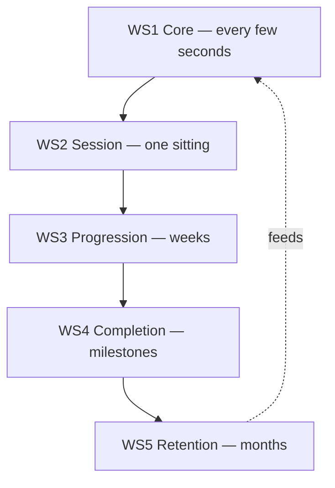

# WS5 — Retention Loop

| Field                 | Value                                                                                                                                                                                                                        |
| --------------------- | ---------------------------------------------------------------------------------------------------------------------------------------------------------------------------------------------------------------------------- |
| **Project**           | Labyrinth Legends                                                                                                                                                                                                            |
| **Document Name**     | WS5 — Retention Loop                                                                                                                                                                                                         |
| **Document ID**       | LLDS-DOC-01-WS5-001                                                                                                                                                                                                          |
| **Version**           | 1.0.0                                                                                                                                                                                                                        |
| **Status**            | Approved                                                                                                                                                                                                                     |
| **Owner**             | Apoorv                                                                                                                                                                                                                       |
| **Prepared By**       | ChatGPT (workshop) · Cursor (compiler)                                                                                                                                                                                       |
| **Last Updated**      | 2026-06-29                                                                                                                                                                                                                   |
| **Workshop**          | WS5 — Retention Loop                                                                                                                                                                                                         |
| **Dependencies**      | [Vision](../../00_Project/Vision.md) · [WS1 — Core Loop](WS1_Core_Loop.md) · [WS2 — Session Loop](WS2_Session_Loop.md) · [WS3 — Progression Loop](WS3_Progression_Loop.md) · [WS4 — Completion Loop](WS4_Completion_Loop.md) |
| **Related Documents** | [Game Loop](Game_Loop.md) · [Progression](../Progression.md) · [LiveOps](../LiveOps.md) · [Decisions](../../00_Project/Decisions.md)                                                                                      |

## Navigation

| ← Previous                                      | Next →                       | Index                                                           |
| ----------------------------------------------- | ---------------------------- | --------------------------------------------------------------- |
| [WS4 — Completion Loop](WS4_Completion_Loop.md) | [Game Loop](Game_Loop.md) | [Game Loop Workshops](README.md) · [LLDS Home](../../README.md) |

---

## Version History

| Version | Date       | Author           | Summary                                                                 |
| ------- | ---------- | ---------------- | ----------------------------------------------------------------------- |
| 1.0.0   | 2026-06-29 | ChatGPT / Cursor | Retention Loop workshop decisions documented — concludes WS1–WS5 series |

## Change Log

| Version | Change                                                                                                                                                                                 |
| ------- | -------------------------------------------------------------------------------------------------------------------------------------------------------------------------------------- |
| 1.0.0   | Initial workshop record: philosophy, return motivations, long-term engagement, player time respect, post-completion retention, quality metrics, risks, conclusions, closing philosophy |

---

## Purpose

This document records the **approved decisions from WS5 — Retention Loop Workshop**. It does not invent mechanics. It professionally documents **why players voluntarily return** to Labyrinth Legends over weeks and months — and why that return must emerge from trust, not manipulation.

[Vision](../../00_Project/Vision.md) defines philosophy. [WS1](WS1_Core_Loop.md) through [WS4](WS4_Completion_Loop.md) define play from seconds through completion. **WS5 defines the long-term relationship between player and game** — the retention loop that concludes the five gameplay loop workshops.

Implementation of notifications, live ops, and economy belongs in downstream documents. WS5 sets the design philosophy those systems must obey.

## Intended Audience

| Role               | Use this document to…                                                |
| ------------------ | -------------------------------------------------------------------- |
| Game Designers     | Evaluate features against voluntary-return principles                |
| Producers          | Prioritize content and craft over engagement hacks                   |
| Product / Live Ops | Reject systems that violate player trust (when specified downstream) |
| Marketing          | Message the game honestly — curiosity, not obligation                |
| Community          | Understand intended long-term player relationship                    |
| QA Engineers       | Flag coercive patterns in builds                                     |
| AI Coding Agents   | Refuse FOMO, daily chores, and punishment-for-absence mechanics      |

## Table of Contents

1. [Workshop Purpose](#1-workshop-purpose)
2. [Retention Philosophy](#2-retention-philosophy)
3. [Reasons Players Return](#3-reasons-players-return)
4. [Long-Term Engagement](#4-long-term-engagement)
5. [Respecting Player Time](#5-respecting-player-time)
6. [Post-Completion Retention](#6-post-completion-retention)
7. [Retention Quality Metrics](#7-retention-quality-metrics)
8. [Risks](#8-risks)
9. [Workshop Conclusions](#9-workshop-conclusions)
10. [Closing Philosophy](#10-closing-philosophy)

---

## 1. Workshop Purpose

### What Is a Retention Loop?

A **retention loop** is the cycle that brings a player **back after they have left** — not because they must, but because they want to. It spans days, weeks, and months. It answers: *What sustained pull keeps this game in the player's life without manufacturing guilt?*

| Loop level         | Horizon                      | Document                                          |
| ------------------ | ---------------------------- | ------------------------------------------------- |
| Core loop          | Seconds to minutes           | [WS1 — Core Loop](WS1_Core_Loop.md)               |
| Session loop       | One sitting                  | [WS2 — Session Loop](WS2_Session_Loop.md)         |
| Progression loop   | Days to weeks                | [WS3 — Progression Loop](WS3_Progression_Loop.md) |
| Completion loop    | Milestone closure            | [WS4 — Completion Loop](WS4_Completion_Loop.md)   |
| **Retention loop** | **Weeks to months / beyond** | **This document**                                 |

Retention is not a separate game layered on top — it is the **natural consequence** of WS1–WS4 executed well.

### Why Long-Term Retention Matters

| Reason                   | Explanation                                       |
| ------------------------ | ------------------------------------------------- |
| **Product viability**    | Premium craft deserves an audience that stays     |
| **Content amortization** | Authored worlds repay design investment over time |
| **Word of mouth**        | Players recommend games they trust                |
| **Creative legacy**      | A game remembered beats a game merely played once |

Retention matters — but **how** it is achieved matters more.

### Player Trust Over Artificial Engagement

> **Locked Decision:** **Player trust is more valuable than artificial engagement.**

| Trust-based retention         | Manipulation-based retention     |
| ----------------------------- | -------------------------------- |
| Player returns from curiosity | Player returns from fear of loss |
| Absence is not punished       | Absence incurs penalty           |
| Metrics follow satisfaction   | Metrics precede satisfaction     |
| Long-term brand strength      | Short-term metric spikes         |

[Vision](../../00_Project/Vision.md) explicitly rejects aggressive retention mechanics and coercive patterns. WS5 operationalizes that stance across the full player lifecycle.

### Design Intent

Conclude the workshop series by naming retention as a **design outcome of quality**, not a feature category to maximize.

---

## 2. Retention Philosophy

### Agreed Philosophy

> **Locked Decision:** Players should return because they **want to** — never because they feel **forced**.

Retention should emerge from:

| Driver           | Description                             |
| ---------------- | --------------------------------------- |
| **Curiosity**    | Unseen ruins, unanswered questions      |
| **Discovery**    | Secrets and hidden structure            |
| **Mastery**      | Improving plans and optional excellence |
| **Anticipation** | Forward pull toward new ideas           |
| **Exploration**  | Breadth of spaces not yet read          |

### Intrinsic Motivation and Healthy Engagement

Intrinsic motivation produces retention that **compounds trust**:

| Intrinsic retention                 | Extrinsic coercion            |
| ----------------------------------- | ----------------------------- |
| Self-reinforcing enjoyment          | Declining tolerance over time |
| Players advocate honestly           | Players resent obligation     |
| Absence does not break relationship | Absence triggers anxiety      |
| Content quality is the lever        | System design is the lever    |

This extends [WS3 — Progression Loop](WS3_Progression_Loop.md) (knowledge as progression) and [WS4 — Completion Loop](WS4_Completion_Loop.md) (fulfillment over checklists).

### Design Intent

Every retention proposal must identify its intrinsic driver. If none exists, the feature does not belong.

---

## 3. Reasons Players Return

### Healthy Return Motivations

Players voluntarily return when:

| Motivation                     | Retention expression              |
| ------------------------------ | --------------------------------- |
| **New worlds**                 | Fresh environments and idea sets  |
| **New puzzle mechanics**       | Legible rules to learn and master |
| **Hidden areas**               | Rewards for observation           |
| **Optional challenges**        | Self-selected depth               |
| **Personal improvement**       | Better routes, faster reads       |
| **Unfinished exploration**     | Curiosity about what was missed   |
| **Mastering previous content** | Revisiting ruins with new skill   |

Each motivation ties to **understanding or possibility** — not to avoiding punishment.

### Excluded Reliance

Retention must **not** rely on:

| Excluded driver            | Why                                        |
| -------------------------- | ------------------------------------------ |
| **Fear of Missing Out**    | Coerces play; erodes premium trust         |
| **Artificial timers**      | Creates anxiety incompatible with planning |
| **Punishment for absence** | Player guilt is not engagement             |
| **Daily obligations**      | Manufactures chore, not adventure          |

Consistent with [WS2 — Session Loop](WS2_Session_Loop.md) WS2-L05 and [Vision](../../00_Project/Vision.md) anti-patterns under Respect Player Time.

### Design Intent

Content roadmaps and live plans should be justified by the healthy motivation list — not by metric recovery hacks.

---

## 4. Long-Term Engagement

### How Engagement Evolves

Long-term engagement is a **journey of deepening relationship**, not a flat login curve:

| Phase                      | Player focus                  | Retention character                             |
| -------------------------- | ----------------------------- | ----------------------------------------------- |
| **Week 1 — Learning**      | WS1 contract; trust forming   | "I understand how this works"                   |
| **Week 2 — Exploring**     | Breadth; optional paths       | "There is more here than I thought"             |
| **Week 3 — Mastering**     | Depth; efficiency and secrets | "I read these ruins better now"                 |
| **Month 2 — Completion**   | Worlds and optional goals     | "I want to finish what I started — on my terms" |
| **Month 6+ — New content** | Handcrafted expansions        | "I want to see what they built next"            |

### Meaningful Content Over Artificial Systems

> **Locked Decision:** **Meaningful content always outperforms artificial retention systems.**

| Content-led long tail         | System-led long tail                      |
| ----------------------------- | ----------------------------------------- |
| New worlds teach new ideas    | Login calendars teach obligation          |
| Optional mastery extends life | Energy gates extend sessions artificially |
| Expansions feel like gifts    | Seasons feel like homework                |
| Players remember chambers     | Players remember streaks                  |

### Design Intent

Roadmap and expansion strategy prioritize authored quality. Systems serve content — not the reverse.

---

## 5. Respecting Player Time

### Defining Philosophy

Respect for player time is not a feature — it is the **foundation of Labyrinth Legends' retention model**.

| Player should feel     | Player should never feel |
| ---------------------- | ------------------------ |
| **"I chose to play."** | **"I had to log in."**   |

### Why Respect Builds Long-Term Trust

| Effect                       | Mechanism                     |
| ---------------------------- | ----------------------------- |
| **Lower anxiety**            | Players leave without penalty |
| **Higher return quality**    | Sessions start from desire    |
| **Stronger recommendations** | Players praise fair design    |
| **Premium credibility**      | Product matches positioning   |

Aligns with Vision Pillar 4 — Respect Player Time — and WS2 voluntary exit philosophy.

### Practical Implications (Philosophy Only)

- Notifications, when they exist downstream, must **invite** — not threaten
- Absence does not decay core progress
- Sessions remain completable in short windows
- Front-loaded clarity prevents wasted time

### Design Intent

Any future system that makes the player feel obligated fails WS5 regardless of metric lift.

---

## 6. Post-Completion Retention

### Retention After the Main Adventure

Completing the core adventure is not the end of the relationship — it is a **transition** to optional depth and future craft.

### Why Players Continue After Completion

| Motivation                  | Description                                  |
| --------------------------- | -------------------------------------------- |
| **Hidden secrets**          | Unfound optional content                     |
| **Optional mastery**        | Efficiency, perfection, thorough exploration |
| **Achievement hunting**     | Recognition of standards voluntarily pursued |
| **Future expansions**       | New handcrafted worlds and ideas             |
| **Community discussion**    | Sharing solutions and discoveries            |
| **Better puzzle solutions** | Self-improvement on earlier content          |

> **Locked Decision:** Post-completion retention should **naturally extend from player satisfaction** — not from locking content behind return schedules.

### Relationship to WS4

[WS4 — Completion Loop](WS4_Completion_Loop.md) defines how milestones feel when reached. WS5 defines why players **return after** those milestones — especially optional and post-campaign layers.

### Design Intent

Endgame and expansion design serve players who want more — never players trying to escape obligation.

---

## 7. Retention Quality Metrics

### Indicators of Successful Retention

Qualitative signals — not login streaks alone:

| Signal                                     | Healthy interpretation              |
| ------------------------------------------ | ----------------------------------- |
| **Players return voluntarily**             | Desire, not duty                    |
| **Players recommend the game**             | Trust converted to advocacy         |
| **Players remember puzzles**               | Intrinsic engagement left a mark    |
| **Curiosity remains high**                 | Forward pull persists               |
| **Community discussion grows organically** | Players want to share understanding |

### Weak Metrics

| Weak metric                      | Why                        |
| -------------------------------- | -------------------------- |
| Login streaks alone              | Streaks measure compliance |
| Session count without sentiment  | Volume ≠ satisfaction      |
| DAU maximization without quality | Churn follows coercion     |
| Notification open rates          | Opens ≠ enjoyment          |

### Review Questions

1. Would players still return if daily rewards were removed?
2. Do players describe the game in terms of puzzles and ruins — or schedules?
3. Does absence feel safe?
4. Is new content the primary reason for return spikes?

### Design Intent

Leadership evaluates retention health by trust and memory — dashboards support, they do not define success.

---

## 8. Risks

| Risk                                  | Description                             | Mitigation                                                                   |
| ------------------------------------- | --------------------------------------- | ---------------------------------------------------------------------------- |
| **FOMO systems**                      | Limited-time pressure on core content   | Reject for core progression; any optional use must pass Vision §13 framework |
| **Daily chores**                      | Login tasks replace play                | No daily obligation mechanics per WS5-L02                                    |
| **Repetitive live-service mechanics** | Same seasonal pattern without new ideas | Content-first expansions; craft over cadence                                 |
| **Excessive notifications**           | Push messages create guilt              | Invite-only tone; respect silence                                            |
| **Artificial scarcity**               | Fake urgency on non-limited content     | Honest availability; premium trust                                           |
| **Player burnout**                    | Pacing ignores mental load              | WS2 pacing arc; WS4 completion closure                                       |
| **Metric chasing**                    | Features optimize dashboards over feel  | WS5 quality metrics; Human approval on exceptions                            |

### Monitoring

[LiveOps](../LiveOps.md) and [Economy](../Economy.md) documents, when written, must cite WS5 compliance explicitly.

---

## 9. Workshop Conclusions

### Locked Decisions

| ID      | Decision                                                                                                           | Source                                                |
| ------- | ------------------------------------------------------------------------------------------------------------------ | ----------------------------------------------------- |
| WS5-L01 | Retention loop = voluntary return over weeks/months; emerges from WS1–WS4 quality                                  | WS5 workshop                                          |
| WS5-L02 | Players return because they want to — never because they feel forced                                               | WS5 workshop                                          |
| WS5-L03 | Retention drivers: curiosity, discovery, mastery, anticipation, exploration                                        | WS5 workshop                                          |
| WS5-L04 | Intrinsic motivation produces healthier long-term engagement than coercion                                         | WS5 workshop                                          |
| WS5-L05 | Healthy return motivations: new worlds, mechanics, secrets, optional challenges, improvement, exploration, mastery | WS5 workshop                                          |
| WS5-L06 | No reliance on FOMO, artificial timers, absence punishment, or daily obligations                                   | WS5 workshop · aligns with WS2-L05, Vision            |
| WS5-L07 | Long-term engagement phases: learning → exploring → mastering → completion → new content                           | WS5 workshop                                          |
| WS5-L08 | Meaningful content outperforms artificial retention systems                                                        | WS5 workshop                                          |
| WS5-L09 | Player trust more valuable than artificial engagement                                                              | WS5 workshop                                          |
| WS5-L10 | "I chose to play" — never "I had to log in"                                                                        | WS5 workshop · aligns with Vision Respect Player Time |
| WS5-L11 | Post-completion retention extends naturally from satisfaction                                                      | WS5 workshop · aligns with WS4                        |
| WS5-L12 | Retention quality: voluntary return, recommendation, puzzle memory, curiosity, organic community                   | WS5 workshop                                          |
| WS5-L13 | Goal is not to maximize retention metrics — it is to earn natural return through thoughtful design                 | WS5 workshop                                          |

### Future Decisions (Deferred)

| Topic                                    | Target document                                                                      |
| ---------------------------------------- | ------------------------------------------------------------------------------------ |
| Notification policy                      | [LiveOps](../LiveOps.md) — must comply with WS5                                      |
| Daily challenge design (if any)          | [LiveOps](../LiveOps.md) — must strengthen pillars per Vision                        |
| Expansion cadence                        | [Roadmap](../../00_Project/Roadmap.md)                                               |
| Community features                       | Product decision — organic discussion preferred                                      |
| Economy and monetization retention hooks | [Economy](../Economy.md) · [Monetization](../Monetization.md) — must not violate WS5 |

### Open Questions

| ID      | Question                                                      | Owner            | Status          |
| ------- | ------------------------------------------------------------- | ---------------- | --------------- |
| WS5-Q01 | Optional daily challenge: strengthen pillars or skip for MVP? | ChatGPT / Apoorv | Open — LiveOps  |
| WS5-Q02 | Notification strategy: none, minimal, or player-opt-in only?  | ChatGPT / Apoorv | Open — product  |
| WS5-Q03 | Post-campaign content cadence for indie/small-team reality?   | ChatGPT / Apoorv | Open — Roadmap  |
| WS5-Q04 | In-game community/solution-sharing scope?                     | ChatGPT / Apoorv | Open — post-MVP |

---

## 10. Closing Philosophy

The five gameplay loop workshops form a single design contract:

**WS1** asks: Is each puzzle worth thinking about?  
**WS2** asks: Is each session worth finishing?  
**WS3** asks: Is growth worth pursuing?  
**WS4** asks: Does each milestone land emotionally?  
**WS5** asks: Is the game worth coming back to — freely?

The ultimate goal of Labyrinth Legends is **not** to maximize player retention metrics.

Its goal is to create an experience so thoughtfully designed that players **naturally choose to return**, **recommend it to others**, and **remember it long after they have completed it**.

When that goal is met, retention metrics become a **report** on success — not a target that distorts design.

This concludes the **WS1–WS5 Gameplay Loop Workshop Series**. Downstream documents implement. They do not redefine these loops without explicit Human approval recorded in [Decisions](../../00_Project/Decisions.md).

---

## Cross References

- Upstream: [Vision](../../00_Project/Vision.md), [WS1](WS1_Core_Loop.md), [WS2](WS2_Session_Loop.md), [WS3](WS3_Progression_Loop.md), [WS4](WS4_Completion_Loop.md)
- Parent: [Game Loop](Game_Loop.md)
- Downstream: [LiveOps](../LiveOps.md), [Progression](../Progression.md), [Roadmap](../../00_Project/Roadmap.md)
- Governance: [Decisions](../../00_Project/Decisions.md)

---

## Navigation

| ← Previous                                      | Next →                       | Index                                                           |
| ----------------------------------------------- | ---------------------------- | --------------------------------------------------------------- |
| [WS4 — Completion Loop](WS4_Completion_Loop.md) | [Game Loop](Game_Loop.md) | [Game Loop Workshops](README.md) · [LLDS Home](../../README.md) |

