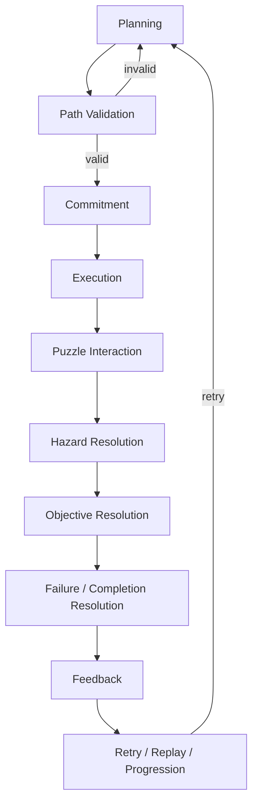

# Gameplay — Integration Document

| Field | Value |
|-------|-------|
| **Project** | Labyrinth Legends |
| **Document Name** | Gameplay Integration |
| **Document ID** | LLDS-DOC-01-GP-INT-001 |
| **Path** | `docs/01_Game_Design/Gameplay.md` |
| **Version** | 2.1.0 |
| **Status** | Approved |
| **Owner** | Apoorv |
| **Prepared By** | Cursor (compiler) |
| **Last Updated** | 2026-06-29 |
| **Phase** | Gameplay Documentation Integration |
| **Priority** | Integration / Reference |
| **Dependencies** | [Vision](../00_Project/Vision.md) · [Game Loop](Game_Loop.md) · [GP1–GP7](Gameplay/README.md) |
| **Related Documents** | [Gameplay Specs README](Gameplay/README.md) · [Decisions](../00_Project/Decisions.md) · [Roadmap](../00_Project/Roadmap.md) |

## Navigation

| ← Previous | Next → | Index |
|------------|--------|-------|
| [Game Loop](Game_Loop.md) | [LLDL](../02_Design_System/LLDL.md) | [LLDS Home](../README.md) · [Gameplay Specs](Gameplay/README.md) |

---

## Version History

| Version | Date | Author | Summary |
|---------|------|--------|---------|
| 1.0.0 | 2026-06-28 | Cursor | Phase 1 scaffold — placeholders awaiting GP series |
| 2.0.0 | 2026-06-29 | Cursor | Full integration document synthesizing GP1–GP7 and GP3 series |
| 2.1.0 | 2026-06-29 | Apoorv / ChatGPT | Approved and locked after Gameplay Phase 2 integration review |

---

## Table of Contents

1. [Purpose](#1-purpose)
2. [Gameplay Identity](#2-gameplay-identity)
3. [Gameplay Document Map](#3-gameplay-document-map)
4. [Authority Model](#4-authority-model)
5. [Core Gameplay Loop](#5-core-gameplay-loop)
6. [Player & Explorer Model](#6-player--explorer-model)
7. [Movement Model](#7-movement-model)
8. [Gameplay Rule Model](#8-gameplay-rule-model)
9. [Puzzle Element System](#9-puzzle-element-system)
10. [Hazards & Failure System](#10-hazards--failure-system)
11. [Objectives & Completion System](#11-objectives--completion-system)
12. [Gameplay Feedback System](#12-gameplay-feedback-system)
13. [Gameplay System Interaction](#13-gameplay-system-interaction)
14. [MVP Gameplay Scope Summary](#14-mvp-gameplay-scope-summary)
15. [What Gameplay.md Must Not Do](#15-what-gameplaymd-must-not-do)
16. [Gameplay Review Checklist](#16-gameplay-review-checklist)
17. [Locked Gameplay Decisions](#17-locked-gameplay-decisions)
18. [Open Questions & Deferred Items](#18-open-questions--deferred-items)
19. [Cross References](#19-cross-references)
20. [Approval Status](#20-approval-status)

---

## 1. Purpose

This document is the **consolidated gameplay integration reference** for Labyrinth Legends. It answers:

> **What is the complete gameplay system, and where does each rule live?**

`Gameplay.md` **summarizes, connects, and indexes** the authoritative gameplay specification series — it does **not** replace them.

| This document | Authoritative specs |
|---------------|---------------------|
| Explains how systems fit together | Define the rules |
| Directs readers to the correct owner | Own player agency, movement, elements, hazards, objectives, feedback, precedence |
| Lists locked decisions and open questions at integration level | Hold detailed behaviour, taxonomy, and examples |

**Upstream authority:** [Vision](../00_Project/Vision.md) · [Game Loop](Game_Loop.md)  
**Downstream specs:** [GP1](Gameplay/GP1_Player_Explorer.md) · [GP2](Gameplay/GP2_Movement_System.md) · [GP7](Gameplay/GP7_Gameplay_Rules.md) · [GP3.1–GP3.5](Gameplay/GP3/README.md) · [GP4](Gameplay/GP4_Hazards_Failure.md) · [GP5](Gameplay/GP5_Objectives_Completion.md) · [GP6](Gameplay/GP6_Gameplay_Feedback.md)

> **Conflict rule:** If this document conflicts with any higher-authority spec, **preserve the higher document** and report the conflict — do not silently reinterpret.

### Design Intent

`Gameplay.md` is the **map**, not the **terrain**. Readers use it to orient; they implement and review from GP1–GP7.

---

## 2. Gameplay Identity

Labyrinth Legends is a **premium mobile puzzle adventure** where the player plans routes through ancient labyrinths, commits to a path, watches the explorer execute it, solves environmental puzzles, avoids hazards, completes objectives, discovers treasures and relics, and masters levels through better planning.

### Core Identity Pillars

| Pillar | Meaning |
|--------|---------|
| **Draw / plan before action** | Skill is forming a correct plan before consequences unfold ([Draw Your Fate](../00_Project/Vision.md)) |
| **Commit before consequence** | Confirmation locks the route; outcomes follow the committed plan |
| **Explorer executes the player's plan** | No real-time steering during core execution |
| **Puzzle consequences are deterministic** | Same plan → same outcome; no random lethal resolution |
| **Hazards are puzzle consequences, not action obstacles** | Danger is readable, learnable, and tied to committed routes |
| **Completion rewards exploration, escape, discovery, and mastery** | Thematic seals — not generic arcade scoring |
| **Feedback informs without solving the puzzle** | Communication supports agency; it does not decide outcomes |

### Design Intent

Every gameplay system must reinforce **planning mastery**, not reflex control. Integration docs exist to keep that identity visible across GP1–GP7.

---

## 3. Gameplay Document Map

| Document | ID | Authority Layer | Owns | Does Not Own |
|----------|-----|-----------------|------|--------------|
| [Vision.md](../00_Project/Vision.md) | — | Product | North star, pillars, player fantasy, premium positioning | Movement rules, puzzle behaviour, UI specs |
| [Game_Loop.md](Game_Loop.md) | GL | Loop architecture | Session, progression, retention, completion loops (WS1–WS5) | Per-step rule precedence, element definitions |
| [GP1_Player_Explorer.md](Gameplay/GP1_Player_Explorer.md) | GP1 | Core | Player ↔ Explorer roles, agency, planning vs execution, commitment | Path validation, element behaviour, hazard rules |
| [GP2_Movement_System.md](Gameplay/GP2_Movement_System.md) | GP2 | Core | Path creation, validation, execution, movement model | Rule precedence, hazard/objective resolution |
| [GP7_Gameplay_Rules.md](Gameplay/GP7_Gameplay_Rules.md) | GP7 | Core | Rule precedence, resolution order, step pipeline, conflict protocol | Element definitions, UI presentation |
| [GP3.1_Puzzle_Taxonomy.md](Gameplay/GP3/GP3.1_Puzzle_Taxonomy.md) | GP3.1 | Puzzle design | Taxonomy language, classification, design philosophy | Individual element mechanics |
| [GP3.2_Static_Traversal_Collectible_Elements.md](Gameplay/GP3/GP3.2_Static_Traversal_Collectible_Elements.md) | GP3.2 | Puzzle design | Static, traversal, collectible element behaviour | Hazard consequences, objective seals |
| [GP3.3_Interactive_Elements.md](Gameplay/GP3/GP3.3_Interactive_Elements.md) | GP3.3 | Puzzle design | Switches, keys, doors, plates, sequences | Movement validation detail, feedback UI |
| [GP3.4_Environmental_Dynamic_Systems.md](Gameplay/GP3/GP3.4_Environmental_Dynamic_Systems.md) | GP3.4 | Puzzle design | Environmental and dynamic puzzle systems | Hazard severity taxonomy, completion rules |
| [GP3.5_Puzzle_Composition_Level_Design_Rules.md](Gameplay/GP3/GP3.5_Puzzle_Composition_Level_Design_Rules.md) | GP3.5 | Puzzle design | Teaching, combination, escalation, level review rules | Individual element specs, engine architecture |
| [Puzzle_Elements.md](Gameplay/Puzzle_Elements.md) | GP3-INT | Integration | Practical integrated puzzle catalogue (synthesizes GP3.1–GP3.5) | New taxonomy or mechanics beyond GP3 series |
| [GP4_Hazards_Failure.md](Gameplay/GP4_Hazards_Failure.md) | GP4 | Feature | Hazard families, failure modes, fairness, retry | Objective completion, rule precedence detail |
| [GP5_Objectives_Completion.md](Gameplay/GP5_Objectives_Completion.md) | GP5 | Feature | Objective families, completion states, seals, mastery | Hazard failure rules, movement rules |
| [GP6_Gameplay_Feedback.md](Gameplay/GP6_Gameplay_Feedback.md) | GP6 | Feature | Feedback families, readability, hints, accessibility (gameplay layer) | UI layouts, visual tokens, outcome resolution |
| **Gameplay.md** (this doc) | GP-INT | Integration | Summary, index, relationships, review checklist | Any authoritative rule listed above |

> **Note:** [`Puzzle_Elements.md`](Gameplay/Puzzle_Elements.md) is **not yet authored** — listed here as the planned GP3 integration catalogue per [Gameplay README](Gameplay/README.md).

### Design Intent

One table answers **"who owns what?"** — preventing duplicate specs and scope arguments during implementation.

---

## 4. Authority Model

```text
Vision.md
    ↓
Game_Loop.md
    ↓
GP1 / GP2 / GP7          ← Core Gameplay Specifications
    ↓
GP3.1 – GP3.5            ← Puzzle element & composition series
    ↓
Puzzle_Elements.md / GP4 / GP5 / GP6   ← Integration & feature specs
    ↓
Gameplay.md              ← This document (summary only)
    ↓
Implementation           ← lib/game_engine/, features/, screens/
```

| Layer | Documents | Role |
|-------|-----------|------|
| **Core** | GP1, GP2, GP7 | Foundations: agency, movement, rule precedence |
| **Puzzle design** | GP3.1–GP3.5 | Element taxonomy, behaviour, composition |
| **Feature** | GP4, GP5, GP6 | Hazards, objectives, feedback operating manuals |
| **Integration** | Puzzle_Elements.md, Gameplay.md | Catalogue synthesis and system map |
| **Implementation** | Engine, UI, data | Must match approved specs — cannot invent hidden exceptions |

**Key clarifications:**

- **GP7** resolves conflicts between GP3, GP4, GP5, and GP6 at execution time.
- **GP6** communicates outcomes; it does **not** decide them (GP7 feedback boundary rules).
- **GP5** evaluates objectives; it does **not** override lethal hazards on the same step (GP7 failure/completion precedence rules).
- **Gameplay.md** may not override any layer above it.

### Design Intent

Authority flows **downward**. Integration and code **consume** specs — they do not rewrite them.

---

## 5. Core Gameplay Loop

Player-facing loop (chamber attempt). Macro session flow remains in [Game_Loop.md](Game_Loop.md).


| Step | Player experience | Primary authority |
|------|-------------------|-------------------|
| 1 | Observe maze, elements, hazards, objectives | GP1 · GP6 |
| 2 | Draw and edit route on labyrinth graph | GP2 · GP1 |
| 3 | Preview invalid vs risky vs safe indicators | GP2 · GP6 · GP4 |
| 4 | Commit — path locked for this attempt | GP1 · GP7 |
| 5 | Watch deterministic step-by-step execution | GP2 · GP1 |
| 6 | GP3 interactions, GP4 hazards resolve per GP7 order | GP3 · GP4 · **GP7** |
| 7 | GP5 objectives evaluated | GP5 · **GP7** |
| 8 | GP6 explains cause, success, failure, mastery | GP6 |
| 9 | Restart, replay for seals, or progress | Game Loop · GP5 |

### Design Intent

The loop reinforces **study → plan → commit → witness consequence** — aligned with [WS1 Core Loop](Game_Loop/WS1_Core_Loop.md).

---

## 6. Player & Explorer Model

Summary of [GP1_Player_Explorer.md](Gameplay/GP1_Player_Explorer.md). **Do not redefine GP1 here.**

| Role | Responsibility |
|------|----------------|
| **Player** | Planner, strategist, observer — draws route, confirms, evaluates outcome |
| **Explorer** | Executor — traverses confirmed path exactly; triggers interactions automatically |

**Agency** comes from **route planning and commitment**, not moment-to-moment control. After confirm, the player is observe-only (Pause / Restart per GP1 post-commitment rules). Failure and success follow **committed decisions**, preserving **Draw Your Fate** identity.

Key locked behaviours (detail in GP1):

- Unlimited planning time; no standard puzzle timers (GP1 planning-time rules)
- Path immutable per run until Restart (GP1 path commitment rules)
- Explorer does not solve puzzles autonomously (GP1 explorer execution rules)
- Invisible rules forbidden — unknowns must be intentional and learnable (GP1 learnability rules)

### Design Intent

GP1 is the **philosophical contract**. Every downstream system must remain compatible with separated planning and execution.

---

## 7. Movement Model

Summary of [GP2_Movement_System.md](Gameplay/GP2_Movement_System.md). **Do not redefine GP2 here.**

| Concept | Rule (summary) |
|---------|----------------|
| **Path drawing** | Player builds node-to-node orthogonal route on labyrinth graph |
| **Validation** | Structural legality checked before confirm — invalid paths **cannot** be committed |
| **Invalid vs risky** | Invalid = validation issue, **not** gameplay failure (GP2 invalid-path rules · GP7 validation vs failure boundary) |
| **Risky but valid** | Player may commit valid paths that lead to hazard or suboptimal outcomes (GP7 risky-path commitment rules) |
| **Execution** | Explorer follows confirmed path **exactly** — deterministic, no improvisation (GP2 deterministic execution rules) |
| **Bridge role** | Movement connects **planning intent** to **puzzle consequence** |

Environmental modifiers (slides, teleports, etc.) extend movement per GP3/GP2 — they do not replace the core model.

### Design Intent

Movement is how the player **expresses** a plan. GP2 owns legality; GP7 owns what happens when that plan runs.

---

## 8. Gameplay Rule Model

Summary of [GP7_Gameplay_Rules.md](Gameplay/GP7_Gameplay_Rules.md). **Do not redefine GP7 here.**

**GP7 owns rule precedence and execution order** for every chamber attempt.

### Resolution pipeline (per attempt)

Planning → Validation → Commitment → Execution → **Step resolution** (repeats per node) → Feedback → Persistence

### Per-step order (GP7 per-step resolution order)

```text
enter → traversal → collectible → interactive → environmental → hazard → objective → fail/complete
```

| System | GP7 relationship |
|--------|------------------|
| **Feedback (GP6)** | Communicates outcomes after resolution — does not decide them |
| **Objectives (GP5)** | Evaluate at steps 8–9 — do not override lethal hazard on same step |
| **Hazards (GP4)** | Resolve at step 7 — consequences, not movement redefinition |
| **Movement (GP2)** | Validates structure — GP7 does not alter validity rules |
| **Implementation** | Must implement full pipeline — no hidden per-level exceptions (GP7 implementation consistency rules) |

Outcomes must be **deterministic** (GP7 determinism rules). Random lethal puzzle outcomes are **not allowed** (GP7 anti-random-lethal rules).

### Design Intent

GP7 is the **referee**. When systems disagree, GP7 wins — not Gameplay.md, not implementation convenience.

---

## 9. Puzzle Element System

Summary of [GP3 series](Gameplay/GP3/README.md) and planned [Puzzle_Elements.md](Gameplay/Puzzle_Elements.md). **Gameplay.md does not define new elements.**

| Document | Scope |
|----------|-------|
| **[GP3.1](Gameplay/GP3/GP3.1_Puzzle_Taxonomy.md)** | Taxonomy language, categories, philosophy, classification rules |
| **[GP3.2](Gameplay/GP3/GP3.2_Static_Traversal_Collectible_Elements.md)** | Static tiles, traversal modifiers, keys, doors, treasures, relics |
| **[GP3.3](Gameplay/GP3/GP3.3_Interactive_Elements.md)** | Switches, plates, sequences, remote links, stateful interactions |
| **[GP3.4](Gameplay/GP3/GP3.4_Environmental_Dynamic_Systems.md)** | Cycles, flow, visibility, collapsing structures, dynamic state |
| **[GP3.5](Gameplay/GP3/GP3.5_Puzzle_Composition_Level_Design_Rules.md)** | Introduction pacing, combination limits, escalation, level review |
| **[Puzzle_Elements.md](Gameplay/Puzzle_Elements.md)** | Integrated practical catalogue — **planned, not yet authored** |

GP3 defines **what exists and how elements behave**. GP4/GP5/GP6 define **hazard consequences, success conditions, and communication** for those elements.

### Design Intent

GP3 is the **vocabulary** of puzzles. Composition (GP3.5) and integration (Puzzle_Elements.md) deploy that vocabulary — they do not invent parallel mechanics.

---

## 10. Hazards & Failure System

Summary of [GP4_Hazards_Failure.md](Gameplay/GP4_Hazards_Failure.md). **Do not duplicate GP4 taxonomy here.**

| Principle | Summary |
|-----------|---------|
| **Nature of hazards** | Puzzle consequences applied to committed routes — not action-combat obstacles |
| **Fairness** | Readable, deterministic, teachable; unfair hidden instant death **not allowed** (GP4 fairness rules) |
| **Soft-lock** | Explicit failure or objective impossibility — **never silent** (GP4 soft-lock rules) |
| **Timing** | Failure resolves during committed execution or post-execution state checks (GP4 hazard timing rules) |
| **Severity** | Warning → Corrective → Lethal → Compound (GP4 severity taxonomy) |
| **MVP scope** | All major hazard families MVP — **one simple, readable, testable form per family** (GP4 MVP hazard scope rules) |

GP4 provides families and operating rules; **GP7** owns when hazards resolve relative to objectives and completion.

### Design Intent

Hazards punish **bad plans**, not slow reflexes. GP4 ensures danger is fair; GP7 ensures danger resolves in the correct order.

---

## 11. Objectives & Completion System

Summary of [GP5_Objectives_Completion.md](Gameplay/GP5_Objectives_Completion.md). **Do not duplicate GP5 taxonomy here.**

| Principle | Summary |
|-----------|---------|
| **Primary completion** | Reach exit after required conditions met (GP5 primary completion rules) |
| **Optional objectives** | Treasure, relics, discovery — reward exploration and replay; **do not block** primary completion (GP5 optional objective rules) |
| **Mastery objectives** | Reward better **planning** — not reflexes; **do not block** basic progression (GP5 mastery objective rules) |
| **Completion marks** | Thematic seals (Escape, Treasure, Relic, Mastery) — not generic score-chasing (GP5 completion seal rules) |
| **Determinism** | Completion outcomes explainable from committed path (GP5 determinism rules) |
| **MVP scope** | All major objective families MVP — one simple form per family (GP5 MVP objective scope rules) |

GP5 defines **what success means**; GP7 defines **when** completion is awarded relative to failure.

### Design Intent

Completion celebrates **escape, discovery, and mastery of planning** — optional layers enrich replay without gating the core experience.

---

## 12. Gameplay Feedback System

Summary of [GP6_Gameplay_Feedback.md](Gameplay/GP6_Gameplay_Feedback.md). **Do not define UI layouts here.**

| Principle | Summary |
|-----------|---------|
| **Purpose** | Help player understand the puzzle **without solving it** (GP6 feedback purpose rules) |
| **Coverage** | Affordances, path preview, commitment, execution, state changes, hazards, objectives, failure, success, mastery, hints, accessibility |
| **MVP scope** | Twelve feedback families — one simple readable form each (GP6 MVP feedback scope rules) |
| **Accessibility** | Critical gameplay information **must not rely on color alone** (GP6 accessibility/readability rules) |
| **Outcome boundary** | Feedback **communicates** outcomes; GP7/GP4/GP5 **decide** them (GP6 outcome boundary rules · GP7 feedback boundary rules) |
| **Hints** | Teach rules, escalate gradually — no full solution delivery (GP6 hint philosophy rules) |

Visual implementation belongs in [LLDL](../02_Design_System/LLDL.md) and screen specs — GP6 defines gameplay-layer requirements.

### Design Intent

Feedback is the **teacher**, not the **solver**. It preserves player agency while meeting GP4 fairness and GP5 clarity requirements.

---

## 13. Gameplay System Interaction

### End-to-end flow



### Ownership matrix

| Stage | Primary owner | Integration role |
|-------|---------------|------------------|
| Planning | GP1, GP2, GP6 | Gameplay.md describes phase |
| Path validation | **GP2** | Invalid blocks confirm |
| Commitment | GP1, GP7 | Lock-in model |
| Execution | GP2 | Deterministic traversal |
| Puzzle interaction | **GP3** (order: **GP7**) | Element behaviour |
| Hazard resolution | **GP4** (order: **GP7**) | Consequences |
| Objective resolution | **GP5** (order: **GP7**) | Success meaning |
| Fail / complete | **GP7** | Precedence |
| Feedback | **GP6** | Communication only |
| Retry / replay / progression | Game Loop, GP5 | Meta flow |

> **Key rule:** GP2 validates movement · GP7 controls resolution order · GP3 defines elements · GP4 defines hazard consequences · GP5 defines objective meaning · GP6 defines communication · **Gameplay.md integrates**.

### Design Intent

One pipeline, one precedence model — every chamber uses the same interaction graph regardless of biome or difficulty skin.

---

## 14. MVP Gameplay Scope Summary

| Area | MVP Meaning | Authority Document | Scope Protection |
|------|-------------|-------------------|------------------|
| **Player / Explorer** | Draw-and-confirm agency; observe-only execution; commitment per run | GP1 | No real-time steering; no pay-to-skip puzzle logic |
| **Movement** | Node-to-node orthogonal paths; validation gates confirm; deterministic execution | GP2 | No hidden movement; invalid ≠ gameplay failure |
| **Gameplay Rules** | Full resolution pipeline and per-step order shipped | GP7 | Order is MVP — polish is optional |
| **Puzzle Elements** | GP3.1–GP3.5 approved; catalogue via Puzzle_Elements.md when authored | GP3 · Puzzle_Elements.md | One primary category per object; no ad-hoc exceptions |
| **Hazards** | All major hazard families; one simple readable form each | GP4 | Not every variant, biome skin, or boss form |
| **Objectives** | All major objective families; one simple form each; exit-primary completion | GP5 | Optional/mastery never block primary |
| **Feedback** | All twelve families; one simple form each; multichannel critical info | GP6 | Not adaptive hints, cinematics, or final UI polish |
| **Completion / Replay** | Seals for escape, treasure, relic, mastery; meaningful replay | GP5 · Game Loop | No generic star-chasing as primary metaphor |
| **Integration** | This document + GP7 pipeline as implementation contract | Gameplay.md · GP7 | No engine-invented exceptions |

> **MVP rule (cross-cutting):** MVP includes all major **families** (hazards, objectives, feedback) with **one simple, readable, testable form per family**. MVP does **not** require every variant, biome skin, advanced combination, boss form, procedural form, or final polish layer.

### Design Intent

MVP means **complete vocabulary, minimal polish per item** — not a cut-down ruleset that breaks GP7 precedence.

---

## 15. What Gameplay.md Must Not Do

`Gameplay.md` and agents editing it **must not**:

- [ ] Redefine GP1–GP7 or GP3.1–GP3.5
- [ ] Introduce new mechanics or puzzle elements
- [ ] Change movement validity rules
- [ ] Change rule precedence or step resolution order
- [ ] Change hazard failure rules or severity model
- [ ] Change objective completion rules or seal definitions
- [ ] Change feedback behaviour or hint philosophy
- [ ] Define technical architecture, engine structure, or save format
- [ ] Define UI layouts, tokens, or screen specs
- [ ] Define monetization, economy values, or store rewards
- [ ] Override [Decisions.md](../00_Project/Decisions.md)
- [ ] Silently resolve open questions listed in §18

> Changes to authoritative behaviour belong in the **owning GP document**, then propagate summaries here.

### Design Intent

Integration docs **rot** when they become shadow specs. Keep this file thin; keep GP1–GP7 authoritative.

---

## 16. Gameplay Review Checklist

Use before approving any gameplay change:

| # | Question |
|---|----------|
| 1 | Which **authority document** owns this change? |
| 2 | Does this affect **player agency** (GP1)? |
| 3 | Does this affect **movement validity** (GP2)? |
| 4 | Does this affect **rule precedence** (GP7)? |
| 5 | Does this affect **puzzle elements** (GP3 / Puzzle_Elements.md)? |
| 6 | Does this affect **hazards or failure** (GP4)? |
| 7 | Does this affect **objectives or completion** (GP5)? |
| 8 | Does this affect **feedback or readability** (GP6)? |
| 9 | Does this introduce a **new MVP scope item**? |
| 10 | Does this require a **[Decisions.md](../00_Project/Decisions.md)** entry? |
| 11 | Does this require a **[review package](../99_Reviews/README.md)**? |
| 12 | Does this preserve **[Vision.md](../00_Project/Vision.md)** and **[Game_Loop.md](Game_Loop.md)**? |
| 13 | Does this avoid redefining **higher-level or lower-level** docs? |

### Design Intent

Every gameplay change should trace to **one owner** and **one approval path** — preventing integration drift.

---

## 17. Locked Gameplay Decisions

Major locked decisions (sourced from approved GP specs — **no new decisions added here**):

| # | Decision | Primary source |
|---|----------|----------------|
| 1 | Player plans; explorer executes | GP1 Player & Explorer |
| 2 | Path commitment is central to game identity | GP1 Player & Explorer |
| 3 | Invalid paths are validation issues, not gameplay failure | GP2 Movement System · GP7 Gameplay Rules |
| 4 | Valid but risky paths may be committed | GP7 Gameplay Rules |
| 5 | Gameplay outcomes must be deterministic | GP7 Gameplay Rules |
| 6 | GP7 owns rule precedence | GP7 Gameplay Rules |
| 7 | GP3 owns puzzle element definitions | GP3.1–GP3.5 |
| 8 | Hazards are puzzle consequences, not action obstacles | GP4 Hazards & Failure |
| 9 | All major hazard families MVP — one simple readable form per family | GP4 Hazards & Failure |
| 10 | Primary completion is exit-based after required conditions | GP5 Objectives & Completion |
| 11 | Optional objectives do not block primary completion | GP5 Objectives & Completion · GP7 Gameplay Rules |
| 12 | Mastery objectives do not block primary completion | GP5 Objectives & Completion · GP7 Gameplay Rules |
| 13 | Completion uses thematic marks / seals, not generic score-chasing | GP5 Objectives & Completion |
| 14 | Feedback informs without solving | GP6 Gameplay Feedback |
| 15 | Critical gameplay feedback must not rely on color alone | GP6 Gameplay Feedback |
| 16 | No silent soft-locking | GP4 Hazards & Failure · GP5 Objectives & Completion |
| 17 | No unfair hidden instant death | GP4 Hazards & Failure |
| 18 | No random lethal puzzle outcomes | GP7 Gameplay Rules |

### Design Intent

Locked decisions are **integration guardrails**. Changing any item requires updating the owning GP doc and [Decisions.md](../00_Project/Decisions.md) — not this summary.

---

## 18. Open Questions & Deferred Items

Cross-gameplay questions **currently open** in source specs that affect integration between systems. Resolved or partially resolved items are noted; this section does **not** invent new questions.

| ID | Question | Source Document | Status | Recommended Owner |
|----|----------|-----------------|--------|-------------------|
| GP2-Q01 / GP3.3-Q01 | Default revisit interaction: retrigger every visit or once per run? | GP2 · GP3.3 | Open | ChatGPT / Apoorv — GP3 / Movement |
| GP2-Q02 | Teleport: truncate path or insert scripted continuation? | GP2 | Open | ChatGPT / Apoorv — GP4 |
| GP3.2-Q01 / GP7-Q01 | Ice slide: included in drawn path or computed extension? | GP3.2 · GP7 | Open | ChatGPT / Apoorv — GP7 / Movement |
| GP3.2-Q02 / GP7-Q02 | Multi-key doors: key order in path validation or only at door step? | GP3.2 · GP7 | Open | ChatGPT / Apoorv — GP3.3 |
| GP3.1-Q02 | Environmental vs Dynamic boundary for cycling hazards? | GP3.1 | Open | ChatGPT / Apoorv — GP3.4 |
| GP3.4-Q01 | Flow fill: instant per step or accumulated volume model? | GP3.4 | Open | ChatGPT / Apoorv |
| GP3.4-Q03 | Line-of-sight: grid-based or geometry-based for hidden nodes? | GP3.4 | Open | ChatGPT / Apoorv |
| GP3.4-Q04 | Collapsing structures: reset on Restart only or per-cycle? | GP3.4 | Open | ChatGPT / Apoorv — GP4 / GP7 |
| GP4-Q01 | Checkpoint retry in MVP or post-MVP? | GP4 | Open | ChatGPT / Apoorv |
| GP4-Q02 | Step limit vs torch: which is canonical MVP resource hazard? | GP4 | Open | ChatGPT / Apoorv |
| GP4-Q03 | Guardian capture = lethal fail or corrective replan? | GP4 | Partially resolved — see GP7 guardian capture rules | Sync GP4 status with GP7 |
| GP4-Q04 / GP5-Q04 | Objective impossibility: fail immediately or at exit attempt? | GP4 · GP5 | Partially resolved — see GP7 objective impossibility rules | Sync GP4/GP5 status with GP7 |
| GP7-Q03 | Corrective hazard: stops step or ends attempt? | GP7 | Open | ChatGPT / Apoorv |
| GP7-Q04 | Post-exit environmental tick (chamber settling)? | GP7 | Open — post-MVP | ChatGPT / Apoorv |
| GP5-Q02 | Mastery path: shortest, designer ideal, or player-best? | GP5 | Open | ChatGPT / Apoorv |
| GP6-Q02 | Adaptive hints in MVP or post-MVP? | GP6 | Open | ChatGPT / Apoorv |
| GP6-Q03 | Show mastery criteria before first clear on challenge levels only? | GP6 | Open | ChatGPT / Apoorv |

### Reported conflicts (preserve higher authority)

| Conflict | Resolution |
|----------|------------|
| GP4-Q03 / GP4-Q04 / GP5-Q04 remain deferred in source docs | GP7 now provides binding resolution rules for guardian same-step capture and objective impossibility timing. GP4 and GP5 should be synced in a future cleanup pass. Gameplay.md records the dependency but does not override the source docs. |
| `Puzzle_Elements.md` referenced throughout stack but **not yet authored** | Integration catalogue remains **planned**; GP3.1–GP3.5 are authoritative until Puzzle_Elements.md ships |

### Design Intent

Open questions stay **visible at integration level** so reviewers see cross-spec dependencies — Gameplay.md does not resolve them silently.

---

## 19. Cross References

### Product & loops

- [Vision.md](../00_Project/Vision.md)
- [Game_Loop.md](Game_Loop.md)
- [Decisions.md](../00_Project/Decisions.md)
- [Roadmap.md](../00_Project/Roadmap.md)

### Core gameplay specifications

- [GP1_Player_Explorer.md](Gameplay/GP1_Player_Explorer.md)
- [GP2_Movement_System.md](Gameplay/GP2_Movement_System.md)
- [GP7_Gameplay_Rules.md](Gameplay/GP7_Gameplay_Rules.md)

### GP3 puzzle design series

- [GP3 README](Gameplay/GP3/README.md)
- [GP3.1_Puzzle_Taxonomy.md](Gameplay/GP3/GP3.1_Puzzle_Taxonomy.md)
- [GP3.2_Static_Traversal_Collectible_Elements.md](Gameplay/GP3/GP3.2_Static_Traversal_Collectible_Elements.md)
- [GP3.3_Interactive_Elements.md](Gameplay/GP3/GP3.3_Interactive_Elements.md)
- [GP3.4_Environmental_Dynamic_Systems.md](Gameplay/GP3/GP3.4_Environmental_Dynamic_Systems.md)
- [GP3.5_Puzzle_Composition_Level_Design_Rules.md](Gameplay/GP3/GP3.5_Puzzle_Composition_Level_Design_Rules.md)

### Feature & integration specifications

- [Puzzle_Elements.md](Gameplay/Puzzle_Elements.md) *(planned)*
- [GP4_Hazards_Failure.md](Gameplay/GP4_Hazards_Failure.md)
- [GP5_Objectives_Completion.md](Gameplay/GP5_Objectives_Completion.md)
- [GP6_Gameplay_Feedback.md](Gameplay/GP6_Gameplay_Feedback.md)

### Index

- [Gameplay Specs README](Gameplay/README.md)

### Design Intent

Stable cross-links keep this document useful as the **entry point** into the full gameplay spec stack.

---

## 20. Approval Status

**Status: Approved / Locked**

`Gameplay.md` is an **approved integration summary** for the Gameplay Phase 2 documentation set. It remains locked unless an upstream GP document materially changes or Human Owner approval authorizes a revision.

| Ready for | Status |
|-----------|--------|
| Codex engineering review | ☑ |
| ChatGPT product review | ☑ |
| Human approval | ☑ |

---

## Navigation

| ← Previous | Next → | Index |
|------------|--------|-------|
| [Game Loop](Game_Loop.md) | [LLDL](../02_Design_System/LLDL.md) | [LLDS Home](../README.md) · [Gameplay Specs](Gameplay/README.md) |
