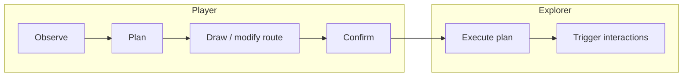

# Player & Explorer

| Field                 | Value                                                                                                                                                                                                         |
| --------------------- | ------------------------------------------------------------------------------------------------------------------------------------------------------------------------------------------------------------- |
| **Project**           | Labyrinth Legends                                                                                                                                                                                             |
| **Document Name**     | Player & Explorer                                                                                                                                                                                             |
| **Document ID**       | LLDS-DOC-01-GP1-001                                                                                                                                                                                           |
| **Series**            | GP1 — Gameplay Core Specification                                                                                                                                                                             |
| **Version**           | 1.0.0                                                                                                                                                                                                         |
| **Status**            | Approved                                                                                                                                                                                                      |
| **Owner**             | Apoorv                                                                                                                                                                                                        |
| **Prepared By**       | ChatGPT (specification) · Cursor (compiler)                                                                                                                                                                   |
| **Last Updated**      | 2026-06-29                                                                                                                                                                                                    |
| **Path**              | `docs/01_Game_Design/Gameplay/Player_Explorer.md`                                                                                                                                                             |
| **Dependencies**      | [Vision](../../00_Project/Vision.md) · [Game Loop](../Game_Loop/Game_Loop.md) · [WS1 — Core Loop](../Game_Loop/WS1_Core_Loop.md)                                                                                        |
| **Related Documents** | [Movement_System](GP2_Movement_System.md) · [GP3 — Puzzle Taxonomy](GP3/GP3.1_Puzzle_Taxonomy.md) · [Gameplay_Rules](GP7_Gameplay_Rules.md) · [Gameplay](Gameplay.md) · [Decisions](../../00_Project/Decisions.md) |

## Navigation

| ← Previous                   | Next →                                | Index                                                      |
| ---------------------------- | ------------------------------------- | ---------------------------------------------------------- |
| [Game Loop](../Game_Loop/Game_Loop.md) | [Movement System](GP2_Movement_System.md) | [Gameplay Specs](README.md) · [LLDS Home](../../README.md) |

---

## Version History

| Version | Date       | Author           | Summary                                             |
| ------- | ---------- | ---------------- | --------------------------------------------------- |
| 1.0.0   | 2026-06-29 | ChatGPT / Cursor | GP1 — Player & Explorer authoritative specification |

## Change Log

| Version | Change                                                                                                                            |
| ------- | --------------------------------------------------------------------------------------------------------------------------------- |
| 1.0.0   | Initial specification: player/explorer roles, agency, planning/execution, commitment, capabilities, constraints, locked decisions |

---

## Purpose

This document is the **single source of truth** for the relationship between the **Player** and the **Explorer** in Labyrinth Legends. It defines who makes decisions, who performs actions, and the philosophical contract between planning and execution.

Every future gameplay system — movement, puzzles, hazards, objectives, feedback — must be compatible with this document.

| Role         | Definition                                                                 |
| ------------ | -------------------------------------------------------------------------- |
| **Player**   | The human mind: planner, strategist, observer, decision-maker              |
| **Explorer** | The in-world presence: executor of confirmed plans                         |
| **Gameplay** | The interaction between Player intent and Explorer action through the ruin |

### Why Planning and Execution Are Separated

Labyrinth Legends is built on **Draw Your Fate**: the defining skill is forming a correct plan before consequences unfold ([Vision](../../00_Project/Vision.md) · [WS1-L02](../Game_Loop/WS1_Core_Loop.md#10-workshop-conclusions)).

Separating Player from Explorer:

| Benefit               | Explanation                                                              |
| --------------------- | ------------------------------------------------------------------------ |
| **Strategic weight**  | Commitment matters because outcomes follow a locked plan                 |
| **Readable fairness** | The player evaluates what the plan caused — not reflex performance       |
| **Explorer fantasy**  | The player thinks like a ruin-reader; the Explorer walks the consequence |
| **Mobile fit**        | Deliberate pacing suits interruptible sessions                           |

Movement rules live in [Movement_System](GP2_Movement_System.md). Puzzle behavior lives in feature specs. This document defines **roles and philosophy only**.

## Intended Audience

| Role             | Use this document to…                                    |
| ---------------- | -------------------------------------------------------- |
| Game Designers   | Validate mechanics against player/explorer contract      |
| Engineers        | Implement input and state without collapsing roles       |
| Level Designers  | Author spaces that reward observation and commitment     |
| UI/UX Designers  | Present planning vs execution phases clearly             |
| QA Engineers     | Verify agency, commitment, and information fairness      |
| AI Coding Agents | Reject real-time steering and hidden mandatory mechanics |

## Table of Contents

1. [Purpose](#purpose)
2. [Player Philosophy](#1-player-philosophy)
3. [Explorer Philosophy](#2-explorer-philosophy)
4. [Player Agency](#3-player-agency)
5. [Planning Phase](#4-planning-phase)
6. [Execution Phase](#5-execution-phase)
7. [Information Visibility](#6-information-visibility)
8. [Automatic Interactions](#7-automatic-interactions)
9. [Commitment Philosophy](#8-commitment-philosophy)
10. [Explorer Capabilities](#9-explorer-capabilities)
11. [Explorer Limitations](#10-explorer-limitations)
12. [Explorer Identity & Personality](#11-explorer-identity--personality)
13. [Design Constraints](#12-design-constraints)
14. [Anti-Patterns](#13-anti-patterns)
15. [Quality Checklist](#14-quality-checklist)
16. [Locked Decisions](#15-locked-decisions)

---

## 1. Player Philosophy

### The Player's Role

The Player is the **intelligence** behind every successful run. They inhabit the ruin through attention and foresight — not through direct avatar control during execution.

| The Player is      | Why                                                     |
| ------------------ | ------------------------------------------------------- |
| **Planner**        | Routes are designed before they run                     |
| **Strategist**     | Trade-offs (risk, order, optional goals) are weighed    |
| **Observer**       | Reading the labyrinth precedes action                   |
| **Decision maker** | Confirm locks intent; the game does not choose for them |

### What the Player Is Not

| The Player is not         | Why excluded                                                                          |
| ------------------------- | ------------------------------------------------------------------------------------- |
| **Direct controller**     | Real-time steering collapses planning into reflex                                     |
| **Action hero**           | Fantasy is archaeological intelligence, not combat dominance                          |
| **Reflex-based operator** | Conflicts with Planning Over Reflexes pillar and [WS1](../Game_Loop/WS1_Core_Loop.md) |

> **Locked Decision:** The Player's primary skill is **thinking**, not reacting.

### Design Intent

All input systems serve **planning quality**. If a feature makes the Player a joystick operator during execution, it violates GP1.

---

## 2. Explorer Philosophy

### The Explorer's Role

The Explorer is the **Player's physical presence** in the ruin — the body that walks the drawn path and triggers the world's responses.

| The Explorer is               | Why                                           |
| ----------------------------- | --------------------------------------------- |
| **Executor of plans**         | Carries out what was confirmed — nothing more |
| **Environmental participant** | Activates mechanisms by traversing space      |
| **Visible consequence**       | Makes the plan legible in motion              |

### What the Explorer Is Not

| The Explorer is not           | Why excluded                                           |
| ----------------------------- | ------------------------------------------------------ |
| **Independently intelligent** | Solving puzzles without Player plans breaks agency     |
| **Autonomous**                | No self-directed routing or improvisation              |
| **Capable of solving alone**  | Complexity lives in the **world**, not character stats |

The Explorer does not "figure out" the labyrinth. The **Player** does. The Explorer **demonstrates** whether the Player was right.

### Design Intent

Character systems stay **simple** so environmental puzzles remain the star ([Vision](../../00_Project/Vision.md) — Clever, Not Powerful).

---

## 3. Player Agency

### What the Player Can Do

| Capability            | Purpose                                                                      |
| --------------------- | ---------------------------------------------------------------------------- |
| **Observe**           | Read layout, objectives, constraints, and cues                               |
| **Inspect**           | Examine interactables and state (detail in feature specs)                    |
| **Plan**              | Form route intent before commitment                                          |
| **Draw paths**        | Express the intended route through the labyrinth                             |
| **Modify paths**      | Revise before confirm — planning is iterative                                |
| **Erase paths**       | Correct mistakes during planning without penalty narrative                   |
| **Preview routes**    | Validate intent before irreversible commit (presentation in downstream docs) |
| **Confirm execution** | Lock the plan; transfer control to Explorer                                  |
| **Pause**             | Interrupt during execution for life/context — not to re-plan mid-run         |
| **Restart**           | Abandon current attempt and return to planning                               |

Each capability exists to support **informed commitment**. The Player must always be able to express intent clearly before execution begins.

### What the Player Can Never Do

| Forbidden during core execution              | Reason                                         |
| -------------------------------------------- | ---------------------------------------------- |
| **Steer the Explorer in real time**          | Breaks draw-and-confirm contract               |
| **Issue new movement commands mid-path**     | Collapses planning and execution               |
| **Override automatic interactions manually** | Execution is observe-only except pause/restart |
| **Bypass hazards through character power**   | Complexity is environmental                    |
| **Force solutions the rules disallow**       | Agency is within fair rules, not above them    |

> **Locked Decision:** After confirm, the Player **observes** — they do not **drive**.

### Design Intent

Agency is **front-loaded** in planning. Execution honors the Player's last intentional decision.

---

## 4. Planning Phase

### What Planning Includes

| Property                    | Specification                                                                  |
| --------------------------- | ------------------------------------------------------------------------------ |
| **Unlimited thinking time** | No standard puzzle timers ([Vision](../../00_Project/Vision.md) anti-patterns) |
| **No pressure**             | Anxiety mechanics excluded from core planning                                  |
| **Complete observation**    | Player can study the space before drawing                                      |
| **Experimentation**         | Draw, erase, redraw without punitive friction                                  |
| **Route optimization**      | Optional efficiency is a mastery goal, not a gate                              |
| **Risk evaluation**         | Player weighs hazards and optional objectives                                  |

### Why Gameplay Primarily Occurs Here

The Player's meaningful choices — where to go, what to trigger, what to risk — are resolved **before** the Explorer moves. Execution is **verification** of intelligence, not the primary skill test.

This aligns with [WS1 — Core Loop](../Game_Loop/WS1_Core_Loop.md): Observe → Plan → Draw → Confirm precede Execute.

### Design Intent

Levels must be **readable in planning**. If the Player cannot form a fair plan, the chamber fails GP1 regardless of execution polish.

---

## 5. Execution Phase

### When Execution Begins

Execution begins **immediately after confirmation**. The confirmed path is immutable for that run.

### During Execution

| Rule                             | Behavior                                                          |
| -------------------------------- | ----------------------------------------------------------------- |
| Explorer follows confirmed plan  | Route is fixed for this execution                                 |
| Interactions occur automatically | When the Explorer reaches trigger cells (detail in feature specs) |
| Player observes                  | Watches consequences unfold                                       |
| No redirect                      | Player cannot change movement                                     |
| No new commands                  | Only **Pause** and **Restart** permitted                          |

### Why Commitment Is Essential

Without commitment, plans are hypothetical. Commitment creates:

- **Anticipation** between confirm and outcome
- **Learning** when outcomes trace to plans
- **Fair evaluation** — success and failure are attributable

> **Locked Decision:** Execution is **observe-only** except Pause and Restart.

### Design Intent

Execution presentation must be **legible** — the Player watches the ruin answer their plan ([WS1](../Game_Loop/WS1_Core_Loop.md) visible consequences).

---

## 6. Information Visibility

### Information Philosophy

The Player should always understand enough to form a **fair plan**:

| Visible to Player       | Why                                     |
| ----------------------- | --------------------------------------- |
| **Environment layout**  | Spatial reasoning is the core skill     |
| **Known hazards**       | Risk must be evaluable                  |
| **Puzzle state**        | Objectives and constraints readable     |
| **Reachable paths**     | Drawing assumes legible connectivity    |
| **Interactive objects** | Triggers must be discoverable or taught |

### Unknown Information

Unknown information may exist **only when intentionally designed** as part of the puzzle — and must be **learnable**, not arbitrary ([WS1](../Game_Loop/WS1_Core_Loop.md) risks: hidden information).

> **Locked Decision:** **Invisible rules are forbidden.**

### Quality Dimensions

| Dimension                | Requirement                                                                  |
| ------------------------ | ---------------------------------------------------------------------------- |
| **Readability**          | Player knows which phase they are in                                         |
| **Fairness**             | Failure traces to plan or misunderstanding — not opacity                     |
| **Puzzle communication** | Layout and presentation teach                                                |
| **Visual clarity**       | LLDL supports legibility ([LLDL](../../02_Design_System/LLDL/LLDL.md) downstream) |

### Design Intent

Information design is part of player respect. Mystery invites; opacity cheats.

---

## 7. Automatic Interactions

### Principle

When the Explorer traverses the confirmed path, **interactions resolve automatically** at appropriate cells. The Player does not tap switches, pick up keys, or open doors during execution.

### Examples (conceptual — detail in feature specs)

| Interaction type  | Execution behavior                         |
| ----------------- | ------------------------------------------ |
| Keys              | Collected on path traversal                |
| Doors / gates     | Open when conditions met along route       |
| Pressure plates   | Trigger when stepped on                    |
| Switches          | Toggle when crossed if plan includes them  |
| Relics / treasure | Collected on contact if path includes cell |
| Teleporters       | Resolve per authored rules when reached    |
| Exit portals      | Complete objective when reached per rules  |

### Why No Extra Input During Execution

| Reason                   | Explanation                                            |
| ------------------------ | ------------------------------------------------------ |
| **Plan completeness**    | The route must account for all interactions in advance |
| **Commitment integrity** | Mid-run taps would be hidden re-planning               |
| **Cognitive clarity**    | One phase plans; one phase watches                     |
| **Fair failure**         | Outcomes trace to the drawn path                       |

### Design Intent

[Gameplay_Rules](GP7_Gameplay_Rules.md) and [Puzzle_Elements](Puzzle_Elements.md) define ordering and mechanics. GP1 locks **automatic resolution during execution**.

---

## 8. Commitment Philosophy

### The Commitment Model

Once the Player confirms:

| Rule                       | Status                   |
| -------------------------- | ------------------------ |
| Execution cannot be edited | Path locked for this run |
| No manual steering         | GP1-L03                  |
| No mid-path corrections    | Replan = Restart         |

### Allowed Exceptions

| Exception                         | Purpose                                                                                           |
| --------------------------------- | ------------------------------------------------------------------------------------------------- |
| **Pause**                         | Life interrupt; does not change plan                                                              |
| **Restart**                       | Return to planning; learn and revise                                                              |
| **Future accessibility features** | Must not undermine commitment without Human approval ([Decisions](../../00_Project/Decisions.md)) |

### Why Commitment Gives Planning Meaning

A plan that can be fixed mid-flight is not a plan — it is a suggestion. Labyrinth Legends treats the Player's confirm as **contract with the ruin**.

### Design Intent

Confirm is a **primary action** (gold CTA in LLDL). Its weight must be felt in product and UX.

---

## 9. Explorer Capabilities

### Core Capabilities (Always)

| Capability                | Description                              |
| ------------------------- | ---------------------------------------- |
| **Walking**               | Follow confirmed path cell-to-cell       |
| **Following paths**       | Execute drawn route faithfully           |
| **Activating mechanisms** | Via traversal (automatic)                |
| **Collecting items**      | Via traversal when path includes cells   |
| **Triggering events**     | Environmental responses along route      |
| **Reaching objectives**   | Exit and goals when path satisfies rules |

### Conditional Capabilities

Capabilities unlocked by **world rules or puzzle state** — never by stat grinding:

| Type            | Examples (detail downstream)        |
| --------------- | ----------------------------------- |
| Gated access    | Key opens door when route is valid  |
| Mechanism state | Switch sequence affects later cells |
| Optional cells  | Treasure only if path includes them |

### Future Extensibility

New Explorer capabilities may be added only if they:

1. Do not add real-time Player control during execution
2. Do not replace planning with character power
3. Extend environmental complexity, not dominance

### Design Intent

[Movement_System](GP2_Movement_System.md) specifies how movement expresses these capabilities mechanically.

---

## 10. Explorer Limitations

### What the Explorer Cannot Do

| Limitation                      | Rationale                                    |
| ------------------------------- | -------------------------------------------- |
| **Jump**                        | Platforming introduces reflex skill          |
| **Fight**                       | Combat fantasy excluded from Vision          |
| **Invent solutions**            | Player plans; Explorer does not improvise    |
| **Ignore hazards**              | Hazards apply per rules — no invulnerability |
| **Change plans independently**  | No autonomous rerouting                      |
| **Solve puzzles automatically** | No auto-path or hint execution               |

### Environment Creates Complexity

| Design principle    | Application                                         |
| ------------------- | --------------------------------------------------- |
| Simple character    | Explorer actions are few and readable               |
| Complex world       | Puzzles combine layout, mechanisms, and information |
| Player intelligence | Difficulty scales through **reading the ruin**      |

> **Locked Decision:** **Puzzle complexity comes from the world. Explorer complexity remains intentionally limited.**

### Design Intent

Feature proposals that add Explorer verbs must pass the [Quality Checklist](#14-quality-checklist).

---

## 11. Explorer Identity & Personality

### Character Definition

The Explorer is a **silent ruin-walker** — present, purposeful, never chatty during puzzles. Personality supports atmosphere; it does not deliver tutorials through dialogue walls.

| Dimension                    | Direction                                                                                       |
| ---------------------------- | ----------------------------------------------------------------------------------------------- |
| **Visual identity**          | Ancient explorer in forgotten temple context ([Vision](../../00_Project/Vision.md) world theme) |
| **Silence vs dialogue**      | Minimal; environmental storytelling preferred                                                   |
| **Emotional expression**     | Subtle animation — relief, surprise, determination — not cartoon exaggeration                   |
| **Animations**               | Deliberate pace; readable reactions to hazards and success                                      |
| **Idle behavior**            | Calm waiting during planning; attentive during observation                                      |
| **Relationship with Player** | Player is mind; Explorer is body — unified intent, separated phases                             |
| **Customization**            | Cosmetic only; never affects puzzle fairness (downstream economy docs)                          |

### Design Intent

The Explorer should feel **worthy of the ruins** — premium, restrained, never undermining puzzle focus.

---

## 12. Design Constraints

Non-negotiable rules binding all gameplay work:

| ID   | Constraint                                                           |
| ---- | -------------------------------------------------------------------- |
| C-01 | **Planning always precedes execution**                               |
| C-02 | **Execution always follows confirmed instructions**                  |
| C-03 | **No reflex-based gameplay** in core puzzle progression              |
| C-04 | **No hidden mandatory mechanics**                                    |
| C-05 | **Player agency is preserved** in planning                           |
| C-06 | **Puzzle complexity comes from the world**                           |
| C-07 | **Explorer complexity remains intentionally limited**                |
| C-08 | **Invisible rules are forbidden**                                    |
| C-09 | **Automatic interactions during execution** — no manual trigger spam |
| C-10 | **Pause and Restart only** Player interrupts during execution        |

---

## 13. Anti-Patterns

Explicitly forbidden — conflicts with [Vision](../../00_Project/Vision.md) and [Game Loop](../Game_Loop/Game_Loop.md):

| Anti-pattern                     | Why forbidden                             |
| -------------------------------- | ----------------------------------------- |
| **Real-time steering**           | Destroys draw-and-confirm; WS1-L02        |
| **Combat-centric mechanics**     | Wrong fantasy; Vision non-goals           |
| **Platforming**                  | Reflex and jump verbs excluded            |
| **Reaction-based gameplay**      | Timers, dodge windows in core progression |
| **Hidden inputs**                | Mid-execution taps = secret replanning    |
| **Overpowered player abilities** | Stat bypass breaks mastery contract       |
| **Explorer autopilot solving**   | Removes Player intelligence               |
| **Mandatory perfect execution**  | Reflex difficulty masquerading as puzzle  |

---

## 14. Quality Checklist

Use before approving any gameplay feature:

| Question                                      | Pass criterion                             |
| --------------------------------------------- | ------------------------------------------ |
| Does this strengthen **planning**?            | Feature adds decisions before confirm      |
| Does it reduce **player agency**?             | Must not remove planning control           |
| Does it introduce **unnecessary complexity**? | Prefer world composition over new verbs    |
| Does it remain **readable**?                  | Player understands phase and outcome       |
| Does it fit **Explorer philosophy**?          | Executor, not hero                         |
| Does it respect **commitment**?               | No mid-run plan edits                      |
| Is information **fair**?                      | No invisible mandatory rules               |
| Does it align with **Vision pillars**?        | Planning, discovery, respect time, quality |

---

## 15. Locked Decisions

### Locked Decisions

| ID      | Decision                                                              | Source                                   |
| ------- | --------------------------------------------------------------------- | ---------------------------------------- |
| GP1-L01 | Player = planner/strategist/observer; Explorer = executor             | GP1 workshop · WS1 · Vision              |
| GP1-L02 | Draw-and-confirm: no real-time steering during core execution         | GP1 · WS1-L02 · Decisions Draw Your Fate |
| GP1-L03 | After confirm: observe-only; Pause and Restart only                   | GP1 workshop                             |
| GP1-L04 | Planning has unlimited time; no standard puzzle timers                | GP1 · Vision Respect Player Time         |
| GP1-L05 | Interactions automatic during execution along confirmed path          | GP1 workshop                             |
| GP1-L06 | Invisible rules forbidden; unknowns must be intentional and learnable | GP1 · WS1 risks                          |
| GP1-L07 | Explorer simple; world complex                                        | GP1 · Vision Clever Not Powerful         |
| GP1-L08 | Explorer does not solve puzzles autonomously                          | GP1 workshop                             |
| GP1-L09 | Commitment model: path immutable per run until Restart                | GP1 workshop                             |
| GP1-L10 | Cosmetic customization only — no pay-to-skip puzzle logic             | GP1 · Vision anti-patterns               |

### Future Decisions (Deferred)

| Topic                                  | Target document                                             |
| -------------------------------------- | ----------------------------------------------------------- |
| Path drawing input affordances         | [Movement_System](GP2_Movement_System.md)                       |
| Interaction order and precedence       | [Gameplay_Rules](GP7_Gameplay_Rules.md)                         |
| Inspect / preview presentation         | [Gameplay_Feedback](GP6_Gameplay_Feedback.md) · LLDL            |
| Accessibility exceptions to commitment | [Decisions](../../00_Project/Decisions.md) · Human approval |
| Explorer visual and animation detail   | [Game Bible](../Game_Bible.md) · LLDL                       |

### Open Questions

| ID      | Question                                             | Owner            | Status                     |
| ------- | ---------------------------------------------------- | ---------------- | -------------------------- |
| GP1-Q01 | How explicit is route preview before confirm?        | ChatGPT / Apoorv | Open — Movement / Feedback |
| GP1-Q02 | Restart friction: instant vs brief transition?       | ChatGPT / Apoorv | Open — WS4 / Feedback      |
| GP1-Q03 | Inspect depth: tap objects vs path-only observation? | ChatGPT / Apoorv | Open — GP4 / UX            |

---

## Cross References

- Upstream: [Vision](../../00_Project/Vision.md), [Game Loop](../Game_Loop/Game_Loop.md), [WS1](../Game_Loop/WS1_Core_Loop.md)
- Siblings: [Movement_System](GP2_Movement_System.md), [Gameplay_Rules](GP7_Gameplay_Rules.md)
- Downstream: [Puzzle_Elements](Puzzle_Elements.md), [Gameplay](Gameplay.md)
- Governance: [Decisions](../../00_Project/Decisions.md)

---

## Navigation

| ← Previous                   | Next →                                | Index                                                      |
| ---------------------------- | ------------------------------------- | ---------------------------------------------------------- |
| [Game Loop](../Game_Loop/Game_Loop.md) | [Movement System](GP2_Movement_System.md) | [Gameplay Specs](README.md) · [LLDS Home](../../README.md) |

