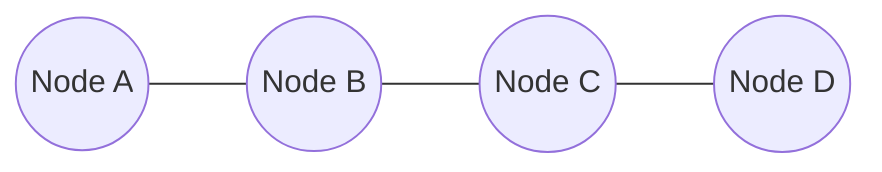
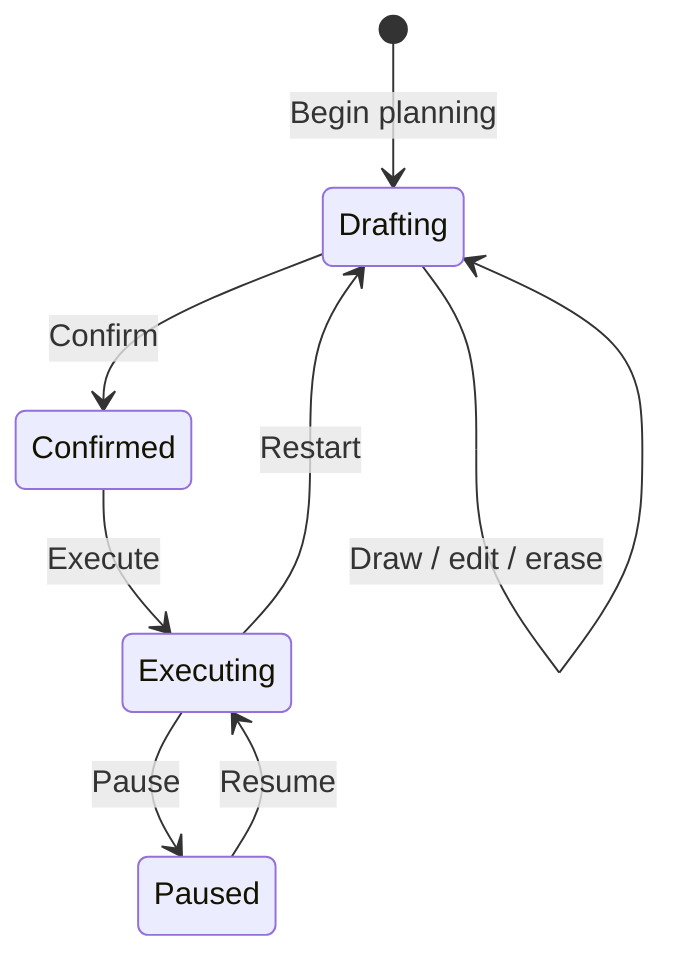
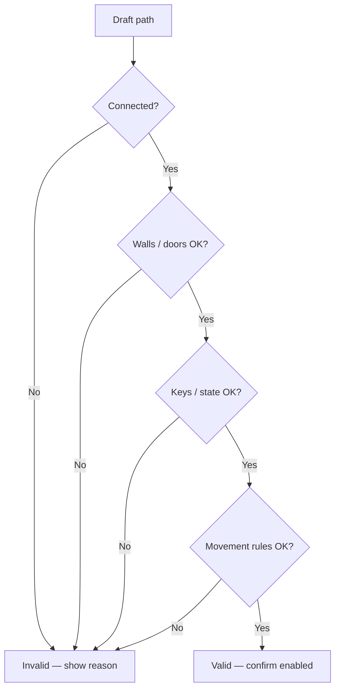
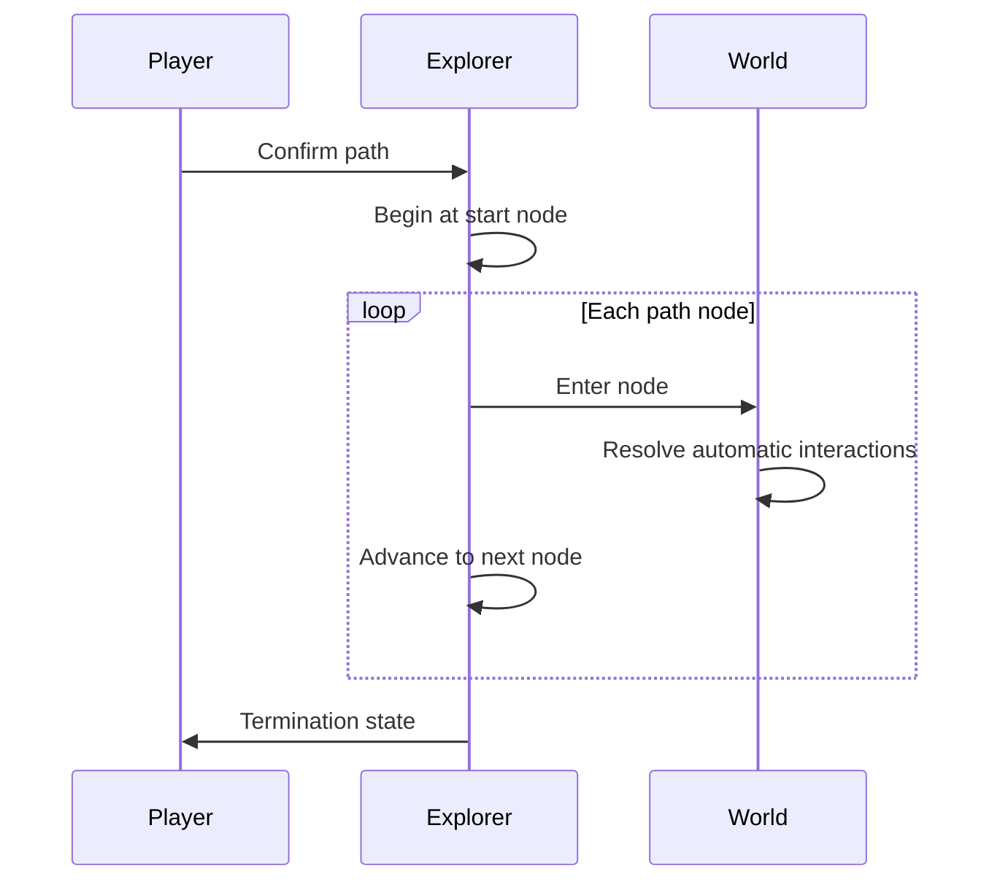

# Movement System

| Field | Value |
|-------|-------|
| **Project** | Labyrinth Legends |
| **Document Name** | Movement System |
| **Document ID** | LLDS-DOC-01-GP2-001 |
| **Series** | GP2 — Gameplay Core Specification |
| **Version** | 1.0.0 |
| **Status** | Approved |
| **Owner** | Apoorv |
| **Prepared By** | ChatGPT (specification) · Cursor (compiler) |
| **Last Updated** | 2026-06-29 |
| **Path** | `docs/01_Game_Design/Gameplay/Movement_System.md` |
| **Dependencies** | [Vision](../../00_Project/Vision.md) · [Game Loop](../Game_Loop/Game_Loop.md) · [Player & Explorer](GP1_Player_Explorer.md) |
| **Related Documents** | [GP3 — Puzzle Taxonomy](GP3/GP3.1_Puzzle_Taxonomy.md) · [Gameplay_Rules](GP7_Gameplay_Rules.md) · [Puzzle_Elements](Puzzle_Elements.md) · [Gameplay_Feedback](GP6_Gameplay_Feedback.md) · [Gameplay](Gameplay.md) |

## Navigation

| ← Previous | Next → | Index |
|------------|--------|-------|
| [Player & Explorer](GP1_Player_Explorer.md) | [GP3 — Puzzle Taxonomy](GP3/GP3.1_Puzzle_Taxonomy.md) | [Gameplay Specs](README.md) · [LLDS Home](../../README.md) |

---

## Version History

| Version | Date | Author | Summary |
|---------|------|--------|---------|
| 1.0.0 | 2026-06-29 | ChatGPT / Cursor | GP2 — Movement System authoritative specification |

## Change Log

| Version | Change |
|---------|--------|
| 1.0.0 | Initial specification: philosophy, node model, path creation/validation/execution, direction, speed, preview, collision, interruptions, modifiers, accessibility, constraints |

---

## Purpose

Movement is one of the **foundational systems** of Labyrinth Legends. It is how the Player expresses a plan and how the Explorer proves whether that plan was correct.

This document is the **single source of truth** for:

- Path creation, editing, and confirmation
- Movement validation
- Movement execution behaviour
- Direction, timing, preview, collision responses, and interruptions

It inherits the Player & Explorer contract from [Player_Explorer.md](GP1_Player_Explorer.md). Puzzle element behaviour, hazards, and UI implementation belong in downstream documents.

### Planning First, Execution Second

| Phase | Movement role |
|-------|----------------|
| **Planning** | Player draws and validates a path on the labyrinth graph |
| **Execution** | Explorer traverses the confirmed path **exactly** — no improvisation |

Movement supports [WS1 — Core Loop](../Game_Loop/WS1_Core_Loop.md): Draw → Confirm → Execute.

## Intended Audience

| Role | Use this document to… |
|------|------------------------|
| Game Designers | Author traversable spaces within movement rules |
| Level Designers | Place nodes, edges, and readable routes |
| Engineers | Implement path model and execution without ambiguity |
| UI/UX Designers | Design drawing, preview, and execution feedback |
| QA Engineers | Verify determinism, validation, and fairness |
| AI Coding Agents | Reject rerouting, hidden movement rules, and stat-based speed |

## Table of Contents

1. [Purpose](#purpose)
2. [Movement Philosophy](#1-movement-philosophy)
3. [Movement Model](#2-movement-model)
4. [Path Creation](#3-path-creation)
5. [Path Validation](#4-path-validation)
6. [Movement Execution](#5-movement-execution)
7. [Direction Rules](#6-direction-rules)
8. [Movement Speed](#7-movement-speed)
9. [Path Preview](#8-path-preview)
10. [Collision Philosophy](#9-collision-philosophy)
11. [Movement Interruptions](#10-movement-interruptions)
12. [Special Movement States](#11-special-movement-states)
13. [Accessibility](#12-accessibility)
14. [Design Constraints](#13-design-constraints)
15. [Anti-Patterns](#14-anti-patterns)
16. [Quality Checklist](#15-quality-checklist)
17. [Locked Decisions](#16-locked-decisions)

---

## 1. Movement Philosophy

### Approved Philosophy

Movement in Labyrinth Legends must be:

| Property | Meaning |
|----------|---------|
| **Deterministic** | Same path + same world state → same outcome |
| **Predictable** | Player can foresee traversal before confirm |
| **Readable** | Route and motion are legible on screen |
| **Fair** | Failure traces to plan or learnable rules |
| **Strategic** | Movement serves planning, not reflex |

### Movement Must Never Rely On

| Excluded | Why |
|----------|-----|
| **Reflexes** | Conflicts with Planning Over Reflexes ([Vision](../../00_Project/Vision.md)) |
| **Randomness** | Breaks commitment and learning |
| **Hidden behaviour** | Violates GP1 information visibility |

> **Locked Decision:** Movement **never surprises** the player with undisclosed traversal rules.

### Design Intent

If the Player cannot predict how a confirmed path will run, the movement system has failed — regardless of puzzle cleverness.

---

## 2. Movement Model

### Approved Architecture: Node-to-Node Movement

Labyrinth Legends uses **graph-based, node-to-node movement** on a discrete labyrinth grid.

| Concept | Definition |
|---------|------------|
| **Node** | A discrete position the Explorer can occupy (cell / waypoint) |
| **Edge / connection** | A valid link between adjacent nodes the Explorer may traverse |
| **Path** | An ordered sequence of nodes from start to intended end |
| **Traversal** | Visiting each path node in order during execution |

### Why Node-to-Node

| Alternative | Why not chosen |
|-------------|----------------|
| **Free movement** | Analog control implies real-time steering — violates GP1 |
| **Continuous movement** | Harder to read, validate, and commit to |
| **Arbitrary curve drawing** | Obscures discrete puzzle logic; ambiguous collision |

Node-to-node movement:

- Aligns with **draw-and-confirm** (path is a explicit sequence)
- Makes **validation** tractable before execution
- Keeps **determinism** visible to the Player
- Matches classic labyrinth **mapping** fantasy

### Design Intent

[Puzzle_Elements](Puzzle_Elements.md) attach to nodes and edges. Movement defines **how traversal works**; puzzles define **what nodes mean**.

---

## 3. Path Creation

### How Players Create Paths

During the **planning phase** only ([Player_Explorer](GP1_Player_Explorer.md) §4):

| Action | Description |
|--------|-------------|
| **Drawing** | Add nodes to the route in traversal order |
| **Editing** | Change intermediate nodes before confirm |
| **Erasing** | Remove nodes or segments from the draft path |
| **Extending** | Continue drawing from the current path end |
| **Replacing** | Clear and redraw, or overwrite segments |
| **Confirming** | Lock path for execution — transitions to execution phase |

### Valid vs Invalid Paths

| Path state | Executable? |
|------------|-------------|
| **Valid** | Passes all validation (§4) — confirm enabled |
| **Invalid** | Fails validation — **cannot** be confirmed or executed |

> **Locked Decision:** **Invalid paths never become executable.**

### Why Invalid Paths Cannot Run

Allowing execution of illegal routes:

- Breaks fairness (outcomes not implied by readable rules)
- Erases commitment (confirm would mean nothing)
- Creates ambiguity (was failure movement or puzzle logic?)

The Player must fix the path **before** confirm, not discover illegality mid-run through hidden correction.

### Design Intent

Confirm is gated on validation success. UI presents why a path is invalid ([Gameplay_Feedback](GP6_Gameplay_Feedback.md) downstream).

---

## 4. Path Validation

### Validation Philosophy

Validation answers: *If the Explorer walks this exact sequence, is every step legal given what the Player can know?*

Validation runs:

1. **Continuously** during drafting (feedback)
2. **Authoritatively** at confirm (gate)

### Validation Stages

| Stage | Checks (conceptual) |
|-------|---------------------|
| **Connected path** | Each consecutive pair is a valid edge |
| **Reachability** | All nodes reachable from start via drawn sequence |
| **Walls** | No traversal through blocked connections |
| **Locked doors** | Path does not pass through closed gates without satisfying conditions (state from [Puzzle_Elements](Puzzle_Elements.md)) |
| **Required keys** | Key-dependent segments only if route satisfies acquisition order ([Gameplay_Rules](GP7_Gameplay_Rules.md)) |
| **Movement legality** | Orthogonal rules, revisits, special states (§6–§11) |
| **World state** | Mechanism states consistent with one forward pass |
| **Impossible routes** | No segment violates known constraints |

### Design Intent

Validation is **transparent**. The Player learns why a path fails during planning — not during execution surprises.

---

## 5. Movement Execution

### Execution Behaviour

When the Player confirms a valid path:

| Rule | Specification |
|------|---------------|
| Follow path **exactly** | Node order preserved |
| **Never improvise** | No shortcuts, no rerouting |
| **Never optimise** | No auto-correction of Player mistakes |
| **Never deviate** | No steering input accepted |

Aligns with [GP1-L02](GP1_Player_Explorer.md#15-locked-decisions) and [GP1-L03](GP1_Player_Explorer.md#15-locked-decisions).

### Execution Lifecycle

| Phase | Description |
|-------|-------------|
| **Start** | Explorer at path origin |
| **Step** | Move to next node at constant speed (§7) |
| **Per-node resolution** | Automatic interactions (GP1) |
| **Completion** | Final node reached or termination event |
| **Termination** | Success, failure, interrupt, or puzzle resolution |

### Movement Completion

Path execution **completes** when:

- The final drawn node is reached, or
- A **forced interruption** ends the run (§10), or
- A **puzzle resolution** halts traversal (e.g. objective met mid-route — detail in GP6)

### Movement Interruption & Termination

| Type | Player control |
|------|----------------|
| **Pause** | Voluntary — freezes execution |
| **Restart** | Voluntary — aborts execution, return to planning |
| **Forced stop** | Death, scripted event, teleport — see §10 |

### Design Intent

Execution is **playback of the plan** — dramatic, readable, and attributable.

---

## 6. Direction Rules

### Orthogonal Movement Only

| Allowed | Not allowed |
|---------|-------------|
| Up, down, left, right (cardinal) | Diagonal moves |

### Why No Diagonals

| Reason | Explanation |
|--------|-------------|
| **Readability** | Grid alignment matches temple architecture |
| **Fairness** | Corner-cutting obscures distance and hazard timing |
| **Validation clarity** | Edges are unambiguous |
| **Puzzle design** | Authors reason in Manhattan geometry |

> **Locked Decision:** **Orthogonal movement only** — no diagonal traversal.

### Turns, Corners, Backtracking

| Rule | Specification |
|------|---------------|
| **Turns** | Allowed at nodes where path changes cardinal direction |
| **Corners** | Two orthogonal edges meeting at a node |
| **Backtracking** | Revisiting a node **allowed** if path explicitly includes it |
| **Revisiting nodes** | Permitted when strategically meaningful; each visit is a path step |

Revisits consume path length and may retrigger interactions per [Gameplay_Rules](GP7_Gameplay_Rules.md) — movement does not forbid them by default.

### Design Intent

Direction rules are **simple and universal**. Complexity enters through world state, not exotic locomotion.

---

## 7. Movement Speed

### Timing Philosophy

| Principle | Rule |
|-----------|------|
| **Constant speed** | Default: uniform step duration node-to-node |
| **Animation consistency** | Step timing matches logical traversal |
| **Readability** | Player can track Explorer position and upcoming cells |
| **No stat progression** | Speed is **not** a character upgrade |

### Environmental Modifiers (Future)

World-authored modifiers (e.g. slow tiles, conveyors — §11) may alter **effective** step behaviour on specific nodes. They:

- Must be **visible and learnable**
- Must not require reflex compensation
- Must not permanently upgrade the Explorer

> **Locked Decision:** **Movement speed is never character progression.**

### Design Intent

[Puzzle_Elements](Puzzle_Elements.md) may use timing-aware mechanics only within deterministic, previewable rules.

---

## 8. Path Preview

### Preview Purpose

Before confirm, preview helps the Player **trust** their plan.

Preview should communicate:

| Element | Preview shows |
|---------|---------------|
| **Route** | Full node sequence highlighted |
| **Destination** | End node clearly marked |
| **Interactions** | Cells where automatic interactions will fire (indicative) |
| **Potential hazards** | Known hazard cells on path (if visible per GP1) |
| **Puzzle state** | Relevant mechanism states affected by route |

### Why Preview Builds Confidence

Confirm is a **commitment** ([Player_Explorer](GP1_Player_Explorer.md) §8). Preview reduces mis-clicks and supports learning — it does not replace observation.

Preview is **planning-phase only**. It does not execute the path or resolve outcomes.

### Design Intent

[Gameplay_Feedback](GP6_Gameplay_Feedback.md) defines presentation. GP2 requires that preview exist conceptually and reflect **validated** paths only.

---

## 9. Collision Philosophy

Movement **responses** when the Explorer encounters geometry or entities — individual mechanics defined downstream.

| Encounter | Movement response (conceptual) |
|-----------|-------------------------------|
| **Walls** | No edge — path cannot be drawn through; validation fails |
| **Closed doors** | Blocked edge unless world state permits passage |
| **Open doors** | Traversable edge |
| **Interactive objects** | Traversal continues; interaction resolves automatically on entry |
| **Moving objects** | Deterministic position per world rules at execution time — must be previewable or learnable |
| **Hazards** | Traversal may continue; hazard outcome per [Hazards_Failure](GP4_Hazards_Failure.md) |
| **Future entities** | Must not introduce real-time avoidance |

### Principle

Collision is **not** a physics simulation. It is **graph legality** plus **authored responses** at nodes.

> Walls and illegal edges are caught in **validation**, not discovered as surprise blocks mid-animation without forewarning.

### Design Intent

Movement defines **whether a step can occur**. Feature specs define **what happens when it does**.

---

## 10. Movement Interruptions

### Interruption Types

| Event | Voluntary? | Effect on path |
|-------|------------|----------------|
| **Pause** | Yes (Player) | Freeze execution; resume continues same path |
| **Restart** | Yes (Player) | Abort execution; return to planning |
| **Puzzle completion** | Forced (system) | End traversal when objective met per rules |
| **Explorer failure** | Forced (system) | Terminate run per hazard rules |
| **Teleportation** | Forced (authored) | Jump Explorer to target node; path may end or continue per puzzle |
| **Scripted events** | Forced (authored) | Pause or redirect per authored sequence — must be learnable |

### Clarification

| Category | Player intent |
|----------|---------------|
| **Voluntary** | Pause, Restart — GP1 allowed controls |
| **Forced** | World-driven; must be fair, readable, and attributable to plan or known rule |

Forced interruptions must not substitute for **invalid path validation**.

### Design Intent

Authors document scripted interruptions in level specs. GP2 requires they remain **deterministic** given path and state.

---

## 11. Special Movement States

### Movement Modifiers

Environmental states **modify** traversal on specific nodes or edges — they do not replace the node-to-node model.

| Modifier (examples) | Effect (conceptual) |
|---------------------|---------------------|
| **Ice** | Continued direction / reduced control variants — must be deterministic |
| **Wind** | Push to adjacent node per authored direction |
| **Conveyor belts** | Auto-advance one step in belt direction |
| **Water currents** | Directed displacement |
| **Slopes** | Directed movement when entered |
| **Gravity** | Fall direction until support |
| **Darkness** | Information limitation — not hidden movement rules |

### Principles

| Rule | Application |
|------|-------------|
| Modifiers are **authored** | Visible or teachable |
| Modifiers are **deterministic** | Same path + state → same modifier outcome |
| Modifiers appear in **validation/preview** when knowable |
| Modifiers do not add **Player steering** during execution |

### Design Intent

[Puzzle_Elements](Puzzle_Elements.md) defines each modifier. GP2 locks: modifiers **extend** movement, never replace commitment model.

---

## 12. Accessibility

### Philosophy

Accessibility **preserves gameplay** — it does not simplify puzzles by removing commitment or fairness.

| Accommodation (examples) | Purpose |
|--------------------------|---------|
| **Larger interaction nodes** | Easier path drawing |
| **Reduced drag precision** | Snap-to-node tolerance |
| **Alternative drawing methods** | Tap-to-add-node vs drag |
| **Animation speed options** | Readability — not faster execution logic |
| **Colour-independent path readability** | Path visible without hue reliance |

### Constraints

| Allowed | Not allowed |
|---------|-------------|
| Easier **input** | Weaker **validation** |
| Clearer **feedback** | Auto-fix **invalid** paths |
| Slower **presentation** | Real-time **steering** |

Future accessibility exceptions to strict confirm model require Human approval ([Decisions](../../00_Project/Decisions.md) · GP1-Q03).

### Design Intent

Accessibility is presentation and input — not a separate ruleset that breaks determinism.

---

## 13. Design Constraints

| ID | Constraint |
|----|------------|
| MS-C01 | Movement is **deterministic** |
| MS-C02 | Movement is **predictable** before confirm |
| MS-C03 | Movement is **readable** during execution |
| MS-C04 | Movement is **fair** — no hidden traversal rules |
| MS-C05 | Movement **never surprises** the Player |
| MS-C06 | Movement **supports planning** — invalid paths cannot execute |
| MS-C07 | **Environment** creates complexity; locomotion stays simple |
| MS-C08 | **Node-to-node**, **orthogonal** traversal only (core) |
| MS-C09 | Explorer follows confirmed path **exactly** |
| MS-C10 | **Speed is not character progression** |
| MS-C11 | Inherits [Player_Explorer](GP1_Player_Explorer.md) commitment model |

---

## 14. Anti-Patterns

| Anti-pattern | Why forbidden |
|--------------|---------------|
| **Random movement** | Breaks determinism and learning |
| **Automatic rerouting** | Collapses planning; violates GP1 |
| **Hidden movement rules** | Invisible edges, surprise blocks |
| **Reaction-based movement** | Dodge windows, steer-around hazards in core play |
| **Character upgrades affecting movement** | Power inflation; Vision conflict |
| **Movement ambiguity** | Diagonal snaps, unclear node occupancy |
| **Execute invalid paths** | Confirm must mean legal traversal |
| **Mid-path steering** | Real-time control during execution |

---

## 15. Quality Checklist

| Question | Pass criterion |
|----------|----------------|
| Is movement **deterministic**? | Same inputs → same traversal |
| Can the Player **predict** the outcome before confirm? | Preview + validation sufficient |
| Does **planning** remain valuable? | No execution-time correction |
| Does movement increase **readability**? | Steps legible on grid |
| Could this introduce **ambiguity**? | Reject if yes |
| Does it respect **[Player_Explorer](GP1_Player_Explorer.md)**? | Planning/execution split intact |
| Is validation **transparent**? | Player knows why path fails |
| Are modifiers **authored and learnable**? | No surprise physics |

---

## 16. Locked Decisions

### Locked Decisions

| ID | Decision | Source |
|----|----------|--------|
| GP2-L01 | Node-to-node graph movement on discrete labyrinth grid | GP2 workshop |
| GP2-L02 | Orthogonal movement only — no diagonals | GP2 workshop |
| GP2-L03 | Invalid paths cannot be confirmed or executed | GP2 workshop |
| GP2-L04 | Execution follows confirmed path exactly — no improvise/optimise/deviate | GP2 workshop · GP1-L02 |
| GP2-L05 | Movement deterministic, predictable, readable, fair, strategic | GP2 workshop |
| GP2-L06 | No reflex, randomness, or hidden movement behaviour | GP2 workshop · GP1 |
| GP2-L07 | Constant default step speed; not character progression | GP2 workshop |
| GP2-L08 | Path preview during planning for confidence | GP2 workshop |
| GP2-L09 | Revisiting nodes allowed when path includes them | GP2 workshop |
| GP2-L10 | Environmental modifiers modify movement — do not replace model | GP2 workshop |
| GP2-L11 | Validation gates confirm; transparent failure reasons | GP2 workshop |

### Future Decisions (Deferred)

| Topic | Target document |
|-------|-----------------|
| Interaction order on shared nodes | [Gameplay_Rules](GP7_Gameplay_Rules.md) |
| Door/key validation detail | [Puzzle_Elements](Puzzle_Elements.md) |
| Hazard termination of movement | [Hazards_Failure](GP4_Hazards_Failure.md) |
| Preview visual language | [Gameplay_Feedback](GP6_Gameplay_Feedback.md) · LLDL |
| Snap tolerance / input feel | [Gameplay_Feedback](GP6_Gameplay_Feedback.md) |
| Specific modifier implementations | [Puzzle_Elements](Puzzle_Elements.md) |

### Open Questions

| ID | Question | Owner | Status |
|----|----------|-------|--------|
| GP2-Q01 | Default revisit interaction: retrigger every visit or once per run? | ChatGPT / Apoorv | Open — GP3 |
| GP2-Q02 | Teleport: truncate path or insert scripted continuation? | ChatGPT / Apoorv | Open — GP4 |
| GP2-Q03 | Animation speed option: cosmetic only or step-duration scaling? | ChatGPT / Apoorv | Open — Feedback / a11y |

---

## Cross References

- Upstream: [Vision](../../00_Project/Vision.md), [Game Loop](../Game_Loop/Game_Loop.md), [Player & Explorer](GP1_Player_Explorer.md)
- Siblings: [Gameplay_Rules](GP7_Gameplay_Rules.md)
- Downstream: [Puzzle_Elements](Puzzle_Elements.md), [Hazards_Failure](GP4_Hazards_Failure.md), [Gameplay_Feedback](GP6_Gameplay_Feedback.md)
- Governance: [Decisions](../../00_Project/Decisions.md)

---

## Navigation

| ← Previous | Next → | Index |
|------------|--------|-------|
| [Player & Explorer](GP1_Player_Explorer.md) | [GP3 — Puzzle Taxonomy](GP3/GP3.1_Puzzle_Taxonomy.md) | [Gameplay Specs](README.md) · [LLDS Home](../../README.md) |
