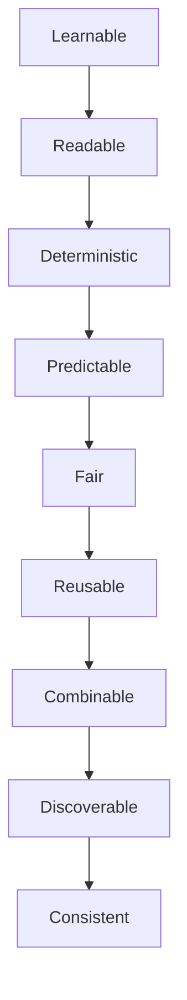
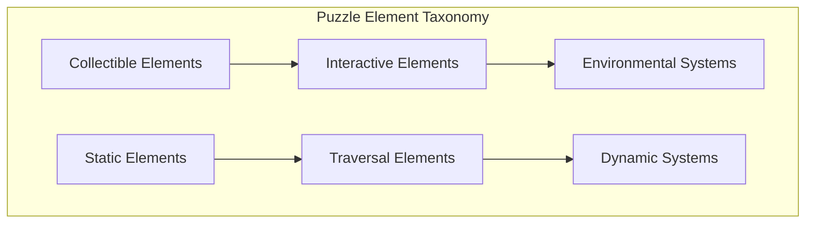
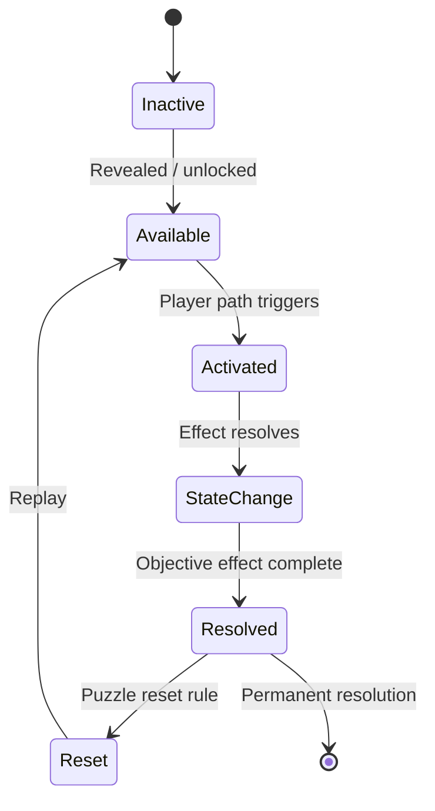

# Puzzle Taxonomy

| Field | Value |
|-------|-------|
| **Project** | Labyrinth Legends |
| **Document Name** | Puzzle Taxonomy |
| **Document ID** | LLDS-DOC-01-GP3.1-001 |
| **Series** | GP3.1 — Puzzle Design Series |
| **Version** | 1.0.0 |
| **Status** | Approved — v1.0.0 |
| **Owner** | Apoorv |
| **Prepared By** | ChatGPT (specification) · Cursor (compiler) |
| **Last Updated** | 2026-06-29 |
| **Path** | `docs/01_Game_Design/Gameplay/GP3/GP3.1_Puzzle_Taxonomy.md` |
| **Dependencies** | [Vision](../../../00_Project/Vision.md) · [Game Loop](../../Game_Loop/Game_Loop.md) · [Player & Explorer](../GP1_Player_Explorer.md) · [Movement System](../GP2_Movement_System.md) |
| **Related Documents** | [Gameplay Rules](../GP7_Gameplay_Rules.md) · [GP3 Series](README.md) · [Puzzle Elements](../Puzzle_Elements.md) |

## Navigation

| ← Previous | Next → | Index |
|------------|--------|-------|
| [Movement System](../GP2_Movement_System.md) | [GP3.2 — Static, Traversal & Collectible](GP3.2_Static_Traversal_Collectible_Elements.md) | [GP3 Series](README.md) · [Gameplay Specs](../README.md) |

---

## Version History

| Version | Date | Author | Summary |
|---------|------|--------|---------|
| 1.0.0 | 2026-06-29 | Apoorv / ChatGPT | Approved as Phase 2 Puzzle Taxonomy baseline |
| 1.0.0 | 2026-06-29 | ChatGPT / Cursor | GP3.1 — Puzzle taxonomy and design language |

## Change Log

| Version | Change |
|---------|--------|
| 1.0.0 | Approved as the authoritative Puzzle Taxonomy baseline for Labyrinth Legends gameplay documentation |
| 1.0.0 | Initial specification: element definition, philosophy, taxonomy, lifecycle, behaviour, combination, hierarchy, constraints |

---

## Purpose

This document defines the **universal taxonomy, philosophy, and classification system** for every puzzle element in Labyrinth Legends — existing or future.

It is **not** a mechanics document. It does not define how doors, keys, switches, or hazards work. It establishes the **design language** all puzzle mechanics must follow.

### Why Puzzle Taxonomy Exists

Without a shared taxonomy, puzzle content becomes a bag of exceptions — hard to teach, hard to validate, hard to scale.

| Benefit | How taxonomy helps |
|---------|-------------------|
| **Consistency** | Authors and agents classify elements the same way |
| **Readability** | Players learn categories once, recognize them everywhere |
| **Scalability** | New mechanics slot into known patterns |
| **Future expansion** | GP3.2–GP3.5 and [`Puzzle_Elements.md`](../Puzzle_Elements.md) build on stable roots |

### Foundation For

- [GP3.2 — Static, Traversal & Collectible](GP3.2_Static_Traversal_Collectible_Elements.md)
- [GP3.3 — Interactive](GP3.3_Interactive_Elements.md)
- [GP3.4 — Environmental](GP3.4_Environmental_Dynamic_Systems.md)
- [GP3.5 — Composition](GP3.5_Puzzle_Composition_Level_Design_Rules.md)
- [`Puzzle_Elements.md`](../Puzzle_Elements.md)

> **Authority rule:** This document **extends** Core Specifications. It must **never** redefine player agency, movement philosophy, execution philosophy, or rule precedence ([Player & Explorer](../GP1_Player_Explorer.md), [Movement System](../GP2_Movement_System.md), [Gameplay Rules](../GP7_Gameplay_Rules.md)).

## Intended Audience

| Role | Use this document to… |
|------|------------------------|
| Puzzle Designers | Classify and author elements within taxonomy |
| Level Designers | Compose chambers from categories |
| Engineers | Model element types without ad-hoc exceptions |
| QA Engineers | Verify elements meet universal principles |
| AI Coding Agents | Reject mechanics that break taxonomy or core specs |

## Table of Contents

1. [Purpose](#purpose)
2. [What is a Puzzle Element?](#1-what-is-a-puzzle-element)
3. [Puzzle Design Philosophy](#2-puzzle-design-philosophy)
4. [Puzzle Element Taxonomy](#3-puzzle-element-taxonomy)
5. [Puzzle Element Lifecycle](#4-puzzle-element-lifecycle)
6. [Behaviour Principles](#5-behaviour-principles)
7. [Combination Philosophy](#6-combination-philosophy)
8. [Puzzle Element Hierarchy](#7-puzzle-element-hierarchy)
9. [Design Constraints](#8-design-constraints)
10. [Anti-Patterns](#9-anti-patterns)
11. [Quality Checklist](#10-quality-checklist)
12. [Locked Decisions](#11-locked-decisions)

---

## 1. What is a Puzzle Element?

### Definition

A **Puzzle Element** is any authored world object or system whose **primary purpose** is to create a **meaningful planning decision** on the labyrinth graph during the planning phase, and/or to produce a **deterministic consequence** when the Explorer traverses the confirmed path.

Puzzle elements interact with [Movement System](../GP2_Movement_System.md) node-to-node traversal and [Player & Explorer](../GP1_Player_Explorer.md) automatic interactions during execution.

### What Puzzle Elements Are

| Property | Description |
|----------|-------------|
| **Functional** | Changes traversal, information, or objectives |
| **Authored** | Deliberately placed with design intent |
| **Teachable** | Player can learn its behaviour |
| **Classifiable** | Belongs to one primary taxonomy category (§3) |

### What Puzzle Elements Are Not

| Excluded | Why |
|----------|-----|
| **Pure decoration** | No planning decision — art-only props |
| **Ambient VFX / flavour** | Atmosphere without mechanical role |
| **UI chrome** | Belongs in screen / LLDL specs |
| **Narrative-only props** | Lore without traversal or puzzle impact (unless also functional) |

> Decorative objects may exist visually but are **not Puzzle Elements** unless they carry mechanical responsibility.

### Meaningful Decisions

Every Puzzle Element must support at least one of:

- Route choice (where to walk)
- Order choice (when to visit)
- Risk choice (whether to engage)
- Information choice (what to observe first)

Aligns with [WS1 — Player Decisions](../../Game_Loop/WS1_Core_Loop.md#4-player-decisions).

### Design Intent

If an object does not affect planning or deterministic execution outcomes, it is not a Puzzle Element — do not document it in GP3.2+.

---

## 2. Puzzle Design Philosophy

Every Puzzle Element must embody these universal principles:

| Principle | Meaning | Why |
|-----------|---------|-----|
| **Learnable** | Behaviour can be understood through play | Supports knowledge-as-progression ([Vision](../../../00_Project/Vision.md)) |
| **Readable** | Current state visible or inferable | GP1 information visibility |
| **Deterministic** | Same path + state → same outcome | [Movement System](../GP2_Movement_System.md) GP2-L05 |
| **Predictable** | Player can foresee effect before confirm | Planning contract |
| **Fair** | Failure traces to plan or misunderstanding | WS1 failure philosophy |
| **Reusable** | Same element type behaves consistently across levels | Taxonomy scalability |
| **Combinable** | Works with other categories without special cases | Depth through composition (§6) |
| **Discoverable** | Presence can be found through observation | Discovery pillar |
| **Consistent** | Does not violate category rules or core specs | No arbitrary exceptions |

### Design Intent

GP3.2–GP3.5 mechanics are judged against this table first — before feature appeal.

---

## 3. Puzzle Element Taxonomy

Complete classification system. **No individual mechanic definitions** — illustrative examples only.

### Static Elements

| Aspect | Description |
|--------|-------------|
| **Purpose** | Define immutable or slowly-changing spatial facts |
| **Role** | Establish the graph the Player reads |
| **Philosophy** | Clarity of space before interaction |
| **Typical responsibilities** | Walls, floors, blocked cells, fixed barriers |
| **Relationships** | Foundation for Traversal and Movement validation |

*Examples only:* stone wall, chasm edge, permanent pillar.

### Collectible Elements

| Aspect | Description |
|--------|-------------|
| **Purpose** | Rewards on path that alter future legality or objectives |
| **Role** | Optional or required acquisition along route |
| **Philosophy** | Acquisition via traversal ([GP1](../GP1_Player_Explorer.md) automatic collection) |
| **Typical responsibilities** | Keys, relics, tokens, optional treasure |
| **Relationships** | Often gates Interactive or Traversal elements |

*Examples only:* key shard, lore relic, optional gem.

### Interactive Elements

| Aspect | Description |
|--------|-------------|
| **Purpose** | Player-visited mechanisms that change world state |
| **Role** | Cause-and-effect along the route |
| **Philosophy** | One primary purpose per element; visible state change |
| **Typical responsibilities** | Switches, plates, toggles, gates (behaviour in GP3.3) |
| **Relationships** | Chain with Static/Traversal; feed Environmental state |

*Examples only:* pressure plate, lever, rune switch.

### Traversal Elements

| Aspect | Description |
|--------|-------------|
| **Purpose** | Modify how movement occurs on the graph |
| **Role** | Alter edges, nodes, or step behaviour |
| **Philosophy** | Extends [Movement System](../GP2_Movement_System.md) — does not replace it |
| **Typical responsibilities** | One-way tiles, teleporters, bridges, portals |
| **Relationships** | Overlays Static graph; triggered by Interactive state |

*Examples only:* one-way arrow, teleport pad, retractable bridge.

### Environmental Systems

| Aspect | Description |
|--------|-------------|
| **Purpose** | Area-wide or persistent conditions affecting multiple elements |
| **Role** | Context layer for planning |
| **Philosophy** | Learnable rules applied uniformly in scope |
| **Typical responsibilities** | Lighting zones, fog of war rules, region modifiers |
| **Relationships** | Modifies readability or movement modifiers (GP2 §11) |

*Examples only:* darkness region, mist that hides distant nodes until approached.

### Dynamic Systems

| Aspect | Description |
|--------|-------------|
| **Purpose** | Time- or sequence-driven change during or between executions |
| **Role** | Adds ordering and foresight challenges |
| **Philosophy** | Deterministic schedules — not random |
| **Typical responsibilities** | Cycling hazards, moving platforms, timed gates |
| **Relationships** | Must be previewable or learnable; pairs with Interactive chains |

*Examples only:* rotating barrier cycle, platform on fixed timer.

### Design Intent

Every authored mechanic in GP3.2+ must declare **one primary category**. Secondary roles are noted but do not replace primary classification.

---

## 4. Puzzle Element Lifecycle

Universal lifecycle philosophy. Not every element uses every state.

| State | Meaning |
|-------|---------|
| **Inactive** | Not yet relevant — hidden, locked sector, or unpowered |
| **Available** | Player can observe; may affect planning |
| **Activated** | Explorer traversal or mechanism trigger fired |
| **State Change** | World updates deterministically |
| **Resolved** | Element's puzzle role complete for this attempt |
| **Reset** | Returns to earlier state on Restart or puzzle reset (if applicable) |

### Principles

| Rule | Application |
|------|-------------|
| States are **visible** or **learnable** | No hidden state jumps |
| Transitions are **deterministic** | Same trigger → same transition |
| **Reset** is explicit | Player understands what Restart restores |

### Design Intent

GP3.3+ define per-element state machines within this philosophy — not ad-hoc lifecycles.

---

## 5. Behaviour Principles

Universal behavioural rules for all categories:

| # | Principle |
|---|-----------|
| B-01 | **One primary purpose** per element type |
| B-02 | **Every state change is visible** (or previously taught) |
| B-03 | **Every interaction is deterministic** |
| B-04 | **Every effect has a clear cause** traceable to path or prior state |
| B-05 | **Current state is communicated** — iconography, pose, lighting, LLDL |
| B-06 | **Traversal triggers** follow GP1 automatic interaction model |
| B-07 | **No player input** during execution beyond Pause/Restart |
| B-08 | **Validation** reflects element state during planning ([Movement System](../GP2_Movement_System.md) §4) |

### Design Intent

Behaviour that violates B-01 through B-05 is a taxonomy failure even if "interesting."

---

## 6. Combination Philosophy

### Why Elements Combine

Depth in Labyrinth Legends comes from **composition**, not from isolated complex gadgets.

| Concept | Description |
|---------|-------------|
| **Composition** | Multiple categories in one chamber |
| **Interaction chains** | Switch → gate → traversal → collectible |
| **Emergent complexity** | Simple parts, sophisticated plans |
| **Reusable mechanics** | Same switch type, new layout |
| **Exponential design space** | Combinations grow faster than new verbs |

### Depth Through Combination

| Approach | Value |
|----------|-------|
| One new category + known partners | High — teaches category once |
| One ultra-complex single object | Low — brittle, hard to teach |

Aligns with [Vision](../../../00_Project/Vision.md) Quality Over Quantity and WS1 meaningful decisions over rule count.

### Design Intent

[GP3.5 — Composition](GP3.5_Puzzle_Composition_Level_Design_Rules.md) will encode level-authoring rules. GP3.1 locks **philosophy**: combine categories, do not accumulate exceptions.

---

## 7. Puzzle Element Hierarchy

Three **strategic introduction tiers** — not taxonomy categories.

| Tier | Scope | Purpose |
|------|-------|---------|
| **Core Elements** | Universal across game | Teach foundation reading |
| **World Elements** | Specific world themes | Variety and identity |
| **Legendary Elements** | Rare, late introduction | Preserve wonder |

### Core Elements

Used throughout the game. Player expects them.

*Examples only:* basic wall, standard key, simple switch, exit portal.

### World Elements

Mechanics themed to a world's fantasy. Reuse **category rules**; new presentation or combinations.

*Examples only:* sand-shift plate (desert world), water valve (flooded ruins).

### Legendary Elements

Rare mechanics introduced late. **Rarity preserves wonder** — not power inflation.

*Examples only:* single-chamber ancient mechanism used sparingly.

### Rules

| Rule | Specification |
|------|---------------|
| Tier does not change **category** | A World switch is still Interactive |
| Tier affects **introduction pacing** | [GP3.5 Composition](GP3.5_Puzzle_Composition_Level_Design_Rules.md) |
| Legendary ≠ **mandatory grind** | Optional mastery or late worlds |

### Design Intent

Tiers guide content roadmap — they do not grant permission for inconsistent behaviour.

---

## 8. Design Constraints

| ID | Constraint |
|----|------------|
| PT-C01 | Every element has **one primary taxonomy category** |
| PT-C02 | **No hidden mandatory mechanics** ([GP1](../GP1_Player_Explorer.md)) |
| PT-C03 | **No arbitrary exceptions** to category behaviour |
| PT-C04 | Every mechanic must be **teachable** |
| PT-C05 | Every interaction **visually communicated** |
| PT-C06 | Every element **supports planning** before confirm |
| PT-C07 | Elements must be **deterministic** and **fair** |
| PT-C08 | Elements **extend** movement — never redefine ([Movement System](../GP2_Movement_System.md)) |
| PT-C09 | Decorative-only objects are **not** Puzzle Elements |
| PT-C10 | Combination preferred over single-object complexity |

### Design Intent

Constraints are acceptance tests for GP3.2–GP3.5 proposals.

---

## 9. Anti-Patterns

| Anti-pattern | Why forbidden |
|--------------|---------------|
| **Random puzzle behaviour** | Breaks determinism and learning |
| **Pixel hunting** | Interaction without readable affordance |
| **Hidden interactions** | Invisible triggers violate GP1 |
| **Puzzle-specific exceptions** | "This switch works differently here only" |
| **Inconsistent rules** | Same icon, different behaviour without teaching |
| **Trial-and-error progression** | Success requires guessing, not planning |
| **Mechanics without visual communication** | Player cannot plan |
| **Decoration posing as mechanic** | False affordances frustrate |
| **Power-gated elements** | Stat checks violate Vision |
| **Real-time element avoidance** | Reflex gameplay in core progression |

### Design Intent

Anti-patterns are automatic reject in design review unless Human records explicit exception in [Decisions](../../../00_Project/Decisions.md).

---

## 10. Quality Checklist

| Question | Pass criterion |
|----------|----------------|
| Is the **category** clearly defined? | One primary taxonomy class |
| Does it **support planning**? | Affects route before confirm |
| Is behaviour **deterministic**? | Same path + state → same outcome |
| Can it **combine** with other categories? | No siloed special case |
| Is **visual communication** sufficient? | State readable in planning |
| Does it preserve **fairness**? | No invisible mandatory rules |
| Is it **teachable**? | One major new idea teachable per beat |
| Does it respect **Core Specs**? | GP1, GP2, Gameplay Rules intact |
| Is it **reusable** across levels? | Not a one-off exception |
| Does introduction **tier** fit pacing? | Core / World / Legendary appropriate |

---

## 11. Locked Decisions

### Locked Decisions

| ID | Decision | Source |
|----|----------|--------|
| GP3.1-L01 | Universal taxonomy: Static, Collectible, Interactive, Traversal, Environmental, Dynamic | GP3.1 workshop |
| GP3.1-L02 | Puzzle Element = meaningful planning decision + deterministic execution consequence | GP3.1 workshop |
| GP3.1-L03 | Decorative-only objects excluded from Puzzle Elements | GP3.1 workshop |
| GP3.1-L04 | Nine universal principles: Learnable, Readable, Deterministic, Predictable, Fair, Reusable, Combinable, Discoverable, Consistent | GP3.1 workshop |
| GP3.1-L05 | Universal lifecycle philosophy: Inactive → Available → Activated → State Change → Resolved → Reset (optional) | GP3.1 workshop |
| GP3.1-L06 | One primary purpose per element; visible deterministic state changes | GP3.1 workshop |
| GP3.1-L07 | Depth from **combination** of categories, not isolated complexity | GP3.1 workshop · Vision Quality Over Quantity |
| GP3.1-L08 | Three introduction tiers: Core, World, Legendary — rarity preserves wonder | GP3.1 workshop |
| GP3.1-L09 | GP3 extends Core Specs; never redefines agency, movement, execution, precedence | GP3.1 workshop |
| GP3.1-L10 | Anti-patterns: randomness, pixel hunt, hidden rules, trial-and-error, inconsistency | GP3.1 workshop |

### Future Decisions (Deferred)

| Topic | Target document |
|-------|-----------------|
| Static & collectible mechanics | [GP3.2 — Static, Traversal & Collectible](GP3.2_Static_Traversal_Collectible_Elements.md) |
| Interactive mechanics | [GP3.3 — Interactive](GP3.3_Interactive_Elements.md) |
| Environmental & dynamic mechanics | [GP3.4 — Environmental](GP3.4_Environmental_Dynamic_Systems.md) |
| Chamber composition rules | [GP3.5 — Composition](GP3.5_Puzzle_Composition_Level_Design_Rules.md) |
| Integrated element catalogue | [Puzzle_Elements.md](../Puzzle_Elements.md) |
| Rule precedence detail | [Gameplay_Rules.md](../GP7_Gameplay_Rules.md) |

### Open Questions

| ID | Question | Owner | Status |
|----|----------|-------|--------|
| GP3.1-Q01 | Can one object have two primary categories, or always strict single? | ChatGPT / Apoorv | Resolved — one primary category; secondary roles allowed as annotations |
| GP3.1-Q02 | Environmental vs Dynamic boundary for cycling hazards? | ChatGPT / Apoorv | Open — GP3.4 |
| GP3.1-Q03 | Legendary tier: max introductions per world? | ChatGPT / Apoorv | Partially resolved — GP3.5-L10 (default max 1) |

---

## Cross References

- Upstream: [Vision](../../../00_Project/Vision.md), [Game Loop](../../Game_Loop/Game_Loop.md), [GP1](../GP1_Player_Explorer.md), [GP2](../GP2_Movement_System.md)
- Series: [GP3 README](README.md), [GP3.2](GP3.2_Static_Traversal_Collectible_Elements.md), [GP3.3](GP3.3_Interactive_Elements.md), [GP3.4](GP3.4_Environmental_Dynamic_Systems.md), [GP3.5](GP3.5_Puzzle_Composition_Level_Design_Rules.md)
- Downstream: [Puzzle_Elements.md](../Puzzle_Elements.md), [Gameplay.md](../Gameplay.md)
- Governance: [Decisions](../../../00_Project/Decisions.md)

---

## Navigation

| ← Previous | Next → | Index |
|------------|--------|-------|
| [Movement System](../GP2_Movement_System.md) | [GP3.2 — Static, Traversal & Collectible](GP3.2_Static_Traversal_Collectible_Elements.md) | [GP3 Series](README.md) · [Gameplay Specs](../README.md) |
