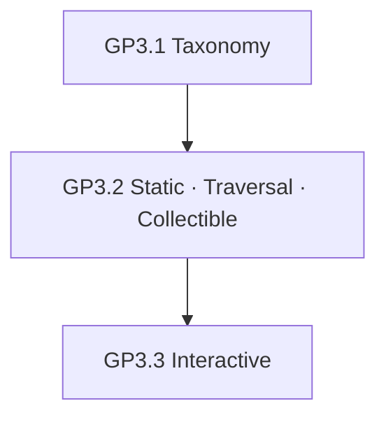
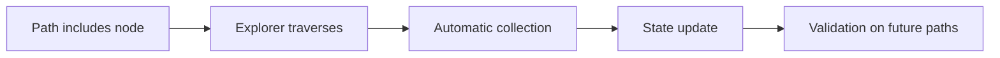
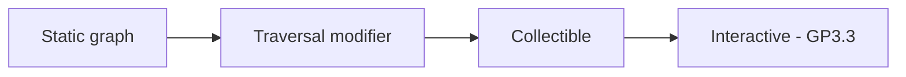

# Static, Traversal & Collectible Elements

| Field | Value |
|-------|-------|
| **Project** | Labyrinth Legends |
| **Document Name** | Static, Traversal & Collectible Elements |
| **Document ID** | LLDS-DOC-01-GP3.2-001 |
| **Series** | GP3.2 — Puzzle Design Series |
| **Version** | 1.0.0 |
| **Status** | Approved — v1.0.0 |
| **Owner** | Apoorv |
| **Prepared By** | ChatGPT (specification) · Cursor (compiler) |
| **Last Updated** | 2026-06-29 |
| **Path** | `docs/01_Game_Design/Gameplay/GP3/GP3.2_Static_Traversal_Collectible_Elements.md` |
| **Dependencies** | [Vision](../../../00_Project/Vision.md) · [Game Loop](../../Game_Loop.md) · [Player & Explorer](../Player_Explorer.md) · [Movement System](../Movement_System.md) · [Puzzle Taxonomy](GP3.1_Puzzle_Taxonomy.md) |
| **Related Documents** | [Gameplay Rules](../GP7_Gameplay_Rules.md) · [GP3.3 — Interactive](GP3.3_Interactive_Elements.md) · [Puzzle Elements](../Puzzle_Elements.md) |

## Navigation

| ← Previous | Next → | Index |
|------------|--------|-------|
| [GP3.1 — Taxonomy](GP3.1_Puzzle_Taxonomy.md) | [GP3.3 — Interactive](GP3.3_Interactive_Elements.md) | [GP3 Series](README.md) · [Gameplay Specs](../README.md) |

---

## Version History

| Version | Date | Author | Summary |
|---------|------|--------|---------|
| 1.0.0 | 2026-06-29 | Apoorv / ChatGPT | Approved as Phase 2 Static, Traversal & Collectible Elements baseline |
| 1.0.0 | 2026-06-29 | ChatGPT / Cursor | GP3.2 — Static, Traversal & Collectible element specifications |

## Change Log

| Version | Change |
|---------|--------|
| 1.0.0 | Approved as the authoritative Static, Traversal & Collectible Elements baseline for Labyrinth Legends gameplay documentation |
| 1.0.0 | Initial specification: static, traversal, collectible families, behaviour, combination, constraints |

---

## Purpose

This document defines the approved design specification for three **foundational puzzle-element families**:

1. **Static Elements** — shape the labyrinth graph
2. **Traversal Elements** — modify how movement occurs on the graph
3. **Collectible Elements** — acquired along routes; affect access, completion, or mastery

### Why These Families Are Grouped

Static, Traversal, and Collectible elements share a design role: they **establish the navigable world** the Player studies during planning and the Explorer traverses during execution. Together they answer:

| Question | Family |
|----------|--------|
| *Where can I go?* | Static Elements |
| *How does movement change on this route?* | Traversal Elements |
| *What must or may I pick up along the way?* | Collectible Elements |

They are **foundational** — most chambers use at least one from each category. Interactive (switches, doors), Environmental (hazards, fog), and Dynamic systems (timed cycles) build on this substrate in GP3.3+.

> **Scope boundary:** This document does not define doors, switches, hazards, failure rules, UI, economy, or technical architecture.

This document **extends** [GP3.1 — Puzzle Taxonomy](GP3.1_Puzzle_Taxonomy.md). It does not redefine taxonomy, movement, player agency, or rule precedence.

### Design Intent

These three families are documented together because they jointly define **navigation literacy** — the minimum vocabulary every player must learn before advanced puzzle systems make sense.

---

## Intended Audience

| Role | Use this document to… |
|------|------------------------|
| Level Designers | Place floors, walls, routes, keys, and treasures correctly |
| Puzzle Designers | Author element behaviour within family rules |
| Engineers | Implement element types deterministically |
| QA Engineers | Verify readability, fairness, and movement compliance |
| AI Coding Agents | Author content without violating GP3.1 or GP2 |

## Table of Contents

1. [Purpose](#purpose)
2. [Relationship to GP3.1 Taxonomy](#1-relationship-to-gp31-taxonomy)
3. [Static Elements](#2-static-elements)
4. [Traversal Elements](#3-traversal-elements)
5. [Collectible Elements](#4-collectible-elements)
6. [Behaviour Rules](#5-behaviour-rules)
7. [Combination Rules](#6-combination-rules)
8. [Design Constraints](#7-design-constraints)
9. [Anti-Patterns](#8-anti-patterns)
10. [Quality Checklist](#9-quality-checklist)
11. [Locked Decisions](#10-locked-decisions)

---

## 1. Relationship to GP3.1 Taxonomy

[GP3.1 — Puzzle Taxonomy](GP3.1_Puzzle_Taxonomy.md) defines **categories and philosophy**. GP3.2 defines **approved behaviour** for three of those categories.

| GP3.1 Category | GP3.2 Coverage |
|----------------|----------------|
| **Static Elements** | §2 — full family spec |
| **Traversal Elements** | §3 — full family spec |
| **Collectible Elements** | §4 — full family spec |
| Interactive Elements | GP3.3 — not in this document |
| Environmental Systems | GP3.4 — partial overlap with traversal modifiers |
| Dynamic Systems | GP3.4 — moving platforms referenced; detail deferred |

### Extension Rule

GP3.2 may specify **how** static, traversal, and collectible elements behave. It may **not**:

- Redefine taxonomy categories ([GP3.1-L01](GP3.1_Puzzle_Taxonomy.md#11-locked-decisions))
- Override [Movement System](../Movement_System.md) node-to-node or orthogonal rules
- Override [Player & Explorer](../Player_Explorer.md) planning/execution split
- Assign rule precedence ([Gameplay Rules](../GP7_Gameplay_Rules.md))

### Design Intent

GP3.2 is the **first mechanics layer** atop taxonomy — foundational, teachable, and combinable.

---

## 2. Static Elements

### Definition

**Static Elements** shape the labyrinth **without actively changing state** during normal play. They define the graph the Player reads during planning.

> Static elements may have *authored states* set at level load (e.g. bridge present/absent) but do not toggle from Explorer traversal alone unless classified primarily as Interactive (GP3.3).

### Element Specifications

#### Floor Nodes

| Aspect | Specification |
|--------|---------------|
| **Purpose** | Default traversable cells |
| **Behaviour** | Explorer may occupy; path may include |
| **Readability** | Visually distinct from walls/chasms |
| **Common uses** | General routing, teaching space |
| **Anti-patterns** | Floor indistinguishable from hazard or void |

#### Walls

| Aspect | Specification |
|--------|---------------|
| **Purpose** | Block edges between nodes |
| **Behaviour** | No path edge; validation fails if drawn through |
| **Readability** | Clearly impassable; matches collision graph |
| **Common uses** | Maze structure, forcing detours |
| **Anti-patterns** | Passable-looking wall ([§8](#8-anti-patterns)) |

#### Boundaries

| Aspect | Specification |
|--------|---------------|
| **Purpose** | Outer limit of playable labyrinth |
| **Behaviour** | Impassable; no off-graph drawing |
| **Readability** | Strong visual frame |
| **Common uses** | Chamber edge, world edge |
| **Anti-patterns** | Soft boundary player can misread |

#### Start Nodes

| Aspect | Specification |
|--------|---------------|
| **Purpose** | Explorer origin for path |
| **Behaviour** | Path must begin here unless authored exception |
| **Readability** | Distinct marker; always visible in planning |
| **Common uses** | Level entry, retry origin |
| **Anti-patterns** | Ambiguous start among identical tiles |

#### Exit Nodes

| Aspect | Specification |
|--------|---------------|
| **Purpose** | Primary completion target when authored as goal |
| **Behaviour** | Traversal triggers completion per [Objectives_Completion](../GP5_Objectives_Completion.md) (downstream) |
| **Readability** | Clearly identifiable as goal |
| **Common uses** | Chamber resolution |
| **Anti-patterns** | Fake exit indistinguishable from decoration ([§8](#8-anti-patterns)) |

#### Blocked Nodes

| Aspect | Specification |
|--------|---------------|
| **Purpose** | Visible cell that cannot be occupied |
| **Behaviour** | Node exists on graph but traversal forbidden |
| **Readability** | Occupied/blocked visual language |
| **Common uses** | Rubble, collapsed tile, ritual seal |
| **Anti-patterns** | Looks walkable until execution |

#### Chasms / Voids

| Aspect | Specification |
|--------|---------------|
| **Purpose** | Absence of traversable floor |
| **Behaviour** | No node or non-traversable node; path cannot cross without Traversal aid |
| **Readability** | Clear void vs floor |
| **Common uses** | Gap puzzles with bridges/teleporters |
| **Anti-patterns** | Jumpable chasm (Explorer cannot jump — [GP1](../Player_Explorer.md)) |

#### Decorative Non-Interactive Geometry

| Aspect | Specification |
|--------|---------------|
| **Purpose** | Atmosphere only |
| **Behaviour** | **Not a Puzzle Element** per [GP3.1](GP3.1_Puzzle_Taxonomy.md#1-what-is-a-puzzle-element) unless it blocks line-of-sight only |
| **Readability** | Must not mimic functional elements |
| **Common uses** | Pillars, murals, background ruins |
| **Anti-patterns** | Decoration identical to switch, key, or exit |

### Design Intent

Static elements are the **honest map**. Misleading static geometry is a critical failure.

---

## 3. Traversal Elements

### Definition

**Traversal Elements** change **where or how** the Explorer moves on the graph while **respecting** [Movement System](../Movement_System.md): node-to-node, orthogonal, deterministic, path-exact execution.

### Element Specifications

#### Bridges

| Aspect | Specification |
|--------|---------------|
| **Purpose** | Enable crossing gaps between nodes |
| **Movement** | Creates or reveals traversable edge |
| **Visibility** | Bridge state (extended/retracted) readable in planning when knowable |
| **Determinism** | State at confirm time determines legality |
| **Path planning** | Player must include bridge crossing in path if required |
| **Anti-patterns** | Bridge appears mid-execution without authored rule |

#### One-Way Paths

| Aspect | Specification |
|--------|---------------|
| **Purpose** | Directed edges — enter but not return (or vice versa) |
| **Movement** | Edge direction enforced on traversal |
| **Visibility** | Arrow or visual flow direction mandatory |
| **Determinism** | Direction fixed per edge |
| **Path planning** | Revisit rules per [Movement System](../Movement_System.md) §6 |
| **Anti-patterns** | Unclear direction; reversible without teaching |

#### Teleporters

| Aspect | Specification |
|--------|---------------|
| **Purpose** | Discontinuous move from entry node to paired exit node |
| **Movement** | Path includes entry; execution jumps to exit; continues path |
| **Visibility** | Paired portals visually linked; destination knowable |
| **Determinism** | Fixed pairing; no random destination ([GP3.2-L04](#10-locked-decisions)) |
| **Path planning** | Player must account for exit node in sequence |
| **Anti-patterns** | Random teleport; hidden destination |

#### Conveyors

| Aspect | Specification |
|--------|---------------|
| **Purpose** | Auto-displace Explorer one step in belt direction on entry |
| **Movement** | Modifier on node per [Movement System](../Movement_System.md) §11 |
| **Visibility** | Belt direction visible |
| **Determinism** | Fixed direction and distance |
| **Path planning** | Player plans post-conveyor position |
| **Anti-patterns** | Unpredictable belt speed requiring reflex |

#### Ice Paths

| Aspect | Specification |
|--------|---------------|
| **Purpose** | Continue movement in entry direction until stop condition |
| **Movement** | Deterministic slide along axis |
| **Visibility** | Ice surface distinct |
| **Determinism** | Slide path calculable in planning when rules taught |
| **Path planning** | May extend effective path beyond drawn nodes — rules in GP3 / Movement |
| **Anti-patterns** | Random slide distance |

#### Water Currents

| Aspect | Specification |
|--------|---------------|
| **Purpose** | Directed displacement like conveyor in fluid theme |
| **Movement** | Orthogonal push per authored direction |
| **Visibility** | Flow animation or arrows |
| **Determinism** | Fixed per cell |
| **Path planning** | Combined with route order |
| **Anti-patterns** | Fighting current via real-time input |

#### Wind Paths

| Aspect | Specification |
|--------|---------------|
| **Purpose** | Area or cell-directed push |
| **Movement** | Same class as current — environmental displacement |
| **Visibility** | Particle/wind cues |
| **Determinism** | Authored direction only |
| **Path planning** | Teach once per world |
| **Anti-patterns** | Variable wind without pattern |

#### Moving Platforms

| Aspect | Specification |
|--------|---------------|
| **Purpose** | Change graph connectivity over time |
| **Movement** | Platform position deterministic by cycle or switch (GP3.3) |
| **Visibility** | Cycle visible or learnable; preview when knowable |
| **Determinism** | Fixed schedule or state-driven — not random |
| **Path planning** | Player plans for platform position at step arrival |
| **Anti-patterns** | Reflex timing to board platform |

### Design Intent

Traversal elements **extend** movement — they never replace commitment, validation, or orthogonal rules.

---

## 4. Collectible Elements

### Definition

**Collectible Elements** are acquired when the Explorer **traverses their node** (automatic collection per [GP1](../Player_Explorer.md)). They affect access, completion, discovery, or optional mastery.

### Element Specifications

#### Keys

| Aspect | Specification |
|--------|---------------|
| **Purpose** | Grant access when paired with locked content (GP3.3) |
| **Mandatory vs optional** | Mandatory only when lock blocks **required** path — must be fairly clued |
| **Persistent vs consumed** | Typically **consumed on use**; state tracked per attempt |
| **Visibility** | Key and lock relationship learnable |
| **Collection feedback** | Clear acquire on traversal |
| **Completion** | Enables route legality, not completion alone |
| **Anti-patterns** | Key required with no readable path to it |

#### Relics

| Aspect | Specification |
|--------|---------------|
| **Purpose** | Lore, optional mastery, meta collection |
| **Mandatory vs optional** | **Optional** by default |
| **Persistent vs consumed** | **Persistent** across session/profile (downstream [Progression](../../Progression.md)) |
| **Visibility** | Discoverable through observation or optional detour |
| **Collection feedback** | Distinct acquire moment |
| **Completion** | May tie to optional completion — never core gate |
| **Anti-patterns** | Mandatory relic hunt without curiosity reward |

#### Gems / Optional Treasures

| Aspect | Specification |
|--------|---------------|
| **Purpose** | Optional reward for detour or efficient play |
| **Mandatory vs optional** | **Optional** |
| **Persistent vs consumed** | Persistent collection record |
| **Visibility** | May be hidden but fairly discoverable |
| **Collection feedback** | Satisfying pickup; no grind requirement |
| **Completion** | Mastery / optional goals only |
| **Anti-patterns** | Grind currency disguised as treasure ([§7](#7-design-constraints)) |

#### Scrolls / Puzzle Fragments

| Aspect | Specification |
|--------|---------------|
| **Purpose** | Information or partial objective unlock |
| **Mandatory vs optional** | Optional unless explicitly teaching beat |
| **Persistent vs consumed** | Persistent in inventory or journal |
| **Visibility** | Readable affordance |
| **Collection feedback** | Information revealed post-collection |
| **Completion** | Supports understanding, not stat power |
| **Anti-patterns** | Mandatory fetch without teaching value |

#### Optional Treasures (general)

| Aspect | Specification |
|--------|---------------|
| **Purpose** | Reward curiosity per [WS4](../Game_Loop/WS4_Completion_Loop.md) |
| **Mandatory vs optional** | Always optional for core progression |
| **Persistent vs consumed** | Varies; must be documented per type |
| **Visibility** | Fair detour signaling |
| **Collection feedback** | Intrinsic reward primary |
| **Completion** | Optional mastery layer |
| **Anti-patterns** | Punish skipping ([GP3.1](GP3.1_Puzzle_Taxonomy.md) optional philosophy) |

### Collection Model

> Collection requires **no extra input** during execution ([GP1-L05](../Player_Explorer.md#15-locked-decisions)).

### Design Intent

Collectibles reward **routes**, not button presses. Optional collectibles must not punish normal completion.

---

## 5. Behaviour Rules

Shared rules for Static, Traversal, and Collectible families ([GP3.1 §5](GP3.1_Puzzle_Taxonomy.md#5-behaviour-principles)):

| Rule | Requirement |
|------|-------------|
| **Visible state** | Player can read element state in planning when knowable |
| **Deterministic outcome** | Same path + world state → same result |
| **Readable purpose** | Element type recognizable or taught |
| **No hidden mandatory behaviour** | Required elements fairly clued |
| **Clear interaction result** | Effect traceable to traversal |
| **Predictable path impact** | Validation reflects element before confirm |

### Lifecycle Fit

| Family | Typical lifecycle ([GP3.1 §4](GP3.1_Puzzle_Taxonomy.md#4-puzzle-element-lifecycle)) |
|--------|------------------------------------------------------------------------|
| Static | Available throughout; rarely state-changes |
| Traversal | Available → Activated on traverse → may State Change |
| Collectible | Available → Activated on traverse → Resolved (collected) |

### Design Intent

If behaviour cannot be stated in this table, the element may belong in GP3.3+ or needs redesign.

---

## 6. Combination Rules

These families combine with each other and with later systems. **Do not** fully specify doors, switches, or hazards here.

| Combination | Planning effect | Documented in |
|-------------|-----------------|---------------|
| **Key + locked door** | Route must collect key before lock segment | GP3.3 (door); key in §4 |
| **Bridge + switch** | Bridge state may depend on switch | GP3.3 switch; bridge §3 |
| **Chasm + traversal route** | Static void + bridge/teleporter | §2 + §3 |
| **Relic + optional completion** | Detour for mastery | §4 + [WS4](../../Game_Loop/WS4_Completion_Loop.md) |
| **Teleporter + route planning** | Path must include entry/exit pair | §3 |
| **One-way + collectible** | Order forces key pickup before commit | §3 + §4 |
| **Start + exit** | Minimum static framing of every level | §2 |

### Design Intent

GP3.2 elements are **ingredients**. GP3.3+ and [GP3.5 — Composition](GP3.5_Puzzle_Composition_Level_Design_Rules.md) define recipes.

---

## 7. Design Constraints

| ID | Constraint |
|----|------------|
| STC-C01 | Static elements must **never mislead** — passable vs blocked honest |
| STC-C02 | Traversal elements must **never violate** [Movement System](../Movement_System.md) |
| STC-C03 | Collectibles must **never become grind currency** ([Vision](../../../00_Project/Vision.md)) |
| STC-C04 | Optional collectibles **reward curiosity**, never punish normal completion |
| STC-C05 | All behaviours **deterministic** |
| STC-C06 | Automatic collection only — no execution-time pickup input |
| STC-C07 | One **primary category** per element ([GP3.1](GP3.1_Puzzle_Taxonomy.md)) |
| STC-C08 | Decorative geometry must not mimic functional elements |
| STC-C09 | Mandatory collectibles require **readable** routes |
| STC-C10 | Teleporters and one-ways must show **direction/destination** when knowable |

### Design Intent

Constraints are release blockers for level content using these families.

---

## 8. Anti-Patterns

| Anti-pattern | Violation | Why forbidden |
|--------------|-----------|---------------|
| **Invisible walls that look passable** | STC-C01 | Breaks trust and planning |
| **Unclear traversal direction** | STC-C02 / readability | Player cannot plan |
| **Random teleport outcomes** | Determinism | Guessing not planning |
| **Collectibles required without clues** | Fairness | Hidden mandatory |
| **Fake exits** | Static honesty | Completion betrayal |
| **Misleading visual language** | GP3.1 consistency | Same icon, wrong behaviour |
| **Pixel hunting** | Readability | Interaction without affordance |
| **Collectibles as filler** | Quality | No decision value |
| **Traversal requiring reflex** | GP1 / GP2 | Wrong skill test |
| **Keys as grind drops** | STC-C03 | Economy creep |

### Design Intent

Reject in design review before implementation.

---

## 9. Quality Checklist

For any Static, Traversal, or Collectible element:

| # | Question | Pass |
|---|----------|------|
| 1 | Is the element **visually readable**? | |
| 2 | Does it **support planning** before confirm? | |
| 3 | Is behaviour **deterministic**? | |
| 4 | Does it respect **[Movement System](../Movement_System.md)**? | |
| 5 | Is it **teachable** within one major beat? | |
| 6 | Does it **combine cleanly** with other families? | |
| 7 | Does it avoid **hidden rules**? | |
| 8 | Is **primary category** clear (Static / Traversal / Collectible)? | |
| 9 | If mandatory, is it **fairly clued**? | |
| 10 | If optional, does skipping feel **acceptable**? | |
| 11 | Does decoration avoid **functional mimicry**? | |
| 12 | Does it align with **[GP3.1](GP3.1_Puzzle_Taxonomy.md)** principles? | |

### Design Intent

Use this checklist in design review, QA pass, and AI content validation before any element ships.

---

## 10. Locked Decisions

### Locked Decisions

| ID | Decision | Source |
|----|----------|--------|
| GP3.2-L01 | Static, Traversal, Collectible foundational families specified in GP3.2 | GP3.2 workshop |
| GP3.2-L02 | Static elements shape graph without normal play state change | GP3.2 · GP3.1 |
| GP3.2-L03 | Traversal elements modify movement within GP2 node-to-node rules | GP3.2 · GP2 |
| GP3.2-L04 | Teleporters: fixed pairing, deterministic, destination knowable when authored | GP3.2 workshop |
| GP3.2-L05 | One-way paths require visible direction | GP3.2 workshop |
| GP3.2-L06 | Collectibles acquired automatically on node traversal | GP3.2 · GP1-L05 |
| GP3.2-L07 | Keys consumed on use; relics/treasures optional by default | GP3.2 workshop |
| GP3.2-L08 | Optional collectibles never gate core progression | GP3.2 · WS4 · Vision |
| GP3.2-L09 | Decorative geometry is not a Puzzle Element unless functional | GP3.2 · GP3.1-L03 |
| GP3.2-L10 | No random traversal or collection outcomes | GP3.2 · GP3.1-L04 |

### Future Decisions (Deferred)

| Topic | Target document |
|-------|-----------------|
| Door and lock mechanics | [GP3.3 — Interactive](GP3.3_Interactive_Elements.md) |
| Switch-driven bridges | GP3.3 |
| Hazard interaction on static/traversal cells | [Hazards_Failure](../GP4_Hazards_Failure.md) |
| Moving platform timing tables | GP3.4 |
| Relic meta progression numbers | [Progression](../../Progression.md) |
| Ice slide path validation detail | [Gameplay Rules](../GP7_Gameplay_Rules.md) |

### Open Questions

| ID | Question | Owner | Status |
|----|----------|-------|--------|
| GP3.2-Q01 | Ice slide: included in drawn path or computed extension? | ChatGPT / Apoorv | Open — Gameplay Rules / Movement edge cases |
| GP3.2-Q02 | Multi-key doors: key order in path validation? | ChatGPT / Apoorv | Open — GP3.3 |
| GP3.2-Q03 | Relic visibility: always map-visible or discovery fog? | ChatGPT / Apoorv | Open — GP3.4 / Objectives & Completion |

### Design Intent

Locked decisions are binding for GP3.2 content. Open questions must be resolved before full ice-slide and multi-key validation specs are finalized.

---

## Cross References

- Upstream: [GP3.1 Taxonomy](GP3.1_Puzzle_Taxonomy.md), [GP1](../Player_Explorer.md), [GP2](../Movement_System.md)
- Siblings: [GP3.3 Interactive](GP3.3_Interactive_Elements.md), [GP3.4 Environmental](GP3.4_Environmental_Dynamic_Systems.md)
- Downstream: [Puzzle_Elements.md](../Puzzle_Elements.md), [Gameplay.md](../../Gameplay.md)
- Governance: [Decisions](../../../00_Project/Decisions.md)

---

## Navigation

| ← Previous | Next → | Index |
|------------|--------|-------|
| [GP3.1 — Taxonomy](GP3.1_Puzzle_Taxonomy.md) | [GP3.3 — Interactive](GP3.3_Interactive_Elements.md) | [GP3 Series](README.md) · [Gameplay Specs](../README.md) |
