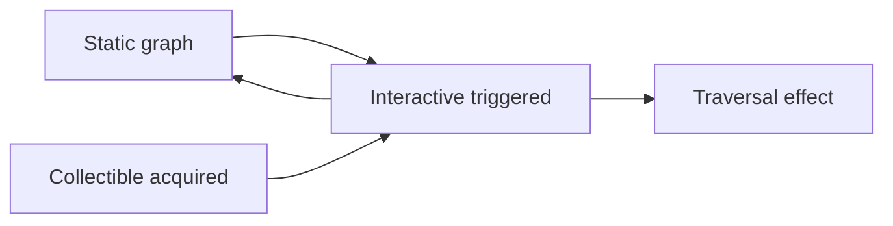
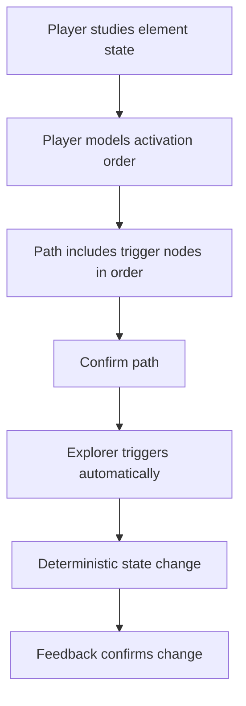
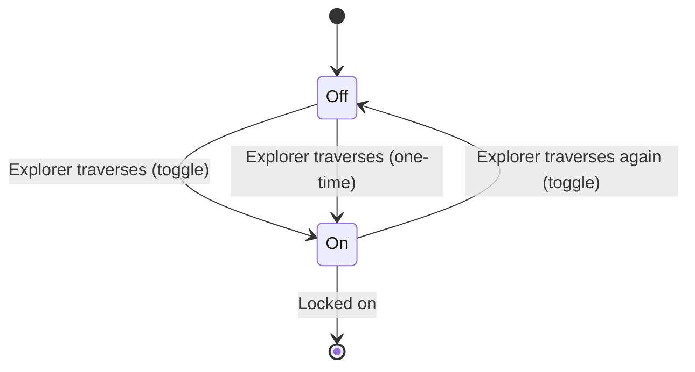
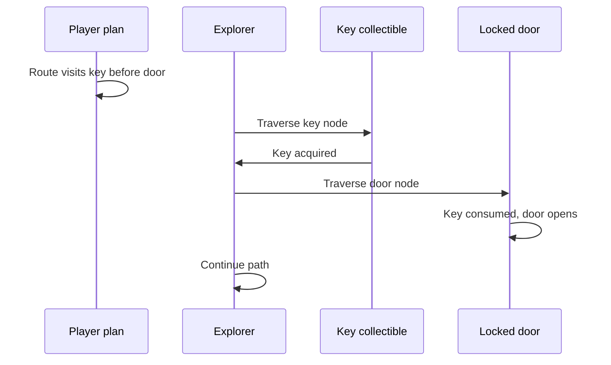
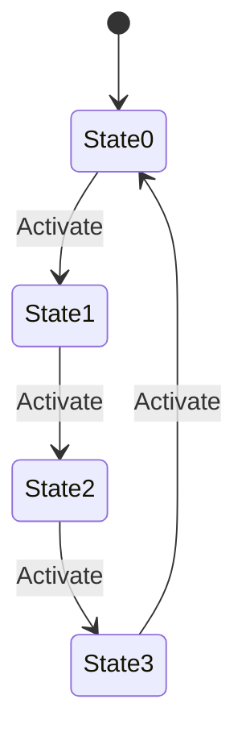
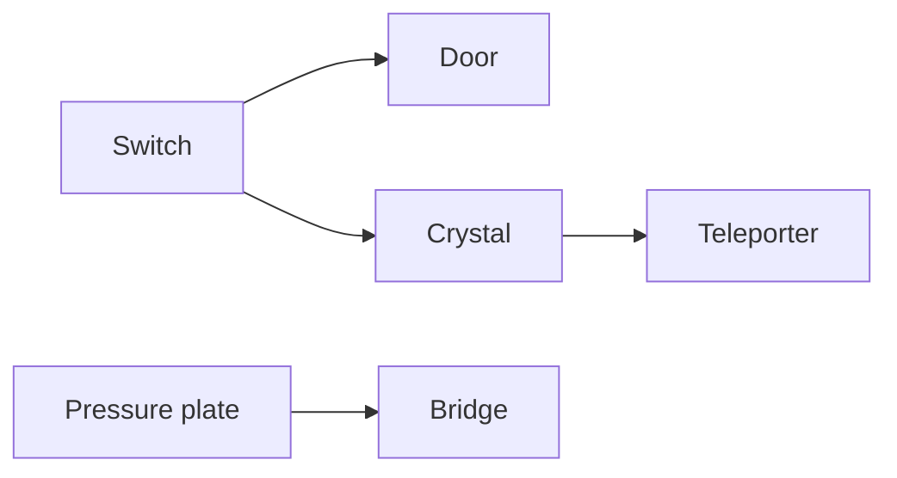
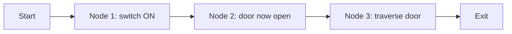

# Interactive Elements

| Field | Value |
|-------|-------|
| **Project** | Labyrinth Legends |
| **Document Name** | Interactive Elements |
| **Document ID** | LLDS-DOC-01-GP3.3-001 |
| **Series** | GP3.3 — Puzzle Design Series |
| **Version** | 1.0.0 |
| **Status** | Approved — v1.0.0 |
| **Owner** | Apoorv |
| **Prepared By** | ChatGPT (specification) · Cursor (compiler) |
| **Last Updated** | 2026-06-29 |
| **Path** | `docs/01_Game_Design/Gameplay/GP3/GP3.3_Interactive_Elements.md` |
| **Dependencies** | [Vision](../../../00_Project/Vision.md) · [Game Loop](../../Game_Loop.md) · [Player & Explorer](../Player_Explorer.md) · [Movement System](../Movement_System.md) · [GP3.1 — Puzzle Taxonomy](GP3.1_Puzzle_Taxonomy.md) · [GP3.2 — Static, Traversal & Collectible](GP3.2_Static_Traversal_Collectible_Elements.md) |
| **Related Documents** | [Gameplay Rules](../GP7_Gameplay_Rules.md) · [GP3.4 — Environmental](GP3.4_Environmental_Dynamic_Systems.md) · [Puzzle Elements](../Puzzle_Elements.md) |

## Navigation

| ← Previous | Next → | Index |
|------------|--------|-------|
| [GP3.2 — Static, Traversal & Collectible](GP3.2_Static_Traversal_Collectible_Elements.md) | [GP3.4 — Environmental](GP3.4_Environmental_Dynamic_Systems.md) | [GP3 Series](README.md) · [Gameplay Specs](../README.md) |

---

## Version History

| Version | Date | Author | Summary |
|---------|------|--------|---------|
| 1.0.0 | 2026-06-29 | Apoorv / ChatGPT | Approved as Phase 2 Interactive Elements baseline |
| 1.0.0 | 2026-06-29 | ChatGPT / Cursor | GP3.3 — Interactive element specifications |

## Change Log

| Version | Change |
|---------|--------|
| 1.0.0 | Approved as the authoritative Interactive Elements baseline for Labyrinth Legends gameplay documentation |
| 1.0.0 | Initial specification: doors, switches, plates, levers, locks, multi-state, linking, timing, feedback |

---

## Purpose

This document defines the approved design specification for **Interactive Elements** — puzzle elements that **respond to Explorer traversal**, **player planning**, or **labyrinth state changes**.

Interactive Elements are the primary building blocks for **cause-and-effect puzzle design**. They transform a static navigable graph into a solvable reasoning problem: the Player must understand *what changes*, *when it changes*, and *how that affects the route* before confirming the path.

### Why Interactive Elements Exist

| Role | Contribution |
|------|--------------|
| **Cause-and-effect reasoning** | Player links activation to consequence |
| **Route planning consequences** | Path order matters; state evolves along the route |
| **Puzzle state changes** | World updates deterministically during execution |
| **Access control** | Gates, locks, and mechanisms shape legality |

> **Scope boundary:** This document does not define hazards, enemies, full environmental systems, level composition rules, UI implementation, economy, monetization, or narrative.

This document **extends** [GP3.1 — Puzzle Taxonomy](GP3.1_Puzzle_Taxonomy.md) and [GP3.2 — Static, Traversal & Collectible](GP3.2_Static_Traversal_Collectible_Elements.md). It does not redefine player agency, movement, execution commitment, taxonomy, traversal behaviour, collectible behaviour, or rule precedence.

### Design Intent

Interactive Elements turn **navigation into logic** — every mechanism must earn its place by creating a fair, readable planning decision.

---

## Intended Audience

| Role | Use this document to… |
|------|------------------------|
| Level Designers | Author switch chains, doors, and lock puzzles correctly |
| Puzzle Designers | Define activation rules and linked effects |
| Engineers | Implement deterministic state machines |
| QA Engineers | Verify every state, link, and feedback path |
| AI Coding Agents | Author interactive content without violating GP1–GP3.2 |

## Table of Contents

1. [Purpose](#purpose)
2. [Relationship to Puzzle Taxonomy](#1-relationship-to-puzzle-taxonomy)
3. [Interactive Element Philosophy](#2-interactive-element-philosophy)
4. [Doors and Gates](#3-doors-and-gates)
5. [Switches](#4-switches)
6. [Pressure Plates](#5-pressure-plates)
7. [Levers and Buttons](#6-levers-and-buttons)
8. [Locks and Access Logic](#7-locks-and-access-logic)
9. [Multi-State Interactables](#8-multi-state-interactables)
10. [Linked Interactions](#9-linked-interactions)
11. [Interaction Timing](#10-interaction-timing)
12. [Interaction Feedback](#11-interaction-feedback)
13. [Behaviour Rules](#12-behaviour-rules)
14. [Combination Rules](#13-combination-rules)
15. [Design Constraints](#14-design-constraints)
16. [Anti-Patterns](#15-anti-patterns)
17. [Quality Checklist](#16-quality-checklist)
18. [Locked Decisions](#17-locked-decisions)

---

## 1. Relationship to Puzzle Taxonomy

[GP3.1 — Puzzle Taxonomy](GP3.1_Puzzle_Taxonomy.md) classifies Interactive Elements as mechanisms that **change world state** along the route. GP3.3 defines **approved behaviour** for that category.

### Category Distinction

| Category | Primary question | State change | GP document |
|----------|------------------|--------------|-------------|
| **Static** | *Where is the graph?* | No change during normal play | GP3.2 §2 |
| **Traversal** | *How does movement modify?* | Movement rules on nodes/edges | GP3.2 §3 |
| **Collectible** | *What is acquired on the route?* | Inventory / access tokens | GP3.2 §4 |
| **Interactive** | *What changes when triggered?* | **Yes — deterministic state change** | GP3.3 (this document) |

### Extension Rule

GP3.3 may specify **how** interactive elements activate, link, and resolve. It may **not**:

- Redefine taxonomy categories ([GP3.1-L01](GP3.1_Puzzle_Taxonomy.md#11-locked-decisions))
- Override [Movement System](../Movement_System.md) or [Player & Explorer](../Player_Explorer.md) planning/execution model
- Redefine key/collectible acquisition rules ([GP3.2 §4](GP3.2_Static_Traversal_Collectible_Elements.md#4-collectible-elements))
- Assign rule precedence ([Gameplay Rules](../GP7_Gameplay_Rules.md))

> **Activation model:** Interactive elements activate when the **Explorer traverses their node** (or holds position per element type) during execution — automatic resolution per [GP1-L05](../Player_Explorer.md#15-locked-decisions). The Player plans; the Explorer triggers.

### Design Intent

Interactive Elements sit **between** collectibles and traversal — they translate acquisition and visitation into **world state** the Player must reason about in advance.

---

## 2. Interactive Element Philosophy

Universal principles for all Interactive Elements. Aligned with [GP3.1 §5](GP3.1_Puzzle_Taxonomy.md#5-behaviour-principles).

| Principle | Requirement |
|-----------|-------------|
| **Clear cause and effect** | Every activation has an identifiable consequence |
| **Readable state** | Current state visible or inferable in planning when knowable |
| **Deterministic outcome** | Same path + world state → same result |
| **Visible feedback** | State change communicated at activation |
| **No hidden activation** | Mandatory triggers fairly discoverable |
| **No arbitrary exceptions** | Same element type behaves consistently across levels |
| **Interaction supports planning** | Player can model effect before Confirm |

> **One primary purpose per element** ([GP3.1-L06](GP3.1_Puzzle_Taxonomy.md#11-locked-decisions)): a switch opens a gate; it does not also secretly change unrelated hazards unless that dual role is readable and authored deliberately.

### Design Intent

Interactive puzzles test **foresight**, not memory of undocumented rules.

---

## 3. Doors and Gates

### Definition

**Doors and gates** are **access-control** Interactive Elements. They block or permit traversal between nodes or sectors until their authored open condition is met.

### Door and Gate Types

| Type | Default state | Opens when | Closes when | Reuse |
|------|---------------|------------|-------------|-------|
| **Locked door** | Closed, locked | Key consumed / lock satisfied | Stays open (typical) or per authored rule | Reusable chamber; lock one-time per attempt |
| **Unlocked door** | Closed, unlocked | Explorer reaches door node | — | Reusable |
| **Open door** | Open | — | Optional close trigger | Per authored rule |
| **Closed gate** | Closed | Switch, plate, or lock condition | May re-close if linked | Per authored rule |
| **One-time gate** | Closed | First valid activation | Permanently open after | Single resolution per attempt |
| **Reusable gate** | Closed | Activation condition | Deactivation condition (toggle chain) | Multiple cycles per attempt if authored |

### Relationships

| Partner | Relationship |
|---------|--------------|
| **Keys** ([GP3.2 §4](GP3.2_Static_Traversal_Collectible_Elements.md#4-collectible-elements)) | Key collected on route before door node; consumed on unlock |
| **Switches** (§4) | Switch state opens/closes gate remotely |
| **Pressure plates** (§5) | Hold-open or pulse-open gate while active |
| **Locks** (§7) | Lock logic defines open condition |

### Visibility and Path Validation

| Rule | Specification |
|------|-------------|
| **Visibility** | Door/gate state (open/closed/locked) readable in planning when knowable |
| **State communication** | Locked vs unlocked visually distinct; keyhole or rune affordance for key locks |
| **Path validation** | Closed door = impassable edge/node; validation must reflect state **at each step** along path order |
| **Ownership** | Player can identify which mechanism controls which gate |

### Anti-Patterns

| Anti-pattern | Why forbidden |
|--------------|---------------|
| Fake door (decoration looks like exit) | Breaks static honesty ([GP3.2](GP3.2_Static_Traversal_Collectible_Elements.md)) |
| Locked door with no key route | Unfair mandatory collectible |
| Gate opens off-screen with no feedback | Player cannot learn link |
| Identical doors, different rules without teaching | Violates consistency |

### Design Intent

Doors and gates are **legibility checkpoints** — the Player must always know whether access is blocked, and why.

---

## 4. Switches

### Definition

**Switches** are state-changing Interactive Elements toggled by **Explorer traversal** (or linked activation). They flip or advance mechanism state and commonly drive doors, bridges, and gates.

### Switch Types

| Type | Activation | State behaviour | Typical use |
|------|------------|-----------------|-------------|
| **Toggle switch** | Traverse switch node | Flips ON ↔ OFF each visit | Reversible mechanisms |
| **One-time switch** | First traverse only | ON permanently (or until reset) | Irreversible puzzle beats |
| **Linked switch** | Traverse | Changes state of linked object(s) | Remote doors, bridges |
| **Sequence switch** | Traverse in authored order | Advances sequence counter | Order puzzles |
| **Remote switch** | Traverse | Affects distant element; link visible or taught | Spatial reasoning |

### Activation Rules

| Rule | Specification |
|------|---------------|
| **Trigger** | Explorer enters switch node during execution |
| **Order** | Sequence switches resolve in path order |
| **Revisit** | Toggle switches re-fire on each traversal unless one-time |
| **Determinism** | Linked effects resolve immediately per §10 timing rules |

### Feedback Rules

| Requirement | Detail |
|-------------|--------|
| **Local feedback** | Switch visually changes state on activation |
| **Remote feedback** | Linked object shows state change (door opens, bridge extends) |
| **Audio** | Optional; never sole signal for mandatory state |

### Player Readability

- Switch **ON/OFF** (or equivalent) states visually distinct
- Linked targets discoverable within chamber or teaching beat
- Sequence switches show progress when sequence is part of taught mechanic

### Design Intent

Switches are the **simplest cause-and-effect teaching tool** — master toggle literacy before complex chains.

---

## 5. Pressure Plates

### Definition

**Pressure plates** are **position-based** activation elements. They activate while their trigger condition is satisfied (typically Explorer standing on plate node).

### Plate Types

| Type | Active while | Deactivates when | Typical link |
|------|--------------|------------------|--------------|
| **Temporary plate** | Explorer on node | Explorer leaves | Hold-open gate, timed bridge |
| **Persistent plate** | First press | Stays latched ON | Permanent door open |
| **Weighted plate** | Weight condition met | Condition removed | Future: object weight (deferred) |
| **Timed plate** | Press + authored delay | After timer expires | Short access window |

> **Weighted plates (objects):** Explorer-only activation is MVP. Object-weight plates are **future** — document as GP3.3-Q02 if used.

### Activation Model

| Actor | MVP rule |
|-------|----------|
| **Explorer** | Traversing plate node activates per plate type |
| **Objects** | Deferred — must not block MVP unless spec approved |

### Visibility

| State | Visual requirement |
|-------|-------------------|
| **Inactive** | Plate readable; depressed vs raised distinguishable |
| **Active** | Clear active glow/depth/state |
| **Linked effect** | Gate/bridge responds visibly |

### Relations to Other Systems

| System | Relationship |
|--------|--------------|
| **Doors** | Hold-open or pulse-open |
| **Bridges** ([GP3.2 §3](GP3.2_Static_Traversal_Collectible_Elements.md#3-traversal-elements)) | Extend while plate active |
| **Hazards** | May arm/disarm — detail in [Hazards_Failure](../GP4_Hazards_Failure.md) |
| **Environmental** | Plate state may interact with zones — GP3.4 |

### Design Intent

Pressure plates teach **position and persistence** — is the effect held, latched, or timed?

---

## 6. Levers and Buttons

### Definition

**Levers and buttons** are **direct activation** elements — immediate, discrete interactions at a node. They overlap switches in function but differ in **affordance and state expression**.

### Distinction from Switches and Plates

| Element | Affordance | State model | Typical feel |
|---------|------------|-------------|--------------|
| **Switch** | Toggle mechanism | Sustained ON/OFF | Persistent state change |
| **Pressure plate** | Stand on | Position-dependent | Hold or latch |
| **Lever** | Pull/push | Discrete positions (2–3+) | Mechanical, weighty |
| **Button** | Press | Momentary or latch | Immediate, discrete |

### Types

| Type | Behaviour | Reset |
|------|-----------|-------|
| **Single-use button** | Fires once per attempt | No |
| **Resettable button** | Fires each traverse | Per visit |
| **Lever (2-state)** | UP/DOWN maps to linked states | Toggle per activation |
| **Lever (3+ state)** | Cycles positions | See §8 multi-state |
| **Linked mechanism** | Opens/closes/rotates target | Per link rules §9 |

### Activation

- Triggered by **Explorer traversal** of lever/button node during execution
- Effect resolves per §10 timing (typically instant)
- Path must include node when activation required

### Design Intent

Levers and buttons provide **tactile clarity** — the Player reads them as *momentary* or *positional* controls, not ambient state.

---

## 7. Locks and Access Logic

### Definition

**Locks** define **conditions** that must be satisfied before a door, gate, or mechanism permits access. Lock logic is specified here; **keys** remain Collectibles per GP3.2.

### Lock Types

| Type | Condition | Readability requirement |
|------|-----------|-------------------------|
| **Key lock** | Matching key in inventory at door traverse | Keyhole/rune + key visual pairing |
| **Sequence lock** | Switches/plates activated in order | Progress indicators when taught |
| **Symbol lock** | Matching symbol state on interactables | Symbols visible and consistent |
| **Mechanism lock** | Composite condition (e.g. 2 switches ON) | All inputs visible in chamber |
| **Environmental lock** | External condition (light, power) — summary only | Taught in GP3.4; must be fair |

### Fairness Rules

| Rule | Requirement |
|------|-------------|
| **Readable lock state** | Player knows locked vs unlocked |
| **Fair clues** | Mandatory locks have discoverable solution path |
| **No arbitrary counts** | "Collect 7 hidden keys" forbidden for core path |
| **Validation** | Path validator checks lock state at door step using prior route state |

### Key Lock Flow

> **Multi-key doors:** Key order and consumption — see [GP3.2-Q02](GP3.2_Static_Traversal_Collectible_Elements.md#10-locked-decisions); default: all required keys must be collected before door traverse unless sequence lock authored.

### Design Intent

Locks are **contracts** — if access is denied, the Player must understand the terms of release.

---

## 8. Multi-State Interactables

### Definition

**Multi-state interactables** have **more than two** authored states. Each activation advances or selects state deterministically.

### Examples

| Element | States | Advance rule |
|---------|--------|--------------|
| **Rotating statue** | 4 facings (N/E/S/W) | Each traverse rotates 90° CW |
| **Rotating tile** | 2–4 orientations | Toggle or cycle |
| **Shifting block** | Grid positions (2–3) | Each activation shifts one step |
| **Energy crystal** | Off / Low / High | Charge stages per activation |
| **Alignment device** | Multiple rune positions | Cycle until match |

### Design Requirements

| Requirement | Detail |
|-------------|--------|
| **State visibility** | Current state readable in planning when knowable |
| **Cycling rules** | Fixed order or fixed set — no random next state |
| **Activation order** | Path order determines state at each step |
| **Player prediction** | Player can compute state after *n* activations |
| **Composition** | Combine with locks (symbol match) or traversal (bridge angle) |

### Design Intent

Multi-state elements add **depth through counting and ordering**, not through hidden state machines.

---

## 9. Linked Interactions

### Definition

**Linked interactions** connect Interactive Elements to **other puzzle elements** — static, traversal, collectible, environmental, dynamic, or hazard — through authored **deterministic bindings**.

### Link Topology

| Pattern | Description | Example |
|---------|-------------|---------|
| **One-to-one** | A → B | Switch opens one door |
| **One-to-many** | A → B, C, D | Master switch opens three gates |
| **Many-to-one** | A, B → C | Two plates required for bridge |
| **Chain reaction** | A → B → C | Switch powers crystal → crystal enables teleporter |

### Authored Examples

| Chain | Planning implication |
|-------|---------------------|
| Switch opens door | Route must visit switch before door |
| Pressure plate lowers bridge | Plate order matters; may need hold vs latch |
| Lever rotates statue | Statue state must match lock before door |
| Crystal powers teleporter | Charge state before teleporter entry |
| Button changes path state | Validation updates after button step |

### Discoverability

| Rule | Requirement |
|------|-------------|
| **Learnable links** | Visual, spatial, or taught in intro beat |
| **No mystery links** | Mandatory links cannot be arbitrary distance without cue |
| **Consistent language** | Same cable/rune/color system within world tier |

### Design Intent

Links are **puzzle sentences** — subject (trigger), verb (activate), object (effect). Each must parse clearly.

---

## 10. Interaction Timing

### Philosophy

Interactive Elements are **deterministic and readable**. Timing adds **ordering foresight**, not **reflex skill**.

> **No reflex gameplay:** Player never mashes buttons or races execution timer for core puzzle resolution ([GP1](../Player_Explorer.md), [Vision](../../../00_Project/Vision.md)).

### Timing Categories

| Category | Behaviour | Planning impact |
|----------|-----------|-----------------|
| **Instant activation** | Effect on same execution step | Player models immediate state |
| **Delayed activation** | Effect after authored delay (fixed) | Player accounts for delay in route order |
| **Timed reset** | Element returns to prior state after fixed duration | Player must complete segment within window **as planned** — not via reaction |
| **Animation delay** | Visual only; logical state changes at defined tick | Feedback must not hide logical state |
| **Sequence timing** | Steps must occur in order with fixed intervals | Teach once; deterministic schedule |

### Rules

| Rule | Specification |
|------|---------------|
| **Fixed durations** | All delays authored; no random variance |
| **Preview** | When delay affects legality, planning UI may show post-delay state when knowable |
| **Execution** | Observer watches plan unfold — no mid-execution correction |
| **Pause** | Pause freezes timing; no penalty |

### Design Intent

Time is a **planning dimension**, not a **dexterity test**.

---

## 11. Interaction Feedback

### Philosophy

Every interaction must answer four questions for the Player:

1. **What activated?**
2. **What changed?**
3. **Why it changed?** (cause visible or already learned)
4. **Is the change temporary or permanent?**

### Feedback Channels

| Channel | Use |
|---------|-----|
| **Animation** | Door opening, switch flip, bridge extension |
| **Sound** | Confirm activation; optional accent |
| **Visual state change** | Persistent ON/OFF, open/closed, charged/empty |
| **Path preview updates** | Validation/preview reflects new legality when knowable |
| **Camera attention** | Optional, restrained — highlight linked effect once |

### Requirements

| Requirement | Detail |
|-------------|--------|
| **Mandatory feedback** | State change never silent for required puzzle steps |
| **Proportional** | Minor toggle = local feedback; major unlock = stronger signal |
| **Non-deceptive** | Feedback matches logical state immediately |
| **Accessibility** | Not color-only; shape/motion redundancy per LLDL downstream |

### Design Intent

Feedback **closes the learning loop** — the Player verifies their mental model against the world response.

---

## 12. Behaviour Rules

Shared behaviour rules for all Interactive Elements:

| Rule | Requirement |
|------|-------------|
| **Visual readability** | All states distinguishable |
| **Clear cause** | Activation source identifiable |
| **Deterministic effect** | No random outcomes |
| **Discoverable links** | Linked elements learnable |
| **Path validation sync** | State changes update legality for subsequent path steps |
| **No invisible mandatory interaction** | Required triggers fairly findable |
| **Automatic activation** | Explorer traversal triggers; no execution-time tapping ([GP1-L05](../Player_Explorer.md#15-locked-decisions)) |
| **Lifecycle fit** | Follows [GP3.1 §4](GP3.1_Puzzle_Taxonomy.md#4-puzzle-element-lifecycle) within element state machines |

### Path Order Principle

Interactive state evolves **in path traversal order**. Validation simulates state step-by-step from Start through each node to Exit.

### Design Intent

If QA cannot predict state at step *k*, the puzzle is not ready to ship.

---

## 13. Combination Rules

Interactive Elements combine with all taxonomy families:

| Family | Combination examples |
|--------|---------------------|
| **Static** | Door blocks wall opening; blocked node behind gate |
| **Traversal** | Switch extends bridge; crystal powers teleporter |
| **Collectible** | Key + lock + door; relic behind optional gate |
| **Environmental** | Light-powered lock; fog hides switch until approached (GP3.4) |
| **Dynamic** | Timed gate + switch schedule; moving platform + plate |
| **Hazards** | Switch disables hazard — see [GP4 Hazards & Failure](../GP4_Hazards_Failure.md) |

### Authored Combination Table

| Puzzle recipe | Elements | Player skill |
|---------------|----------|--------------|
| Key + lock + door | Collectible + lock + door | Route ordering |
| Switch + bridge | Switch + traversal | Remote cause-effect |
| Pressure plate + gate | Plate + door | Hold vs traverse timing |
| Lever + rotating statue | Lever + multi-state + symbol lock | State computation |
| Crystal + teleporter | Multi-state + traversal | Charge before use |
| Button + timed path | Button + dynamic traversal | Planned window |

> **Depth from combination** ([GP3.1-L07](GP3.1_Puzzle_Taxonomy.md#11-locked-decisions)): add links, not exceptions.

### Design Intent

GP3.3 provides **verbs**; GP3.2 and GP3.4 provide **nouns and context**; GP3.5 will govern **sentence structure** per chamber.

---

## 14. Design Constraints

| ID | Constraint |
|----|------------|
| INT-C01 | No hidden switches required for main completion |
| INT-C02 | No random activation results |
| INT-C03 | No visually identical objects with different rules without teaching |
| INT-C04 | No unclear linked effects on mandatory path |
| INT-C05 | No reaction-speed dependency |
| INT-C06 | No interaction that invalidates planning unfairly post-confirm |
| INT-C07 | Automatic activation only during execution |
| INT-C08 | One primary category per element |
| INT-C09 | Mandatory lock conditions fairly clued |
| INT-C10 | State at confirm must fully determine execution outcome |

### Design Intent

Constraints protect **Draw Your Fate** integrity — planning is the game.

---

## 15. Anti-Patterns

| Anti-pattern | Violation | Why forbidden |
|--------------|-----------|---------------|
| **Invisible switches** | INT-C01 | Player cannot plan |
| **Unclear door ownership** | Link discoverability | Cannot attribute effect |
| **Fake interactables** | Honesty | Wastes player trust |
| **Random switch outcomes** | Determinism | Guessing not reasoning |
| **State changes without feedback** | Feedback rules | No learning loop |
| **Puzzle-specific exceptions** | Consistency | Taxonomy breaks down |
| **Timed pressure → reflex** | INT-C05 | Wrong skill test |
| **Arbitrary lock requirements** | Fairness | Hidden mandatory grind |
| **Post-confirm surprises** | Commitment model | Violates GP1 |
| **Execution-time tapping** | GP1-L05 | Breaks execution philosophy |

### Design Intent

Reject at design review — cheaper than retrofitting levels.

---

## 16. Quality Checklist

For any Interactive Element:

| # | Question | Pass |
|---|----------|------|
| 1 | Is the element's **purpose** clear? | |
| 2 | Is its **state readable**? | |
| 3 | Is activation **deterministic**? | |
| 4 | Is the linked effect **visible or learnable**? | |
| 5 | Does it **support planning** before Confirm? | |
| 6 | Does it respect **[Movement System](../Movement_System.md)**? | |
| 7 | Does it avoid **hidden rules**? | |
| 8 | Can **QA test every state**? | |
| 9 | Is **feedback** provided on activation? | |
| 10 | Does path **validation update** correctly per step? | |
| 11 | Is **primary category** Interactive (not mis-tagged)? | |
| 12 | Does it combine without **exception creep**? | |

### Design Intent

Use at design review, content lock, and regression passes for interactive chambers.

---

## 17. Locked Decisions

### Locked Decisions

| ID | Decision | Source |
|----|----------|--------|
| GP3.3-L01 | Interactive Elements defined in GP3.3; primary cause-and-effect category | GP3.3 workshop |
| GP3.3-L02 | Activation via Explorer traversal — automatic during execution | GP3.3 · GP1-L05 |
| GP3.3-L03 | Doors/gates as access-control; state affects path validation per step | GP3.3 workshop |
| GP3.3-L04 | Switches: toggle, one-time, linked, sequence, remote — all deterministic | GP3.3 workshop |
| GP3.3-L05 | Pressure plates: temporary, persistent, timed; object-weight deferred | GP3.3 workshop |
| GP3.3-L06 | Levers/buttons distinguished by affordance from switches/plates | GP3.3 workshop |
| GP3.3-L07 | Lock types: key, sequence, symbol, mechanism; environmental summary only | GP3.3 workshop |
| GP3.3-L08 | Multi-state interactables: fixed cycling; player-predictable | GP3.3 workshop |
| GP3.3-L09 | Link patterns: 1:1, 1:many, many:1, chains — must be discoverable | GP3.3 workshop |
| GP3.3-L10 | Timing is planning dimension — no reflex core gameplay | GP3.3 · GP1 · Vision |
| GP3.3-L11 | Mandatory feedback on state changes for required puzzle steps | GP3.3 workshop |
| GP3.3-L12 | Path order simulates interactive state for validation | GP3.3 · GP2 |

### Future Decisions (Deferred)

| Topic | Target document |
|-------|-----------------|
| Object-weight pressure plates | Future GP3.3 amendment / Gameplay Rules |
| Hazard-switch coupling detail | [GP4 Hazards & Failure](../GP4_Hazards_Failure.md) |
| Environmental lock full spec | [GP3.4 — Environmental](GP3.4_Environmental_Dynamic_Systems.md) |
| Chamber link density and interaction-chain limits | [GP3.5 — Composition](GP3.5_Puzzle_Composition_Level_Design_Rules.md) |
| Multi-key door validation order | [Gameplay Rules](../GP7_Gameplay_Rules.md) · GP3.2-Q02 |
| Feedback accessibility tokens | LLDL / [GP6 Gameplay Feedback](../GP6_Gameplay_Feedback.md) |

### Open Questions

| ID | Question | Owner | Status |
|----|----------|-------|--------|
| GP3.3-Q01 | Toggle switch on revisit: retrigger every visit or latch after first? | ChatGPT / Apoorv | Open — aligns with GP2-Q01 |
| GP3.3-Q02 | Object-weight plates in MVP or post-MVP? | ChatGPT / Apoorv | Open |
| GP3.3-Q03 | Camera punch on remote link: always, first-time only, or never? | ChatGPT / Apoorv | Open — LLDL |
| GP3.3-Q04 | Sequence lock: show progress counter in UI or world-only? | ChatGPT / Apoorv | Open |

### Design Intent

Locked decisions bind GP3.3 content. Resolve open questions before composition guidelines (GP3.5) finalize.

---

## Cross References

- Upstream: [GP3.1](GP3.1_Puzzle_Taxonomy.md), [GP3.2](GP3.2_Static_Traversal_Collectible_Elements.md), [GP1](../Player_Explorer.md), [GP2](../Movement_System.md)
- Siblings: [GP3.4 Environmental](GP3.4_Environmental_Dynamic_Systems.md), [GP3.5 Composition](GP3.5_Puzzle_Composition_Level_Design_Rules.md)
- Downstream: [Puzzle_Elements.md](../Puzzle_Elements.md), [Gameplay.md](../../Gameplay.md)
- Governance: [Decisions](../../../00_Project/Decisions.md)

---

## Navigation

| ← Previous | Next → | Index |
|------------|--------|-------|
| [GP3.2 — Static, Traversal & Collectible](GP3.2_Static_Traversal_Collectible_Elements.md) | [GP3.4 — Environmental](GP3.4_Environmental_Dynamic_Systems.md) | [GP3 Series](README.md) · [Gameplay Specs](../README.md) |
