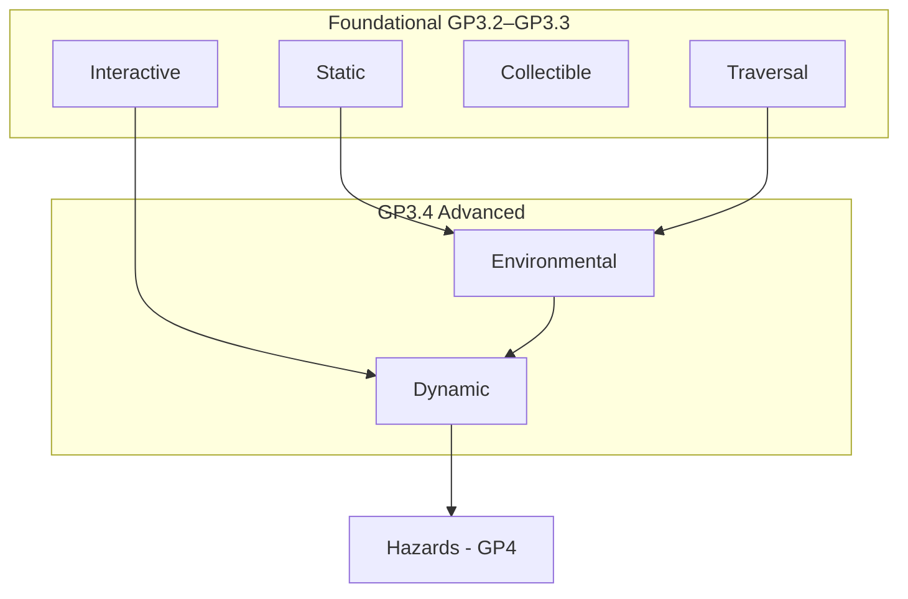
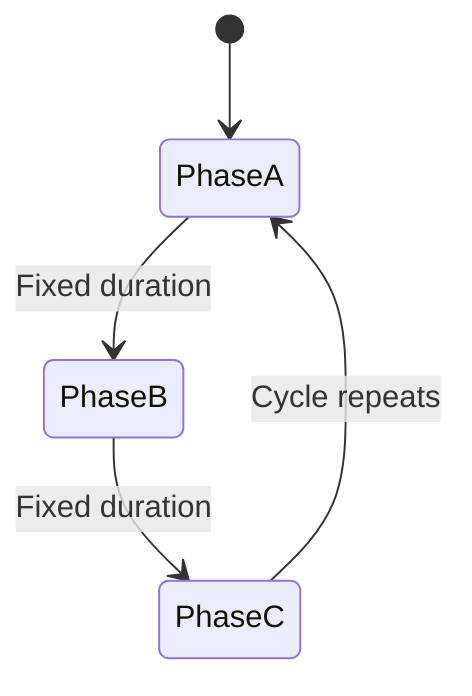
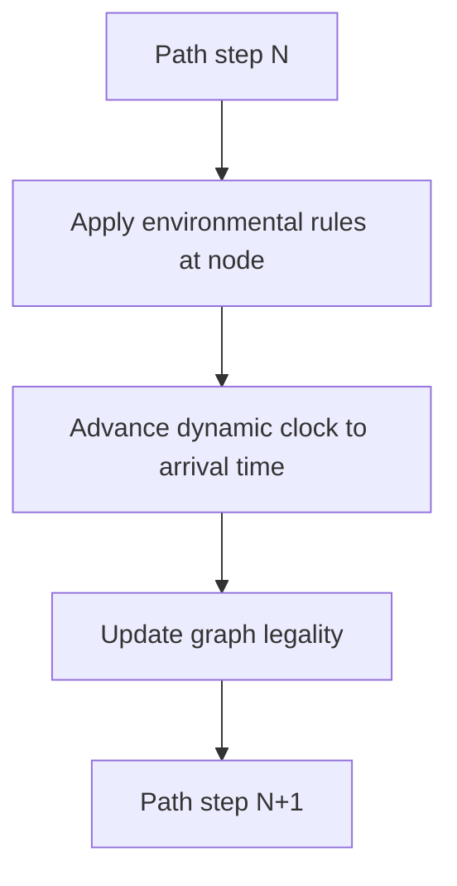
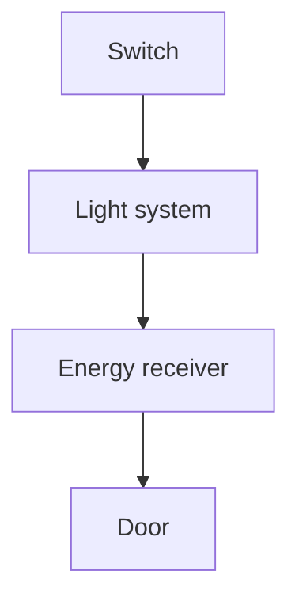

# Environmental & Dynamic Systems

| Field | Value |
|-------|-------|
| **Project** | Labyrinth Legends |
| **Document Name** | Environmental & Dynamic Systems |
| **Document ID** | LLDS-DOC-01-GP3.4-001 |
| **Series** | GP3.4 — Puzzle Design Series |
| **Version** | 1.0.0 |
| **Status** | Approved — v1.0.0 |
| **Owner** | Apoorv |
| **Prepared By** | ChatGPT (specification) · Cursor (compiler) |
| **Last Updated** | 2026-06-29 |
| **Path** | `docs/01_Game_Design/Gameplay/GP3/GP3.4_Environmental_Dynamic_Systems.md` |
| **Dependencies** | [Vision](../../../00_Project/Vision.md) · [Game Loop](../../Game_Loop/Game_Loop.md) · [Player & Explorer](../GP1_Player_Explorer.md) · [Movement System](../GP2_Movement_System.md) · [GP3.1 — Puzzle Taxonomy](GP3.1_Puzzle_Taxonomy.md) · [GP3.2 — Static, Traversal & Collectible](GP3.2_Static_Traversal_Collectible_Elements.md) · [GP3.3 — Interactive](GP3.3_Interactive_Elements.md) |
| **Related Documents** | [Gameplay Rules](../GP7_Gameplay_Rules.md) · [GP3.5 — Composition](GP3.5_Puzzle_Composition_Level_Design_Rules.md) · [Hazards_Failure](../GP4_Hazards_Failure.md) · [Puzzle Elements](../Puzzle_Elements.md) |

## Navigation

| ← Previous | Next → | Index |
|------------|--------|-------|
| [GP3.3 — Interactive](GP3.3_Interactive_Elements.md) | [GP3.5 — Composition](GP3.5_Puzzle_Composition_Level_Design_Rules.md) | [GP3 Series](README.md) · [Gameplay Specs](../README.md) |

---

## Version History

| Version | Date | Author | Summary |
|---------|------|--------|---------|
| 1.0.0 | 2026-06-29 | Apoorv / ChatGPT | Approved as Phase 2 Environmental & Dynamic Systems baseline |
| 1.0.0 | 2026-06-29 | ChatGPT / Cursor | GP3.4 — Environmental & Dynamic system specifications |

## Change Log

| Version | Change |
|---------|--------|
| 1.0.0 | Approved as the authoritative Environmental & Dynamic Systems baseline for Labyrinth Legends gameplay documentation |
| 1.0.0 | Initial specification: environmental forces, dynamic cycles, visibility, combination rules |

---

## Purpose

This document defines the approved design specification for two advanced puzzle-system families:

1. **Environmental Systems** — world forces, conditions, and thematic rules that alter puzzle logic across regions or the chamber
2. **Dynamic Systems** — state that changes over **time**, **cycles**, or **deterministic world-state progression**

Together they create **advanced puzzle depth**, **world identity**, **sequencing challenges**, and **systemic combinations** beyond static graphs and discrete interactives.

### Why These Systems Exist

| Contribution | Description |
|--------------|-------------|
| **Advanced depth** | Layers foresight, timing, and regional rules onto foundational elements |
| **World identity** | Light temples, sand tombs, storm ruins — mechanics express place |
| **Sequencing** | Player orders route against cycles and environmental state |
| **Systemic combinations** | Light powers crystals; flow fills channels; wind redirects routes |

> **Scope boundary:** This document does not define hazards in full detail, enemies, objective scoring, UI implementation, technical architecture, economy, monetization, or narrative scripting.

This document **extends** GP3.1–GP3.3. It does not redefine player agency, movement, execution commitment, taxonomy, static/traversal/collectible behaviour, interactive behaviour, or rule precedence.

### Design Intent

Environmental and Dynamic Systems are **the world's grammar** — they make chambers feel like places with laws, not collections of isolated gadgets.

---

## Intended Audience

| Role | Use this document to… |
|------|------------------------|
| Level Designers | Author light puzzles, cycles, fog, and flow chambers |
| Puzzle Designers | Define deterministic environmental rules |
| Engineers | Implement schedulers and region modifiers |
| QA Engineers | Verify all cycle states and environmental transitions |
| AI Coding Agents | Author environmental content without violating GP1–GP3.3 |

## Table of Contents

1. [Purpose](#purpose)
2. [Relationship to Puzzle Taxonomy](#1-relationship-to-puzzle-taxonomy)
3. [Environmental System Philosophy](#2-environmental-system-philosophy)
4. [Dynamic System Philosophy](#3-dynamic-system-philosophy)
5. [Light and Shadow Systems](#4-light-and-shadow-systems)
6. [Electricity / Energy Systems](#5-electricity--energy-systems)
7. [Water, Sand, and Flow Systems](#6-water-sand-and-flow-systems)
8. [Wind and Force Systems](#7-wind-and-force-systems)
9. [Gravity and Orientation Systems](#8-gravity-and-orientation-systems)
10. [Darkness, Fog, and Visibility Systems](#9-darkness-fog-and-visibility-systems)
11. [Moving and Shifting Structures](#10-moving-and-shifting-structures)
12. [Timed and Cyclical Systems](#11-timed-and-cyclical-systems)
13. [Environmental State Communication](#12-environmental-state-communication)
14. [Behaviour Rules](#13-behaviour-rules)
15. [Combination Rules](#14-combination-rules)
16. [Design Constraints](#15-design-constraints)
17. [Anti-Patterns](#16-anti-patterns)
18. [Quality Checklist](#17-quality-checklist)
19. [Locked Decisions](#18-locked-decisions)

---

## 1. Relationship to Puzzle Taxonomy

[GP3.1 — Puzzle Taxonomy](GP3.1_Puzzle_Taxonomy.md) classifies **Environmental** and **Dynamic** as distinct categories. GP3.4 defines **approved behaviour** for both.

### Category Distinction

| Category | Primary question | Change model | GP document |
|----------|------------------|--------------|-------------|
| **Traversal** | *How does this cell modify movement?* | Per-node/edge modifier | GP3.2 §3 |
| **Interactive** | *What toggles when triggered?* | Explorer/switch activation | GP3.3 |
| **Environmental** | *What regional rule applies?* | Area condition or force field | GP3.4 §2–§10 |
| **Dynamic** | *What changes on a schedule?* | Time/cycle/state progression | GP3.4 §3, §10–§11 |
| **Hazards** | *What causes failure?* | Threat outcome | [GP4 Hazards & Failure](../GP4_Hazards_Failure.md) |

### Environmental vs Dynamic

| Aspect | Environmental | Dynamic |
|--------|---------------|---------|
| **Driver** | Region rules, forces, visibility | Clock, cycle, phased state |
| **Typical scope** | Zone-wide or field-wide | Element or chamber schedule |
| **Player reads** | *What rules apply here?* | *When will state be X?* |
| **Example** | Fog region, light beam network | Rotating bridge cycle, timed gate |

> **Overlap:** A wind **zone** is Environmental; a wind **path tile** displacing one step is Traversal ([GP3.2 §3](GP3.2_Static_Traversal_Collectible_Elements.md#3-traversal-elements)). Declare **one primary category**; note secondary role.

### Authority Boundary

GP3.4 may extend environmental and dynamic behaviour. It may **not**:

- Override [Movement System](../GP2_Movement_System.md) node-to-node or orthogonal rules
- Override [Player & Explorer](../GP1_Player_Explorer.md) planning/execution model
- Redefine interactive activation ([GP3.3](GP3.3_Interactive_Elements.md))
- Assign rule precedence ([Gameplay Rules](../GP7_Gameplay_Rules.md))

Environmental and dynamic effects **modify** movement and validation — they do not replace GP2.

### Design Intent

GP3.4 is the **systems layer** — regional laws and clocks that make advanced chambers coherent.

---

## 2. Environmental System Philosophy

Universal principles for all Environmental Systems:

| Principle | Requirement |
|-----------|-------------|
| **Readable** | Player can identify where the system applies |
| **Deterministic** | Same world state + path → same outcome |
| **Teachable** | Introduced in controlled beats; rules stable within world tier |
| **Supports planning** | Player models effect before Confirm |
| **Visible cause and consequence** | Force or condition links to effect |
| **Reinforces world identity** | Mechanics match biome/theme ([Vision](../../../00_Project/Vision.md)) |

> **No arbitrary concealment:** Hidden information is allowed only when deliberately designed, fair, and teachable ([GP1-L06](../GP1_Player_Explorer.md#15-locked-decisions)).

### Design Intent

Environmental systems are **regional contracts** — the Player learns the law of the chamber, not a list of exceptions.

---

## 3. Dynamic System Philosophy

Universal principles for all Dynamic Systems:

| Principle | Requirement |
|-----------|-------------|
| **Never random** | All transitions authored; fixed schedules |
| **Observable or learnable** | Current phase readable; cycle teachable |
| **Planning over reflex** | Timing is foresight, not twitch ([GP3.3 §10](GP3.3_Interactive_Elements.md#10-interaction-timing)) |
| **Predictable cycles** | Repeating patterns with fixed period |
| **Path validation sync** | Legality updates per step when state affects graph |
| **Sequencing, not chaos** | Depth from *when*, not from surprise |

### Design Intent

Dynamic systems add **temporal reasoning** — the Player asks *at which step does the world match my plan?*

---

## 4. Light and Shadow Systems

### Definition

**Light and shadow** are environmental logic systems where **illumination state** gates mechanisms, visibility, or traversal.

### Components

| Component | Role |
|-----------|------|
| **Light beams** | Directional illumination along fixed paths |
| **Shadow zones** | Regions where light-dependent rules differ |
| **Mirrors** | Redirect beams deterministically |
| **Blockers** | Interrupt beams; movable blockers may be Interactive |
| **Light-activated mechanisms** | Doors, crystals, bridges powered by beam contact |
| **Visibility logic** | Hidden paths revealed only when lit |

### Rules

| Rule | Specification |
|------|---------------|
| **Beam paths** | Deterministic; fixed origin, direction, reflection angles |
| **Mirrors** | Fixed orientations or discrete rotations (Interactive/GP3.3) |
| **Readability** | Lit vs unlit visually distinct; beam path visible or deducible |
| **Planning** | Player computes which targets receive light at plan time when knowable |

### Combinations

| Partner | Example |
|---------|---------|
| **Doors** ([GP3.3](GP3.3_Interactive_Elements.md)) | Light beam hits receptor → gate opens |
| **Crystals** ([GP3.3 §8](GP3.3_Interactive_Elements.md#8-multi-state-interactables)) | Beam charges crystal stage |
| **Bridges** ([GP3.2 §3](GP3.2_Static_Traversal_Collectible_Elements.md#3-traversal-elements)) | Lit receptor extends bridge |
| **Hidden paths** | Shadow lifts when beam hits rune |

### Anti-Patterns

| Anti-pattern | Why forbidden |
|--------------|---------------|
| Beams that randomly redirect | Breaks determinism |
| Mandatory path invisible in shadow without teaching | Unfair concealment |
| Identical mirrors with different reflection rules | Consistency violation |

### Design Intent

Light puzzles teach **routing energy through space** — geometry as logic, not decoration.

---

## 5. Electricity / Energy Systems

### Definition

**Energy systems** model ancient power — electricity, magical current, or temple conduits — as **deterministic flow** from source to receiver.

### Components

| Component | Role |
|-----------|------|
| **Power sources** | Origin of energy (crystal, reactor, sun node) |
| **Conduits** | Fixed paths energy travels |
| **Receivers** | Nodes that activate when powered |
| **Charged crystals** | Store or relay energy states |
| **Powered gates** | Access control when receiver energized |
| **Energy bridges** | Traversal elements active only when powered |

### Rules

| Rule | Specification |
|------|---------------|
| **Cause/effect chains** | Source → conduit → receiver; traceable |
| **Connection paths** | Visible cables, runes, or taught links |
| **Powered / unpowered** | States visually distinct |
| **Determinism** | Power state at confirm fully determines execution |
| **Linked interactions** | Switches may reroute power ([GP3.3 §9](GP3.3_Interactive_Elements.md#9-linked-interactions)) |

### Design Intent

Energy systems extend **linked interactions** across distance — one network, many readable states.

---

## 6. Water, Sand, and Flow Systems

### Definition

**Flow systems** model **fluid or granular matter** moving through channels — water, sand, sand-fall, slurry — under deterministic rules.

### Components

| Component | Role |
|-----------|------|
| **Flow source** | Origin of material |
| **Channels** | Directed paths with fixed flow direction |
| **Flow direction** | Orthogonal or authored diagonal per chamber rules |
| **Blocked / unblocked** | Gates control whether flow reaches target |
| **Pressure / weight** | Filled volume triggers plates or locks (links GP3.3) |

### Interactions

| Family | Relationship |
|--------|--------------|
| **Traversal** | Water current tiles ([GP3.2 §3](GP3.2_Static_Traversal_Collectible_Elements.md#3-traversal-elements)) — cell displacement; flow **system** fills regions over steps |
| **Collectibles** | Items may be revealed or washed into reach — must be deterministic |
| **Interactive** | Switch opens sluice; plate triggers when channel full |

### Communication

| Requirement | Detail |
|-------------|--------|
| **Visual** | Flow direction, fill level, blocked state |
| **Determinism** | Fixed fill rate or instant fill per authored rule |
| **World identity** | Desert sand vs flooded crypt — same rules, different art |

### Design Intent

Flow systems teach **indirect consequence** — the Player routes matter, not only the Explorer.

---

## 7. Wind and Force Systems

### Definition

**Wind and force** systems apply **directional environmental displacement** across zones or beams.

### Components

| Component | Role |
|-----------|------|
| **Directional wind** | Region with fixed push vector |
| **Gust paths** | Timed or cyclic wind corridors (Dynamic overlap) |
| **Push zones** | Area applies displacement on entry |
| **Force beams** | Line-shaped push like light beams |
| **Environmental displacement** | Moves Explorer per [Movement System](../GP2_Movement_System.md) §11 modifiers |

### Movement Relationship

| Rule | Specification |
|------|---------------|
| **GP2 compliance** | Displacement remains node-to-node, orthogonal, deterministic |
| **Visible direction** | Arrows, particles, environmental cues |
| **Planning** | Player includes post-push position in path |
| **No reflex** | Gust timing is cyclic and learnable — not reaction test |

> **Boundary:** Single-tile wind path = Traversal ([GP3.2](GP3.2_Static_Traversal_Collectible_Elements.md)); region wind field = Environmental (this section).

### Design Intent

Wind extends **spatial reasoning** — the Player plans where the world pushes, not how to dodge.

---

## 8. Gravity and Orientation Systems

### Definition

**Gravity and orientation** systems alter **which direction counts as "down"** for movement or rotate the **reference frame** of the chamber.

### Components

| Component | Role |
|-----------|------|
| **Gravity direction** | Authored fall/move bias (advanced) |
| **Rotating rooms** | Chamber sector reorients in discrete steps |
| **Orientation shifts** | Player mental model rotates with room |
| **Gravity fields** | Zone-specific gravity rule |
| **Weighted movement** | Movement cost or forced direction in field |

### Introduction Tier

| Tier | Guidance |
|------|----------|
| **Core** | Avoid — high confusion risk |
| **World** | One orientation beat per world after Core literacy |
| **Legendary** | Multi-orientation chambers with strong visual anchors |

### Readability

| Requirement | Detail |
|-------------|--------|
| **Visual orientation** | Clear up/down or rotation indicator |
| **Camera (design level)** | Rotation must not disorient without landmark anchors |
| **Determinism** | Discrete rotation angles; fixed sequence |
| **Risk mitigation** | Reversible preview; strong floor/wall contrast |

### Design Intent

Gravity/orientation is **Legendary spice** — powerful when readable, punishing when vague.

---

## 9. Darkness, Fog, and Visibility Systems

### Definition

**Visibility systems** limit what the Player can see during planning or execution — fog, darkness, obscured regions, line-of-sight.

### Components

| Component | Role |
|-----------|------|
| **Fog** | Soft concealment of distant or unrevealed nodes |
| **Darkness** | Hard concealment without light source |
| **Obscured regions** | Sector hidden until Explorer enters adjacency |
| **Reveal zones** | Light, switch, or visit reveals area |
| **Memory-based planning** | Player recalls revealed layout — fair only when stable |
| **Line-of-sight** | Nodes hidden behind static geometry |

### Fairness Rules

| Rule | Requirement |
|------|-------------|
| **Mandatory path** | Never hidden under fog/darkness without fair teaching |
| **Optional content** | Relics behind fog allowed if detour is optional ([GP3.2-L08](GP3.2_Static_Traversal_Collectible_Elements.md#10-locked-decisions)) |
| **Deliberate design** | Concealment is authored intent — not default punishment |
| **Reveal permanence** | Revealed state persists for attempt unless authored reset |

> Resolves [GP3.2-Q03](GP3.2_Static_Traversal_Collectible_Elements.md#10-locked-decisions): optional relics may use discovery fog; mandatory routes may not.

### Design Intent

Fog and darkness create **exploration tension** — never **planning betrayal** on the critical path.

---

## 10. Moving and Shifting Structures

### Definition

**Moving and shifting structures** change the **spatial graph** over time or on trigger — walls, bridges, corridors, elevators, blocks.

### Types

| Type | Driver | Category note |
|------|--------|---------------|
| **Moving walls** | Cycle or switch | Dynamic or Interactive-linked |
| **Rotating bridges** | Cycle | Dynamic + Traversal |
| **Shifting corridors** | Triggered sequence | Dynamic |
| **Elevators** | Cycle or call plate | Dynamic + Traversal |
| **Sliding blocks** | Push chain (if authored) | Interactive + Dynamic |
| **Rotating rooms** | Cycle | Dynamic + Environmental |
| **Collapsing-resettable** | Step trigger + reset rule | Dynamic; hazard overlap deferred |

### Rules

| Rule | Specification |
|------|---------------|
| **Deterministic cycles** | Fixed period and phase at level start |
| **Triggered movement** | Interactive trigger → fixed motion ([GP3.3](GP3.3_Interactive_Elements.md)) |
| **Planning visibility** | Phase knowable or cycle diagram taught |
| **Path validation** | Graph updates per step at Explorer arrival time |

### Anti-Patterns

| Anti-pattern | Why forbidden |
|--------------|---------------|
| Random platform position | GP3.2/GP3.4 determinism |
| Boarding requires reflex | Wrong skill test |
| Structure moves without visual/audio state | No feedback |

### Design Intent

Moving structures make the **graph a character** — the labyrinth breathes on a schedule the Player learns.

---

## 11. Timed and Cyclical Systems

### Definition

**Timed and cyclical systems** govern **when** states are active — repeating phases, delays, temporary windows.

### Types

| Type | Behaviour |
|------|-----------|
| **Repeating cycles** | A → B → C → A with fixed durations |
| **Delayed activation** | Effect N steps after trigger |
| **Temporary windows** | Gate open for fixed window each cycle |
| **Timed gates** | Open only in phase B |
| **Timed platforms** | Present only in phase A |
| **Timed environmental states** | Wind reverses every K steps |

### Timing Philosophy

```mermaid
gantt
    title Example deterministic gate cycle
    dateFormat X
    axisFormat %s
    section Gate
    Closed :0, 3
    Open   :3, 2
    Closed :5, 3
```

| Rule | Requirement |
|------|-------------|
| **Deterministic** | Fixed durations; no jitter |
| **Planning** | Player selects path **knowing** arrival phase |
| **Not twitch** | Window wide enough for planned route — not reaction |
| **Preview** | Cycle phase visible or countable when knowable |

### Design Intent

Cycles ask **when**, not **how fast can you tap** — timing serves Draw Your Fate.

---

## 12. Environmental State Communication

### Definition

Environmental and dynamic states must be **communicated** so the Player verifies their model.

### Channels

| Channel | Use |
|---------|-----|
| **Visual state** | Phase color, fill level, lit/unlit, open/closed |
| **Animation state** | Motion shows transition direction |
| **Sound state** | Cycle accent, power hum, flow audio |
| **Linked-object feedback** | Remote gate responds when field changes |
| **Path preview updates** | Validation reflects environmental legality |
| **Camera attention** | Restrained highlight on first teach or major change |
| **Before/after readability** | Player can compare pre- and post-transition |

### Requirements

| Requirement | Detail |
|-------------|--------|
| **Mandatory states** | Never silent for critical-path logic |
| **Phase legibility** | Cycle position readable (indicator, ghost preview, or count) |
| **Consistency** | Same visual language per world tier |
| **Accessibility** | Not color-only; motion/shape redundancy (LLDL downstream) |

### Design Intent

If the Player cannot tell **what phase the world is in**, the puzzle is not shippable.

---

## 13. Behaviour Rules

Shared rules for Environmental and Dynamic Systems:

| Rule | Requirement |
|------|-------------|
| **Determinism** | All systems deterministic |
| **Visible or teachable** | Environmental effects discoverable |
| **Observable transitions** | Dynamic state changes perceptible |
| **No random cycles** | Fixed schedules only |
| **No invisible mandatory logic** | Critical rules fairly exposed |
| **Preserves planning** | Confirm locks plan; no unfair post-confirm surprises |
| **Path validation integration** | Simulator steps environmental state with path order |
| **Primary category** | One per authored object ([GP3.1-L01](GP3.1_Puzzle_Taxonomy.md#11-locked-decisions)) |
| **GP2 respect** | Modifiers extend movement — do not replace |

### Step Simulation Model

### Design Intent

QA and validation share one question: **At step N, what does the world look like?**

---

## 14. Combination Rules

Environmental and Dynamic Systems combine with all taxonomy families:

| Family | Example combination |
|--------|---------------------|
| **Static** | Shadow region hides optional alcove |
| **Traversal** | Timed bridge connects chasm during phase B |
| **Collectible** | Fog hides optional relic; key always fairly visible |
| **Interactive** | Switch reverses wind; plate starts flow |
| **Hazards** | Lit path safe; darkness arms trap — [Hazards_Failure](../GP4_Hazards_Failure.md) |
| **Objectives** | Reach exit during open window — [Objectives_Completion](../GP5_Objectives_Completion.md) |

### Authored Recipes

| Recipe | Systems | Player skill |
|--------|---------|--------------|
| Mirror redirects light to power crystal | Light + Energy + Interactive | Beam routing |
| Water flow activates pressure mechanism | Flow + Interactive | Indirect trigger |
| Switch changes wind direction | Interactive + Wind | State + route |
| Rotating bridge creates new route | Dynamic + Traversal | Cycle timing |
| Fog hides optional relic | Visibility + Collectible | Curiosity |
| Timed gate affects route planning | Dynamic + Static access | Phase alignment |

### Design Intent

GP3.4 **amplifies** GP3.2–GP3.3 — combinations create depth; exceptions create debt.

---

## 15. Design Constraints

| ID | Constraint |
|----|------------|
| ENV-C01 | No random environmental outcomes |
| ENV-C02 | No invisible mandatory logic |
| ENV-C03 | No timing that requires reflex execution |
| ENV-C04 | No dynamic state that unfairly invalidates post-confirm plan |
| ENV-C05 | No visually unclear force direction |
| ENV-C06 | No hidden critical path under fog/darkness without fair teaching |
| ENV-C07 | Every state testable by QA |
| ENV-C08 | Environmental systems reinforce world identity |
| ENV-C09 | Cycles fixed and documented per chamber |
| ENV-C10 | Does not override Movement_System or Gameplay_Rules |

### Design Intent

Constraints keep advanced systems **premium puzzles**, not **frustration machines**.

---

## 16. Anti-Patterns

| Anti-pattern | Violation | Why forbidden |
|--------------|-----------|---------------|
| **Random moving platforms** | ENV-C01 | Guessing |
| **Invisible environmental triggers** | ENV-C02 | Cannot plan |
| **Fog hiding mandatory objectives** | ENV-C06 | Unfair |
| **Timed doors requiring twitch** | ENV-C03 | Wrong skill |
| **Gravity change without visual orientation** | Readability | Disorientation |
| **VFX obscuring puzzle readability** | LLDL / clarity | Hides logic |
| **One-off environmental rules** | Consistency | Unteachable |
| **Chaotic dynamic systems** | Dynamic philosophy | Noise not depth |
| **Puzzle-specific exceptions** | GP3.1 | Taxonomy break |
| **Mandatory pixel-hunt in darkness** | GP1-L06 | Hidden rules |

### Design Intent

Reject in design review before world tier promotion.

---

## 17. Quality Checklist

For any Environmental or Dynamic System:

| # | Question | Pass |
|---|----------|------|
| 1 | Is the system **deterministic**? | |
| 2 | Is the **current state readable**? | |
| 3 | Is the **next state predictable or learnable**? | |
| 4 | Does it **support planning**? | |
| 5 | Does it respect **[Movement System](../GP2_Movement_System.md)**? | |
| 6 | Does it integrate with **interactive elements** cleanly? | |
| 7 | Can **QA test all states**? | |
| 8 | Does it create **depth without confusion**? | |
| 9 | Does it strengthen **world identity**? | |
| 10 | Does it avoid **hidden mandatory logic**? | |
| 11 | Is **primary category** Environmental or Dynamic (not mis-tagged)? | |
| 12 | Are **cycles documented** with period and phase? | |

### Design Intent

Use at content lock, world review, and regression for advanced chambers.

---

## 18. Locked Decisions

### Locked Decisions

| ID | Decision | Source |
|----|----------|--------|
| GP3.4-L01 | Environmental & Dynamic systems specified in GP3.4 | GP3.4 workshop |
| GP3.4-L02 | Environmental = regional/field rules; Dynamic = time/cycle state | GP3.4 · GP3.1 |
| GP3.4-L03 | All environmental/dynamic behaviour deterministic | GP3.4 · GP3.1-L04 |
| GP3.4-L04 | Timing supports planning — no reflex core gameplay | GP3.4 · GP3.3-L10 |
| GP3.4-L05 | Light beams: fixed paths; mirrors deterministic | GP3.4 workshop |
| GP3.4-L06 | Energy flow: traceable source-to-receiver chains | GP3.4 workshop |
| GP3.4-L07 | Fog/darkness may hide optional content; not mandatory path | GP3.4 · GP3.2-L08 |
| GP3.4-L08 | Wind zone (Environmental) vs wind tile (Traversal) boundary defined | GP3.4 · GP3.2 |
| GP3.4-L09 | Gravity/orientation: World/Legendary tier; strong readability required | GP3.4 workshop |
| GP3.4-L10 | Path validation simulates environmental/dynamic state per step | GP3.4 · GP3.3-L12 |
| GP3.4-L11 | Cyclic systems: fixed period; phase knowable or teachable | GP3.4 workshop |
| GP3.4-L12 | Mandatory environmental feedback on critical-path state changes | GP3.4 · GP3.3-L11 |

### Future Decisions (Deferred)

| Topic | Target document |
|-------|-----------------|
| Hazard + darkness coupling | [Hazards_Failure](../GP4_Hazards_Failure.md) |
| Cycle UI / phase indicator spec | LLDL · [Gameplay_Feedback](../GP6_Gameplay_Feedback.md) |
| Chamber environmental density limits | [GP3.5 — Composition](GP3.5_Puzzle_Composition_Level_Design_Rules.md) |
| Ice slide + environmental water overlap | [Gameplay Rules](../GP7_Gameplay_Rules.md) · GP3.2-Q01 |
| Environmental vs Dynamic for cycling hazards | [GP4](../GP4_Hazards_Failure.md) / Gameplay Rules |
| Camera behaviour on room rotation | Screen specs / LLDL |

### Open Questions

| ID | Question | Owner | Status |
|----|----------|-------|--------|
| GP3.4-Q01 | Flow fill: instant per step or accumulated volume model? | ChatGPT / Apoorv | Open |
| GP3.4-Q02 | Cycle preview: always show phase timer or world-tier gated? | ChatGPT / Apoorv | Open |
| GP3.4-Q03 | Line-of-sight: grid-based or geometry-based for hidden nodes? | ChatGPT / Apoorv | Open |
| GP3.4-Q04 | Collapsing structures: reset on Restart only or per-cycle? | ChatGPT / Apoorv | Open — GP4 / Gameplay Rules |

### Design Intent

Locked decisions bind GP3.4 content. Resolve open questions before GP3.5 composition limits finalize.

---

## Cross References

- Upstream: [GP3.1](GP3.1_Puzzle_Taxonomy.md), [GP3.2](GP3.2_Static_Traversal_Collectible_Elements.md), [GP3.3](GP3.3_Interactive_Elements.md), [GP1](../GP1_Player_Explorer.md), [GP2](../GP2_Movement_System.md)
- Siblings: [GP3.5 Composition](GP3.5_Puzzle_Composition_Level_Design_Rules.md)
- Downstream: [Puzzle_Elements.md](../Puzzle_Elements.md), [Hazards_Failure](../GP4_Hazards_Failure.md), [Gameplay.md](../Gameplay.md)
- Governance: [Decisions](../../../00_Project/Decisions.md)

---

## Navigation

| ← Previous | Next → | Index |
|------------|--------|-------|
| [GP3.3 — Interactive](GP3.3_Interactive_Elements.md) | [GP3.5 — Composition](GP3.5_Puzzle_Composition_Level_Design_Rules.md) | [GP3 Series](README.md) · [Gameplay Specs](../README.md) |
