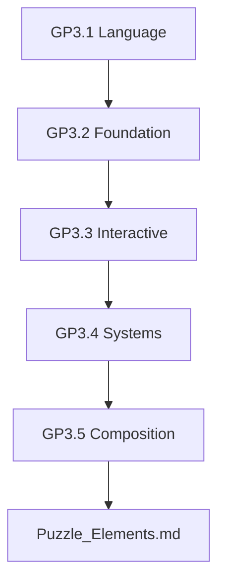
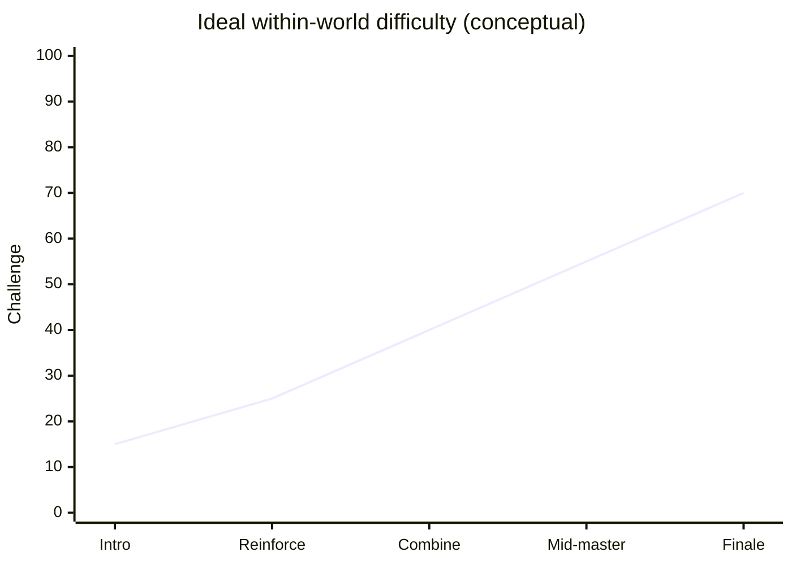
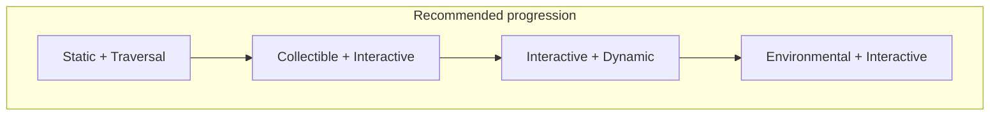
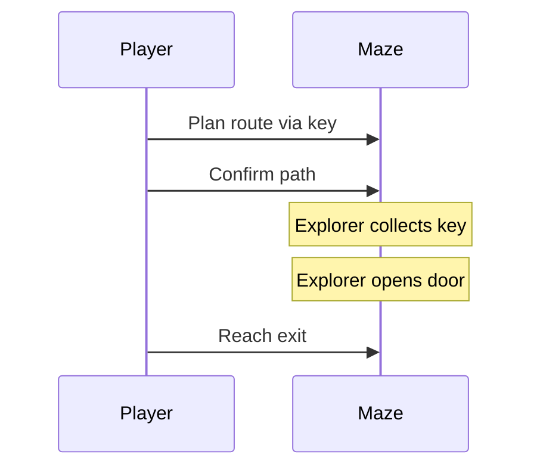
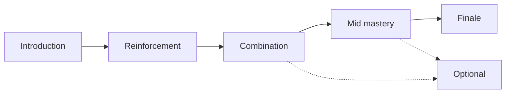
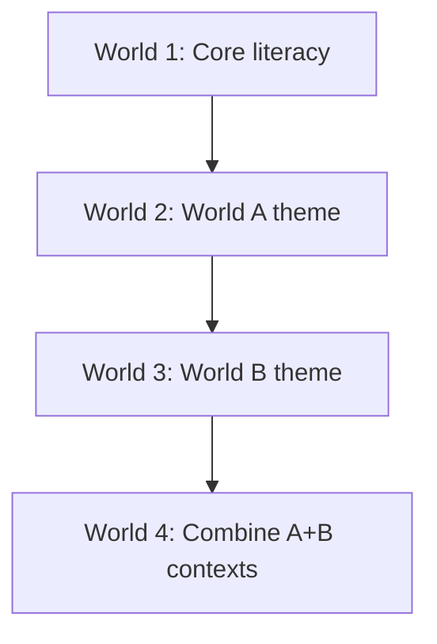
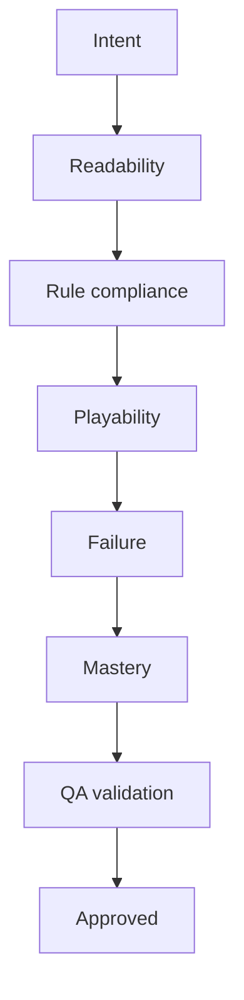

# Puzzle Composition & Level Design Rules

| Field | Value |
|-------|-------|
| **Project** | Labyrinth Legends |
| **Document Name** | Puzzle Composition & Level Design Rules |
| **Document ID** | LLDS-DOC-01-GP3.5-001 |
| **Series** | GP3.5 — Puzzle Design Series |
| **Version** | 1.0.0 |
| **Status** | Approved — v1.0.0 |
| **Owner** | Apoorv |
| **Prepared By** | ChatGPT (specification) · Cursor (compiler) |
| **Last Updated** | 2026-06-29 |
| **Path** | `docs/01_Game_Design/Gameplay/GP3/GP3.5_Puzzle_Composition_Level_Design_Rules.md` |
| **Dependencies** | [Vision](../../../00_Project/Vision.md) · [Game Loop](../../Game_Loop.md) · [Player & Explorer](../Player_Explorer.md) · [Movement System](../Movement_System.md) · [GP3.1 — Puzzle Taxonomy](GP3.1_Puzzle_Taxonomy.md) · [GP3.2](GP3.2_Static_Traversal_Collectible_Elements.md) · [GP3.3](GP3.3_Interactive_Elements.md) · [GP3.4](GP3.4_Environmental_Dynamic_Systems.md) |
| **Related Documents** | [Gameplay Rules](../GP7_Gameplay_Rules.md) · [Puzzle Elements](../Puzzle_Elements.md) · [Level Design](../../Level_Design.md) · [Progression](../../Progression.md) |

## Navigation

| ← Previous | Next → | Index |
|------------|--------|-------|
| [GP3.4 — Environmental & Dynamic](GP3.4_Environmental_Dynamic_Systems.md) | [Puzzle Elements](../Puzzle_Elements.md) | [GP3 Series](README.md) · [Gameplay Specs](../README.md) |

---

## Version History

| Version | Date | Author | Summary |
|---------|------|--------|---------|
| 1.0.0 | 2026-06-29 | Apoorv / ChatGPT | Approved as Phase 2 Puzzle Composition & Level Design Rules baseline |
| 1.0.0 | 2026-06-29 | ChatGPT / Cursor | GP3.5 — Puzzle composition & level design rules |

## Change Log

| Version | Change |
|---------|--------|
| 1.0.0 | Approved as the authoritative Puzzle Composition & Level Design Rules baseline for Labyrinth Legends gameplay documentation |
| 1.0.0 | Initial specification: teaching, progression, combination, archetypes, review process |

---

## Purpose

This document is the **level-design operating manual** for Labyrinth Legends puzzles.

It defines how puzzle elements are **introduced**, **taught**, **combined**, **escalated**, **tested**, and **reviewed** across levels, worlds, and mastery content.

This is **not** a mechanics catalogue. Element behaviour lives in GP3.2–GP3.4. GP3.5 governs **how those elements become fair, readable, satisfying chambers**.

### Why Composition Rules Exist

| Problem without rules | GP3.5 answer |
|----------------------|--------------|
| Mechanics thrown together randomly | Teach → combine → master pipeline |
| Difficulty via confusion | Difficulty via decisions |
| Players punished for curiosity | Optional content stays optional |
| Soft-locks and dead ends | Prevention and recovery rules |
| Inconsistent world pacing | World and cross-world progression models |

> **Scope boundary:** Individual mechanics, hazards detail, enemies, monetization, UI implementation, technical architecture, narrative scripting, and economy belong in other documents.

### Design Intent

Good puzzles come from **teaching, layering, combining, and testing** — not from adding random complexity.

---

## Intended Audience

| Role | Use this document to… |
|------|------------------------|
| Level Designers | Author chambers that teach and test fairly |
| Puzzle Designers | Plan introduction beats and combinations |
| Creative Director | Validate pacing against Vision and Game Loop |
| QA Engineers | Run composition and soft-lock review passes |
| AI Coding Agents | Generate level content within GP3 constraints |

## Table of Contents

1. [Purpose](#purpose)
2. [Relationship to GP3.1–GP3.4](#1-relationship-to-gp31gp34)
3. [Puzzle Composition Philosophy](#2-puzzle-composition-philosophy)
4. [Teaching Methodology](#3-teaching-methodology)
5. [Mechanic Introduction Pattern](#4-mechanic-introduction-pattern)
6. [Puzzle Difficulty Progression](#5-puzzle-difficulty-progression)
7. [Cognitive Load Management](#6-cognitive-load-management)
8. [Element Combination Rules](#7-element-combination-rules)
9. [Puzzle Archetypes](#8-puzzle-archetypes)
10. [World-Level Puzzle Progression](#9-world-level-puzzle-progression)
11. [Cross-World Progression](#10-cross-world-progression)
12. [Optional Challenge Design](#11-optional-challenge-design)
13. [Failure and Recovery in Puzzle Design](#12-failure-and-recovery-in-puzzle-design)
14. [Soft-Lock Prevention](#13-soft-lock-prevention)
15. [Readability and Visual Clarity](#14-readability-and-visual-clarity)
16. [Level Review Process](#15-level-review-process)
17. [Puzzle Quality Metrics](#16-puzzle-quality-metrics)
18. [Anti-Patterns](#17-anti-patterns)
19. [Designer Checklist](#18-designer-checklist)
20. [Locked Decisions](#19-locked-decisions)

---

## 1. Relationship to GP3.1–GP3.4

| Document | Role in puzzle design |
|----------|----------------------|
| **[GP3.1 — Puzzle Taxonomy](GP3.1_Puzzle_Taxonomy.md)** | **Language** — categories, philosophy, tiers, lifecycle |
| **[GP3.2 — Static, Traversal & Collectible](GP3.2_Static_Traversal_Collectible_Elements.md)** | **Foundation elements** — graph, movement modifiers, pickups |
| **[GP3.3 — Interactive](GP3.3_Interactive_Elements.md)** | **Cause-and-effect** — doors, switches, locks, links |
| **[GP3.4 — Environmental & Dynamic](GP3.4_Environmental_Dynamic_Systems.md)** | **Systems layer** — regional rules, cycles, forces |
| **GP3.5 (this document)** | **Composition** — how elements become puzzles |

### Extension Rule

GP3.5 may define **composition and level-design rules**. It may **not**:

- Redefine player agency, movement, or execution ([GP1](../Player_Explorer.md), [GP2](../Movement_System.md))
- Redefine taxonomy categories or element behaviour ([GP3.1–GP3.4](GP3.1_Puzzle_Taxonomy.md))
- Assign rule precedence ([Gameplay Rules](../GP7_Gameplay_Rules.md))

### Design Intent

GP3.1–GP3.4 answer *what elements are*. GP3.5 answers *how to use them well*.

---

## 2. Puzzle Composition Philosophy

Core philosophy for every chamber:

| Principle | Meaning |
|-----------|---------|
| **Teach before testing** | Player knows the rule before it gates progress |
| **Combine before escalating** | Pair known mechanics before adding new ones |
| **Clarity before difficulty** | Readable beats hard |
| **Mastery before novelty** | Solidify skill before new icon |
| **Decisions before decoration** | Every element earns a planning role |
| **Depth through interaction, not clutter** | Combine categories — do not fill space ([GP3.1-L07](GP3.1_Puzzle_Taxonomy.md#11-locked-decisions)) |

> Aligned with [Vision](../../../00_Project/Vision.md): Quality Over Quantity, Respect Player Time, Clever Not Powerful.

### Design Intent

Composition is **curriculum design** — each chamber teaches or tests something deliberate.

---

## 3. Teaching Methodology

New mechanics are introduced through **playable beats**, not text walls alone.

### Teaching Stages

| Stage | Designer goal | Player experience |
|-------|---------------|-------------------|
| **Safe introduction** | No fail state from mechanic alone | Explore without punishment |
| **Obvious first use** | Single mechanic, clear affordance | "I see what this does" |
| **Repeated use** | Same rule, new layout | Confidence |
| **Slight variation** | One new constraint | "Same rule, harder read" |
| **Combined use** | Known mechanic + known partner | Reasoning chain |
| **Mastery challenge** | Full combination, optional pressure | Satisfaction |

### Why Interaction Over Tutorials Alone

| Reason | Application |
|--------|-------------|
| **Draw Your Fate** | Player learns by reading the labyrinth |
| **Retention** | Physical layout anchors memory |
| **Fairness** | Tutorial chamber can be forgiving; test chamber cannot surprise |
| **MVP discipline** | Short optional callouts OK; mechanics teach in play |

Tutorials may **frame** attention; chambers **prove** understanding.

### Design Intent

If the player must read a paragraph to survive the chamber, the chamber is not teaching — it is lecturing.

---

## 4. Mechanic Introduction Pattern

Reusable **Show → Teach → Confirm → Vary → Combine → Master** pipeline.

| Step | Purpose | Example (switch) |
|------|---------|------------------|
| **Show** | Player sees element before it matters | Switch visible behind open area |
| **Teach** | Isolated safe activation | One switch, one door, obvious link |
| **Confirm** | Player must use correctly to exit | Switch required on critical path |
| **Vary** | Layout or order changes | Switch across chasm |
| **Combine** | Switch + key, plate, or cycle | Two-step unlock |
| **Master** | Optional or boss chamber | Multi-switch chain, minimal cues |

### Application by Introduction Tier ([GP3.1 §7](GP3.1_Puzzle_Taxonomy.md#7-puzzle-element-hierarchy))

| Tier | Pattern depth | Novelty budget |
|------|---------------|----------------|
| **Core** | Full Show→Master for foundations | High repetition allowed |
| **World** | Show→Confirm faster; Combine→Master emphasis | Themed reskin + one twist |
| **Legendary** | Compressed Show/Teach; Master emphasis | Rare; strong readability |

> Resolves direction for [GP3.1-Q03](GP3.1_Puzzle_Taxonomy.md#11-locked-decisions): **max one Legendary introduction per world** unless Human approves exception.

### Design Intent

The pattern is the **default pipeline** — skip steps only when player literacy is already proven in-session.

---

## 5. Puzzle Difficulty Progression

### Approved Difficulty Levers

| Lever | Description | Example |
|-------|-------------|---------|
| **Route length** | More nodes between decisions | Longer detour to key |
| **Decision count** | More ordering choices | Switch A before B before door |
| **Mechanic combinations** | More categories active | Key + plate + bridge |
| **Sequencing** | Order-sensitive path | Sequence lock |
| **Optional objectives** | More to optimize | Relic detour |
| **State awareness** | Track more world state | Cycle phase at arrival |
| **Planning depth** | More lookahead | Ice slide + teleporter exit |

### Forbidden Difficulty Levers

| Lever | Why forbidden |
|-------|---------------|
| **Hidden rules** | Violates GP1, GP3.1 |
| **Visual ambiguity** | Passable vs blocked unclear |
| **Random behaviour** | Non-deterministic |
| **Reflex pressure** | Wrong skill ([GP3.3](GP3.3_Interactive_Elements.md), [GP3.4](GP3.4_Environmental_Dynamic_Systems.md)) |
| **Excessive clutter** | Noise masquerading as depth |

### Difficulty Curve Shape

> Finale may spike; optional mastery may exceed finale — never on mandatory path without teaching.

### Design Intent

Difficulty is **more decisions**, not **less information**.

---

## 6. Cognitive Load Management

Define how much the Player must track during planning.

### Load Factors

| Factor | Guidance |
|--------|----------|
| **Visible state count** | Core: ≤3 critical states; World: ≤5; Legendary: ≤7 with teaching |
| **Active mechanics** | Introduce one new mechanic per major beat |
| **Route complexity** | Branch count matches tier; avoid spaghetti without purpose |
| **Memory burden** | Fog/memory puzzles only after reveal rules taught |
| **Symbolic overload** | Limit unique symbols per chamber |
| **Optional vs mandatory** | Mandatory load strict; optional may add load |

### Load Budget Table

| Chamber type | New mechanic | Max combination categories | Max remote links |
|--------------|--------------|------------------------------|------------------|
| **Tutorial** | 1 | 2 | 1 |
| **Standard** | 0–1 | 3 | 2 |
| **Mid-world** | 0 | 4 | 3 |
| **Finale** | 0–1 (World) | 4–5 | 3–4 |
| **Optional mastery** | 0–1 | 5 | 4 |

### Design Intent

When the Player must track more than they can see, **simplify the chamber** — not the player's patience.

---

## 7. Element Combination Rules

How to combine families from GP3.2–GP3.4. Behaviour detail stays in source docs; GP3.5 governs **composition quality**.

### Combination Matrix

| Combination | Design purpose | Player reasoning | Risks | Quality requirements |
|-------------|----------------|------------------|-------|----------------------|
| **Static + Traversal** | Gap routing | Find crossing | Fake passable void | Chasm honest; bridge state readable |
| **Traversal + Collectible** | Order puzzles | Pick up before traverse | Key after one-way | Direction visible; order validatable |
| **Collectible + Interactive** | Access gates | Key before door | Hidden key | Fair clue path ([GP3.2](GP3.2_Static_Traversal_Collectible_Elements.md)) |
| **Interactive + Environmental** | System puzzles | Switch wind, light crystal | Invisible link | Discoverable binding ([GP3.3](GP3.3_Interactive_Elements.md)) |
| **Dynamic + Objective** | Timing beats | Arrive in open phase | Twitch window | Cycle readable ([GP3.4](GP3.4_Environmental_Dynamic_Systems.md)) |
| **Environmental + Traversal** | Force routing | Wind pushes route | Unclear direction | Direction cues mandatory |
| **Interactive + Dynamic** | Trigger + cycle | Switch then wait phase | Soft-lock | Reset path exists |

### Combination Rules

| Rule | Specification |
|------|---------------|
| **Both mechanics taught** | Neither partner is new in hard combination |
| **One new partner max** | When combining, only one side may be first-time |
| **Link budget** | Respect load table §6 |
| **Primary category clarity** | Each object one primary tag ([GP3.1](GP3.1_Puzzle_Taxonomy.md)) |

### Design Intent

Combinations are **sentences** — subject and verb must both be words the player already knows.

---

## 8. Puzzle Archetypes

Reusable chamber patterns. Archetypes guide authoring; they are not exclusive templates.

### Archetype Catalogue

| Archetype | Core idea | Required elements | Player decision | Risk | Best use |
|-----------|-----------|-------------------|-----------------|------|----------|
| **Route Planning** | Find any valid path | Static, Start, Exit | Path shape | Boring if trivial | Early Core |
| **Key-Order** | Collect then unlock | Key, lock, door | Visit order | Hidden key | Core → World |
| **Switch-State** | Toggle world | Switch, linked target | When to flip | Unclear link | Core teaching |
| **Timing-Window** | Arrive in phase | Dynamic gate, cycle | When to cross | Reflex trap | World+ |
| **Teleporter Mapping** | Entry/exit pairing | Teleporter ([GP3.2](GP3.2_Static_Traversal_Collectible_Elements.md)) | Include correct pair | Hidden exit | Mid Core |
| **Optional Treasure Detour** | Risk/reward branch | Collectible, optional gate | Skip or commit | Punishing skip | Any tier |
| **Environmental Logic** | Regional rule | Environmental system | Rule application | Obscured rule | World identity |
| **Multi-Step Chain** | A→B→C | Interactive links | Full order | Soft-lock | Mid-world |
| **Mastery Route** | Optimize path | Multiple categories | Efficiency / 100% | Clutter | Optional / finale |

### Archetype Flow Example — Key-Order

### Design Intent

Archetypes give designers **shared vocabulary** — "Switch-State mid-world reinforcement" beats inventing a new name per chamber.

---

## 9. World-Level Puzzle Progression

How complexity evolves **within one world** ([WS3 — Progression Loop](../../Game_Loop/WS3_Progression_Loop.md)).

### World Beat Structure

| Phase | Chambers (indicative) | Designer focus |
|-------|----------------------|----------------|
| **Mechanic introduction** | First 1–3 | Show → Teach → Confirm for world hook |
| **Mechanic reinforcement** | Next 4–8 | Vary layouts; no new icons |
| **Mechanic combination** | Mid world | Pair world hook with Core literacy |
| **Mid-world mastery** | Mid-late | Multi-step chains; optional relics |
| **Final-world challenge** | World finale | Synthesis; taught mechanics only |
| **Optional mastery** | Secret / 3-star routes | Higher load; never blocks exit |

### Design Intent

Each world is a **course** — one identity mechanic matured before the next world adds novelty.

---

## 10. Cross-World Progression

How learning carries **across worlds**.

| Principle | Application |
|-----------|-------------|
| **Core Elements stable** | Walls, keys, switches behave identically everywhere |
| **World Elements add identity** | New presentation/combination — not new rules without teaching |
| **Legendary Elements rare** | ≤1 major intro per world default |
| **Old mechanics, new context** | Desert switch + sand flow — not new switch rules |
| **Player feels smarter** | Later worlds reuse literacy; less re-teaching |

### Cross-World Literacy Model

### Design Intent

Progression is **confidence**, not **amnesia** — returning players should not relearn Core every world.

---

## 11. Optional Challenge Design

Rules for optional puzzle content ([WS4 — Completion Loop](../../Game_Loop/WS4_Completion_Loop.md)).

### Optional Content Types

| Type | Reward | Blocking rule |
|------|--------|---------------|
| **Relic routes** | Lore / collection | Never on sole exit path |
| **Perfect paths** | Mastery / stars | Base exit always reachable |
| **Hidden chambers** | Bonus puzzle | Discoverable fairly |
| **Secondary objectives** | Optional completion | Core win unchanged |
| **Mastery routes** | Efficiency challenge | Skip must feel OK |

### Requirements

| Rule | Specification |
|------|---------------|
| **Curiosity rewarded** | Detour worth taking intrinsically |
| **Skip acceptable** | No FOMO punishment on critical rewards |
| **Higher load allowed** | Optional may exceed standard cognitive budget |
| **Visibility** | Optional entrances hinted — not pixel-hunted |

### Design Intent

Optional content is **invitation**, not **tax** — per [GP3.2-L08](GP3.2_Static_Traversal_Collectible_Elements.md#10-locked-decisions) and Vision.

---

## 12. Failure and Recovery in Puzzle Design

Level-design perspective on failure. Hazard outcomes: [Hazards_Failure](../GP4_Hazards_Failure.md).

### Failure Modes

| Failure mode | Level-design response |
|--------------|----------------------|
| **Failed route planning** | Clear invalid path feedback pre-confirm when possible |
| **Incorrect order** | Explorer fails or stalls visibly; Restart available |
| **Missed collectible** | Door does not open; player understands why |
| **Wrong state sequence** | Mechanism shows wrong state; feedback fires |
| **Unreachable objective** | Caught in validation — chamber must not ship |
| **Soft-lock** | Prevented per §13 |

### Recovery Tools

| Tool | When |
|------|------|
| **Restart** | Full puzzle reset — always available ([GP1](../Player_Explorer.md)) |
| **Pause** | Observation without penalty |
| **Clear failure** | Hazard or block — player knows attempt ended |
| **Readable mistake** | Player can attribute failure to specific step |

### Design Intent

Failure teaches **which decision was wrong** — not that the game is unfair.

---

## 13. Soft-Lock Prevention

A puzzle must never leave the Player **stuck without understanding**.

### Player Must Always Have

| Escape | Meaning |
|--------|---------|
| **Clear failure** | Attempt ends or cannot proceed — visibly |
| **Reset option** | Restart restores authored initial state |
| **Recoverable path** | Or obvious return to replan |
| **Readable mistake** | Cause identifiable |

### Element-Specific Rules

| Element | Soft-lock prevention |
|---------|---------------------|
| **Keys** | Cannot insert into irreversible lock without key; key always reachable before door in valid design |
| **Doors** | No one-way into sealed sector without reset |
| **Bridges** | Retract only if return path exists or cycle guarantees return |
| **Teleporters** | Exit always reachable from entry in valid graph |
| **Timed systems** | Window wide enough for planned route; cycle repeats |
| **State toggles** | Toggle puzzles solvable from any reachable state or Restart resets |

### Validation Requirement

Every chamber must pass **reachability analysis**: from Start, can the Player reach Exit with some valid path? If key consumed incorrectly blocks exit, chamber fails review.

### Design Intent

Soft-locks are **shipping blockers** — not polish items.

---

## 14. Readability and Visual Clarity

Puzzle readability requirements across all families.

| Dimension | Requirement |
|-----------|-------------|
| **Readable paths** | Floor/wall/void honest ([GP3.2](GP3.2_Static_Traversal_Collectible_Elements.md)) |
| **Readable states** | Open/closed, on/off, powered/unpowered distinct |
| **Readable links** | Switch-door relationship learnable ([GP3.3](GP3.3_Interactive_Elements.md)) |
| **Readable objectives** | Exit and mandatory goals identifiable |
| **Readable optional content** | Detours signaled when intended |
| **Readable consequences** | Feedback on activation ([GP3.3 §11](GP3.3_Interactive_Elements.md#11-interaction-feedback), [GP3.4 §12](GP3.4_Environmental_Dynamic_Systems.md#12-environmental-state-communication)) |

> LLDL implements visual language — GP3.5 locks **design requirements** LLDL must satisfy.

### Design Intent

If a Player screenshots the planning phase, a reviewer should **parse the puzzle** from the image.

---

## 15. Level Review Process

Every chamber passes **seven review stages** before approval.

| Stage | Reviewer focus | Pass criteria |
|-------|----------------|---------------|
| **1. Intent** | What is taught/tested? | Documented beat in level brief |
| **2. Readability** | Visual parse | §14 satisfied |
| **3. Rule compliance** | GP1–GP3.4 | No authority violations |
| **4. Playability** | Solve path exists | Designer solve + alternate routes checked |
| **5. Failure** | Failure modes | §12; failures understandable |
| **6. Mastery** | Optional fair | §11 if optional present |
| **7. QA validation** | States, soft-lock | Checklist §18; automated validation if available |

### Design Intent

Review is **gate**, not **suggestion** — failed stage returns to design.

---

## 16. Puzzle Quality Metrics

What makes a puzzle **good** — not merely **long** or **hard**.

| Metric | Good signal | Bad signal |
|--------|-------------|------------|
| **Meaningful decisions** | Player weighs routes | One obvious line |
| **Fair information** | Required info visible/learnable | Hidden mandatory rule |
| **Satisfying solution** | "I planned that" moment | Accidental win |
| **Learnable rule** | Reusable insight | One-off trick |
| **Readable feedback** | State confirms plan | Silent failure |
| **No hidden logic** | Deterministic model | Surprise behaviour |
| **Replay value** | Optional mastery, alternate paths | Single rote path |
| **Mastery depth** | Optimization optional | Forced perfection |

### Not Quality Metrics

| Misleading metric | Why rejected |
|-------------------|--------------|
| Chamber size alone | Large ≠ good |
| Count of objects | Clutter ≠ depth |
| Raw solve time | Time ≠ difficulty quality |
| Number of mechanics | Uncombinable pile |

### Design Intent

A **short chamber with one crisp decision** beats a **large chamber with ten confused ones**.

---

## 17. Anti-Patterns

| Anti-pattern | Why forbidden |
|--------------|---------------|
| **Difficulty through confusion** | Violates clarity-first |
| **One-off mechanics** | Unteachable; unmaintainable |
| **Hidden mandatory interactions** | GP1, GP3.1 |
| **Random puzzle outcomes** | Determinism break |
| **Visual clutter** | Hides decisions |
| **Fake complexity** | Many objects, one trivial decision |
| **Mandatory pixel hunting** | Unreadable affordance |
| **Reflex timing disguised as puzzle** | Wrong skill |
| **Excessive state tracking** | Cognitive overload |
| **Puzzle-specific exceptions** | Taxonomy break |
| **Soft-lock traps** | Player trust |

### Design Intent

Anti-patterns are **automatic reject** at Intent and Rule compliance stages.

---

## 18. Designer Checklist

Practical pre-ship checklist for level designers:

| # | Question | Pass |
|---|----------|------|
| 1 | What mechanic is being **taught or tested**? | |
| 2 | What **decision** does the Player make? | |
| 3 | Is all required information **visible or fairly learnable**? | |
| 4 | Is the puzzle **deterministic**? | |
| 5 | Can the Player **understand failure**? | |
| 6 | Can the puzzle **soft-lock**? (must be No) | |
| 7 | Does optional content feel **optional**? | |
| 8 | Does this respect **[Vision](../../../00_Project/Vision.md)** and **[Game Loop](../../Game_Loop.md)**? | |
| 9 | Does it follow **[GP3.1](GP3.1_Puzzle_Taxonomy.md)–[GP3.4](GP3.4_Environmental_Dynamic_Systems.md)**? | |
| 10 | Does it match the **introduction pattern** step for this tier? | |
| 11 | Is **cognitive load** within budget (§6)? | |
| 12 | Has **seven-stage review** (§15) been completed? | |

### Design Intent

Designers sign off this checklist; QA verifies — shared contract for ship quality.

---

## 19. Locked Decisions

### Locked Decisions

| ID | Decision | Source |
|----|----------|--------|
| GP3.5-L01 | GP3.5 is composition/level-design authority; not mechanics catalogue | GP3.5 workshop |
| GP3.5-L02 | Teach → combine → master philosophy binding | GP3.5 · GP3.1 · Vision |
| GP3.5-L03 | Introduction pattern: Show → Teach → Confirm → Vary → Combine → Master | GP3.5 workshop |
| GP3.5-L04 | Difficulty via decisions/combinations — not hidden rules or reflex | GP3.5 · GP1–GP3.4 |
| GP3.5-L05 | Cognitive load budgets per chamber type (§6) | GP3.5 workshop |
| GP3.5-L06 | Optional content never blocks core completion | GP3.5 · WS4 · GP3.2-L08 |
| GP3.5-L07 | Soft-lock prevention is shipping blocker | GP3.5 workshop |
| GP3.5-L08 | Seven-stage level review process mandatory | GP3.5 workshop |
| GP3.5-L09 | Core stable cross-world; World adds identity; Legendary rare | GP3.5 · GP3.1 §7 |
| GP3.5-L10 | Max one Legendary introduction per world (default) | GP3.5 · GP3.1-Q03 |
| GP3.5-L11 | Puzzle archetypes as shared authoring vocabulary | GP3.5 workshop |
| GP3.5-L12 | Quality metrics exclude size/time as primary goals | GP3.5 · Vision |

### Future Decisions (Deferred)

| Topic | Target document |
|-------|-----------------|
| Per-world chamber counts and curves | [Progression](../../Progression.md) · [Level Design](../../Level_Design.md) |
| Star / mastery scoring thresholds | [Objectives_Completion](../GP5_Objectives_Completion.md) |
| Automated validation tooling | [Gameplay Rules](../GP7_Gameplay_Rules.md) · technical specs |
| LLDL puzzle readability tokens | LLDL · Components |
| World-specific archetype catalogues | [Puzzle_Elements.md](../Puzzle_Elements.md) |

### Open Questions

| ID | Question | Owner | Status |
|----|----------|-------|--------|
| GP3.5-Q01 | Cognitive load numbers: playtest-tune or fixed caps? | ChatGPT / Apoorv | Open |
| GP3.5-Q02 | Tutorial callout density per introduction chamber? | ChatGPT / Apoorv | Open — LLDL |
| GP3.5-Q03 | Finale difficulty spike: fixed % above mid-world? | ChatGPT / Apoorv | Open — Progression |
| GP3.5-Q04 | Replay mastery: same chamber new objective vs new chamber? | ChatGPT / Apoorv | Open — Objectives & Completion / Retention |

### Design Intent

GP3.5 completes the **GP3 puzzle design series** — downstream [`Puzzle_Elements.md`](../Puzzle_Elements.md) integrates the catalogue; this doc governs **how to deploy it**.

---

## Cross References

- Upstream: [GP3.1](GP3.1_Puzzle_Taxonomy.md) · [GP3.2](GP3.2_Static_Traversal_Collectible_Elements.md) · [GP3.3](GP3.3_Interactive_Elements.md) · [GP3.4](GP3.4_Environmental_Dynamic_Systems.md)
- Core: [GP1](../Player_Explorer.md) · [GP2](../Movement_System.md) · [Gameplay Rules](../GP7_Gameplay_Rules.md)
- Loops: [Game Loop](../../Game_Loop.md) · [WS3](../../Game_Loop/WS3_Progression_Loop.md) · [WS4](../../Game_Loop/WS4_Completion_Loop.md)
- Downstream: [Puzzle_Elements.md](../Puzzle_Elements.md) · [Level Design](../../Level_Design.md) · [Gameplay.md](../../Gameplay.md)
- Governance: [Vision](../../../00_Project/Vision.md) · [Decisions](../../../00_Project/Decisions.md)

---

## Navigation

| ← Previous | Next → | Index |
|------------|--------|-------|
| [GP3.4 — Environmental & Dynamic](GP3.4_Environmental_Dynamic_Systems.md) | [Puzzle Elements](../Puzzle_Elements.md) | [GP3 Series](README.md) · [Gameplay Specs](../README.md) |
