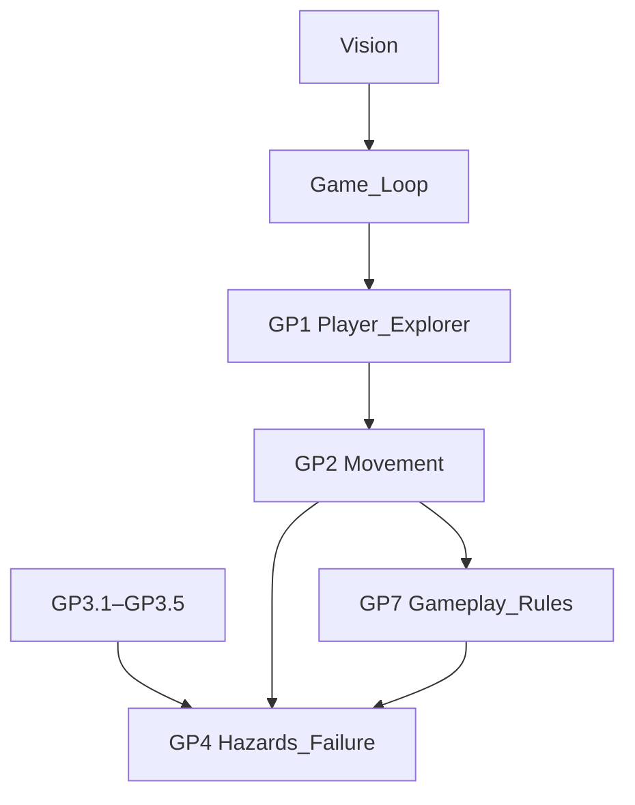
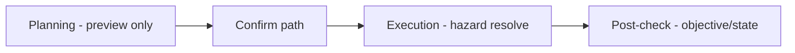
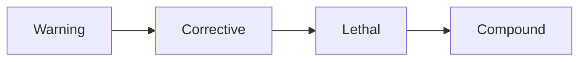
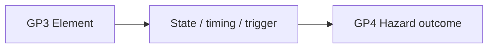

# Hazards & Failure

| Field                 | Value                                                                                                                                                                                                                                                                                                                   |
| --------------------- | ----------------------------------------------------------------------------------------------------------------------------------------------------------------------------------------------------------------------------------------------------------------------------------------------------------------------- |
| **Project**           | Labyrinth Legends                                                                                                                                                                                                                                                                                                       |
| **Document Name**     | Hazards & Failure                                                                                                                                                                                                                                                                                                       |
| **Document ID**       | LLDS-DOC-01-GP4-001                                                                                                                                                                                                                                                                                                     |
| **Series**            | GP4 — Gameplay Feature Specification                                                                                                                                                                                                                                                                                    |
| **Version**           | 1.0.1                                                                                                                                                                                                                                                                                                                   |
| **Status**            | Approved / Locked                                                                                                                                                                                                                                                                                                       |
| **Owner**             | Apoorv                                                                                                                                                                                                                                                                                                                  |
| **Prepared By**       | ChatGPT (specification) · Cursor (compiler)                                                                                                                                                                                                                                                                             |
| **Last Updated**      | 2026-06-29                                                                                                                                                                                                                                                                                                              |
| **Path**              | `docs/01_Game_Design/Gameplay/GP4_Hazards_Failure.md`                                                                                                                                                                                                                                                                   |
| **Dependencies**      | [Vision](../../00_Project/Vision.md) · [Game Loop](../Game_Loop.md) · [GP1 Player & Explorer](GP1_Player_Explorer.md) · [GP2 Movement System](GP2_Movement_System.md) · [GP7 Gameplay Rules](GP7_Gameplay_Rules.md) · [GP3.1](GP3/GP3.1_Puzzle_Taxonomy.md)–[GP3.5](GP3/GP3.5_Puzzle_Composition_Level_Design_Rules.md) |
| **Related Documents** | [GP5 Objectives & Completion](GP5_Objectives_Completion.md) · [GP6 Gameplay Feedback](GP6_Gameplay_Feedback.md) · [Puzzle Elements](Puzzle_Elements.md) · [GP3.5 Composition](GP3/GP3.5_Puzzle_Composition_Level_Design_Rules.md)                                                                                       |

## Navigation

| ← Previous                                                                | Next →                                                  | Index                                                      |
| ------------------------------------------------------------------------- | ------------------------------------------------------- | ---------------------------------------------------------- |
| [GP3.5 — Composition](GP3/GP3.5_Puzzle_Composition_Level_Design_Rules.md) | [Objectives & Completion](GP5_Objectives_Completion.md) | [Gameplay Specs](README.md) · [LLDS Home](../../README.md) |

---

## Version History

| Version | Date       | Author           | Summary                                  |
| ------- | ---------- | ---------------- | ---------------------------------------- |
| 1.0.1   | 2026-06-29 | Apoorv           | Approved and locked after Gameplay Phase 2 review |
| 1.0.0   | 2026-06-29 | ChatGPT / Cursor | GP4 — Hazards & failure operating manual |

## Change Log

| Version | Change                                                                                 |
| ------- | -------------------------------------------------------------------------------------- |
| 1.0.1   | Approved and locked after Gameplay Phase 2 review                                      |
| 1.0.0   | Initial specification: failure philosophy, hazard taxonomy, MVP scope, fairness, retry |

---

## Purpose

This document defines how **hazards**, **failure states**, **danger readability**, **player mistakes**, **recovery**, **retry logic**, and **fairness rules** work across Labyrinth Legends.

GP4 is the **hazard and failure operating manual** — not an enemy catalogue. Hazards are **puzzle consequences** applied to committed routes, not action-combat obstacles.

### What GP4 Defines

| Domain                 | Coverage                                 |
| ---------------------- | ---------------------------------------- |
| Hazard families        | Taxonomy and MVP forms                   |
| Failure categories     | What failure means and when it applies   |
| Failure timing         | Planning vs execution vs post-check      |
| Hazard severity        | Warning → Corrective → Lethal → Compound |
| Fairness & readability | Mandatory danger communication           |
| Retry & recovery       | Player expectations after failure        |
| MVP hazard scope       | One simple form per major family         |

### What GP4 Does Not Define

| Excluded                         | Authority                                                   |
| -------------------------------- | ----------------------------------------------------------- |
| Enemy combat / boss fights       | Out of scope                                                |
| UI implementation                | [GP6 Gameplay Feedback](GP6_Gameplay_Feedback.md) · LLDL    |
| Monetization                     | Product docs                                                |
| Objective completion rules       | [Objectives_Completion](GP5_Objectives_Completion.md) (GP5) |
| Rule precedence detail           | [Gameplay_Rules](GP7_Gameplay_Rules.md) (GP7)               |
| Individual GP3 element behaviour | GP3.1–GP3.5                                                 |

### Design Intent

Hazards exist so **committed decisions have consequences** — fair, readable, and teachable.

---

## Intended Audience

| Role             | Use this document to…                                                                    |
| ---------------- | ---------------------------------------------------------------------------------------- |
| Level Designers  | Place hazards fairly within puzzle composition                                           |
| Puzzle Designers | Choose severity and MVP tier per chamber                                                 |
| Engineers        | Implement deterministic failure resolution                                               |
| QA Engineers     | Test all hazard states and soft-lock paths                                               |
| AI Coding Agents | Generate or modify hazard-related documentation/content while respecting authority rules |

## Table of Contents

1. [Purpose](#purpose)
2. [Relationship to Core Gameplay](#1-relationship-to-core-gameplay-documents)
3. [Failure Philosophy](#2-failure-philosophy)
4. [Definition of Failure](#3-definition-of-failure)
5. [Failure Timing](#4-failure-timing)
6. [Hazard Severity Model](#5-hazard-severity-model)
7. [MVP Hazard Scope Rule](#6-mvp-hazard-scope-rule)
8. [Hazard Taxonomy](#7-hazard-taxonomy)
9. [Hazard Interaction with Movement](#8-hazard-interaction-with-movement)
10. [Hazard Interaction with Puzzle Elements](#9-hazard-interaction-with-puzzle-elements)
11. [Rule Precedence & Resolution](#10-rule-precedence--resolution-expectations)
12. [Fairness & Readability](#11-fairness--readability-rules)
13. [Warning & Telegraphing](#12-warning--telegraphing)
14. [Retry & Recovery](#13-retry--recovery-model)
15. [Tutorial & Progression](#14-tutorial--progression-rules)
16. [Soft-Lock Prevention](#15-soft-lock-prevention)
17. [Failure Feedback Requirements](#16-failure-feedback-requirements)
18. [Hazard Quality Metrics](#17-hazard-quality-metrics)
19. [Anti-Patterns](#18-anti-patterns)
20. [Designer Checklist](#19-designer-checklist)
21. [MVP Summary Table](#20-mvp-summary-table)
22. [Locked Decisions](#21-locked-decisions)

---

## 1. Relationship to Core Gameplay Documents

| Document                                        | GP4 relationship                                                  |
| ----------------------------------------------- | ----------------------------------------------------------------- |
| [Vision](../../00_Project/Vision.md)            | Premium puzzle-adventure; hazards serve planning mastery          |
| [Game Loop](../Game_Loop.md)                    | Failure feeds retry → replan loop                                 |
| [GP1 Player & Explorer](GP1_Player_Explorer.md) | Player plans; Explorer executes; failure is route consequence     |
| [GP2 Movement System](GP2_Movement_System.md)   | Valid path rules; GP4 defines danger on valid committed paths     |
| [GP7 Gameplay Rules](GP7_Gameplay_Rules.md)     | Execution order and precedence — GP4 does not override            |
| [GP3.1–GP3.5](GP3/GP3.1_Puzzle_Taxonomy.md)     | Puzzle elements and composition — GP4 adds hazardous consequences |
| **GP4 (this document)**                         | Hazardous consequences and failure interpretation                 |

### Design Intent

GP4 sits **above puzzle elements, below integration** — it interprets danger without redefining movement or taxonomy.

---

## 2. Failure Philosophy

> **Hazards in Labyrinth Legends are puzzle consequences, not action obstacles.**

Failure is a **fair consequence** of a committed Player decision — not punishment for its own sake.

| Principle                    | Meaning                                                        |
| ---------------------------- | -------------------------------------------------------------- |
| **Fair consequence**         | Outcome follows from visible or taught rules                   |
| **Readable danger**          | Player can model risk before Confirm                           |
| **Committed decision**       | Failure ties to confirmed path ([GP1](GP1_Player_Explorer.md)) |
| **Deterministic resolution** | Same path + state → same failure                               |
| **Fast learning loop**       | Quick retry; clear cause                                       |
| **Emotional fairness**       | "I understand why" — not "that was random"                     |
| **Player responsibility**    | Mistake is route, order, timing, or state — not reflex         |

### Failure Should Feel Like

- "I understand why that happened."
- "The game warned me or taught me enough."
- "I can plan better next time."
- "The result came from my route, timing, order, or puzzle-state decision."

### Failure Should Not Feel Like

- Random punishment · Unreadable instant death · Reflex-heavy action failure
- Hidden unfair logic · Silent soft-locking · Unavoidable loss after correct reasoning

### Design Intent

Failure **teaches** — it clarifies rules and reinforces mastery.

---

## 3. Definition of Failure

**Failure** occurs when the Player's committed path, route decision, timing decision, or puzzle-state decision causes the Explorer to enter an **unsafe, unrecoverable, invalid, or objectively impossible** state.

### Failure Categories

| Category                            | Meaning                                                    | When it applies                                | Communication                                       | Fair vs unfair                            |
| ----------------------------------- | ---------------------------------------------------------- | ---------------------------------------------- | --------------------------------------------------- | ----------------------------------------- |
| **Lethal failure**                  | Explorer cannot continue (death, destruction)              | Active lethal hazard on traversed node         | Clear lethal feedback                               | Fair: hazard was readable/taught          |
| **Capture failure**                 | Explorer is caught, restrained, or intercepted             | Guardian catch, sentinel detection             | Capture state shown                                 | Fair: guardian rule was visible or taught |
| **Trapped-state failure**           | Explorer is alive but no valid route to completion remains | Sealed room, irreversible block, trapped route | Trapped state or objective impossibility shown      | Fair: detectable; unfair: silent          |
| **Objective failure**               | Win condition impossible                                   | Key lost, exit sealed                          | Objective fail message                              | Fair: communicated impossibility          |
| **Path validation rejection**       | Planned path violates movement validity before commitment  | Invalid path — pre-confirm                     | Validation feedback ([GP2](GP2_Movement_System.md)) | Not gameplay failure; owned by GP2/GP7    |
| **Timing failure**                  | Wrong cycle phase at arrival                               | Timed gate closed                              | Timing fail + phase cue                             | Unfair: unreadable window                 |
| **Resource failure**                | Constraint exhausted                                       | Steps/torch depleted                           | Resource depleted state                             | Fair: visible meter                       |
| **Environmental failure**           | Regional rule causes loss                                  | Darkness + lethal zone                         | Environmental feedback                              | Fair: taught regional rule                |
| **Puzzle-state failure**            | State makes completion impossible                          | Bridge collapsed, door locked behind           | State fail detection                                | Fair: player caused state knowingly       |
| **Information/readability failure** | Hidden system caused loss                                  | Hidden trap without clue                       | Post-fail explanation                               | Unfair unless taught/clued                |

Invalid paths are not GP4 gameplay failure. They are planning/validation issues handled by [GP2 Movement System](GP2_Movement_System.md) and [GP7 Gameplay Rules](GP7_Gameplay_Rules.md). GP4 only defines consequences when a valid committed path interacts with hazards, dangerous states, or objective-impossible outcomes.

### Design Intent

Name the **failure category** in design briefs — implementation and QA use the same vocabulary.

---

## 4. Failure Timing

### When Failure Can Occur

| Phase                             | Failure behaviour                                                                                |
| --------------------------------- | ------------------------------------------------------------------------------------------------ |
| **Planning**                      | Preview danger; **usually no failure**                                                           |
| **Path confirmation**             | Structural invalidity blocked ([GP2](GP2_Movement_System.md)); unsafe paths **may** be confirmed |
| **Path execution**                | Primary hazard resolution during Explorer steps                                                  |
| **Hazard trigger resolution**     | Per-step hazard checks ([GP7](GP7_Gameplay_Rules.md))                                            |
| **Post-execution state check**    | Objective impossibility, soft-lock detection                                                     |
| **Objective impossibility check** | Required key unreachable, exit sealed                                                            |

### Rules

| Rule                         | Specification                              |
| ---------------------------- | ------------------------------------------ |
| Planning previews danger     | Warnings allowed; failure rare             |
| Player may draw unsafe paths | Commitment is Player choice                |
| Failure after Confirm        | During execution or post-check             |
| Invalid path validation      | GP2 + GP7 — not GP4                        |
| GP4 scope                    | Valid committed path + danger interaction  |
| Determinism                  | Every failure explainable and reproducible |

### Design Intent

The Player **chooses** risk at Confirm; the game **resolves** it honestly during execution.

---

## 5. Hazard Severity Model

Four severity levels for introduction and escalation:

| Level             | Purpose                            | Player experience                         | Typical use          |
| ----------------- | ---------------------------------- | ----------------------------------------- | -------------------- |
| **1. Warning**    | Teach risk without direct failure  | Near-miss, visual scare, reversible block | First exposure       |
| **2. Corrective** | Block, reset segment, force replan | Bounce, push back, non-lethal trap        | Before lethal        |
| **3. Lethal**     | Causes failure when triggered      | Death, capture fail, objective loss       | After teaching       |
| **4. Compound**   | Multiple rules combined            | Timing + switch + guardian                | Late world / mastery |

### Escalation Across Progression

Per [GP3.5 Puzzle Composition & Level Design Rules](GP3/GP3.5_Puzzle_Composition_Level_Design_Rules.md), hazards should follow the same teaching philosophy as puzzle elements: introduce one family clearly, reinforce it, combine it, and only then use compound forms.

### Design Intent

Severity is a **teaching ramp** — not a difficulty knob turned by hiding information.

---

## 6. MVP Hazard Scope Rule

### Human Owner Scope Decision

**All major hazard families are MVP** — but MVP means **one simple, readable, testable form per family**, not every variant.

### Classification Model

| Class                      | Meaning                              | MVP requirement          |
| -------------------------- | ------------------------------------ | ------------------------ |
| **MVP Basic**              | One simple form per family           | **Required** for ship    |
| **MVP Advanced**           | Extra variant if stable and readable | Allowed, not required    |
| **Post-MVP Expansion**     | Biome skins, bosses, complex combos  | Documented ambition      |
| **Idea**                   | Concept only                         | Backlog                  |
| **Rejected / Not Allowed** | Violates GP4 philosophy              | Never ship (e.g. combat) |

> "All hazards are MVP" = **all families represented**, not all variants implemented.

### Design Intent

MVP hazard scope is **breadth of families, depth of one form each**.

---

## 7. Hazard Taxonomy

Major hazard families. GP3 defines elements; GP4 defines **hazardous consequences**.

---

### 7.1 Static Lethal Hazards

| Aspect            | Specification                                     |
| ----------------- | ------------------------------------------------- |
| **Description**   | Always-dangerous tiles when active                |
| **Player-facing** | Enter active tile → failure                       |
| **Failure mode**  | Lethal failure                                    |
| **MVP Basic**     | Visible spike/pit/fire tile — enter = fail        |
| **MVP Advanced**  | Two tile types (fire + poison) with distinct read |
| **Post-MVP**      | Cursed variants, biome skins                      |
| **Fairness**      | Active state visually distinct from safe floor    |
| **Example**       | Spike corridor — taught in warning chamber first  |

**Rule:** Explorer enters active lethal tile → failure.

### Design Intent

Simplest hazard — teaches **route avoidance** on readable graph.

---

### 7.2 Conditional Hazards

| Aspect            | Specification                      |
| ----------------- | ---------------------------------- |
| **Description**   | Hazard toggles safe ↔ dangerous    |
| **Player-facing** | State determines outcome on entry  |
| **Failure mode**  | Lethal when dangerous state active |
| **MVP Basic**     | Spikes disabled by switch          |
| **MVP Advanced**  | Fire extinguished by water flow    |
| **Post-MVP**      | Relic-cursed zones                 |
| **Fairness**      | State readable before Confirm      |
| **Example**       | Switch-off spikes on critical path |

**Rule:** Current state must be readable before path commitment.

### Design Intent

Teaches **state-aware routing** — links to GP3 Interactive.

---

### 7.3 Dynamic Environmental Hazards

| Aspect            | Specification                         |
| ----------------- | ------------------------------------- |
| **Description**   | Cyclic or timed environmental threats |
| **Player-facing** | Active/inactive phases                |
| **Failure mode**  | Lethal or timing failure              |
| **MVP Basic**     | One predictable timed flame jet       |
| **MVP Advanced**  | Rotating blade on fixed cycle         |
| **Post-MVP**      | Rising water multi-phase              |
| **Fairness**      | Fixed cycle; no random lethal         |
| **Example**       | Cross jet only in OFF phase           |

**Rule:** Predictable patterns only in MVP.

### Design Intent

Links GP3.4 Dynamic systems to **failure consequences**.

---

### 7.4 Collapse & Terrain Failure Hazards

| Aspect            | Specification                                   |
| ----------------- | ----------------------------------------------- |
| **Description**   | Traversal changes map permanently (per attempt) |
| **Player-facing** | Tile/bridge fails after use or delay            |
| **Failure mode**  | Puzzle-state or lethal (pit)                    |
| **MVP Basic**     | Cracked tile collapses after crossed            |
| **MVP Advanced**  | Bridge breaks after crossing                    |
| **Post-MVP**      | Chain collapse rooms                            |
| **Fairness**      | Unstable terrain visually distinct pre-Confirm  |
| **Example**       | One-time bridge — plan return path              |

**Rule:** Traversal-state mutation must be predictable from taught rules.

### Design Intent

Teaches **route commitment cost** — traversal has memory.

---

### 7.5 Enemy / Guardian Hazards

| Aspect            | Specification                                 |
| ----------------- | --------------------------------------------- |
| **Description**   | Moving observers — puzzle systems, not combat |
| **Player-facing** | Patrol, LOS, or zone detection                |
| **Failure mode**  | Capture or lethal failure                     |
| **MVP Basic**     | Fixed patrol route guardian                   |
| **MVP Advanced**  | Stationary LOS sentinel                       |
| **Post-MVP**      | Multi-guardian coordination                   |
| **Fairness**      | Patrol/LOS visible or learnable               |
| **Example**       | Avoid patrol timing on graph                  |

**Rule:** No combat system introduced by GP4.

### Design Intent

Guardians are **moving puzzle state** — not HP bars.

---

### 7.6 Trap Mechanism Hazards

| Aspect            | Specification                        |
| ----------------- | ------------------------------------ |
| **Description**   | Trigger activates hazard             |
| **Player-facing** | Plate, wrong lever, passage trigger  |
| **Failure mode**  | Lethal or corrective                 |
| **MVP Basic**     | Pressure plate fires visible darts   |
| **MVP Advanced**  | Treasure awakens guardian            |
| **Post-MVP**      | Multi-trap chains                    |
| **Fairness**      | Trigger readable; effect telegraphed |
| **Example**       | Optional treasure trap — warned      |

**Rule:** Triggers teachable and fair ([GP3.3](GP3/GP3.3_Interactive_Elements.md)).

### Design Intent

Traps connect **GP3 triggers** to **GP4 outcomes**.

---

### 7.7 Objective-Linked Failure Hazards

| Aspect           | Specification                                       |
| ---------------- | --------------------------------------------------- |
| **Description**  | Player action makes win impossible                  |
| **Failure mode** | Objective failure                                   |
| **MVP Basic**    | Required key becomes unreachable — detected         |
| **MVP Advanced** | Exit closes permanently after wrong order           |
| **Post-MVP**     | Relic destroyed by trap                             |
| **Fairness**     | Game detects and communicates — no silent soft-lock |
| **Example**      | Key falls into pit — objective fail                 |

**Rule:** Impossible completion → explicit failure state.

### Design Intent

Objective hazards enforce **GP3.5 soft-lock prevention** at runtime.

---

### 7.8 Resource / Constraint Hazards

| Aspect           | Specification                                 |
| ---------------- | --------------------------------------------- |
| **Description**  | Limited steps, torch, air, confirmations      |
| **Failure mode** | Resource failure                              |
| **MVP Basic**    | Visible step limit                            |
| **MVP Advanced** | Torch duration on darkness chamber            |
| **Post-MVP**     | Curse countdown                               |
| **Fairness**     | Resource visible; strategic not arcade stress |
| **Example**      | 12-step chamber — count in HUD (GP6)          |

**Rule:** Use carefully — preserve premium relaxing strategy feel ([Vision](../../00_Project/Vision.md)).

### Design Intent

Resource hazards add **optimization pressure** — not timer anxiety.

---

### 7.9 Visibility / Information Hazards

| Aspect           | Specification                                                          |
| ---------------- | ---------------------------------------------------------------------- |
| **Description**  | Incomplete information about danger                                    |
| **Failure mode** | Lethal if unfair; warning if fair                                      |
| **MVP Basic**    | Fog/darkness with clue-based risk                                      |
| **MVP Advanced** | Illusion tile with prior teaching                                      |
| **Post-MVP**     | Mirage paths                                                           |
| **Fairness**     | Hidden lethal requires clue, teaching, scout, hint, or warning penalty |
| **Example**      | Cracked outline visible in fog                                         |

**Rule:** Unfair hidden instant death **not allowed**.

### Design Intent

Uncertainty is allowed; **ambush without fairness support** is not.

---

### 7.10 Puzzle-State Hazards

| Aspect           | Specification                                 |
| ---------------- | --------------------------------------------- |
| **Description**  | State change endangers or blocks route        |
| **Failure mode** | Trapped-state, puzzle-state, or objective     |
| **MVP Basic**    | Door closes behind Explorer                   |
| **MVP Advanced** | Water level cuts return path                  |
| **Post-MVP**     | Switch sequence irreversible trap             |
| **Fairness**     | State change visible; tied to Player decision |
| **Example**      | One-way door — taught before lethal combo     |

**Rule:** Clear, testable, decision-linked, and aligned with [GP3.5 soft-lock prevention rules](GP3/GP3.5_Puzzle_Composition_Level_Design_Rules.md).

### Design Intent

State hazards are **consequences of order** — not surprises after correct logic.

---

## 8. Hazard Interaction with Movement

| Rule                                       | Specification                                                              |
| ------------------------------------------ | -------------------------------------------------------------------------- |
| Path drawing may include dangerous tiles   | Player explores risk in plan                                               |
| Path preview may warn                      | Does not block unless structurally invalid ([GP2](GP2_Movement_System.md)) |
| Explorer resolves hazards during execution | Per [GP7](GP7_Gameplay_Rules.md) order                                     |
| Hazard triggers                            | On reach, cross, trigger, observe, wait, or cause condition                |
| GP4 does not redefine valid paths          | GP2 owns validation                                                        |
| GP4 defines                                | Valid committed path + danger outcome                                      |

### Design Intent

Movement gets you there; **hazards decide what happens when you arrive**.

---

## 9. Hazard Interaction with Puzzle Elements

| Rule                         | Specification                                                                                     |
| ---------------------------- | ------------------------------------------------------------------------------------------------- |
| GP3 defines elements         | GP4 adds hazardous states/outcomes                                                                |
| Element may become hazardous | Via state, timing, trigger, traversal, objective                                                  |
| Reference GP3                | Do not duplicate element definitions                                                              |
| Composition                  | Follow [GP3.5 §7](GP3/GP3.5_Puzzle_Composition_Level_Design_Rules.md#7-element-combination-rules) |

### Design Intent

GP4 is the **danger layer** on GP3's element catalogue.

---

## 10. Rule Precedence & Resolution Expectations

**Authority:** [GP7_Gameplay_Rules.md](GP7_Gameplay_Rules.md) (GP7) defines execution order. GP4 states **compatible expectations** — does not override GP7.

| Expectation                 | Rule                           |
| --------------------------- | ------------------------------ |
| Hazards resolve predictably | Deterministic per step         |
| Multiple hazards same step  | GP7 defines order; all resolve |
| Movement vs hazard conflict | GP7 decides                    |
| GP4 provides examples only  | Not precedence law             |

### Example Scenarios

| Scenario                               | Expected outcome                       |
| -------------------------------------- | -------------------------------------- |
| Explorer enters active spike           | Lethal failure at step                 |
| Crosses cracked tile; bridge collapses | Graph updates; later steps revalidated |
| Switch disables trap before trap step  | Trap safe — no failure                 |
| Guardian and Explorer same tile        | Capture/lethal per guardian rules      |
| Bridge collapse makes key unreachable  | Objective failure detected post-step   |

### Design Intent

When in doubt, **GP7 wins** — GP4 describes hazard intent beneath that order.

---

## 11. Fairness & Readability Rules

| Rule                                                               | Requirement              |
| ------------------------------------------------------------------ | ------------------------ |
| Hazards visible, taught, hinted, previewed, or safely discoverable | Mandatory                |
| First exposure usually non-lethal or tutorialized                  | Warning/Corrective first |
| Lethal hazards never random                                        | Deterministic            |
| Dynamic hazards use readable cycles                                | GP3.4 aligned            |
| Hidden hazards include clues                                       | §7.9 fairness supports   |
| Failure cause communicated clearly                                 | GP6 implements           |
| Retry fast                                                         | §13                      |
| Player knows what to change                                        | Failure feedback §16     |

### Design Intent

Fairness is **information symmetry** at Confirm time — not easier puzzles.

---

## 12. Warning & Telegraphing

| Channel                       | Use                           |
| ----------------------------- | ----------------------------- |
| Tile visual state             | Spike up, cracked floor, glow |
| Animation state               | Pulse before jet fires        |
| Audio cue                     | Accent — not sole signal      |
| Glow / particle               | Pre-activation warning        |
| Path preview warning          | Optional danger overlay       |
| Danger icon / route highlight | Planning aid                  |
| Execution feedback            | Hit confirmation              |
| Post-failure explanation      | Cause summary (GP6)           |

> Final visual treatment: LLDL + [GP6 Gameplay Feedback](GP6_Gameplay_Feedback.md) — GP4 defines **requirements**.

### Design Intent

Telegraphing converts **surprise** into **informed risk**.

---

## 13. Retry & Recovery Model

| Mode                 | Description                        | MVP priority                                      |
| -------------------- | ---------------------------------- | ------------------------------------------------- |
| **Full retry**       | Restart chamber from initial state | **Primary MVP**                                   |
| **Path retry**       | Replan without full reset          | If authored                                       |
| **Checkpoint retry** | From mid-chamber checkpoint        | Future decision                                   |
| **Rewind / undo**    | Step back                          | Post-MVP unless approved                          |
| **Tutorial hint**    | After repeated fail                | [GP6 Gameplay Feedback](GP6_Gameplay_Feedback.md) |

### Recommended Rules

| Rule                                    | Specification                            |
| --------------------------------------- | ---------------------------------------- |
| Quick retry                             | No long delays                           |
| No monetized recovery in GP4            | Product decision elsewhere               |
| Reset scope                             | Level start or approved checkpoint (TBD) |
| Failure does not drain premium currency | Vision alignment                         |

### Design Intent

Retry is **part of the loop** — friction kills learning ([Game Loop](../Game_Loop.md)).

---

## 14. Tutorial & Progression Rules

| Step | Rule                                  |
| ---- | ------------------------------------- |
| 1    | Teach **one hazard family** at a time |
| 2    | Basic behaviour in isolation          |
| 3    | Combine with movement                 |
| 4    | Combine with puzzle state             |
| 5    | Combine with timing                   |
| 6    | Combine with objectives               |
| 7    | Compound only after parts understood  |

Aligned with [GP3.5 teaching methodology](GP3/GP3.5_Puzzle_Composition_Level_Design_Rules.md) and the GP4 severity model.

### Design Intent

Hazard curriculum mirrors **puzzle element curriculum**.

---

## 15. Soft-Lock Prevention

A puzzle must never leave the Player stuck without **clear failure**, **reset**, **recoverable path**, or **readable mistake**.

| Risk                      | Prevention                                 |
| ------------------------- | ------------------------------------------ |
| Unreachable key           | Objective failure detection                |
| Blocked exit              | Validation / post-check                    |
| Collapsed required bridge | Pre-commit preview or fail state           |
| Lost collectible          | Objective fail if mandatory                |
| Irreversible switch       | Restart resets or solvable from all states |
| Trapped Explorer          | Capture fail or corrective                 |
| Invalid objective         | Explicit objective failure                 |

Extends [GP3.5 soft-lock prevention rules](GP3/GP3.5_Puzzle_Composition_Level_Design_Rules.md).

### Design Intent

**Silent stuck** is worse than **clear fail**.

---

## 16. Failure Feedback Requirements

After failure, the Player must understand:

| Requirement                | Content                                    |
| -------------------------- | ------------------------------------------ |
| **What caused failure**    | Hazard category                            |
| **Where**                  | Step or node                               |
| **Which rule**             | Spike, guardian, timing, etc.              |
| **Failure type**           | Lethal, objective, timing, state, resource |
| **What to do differently** | Actionable insight                         |
| **Retry scope**            | Full level, path, or checkpoint            |

UI presentation: [GP6 Gameplay Feedback](GP6_Gameplay_Feedback.md).

### Design Intent

Feedback closes the **learning loop** — same role as GP3 interaction feedback.

---

## 17. Hazard Quality Metrics

| Metric                         | Good signal                                                                 |
| ------------------------------ | --------------------------------------------------------------------------- |
| Readable before commitment     | Player models risk                                                          |
| Deterministic after commitment | Reproducible                                                                |
| Connected to player decision   | Route/order/timing                                                          |
| Fair on first exposure         | Warning or teach                                                            |
| Satisfying to avoid            | Mastery reward                                                              |
| Meaningful in composition      | Serves puzzle ([GP3.5](GP3/GP3.5_Puzzle_Composition_Level_Design_Rules.md)) |
| Compatible with path planning  | Draw Your Fate                                                              |
| Useful for mastery             | Optional perfect routes                                                     |
| Testable by QA                 | All states covered                                                          |
| Not reflex-dependent           | Planning skill                                                              |

### Not Quality Metrics

Chamber hazard count · Animation spectacle · Lethality alone

### Design Intent

A **good hazard** makes the Player feel clever for avoiding it — not lucky.

---

## 18. Anti-Patterns

| Anti-pattern                          | Why forbidden   |
| ------------------------------------- | --------------- |
| Random instant death                  | Determinism     |
| Hidden mandatory hazards without clue | Fairness        |
| Reflex-heavy action hazards           | Wrong skill     |
| Unreadable timing windows             | Planning break  |
| Combat disguised as hazards           | GP4 scope       |
| Traps punishing correct reasoning     | Trust break     |
| Silent soft-locks                     | GP3.5 / GP4 §15 |
| Puzzle-specific exceptions            | Taxonomy        |
| Hazard spam                           | Clutter         |
| Visual clutter                        | Readability     |
| Fake difficulty                       | Vision          |
| Unavoidable failure after commitment  | GP1             |
| Failure without explanation           | GP6 requirement |
| Monetized recovery in GP4             | Out of scope    |

### Design Intent

Reject at **Intent review** using the [GP3.5 level review process](GP3/GP3.5_Puzzle_Composition_Level_Design_Rules.md).

---

## 19. Designer Checklist

| #   | Question                                             | Pass |
| --- | ---------------------------------------------------- | ---- |
| 1   | What **hazard family** is used?                      |      |
| 2   | **MVP Basic**, Advanced, Post-MVP, or Idea?          |      |
| 3   | What **decision** does the Player make?              |      |
| 4   | Is hazard **readable before commitment**?            |      |
| 5   | Is hazard **deterministic**?                         |      |
| 6   | Has Player been **taught** the rule?                 |      |
| 7   | Can Player **understand failure**?                   |      |
| 8   | Can this **silent soft-lock**? (must be No)          |      |
| 9   | Is **retry fast**?                                   |      |
| 10  | Does hazard support **puzzle reasoning** not reflex? |      |
| 11  | Respects **Vision** and **Game Loop**?               |      |
| 12  | Respects **GP1, GP2, GP3.1–GP3.5, GP7**?             |      |

### Design Intent

Checklist is **ship gate** for hazard chambers.

---

## 20. MVP Summary Table

| Hazard Family                | MVP Basic Form           | MVP Advanced Allowed?  | Post-MVP Expansion  | Primary Failure Type  | Fairness Requirement       |
| ---------------------------- | ------------------------ | ---------------------- | ------------------- | --------------------- | -------------------------- |
| **Static Lethal**            | Visible lethal tile      | Yes — second tile type | Biome skins         | Lethal                | Active state distinct      |
| **Conditional**              | Switch-disabled spikes   | Yes — water/fire pair  | Relic conditions    | Lethal when active    | State readable pre-Confirm |
| **Dynamic Environmental**    | One timed cyclic jet     | Yes — rotating blade   | Rising water        | Timing / Lethal       | Fixed cycle                |
| **Collapse & Terrain**       | Cracked tile after cross | Yes — breaking bridge  | Chain collapse      | Puzzle-state / Lethal | Unstable visual            |
| **Guardian**                 | Fixed patrol route       | Yes — LOS sentinel     | Multi-guardian      | Capture / Lethal      | Patrol/LOS learnable       |
| **Trap Mechanism**           | Plate → visible hazard   | Yes — treasure trap    | Trap chains         | Lethal / Corrective   | Trigger telegraphed        |
| **Objective-Linked**         | Unreachable key detected | Yes — sealed exit      | Destroyed relic     | Objective             | Explicit fail state        |
| **Resource / Constraint**    | Step limit               | Yes — torch duration   | Curse timer         | Resource              | Visible resource           |
| **Visibility / Information** | Fog + clue risk          | Yes — taught illusion  | Mirage paths        | Lethal if unfair      | Fairness support required  |
| **Puzzle-State**             | Door closes behind       | Yes — water cut-off    | Irreversible chains | Trapped / Objective   | Decision-linked            |

### Design Intent

This table is the **MVP hazard manifest** — one row per family minimum for ship.

---

## 21. Locked Decisions

### Locked Decisions

| ID      | Decision                                                       | Source             |
| ------- | -------------------------------------------------------------- | ------------------ |
| GP4-L01 | GP4 is hazard & failure operating manual — not enemy catalogue | GP4 workshop       |
| GP4-L02 | Hazards are puzzle consequences, not action obstacles          | GP4 · Vision · GP1 |
| GP4-L03 | All major hazard families are MVP                              | Human Owner scope  |
| GP4-L04 | MVP = one simple, readable, testable form per family           | Human Owner scope  |
| GP4-L05 | Failure resolves on committed path execution or post-check     | GP4 · GP1          |
| GP4-L06 | Four severity levels: Warning, Corrective, Lethal, Compound    | GP4 workshop       |
| GP4-L07 | Unfair hidden instant death not allowed                        | GP4 · GP1-L06      |
| GP4-L08 | No combat system introduced by GP4                             | GP4 workshop       |
| GP4-L09 | Guardians are puzzle hazards with fixed/learnable patterns     | GP4 workshop       |
| GP4-L10 | Soft-lock → objective fail or explicit failure — never silent  | GP4 · GP3.5        |
| GP4-L11 | GP7 owns rule precedence; GP4 provides compatible expectations | GP4 · GP7          |
| GP4-L12 | MVP retry prioritizes quick full chamber restart               | GP4 workshop       |

### Future Decisions (Deferred)

| Topic                                      | Target                     |
| ------------------------------------------ | -------------------------- |
| Exact checkpoint model                     | Level Design · Progression |
| Undo / rewind in MVP                       | GP7 · GP6                  |
| Resource constraints core vs special-level | GP5 · Roadmap              |
| Exact guardian timing model                | GP7                        |
| Failure hint presentation                  | GP6 · LLDL                 |
| Hidden traps in early game                 | GP3.5 progression          |
| Advanced hazard combos before late MVP     | GP3.5                      |

### Open Questions

| ID      | Question                                                      | Owner            | Status          |
| ------- | ------------------------------------------------------------- | ---------------- | --------------- |
| GP4-Q01 | Checkpoint retry in MVP or post-MVP?                          | ChatGPT / Apoorv | Open            |
| GP4-Q02 | Step limit vs torch: which is canonical MVP resource hazard?  | ChatGPT / Apoorv | Open            |
| GP4-Q03 | Guardian capture = lethal fail or corrective replan?          | ChatGPT / Apoorv | Deferred to GP7 |
| GP4-Q04 | Objective impossibility: fail immediately or at exit attempt? | ChatGPT / Apoorv | Deferred to GP7 |

### Design Intent

GP4 locks **how danger works** — GP5/GP6/GP7 fill objectives, feedback, and precedence detail.

---

## Cross References

-- Core: [GP1](GP1_Player_Explorer.md) · [GP2](GP2_Movement_System.md) · [GP7](GP7_Gameplay_Rules.md)

- GP3: [GP3.1](GP3/GP3.1_Puzzle_Taxonomy.md)–[GP3.5](GP3/GP3.5_Puzzle_Composition_Level_Design_Rules.md)
- Siblings: [GP5 Objectives & Completion](GP5_Objectives_Completion.md) · [GP6 Gameplay Feedback](GP6_Gameplay_Feedback.md)
- Integration: [Puzzle_Elements](Puzzle_Elements.md) · [Gameplay.md](../Gameplay.md)
- Governance: [Vision](../../00_Project/Vision.md) · [Decisions](../../00_Project/Decisions.md)

---

## Navigation

| ← Previous                                                                | Next →                                                  | Index                                                      |
| ------------------------------------------------------------------------- | ------------------------------------------------------- | ---------------------------------------------------------- |
| [GP3.5 — Composition](GP3/GP3.5_Puzzle_Composition_Level_Design_Rules.md) | [Objectives & Completion](GP5_Objectives_Completion.md) | [Gameplay Specs](README.md) · [LLDS Home](../../README.md) |

