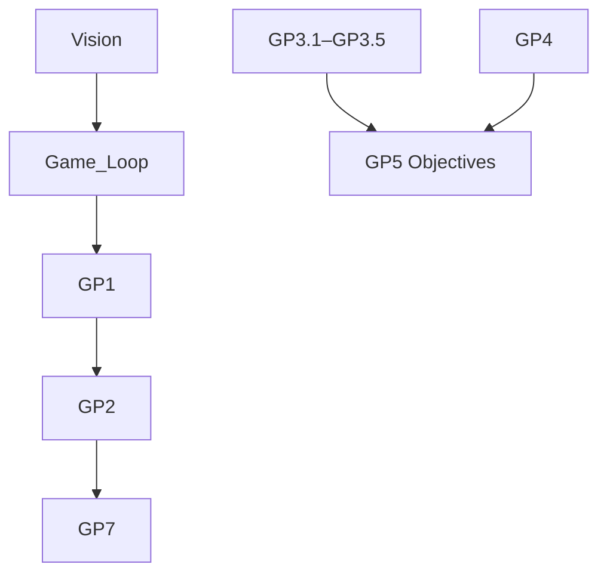
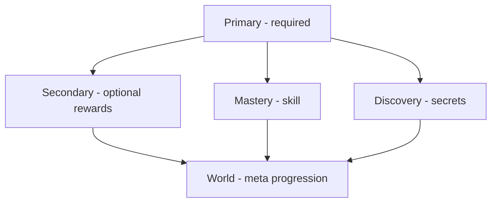
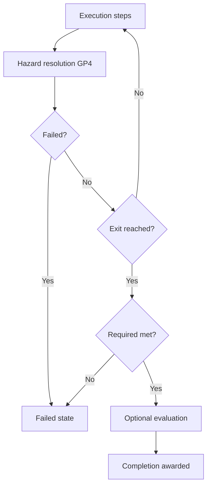
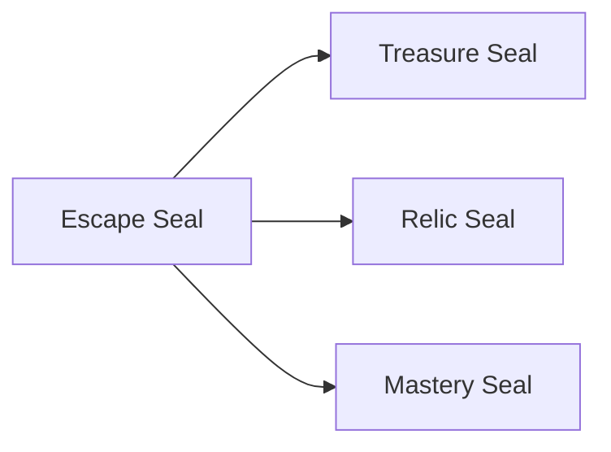

# Objectives & Completion

| Field                 | Value                                                                                                                                                                                                                                                                                                                                                                 |
| --------------------- | --------------------------------------------------------------------------------------------------------------------------------------------------------------------------------------------------------------------------------------------------------------------------------------------------------------------------------------------------------------------- |
| **Project**           | Labyrinth Legends                                                                                                                                                                                                                                                                                                                                                     |
| **Document Name**     | Objectives & Completion                                                                                                                                                                                                                                                                                                                                               |
| **Document ID**       | LLDS-DOC-01-GP5-001                                                                                                                                                                                                                                                                                                                                                   |
| **Series**            | GP5 — Gameplay Feature Specification                                                                                                                                                                                                                                                                                                                                  |
| **Version**           | 1.0.1                                                                                                                                                                                                                                                                                                                                                                 |
| **Status**            | Approved / Locked                                                                                                                                                                                                                                                                                                                                                     |
| **Owner**             | Apoorv                                                                                                                                                                                                                                                                                                                                                                |
| **Prepared By**       | ChatGPT (specification) · Cursor (compiler)                                                                                                                                                                                                                                                                                                                           |
| **Last Updated**      | 2026-06-29                                                                                                                                                                                                                                                                                                                                                            |
| **Path**              | `docs/01_Game_Design/Gameplay/GP5_Objectives_Completion.md`                                                                                                                                                                                                                                                                                                           |
| **Dependencies**      | [Vision](../../00_Project/Vision.md) · [Game Loop](../Game_Loop.md) · [GP1 Player & Explorer](GP1_Player_Explorer.md) · [GP2 Movement System](GP2_Movement_System.md) · [Gameplay Rules](GP7_Gameplay_Rules.md) · [GP3.1](GP3/GP3.1_Puzzle_Taxonomy.md)–[GP3.5](GP3/GP3.5_Puzzle_Composition_Level_Design_Rules.md) · [GP4 Hazards & Failure](GP4_Hazards_Failure.md) |
| **Related Documents** | [GP6 Gameplay Feedback](GP6_Gameplay_Feedback.md) · [Puzzle Elements](Puzzle_Elements.md) · [Progression](../Progression.md) · [WS4 Completion Loop](../Game_Loop/WS4_Completion_Loop.md)                                                                                                                                                                             |

## Navigation

| ← Previous                                        | Next →                                              | Index                                                      |
| ------------------------------------------------- | --------------------------------------------------- | ---------------------------------------------------------- |
| [GP4 — Hazards & Failure](GP4_Hazards_Failure.md) | [GP6 — Gameplay Feedback](GP6_Gameplay_Feedback.md) | [Gameplay Specs](README.md) · [LLDS Home](../../README.md) |

---

## Version History

| Version | Date       | Author           | Summary                                        |
| ------- | ---------- | ---------------- | ---------------------------------------------- |
| 1.0.1   | 2026-06-29 | Apoorv           | Approved and locked after Gameplay Phase 2 review |
| 1.0.0   | 2026-06-29 | ChatGPT / Cursor | GP5 — Objectives & completion operating manual |

## Change Log

| Version | Change                                                                                    |
| ------- | ----------------------------------------------------------------------------------------- |
| 1.0.1   | Approved and locked after Gameplay Phase 2 review                                         |
| 1.0.0   | Initial specification: objective hierarchy, families, completion states, seals, MVP scope |

---

## Purpose

This document defines how **objectives**, **completion states**, **success conditions**, **optional challenges**, **mastery goals**, **world progression**, and **replay completion** work across Labyrinth Legends.

GP5 is the **objective and completion operating manual** — not a scoring catalogue. It defines what it means to **complete**, **master**, **replay**, and **progress** through labyrinth levels.

### What GP5 Defines

| Domain                     | Coverage                              |
| -------------------------- | ------------------------------------- |
| Objective families         | Taxonomy and MVP forms                |
| Completion states          | Success, optional, mastery, discovery |
| Completion timing          | When success is judged                |
| Objective failure          | Impossibility and communication       |
| Seals / completion marks   | Thematic achievement layers           |
| Replay & world progression | Meaningful return motivation          |
| MVP objective scope        | One simple form per family            |

### What GP5 Does Not Define

| Excluded                      | Authority                                         |
| ----------------------------- | ------------------------------------------------- |
| Movement execution            | [GP2](GP2_Movement_System.md)                     |
| Hazard failure rules          | [GP4](GP4_Hazards_Failure.md)                     |
| Rule precedence               | [GP7 Gameplay Rules](GP7_Gameplay_Rules.md)       |
| UI / feedback presentation    | [GP6 Gameplay Feedback](GP6_Gameplay_Feedback.md) |
| Economy values / monetization | Product docs                                      |
| GP3 element behaviour         | GP3.1–GP3.5                                       |

### Design Intent

Objectives make the Player feel like an **explorer mastering ancient labyrinths** — not a score-chaser.

---

## Intended Audience

| Role              | Use this document to…                                                                       |
| ----------------- | ------------------------------------------------------------------------------------------- |
| Level Designers   | Author primary, optional, and mastery goals per chamber                                     |
| Puzzle Designers  | Link GP3 elements to success conditions                                                     |
| Creative Director | Validate completion layering against Vision                                                 |
| QA Engineers      | Verify completion states and objective impossibility                                        |
| AI Coding Agents  | Generate or modify objective-related documentation/content while respecting authority rules |

## Table of Contents

1. [Purpose](#purpose)
2. [Relationship to Core Gameplay](#1-relationship-to-core-gameplay-documents)
3. [Objective & Completion Philosophy](#2-objective--completion-philosophy)
4. [Definition of Completion](#3-definition-of-completion)
5. [Objective Hierarchy](#4-objective-hierarchy)
6. [Primary Objectives](#5-primary-objectives)
7. [Optional Objectives](#6-optional-objectives)
8. [Mastery Objectives](#7-mastery-objectives)
9. [Discovery Objectives](#8-discovery-objectives)
10. [Objective Families](#9-objective-families)
11. [Completion States](#10-completion-states)
12. [Completion Timing](#11-completion-timing)
13. [Objective Failure](#12-objective-failure)
14. [Objective Interaction with Hazards](#13-objective-interaction-with-hazards)
15. [Objective Interaction with Puzzle Elements](#14-objective-interaction-with-puzzle-elements)
16. [Completion Rewards](#15-completion-rewards)
17. [Completion Marks / Seal System](#16-completion-marks--seal-system)
18. [Replayability Rules](#17-replayability-rules)
19. [World & Progression Completion](#18-world--progression-completion)
20. [Fairness & Readability Rules](#19-fairness--readability-rules)
21. [Anti-Patterns](#20-anti-patterns)
22. [Designer Checklist](#21-designer-checklist)
23. [MVP Summary Table](#22-mvp-summary-table)
24. [Locked Decisions](#23-locked-decisions)

---

## 1. Relationship to Core Gameplay Documents

| Document                                        | GP5 relationship                                                       |
| ----------------------------------------------- | ---------------------------------------------------------------------- |
| [Vision](../../00_Project/Vision.md)            | Premium puzzle-adventure; exploration over arcade scoring              |
| [Game Loop](../Game_Loop.md)                    | Complete → reward → progress → replay                                  |
| [GP1 Player & Explorer](GP1_Player_Explorer.md) | Player plans route; Explorer satisfies objectives on execution         |
| [GP2 Movement System](GP2_Movement_System.md)   | Path reaches exit; validation before confirm                           |
| [GP7 Gameplay Rules](GP7_Gameplay_Rules.md)     | Execution order; completion vs hazard precedence                       |
| [GP3.1–GP3.5](GP3/GP3.1_Puzzle_Taxonomy.md)     | Elements and composition — GP5 defines **why they matter for success** |
| [GP4 Hazards & Failure](GP4_Hazards_Failure.md) | Failure before completion; objective impossibility                     |
| **GP5 (this document)**                         | Objectives, success, completion, mastery, replay                       |

### Design Intent

GP5 answers **what winning means** — GP2/GP7 answer **how execution resolves**.

---

## 2. Objective & Completion Philosophy

| Principle                             | Meaning                             |
| ------------------------------------- | ----------------------------------- |
| **Primary completion clear**          | Every level states what is required |
| **Optional rewards curiosity**        | Detours never block exit            |
| **Mastery rewards planning**          | Not reflexes                        |
| **Discovery valuable, not mandatory** | Secrets enrich; core path fair      |
| **Exploration fantasy**               | Ancient adventure, not checklist    |
| **Deterministic success**             | Same route + state → same outcome   |
| **Meaningful replay**                 | Insight goals — not grind           |

### Completion Should Feel Like

Clear · Fair · Satisfying · Replayable · Thematic · Mastery-driven · Aligned with route planning

### Completion Should Not Feel Like

Generic score chasing · Hidden mandatory progress · Arbitrary stars · Punishment for casual clear · Arcade performance pressure

### Design Intent

**Layered completion** — required escape first; mastery and discovery invite return.

---

## 3. Definition of Completion

**Completion** occurs when the Explorer satisfies **required objective conditions** and reaches or triggers the **approved completion state**.

### Completion May Require

| Condition type         | Example                   |
| ---------------------- | ------------------------- |
| Reach exit             | Step on exit node         |
| Exit + dependency      | Key collected before door |
| Collect required relic | Shrine activation         |
| Environmental state    | All braziers lit          |
| Mechanism sequence     | Switches before gate      |
| Hazard escape          | Leave before collapse     |

### Completion Types

| Type                     | Definition                       | Blocks world progress? |
| ------------------------ | -------------------------------- | ---------------------- |
| **Level completion**     | Primary objective satisfied      | Yes — unlocks forward  |
| **Optional completion**  | Secondary goals (treasure, etc.) | No                     |
| **Mastery completion**   | Perfect/efficient/clean solve    | No                     |
| **Discovery completion** | Secret found, relic collected    | No                     |
| **World completion**     | World threshold met              | Meta — see §18         |
| **Full completion**      | All seals on level/world         | No — completionist     |

### Design Intent

One **primary win** per level; everything else is **invitation**.

---

## 4. Objective Hierarchy

| Layer         | Blocks level? | Player purpose                 | Example             | MVP             |
| ------------- | ------------- | ------------------------------ | ------------------- | --------------- |
| **Primary**   | Yes           | Escape / solve required puzzle | Reach exit with key | Required        |
| **Secondary** | No            | Extra reward                   | All gems            | One form        |
| **Mastery**   | No            | Prove skill                    | Ideal path length   | One form        |
| **Discovery** | No            | Explore secrets                | Hidden chamber      | One form        |
| **World**     | No*           | Meta progress                  | World relic set     | Basic threshold |

World gates use **primary** level completion counts — not full mastery.

### Design Intent

Hierarchy prevents **optional goals masquerading as mandatory**.

---

## 5. Primary Objectives

### Core Rule

Default primary objective: **guide the Explorer from entrance to exit** after satisfying any required route, key, puzzle, or environmental conditions.

### Primary Objective Types

| Type              | Completion trigger               |
| ----------------- | -------------------------------- |
| Reach exit        | Explorer on exit node            |
| Exit + key        | Key in inventory at door/exit    |
| Shrine activation | Mechanism state before exit      |
| Gate unlock       | Switch/lock satisfied            |
| Bridge restored   | Traversal state allows exit path |
| Required relic    | Collect then reach exit          |
| Hazard escape     | Exit before fail state           |
| Sequence complete | Mechanism order satisfied        |

### Rules

| Rule                  | Requirement                  |
| --------------------- | ---------------------------- |
| Visible or taught     | No hidden mandatory goals    |
| Deterministic         | Reproducible success         |
| Readable conditions   | Player models before Confirm |
| Not checklist hunting | One clear primary thread     |

### Design Intent

Primary objective is the **contract** — Player knows what "done" means.

---

## 6. Optional Objectives

### Examples

Collect all treasures · Hidden relic · Secret room · Alternate route · Lore fragment · Avoid optional hazard trigger · Optional mechanism solve · Extra route conditions

### Rules

| Rule                         | Requirement                                                                                                      |
| ---------------------------- | ---------------------------------------------------------------------------------------------------------------- |
| Never block basic completion | Exit always reachable without optional                                                                           |
| Reward curiosity & replay    | Intrinsic + seal progression                                                                                     |
| Fairly discoverable          | Hinted — not pixel hunt                                                                                          |
| Don't obscure primary route  | Visual clarity aligned with [GP3.5 puzzle composition rules](GP3/GP3.5_Puzzle_Composition_Level_Design_Rules.md) |
| Thematically meaningful      | Fits world identity                                                                                              |

### Design Intent

Optional objectives are **invitations** — per [GP3.2-L08](GP3/GP3.2_Static_Traversal_Collectible_Elements.md#10-locked-decisions) and [WS4](../Game_Loop/WS4_Completion_Loop.md).

---

## 7. Mastery Objectives

### Examples

Ideal route length · No failed attempts · No hazard triggers · All treasures one route · Limited confirmations · No assist · Perfect route · World mastery set

### Rules

| Rule                              | Requirement                         |
| --------------------------------- | ----------------------------------- |
| Never required for basic progress | Mastery is opt-in pride             |
| Tests planning & sequencing       | Not reflex                          |
| Fair, deterministic, replayable   | Same rules every attempt            |
| Visible after unlock/discovery    | Requirements explicit when relevant |
| First clear experimentation OK    | Unless authored challenge level     |

### Design Intent

Mastery celebrates **"I could have planned better"** — not **"I mashed faster"**.

---

## 8. Discovery Objectives

### Examples

Hidden chamber · Secret relic · Lore stone · Alternate exit · Hidden treasure route · World artifact fragment · Inscription · Concealed shortcut

### Rules

| Rule                            | Requirement                                                                                       |
| ------------------------------- | ------------------------------------------------------------------------------------------------- |
| May be hidden                   | Fair hints required                                                                               |
| No hidden mandatory             | Discovery ≠ primary gate                                                                          |
| Enrich, don't obscure           | Core path readable                                                                                |
| Support replay & world identity | Aligned with [GP3.5 puzzle composition rules](GP3/GP3.5_Puzzle_Composition_Level_Design_Rules.md) |
| Clues via environment           | Pattern, optional scout, teaching                                                                 |

### Design Intent

Discovery is **reward for looking** — not **tax for progressing**.

---

## 9. Objective Families

Major objective families. GP3 defines elements; GP5 defines **success conditions**.

---

### 9.1 Exit Objective

| Aspect            | Specification                                                                          |
| ----------------- | -------------------------------------------------------------------------------------- |
| **Description**   | Reach valid exit state                                                                 |
| **Player-facing** | Step on exit → level complete                                                          |
| **Completion**    | Explorer on exit node after requirements met                                           |
| **MVP Basic**     | Visible exit tile completes level                                                      |
| **MVP Advanced**  | Exit portal with animation state                                                       |
| **Post-MVP**      | Multi-exit choice chambers                                                             |
| **Readability**   | Exit always identifiable ([GP3.2](GP3/GP3.2_Static_Traversal_Collectible_Elements.md)) |
| **Example**       | First tutorial chamber — reach glowing gate                                            |

**Rule:** Valid exit state triggers primary completion.

### Design Intent

Exit is the **default primary** — all other families modify it.

---

### 9.2 Key / Gate Objective

| Aspect            | Specification                           |
| ----------------- | --------------------------------------- |
| **Description**   | Dependency before exit counts           |
| **Player-facing** | Collect key / activate gate → then exit |
| **Completion**    | Dependency satisfied + exit reached     |
| **MVP Basic**     | One key before one locked exit          |
| **MVP Advanced**  | Relic carried to shrine exit            |
| **Post-MVP**      | Multi-key sequence                      |
| **Readability**   | Lock/key pairing visible or taught      |
| **Example**       | Key in side room — route order puzzle   |

**Rule:** Required dependency must be satisfied before exit completes level.

### Design Intent

Teaches **route ordering** as success condition.

---

### 9.3 Treasure Objective

| Aspect            | Specification                                                                                                                            |
| ----------------- | ---------------------------------------------------------------------------------------------------------------------------------------- |
| **Description**   | Optional collectibles improve completion tier                                                                                            |
| **Player-facing** | Pick up gems/coins on path                                                                                                               |
| **Completion**    | Secondary — treasure seal thresholds                                                                                                     |
| **MVP Basic**     | Gems improve status; don't block exit                                                                                                    |
| **MVP Advanced**  | Collect-all for secondary seal                                                                                                           |
| **Post-MVP**      | World treasure totals                                                                                                                    |
| **Readability**   | Collectible affordance aligned with [GP3.2 Static, Traversal & Collectible Elements](GP3/GP3.2_Static_Traversal_Collectible_Elements.md) |
| **Example**       | Detour gem — skip OK                                                                                                                     |

**Rule:** Treasures optional unless **explicitly** authored as required (rare; must teach).

### Design Intent

Treasure measures **curiosity** — not **gatekeeping**.

---

### 9.4 Relic Objective

| Aspect            | Specification                                                                    |
| ----------------- | -------------------------------------------------------------------------------- |
| **Description**   | High-value discovery/collection                                                  |
| **Player-facing** | Find artifact; often optional                                                    |
| **Completion**    | Discovery seal / world collection                                                |
| **MVP Basic**     | One optional relic in selected levels                                            |
| **MVP Advanced**  | World relic shard set                                                            |
| **Post-MVP**      | Legendary relic quests                                                           |
| **Readability**   | Fair hint; optional fog OK ([GP3.4](GP3/GP3.4_Environmental_Dynamic_Systems.md)) |
| **Example**       | Hidden alcove relic                                                              |

**Rule:** Relics represent exploration/mastery — not core gate by default.

### Design Intent

Relics are **prestige collectibles** — lore and completionist pride.

---

### 9.5 Mastery Route Objective

| Aspect            | Specification                                                  |
| ----------------- | -------------------------------------------------------------- |
| **Description**   | Efficient or complete solution                                 |
| **Player-facing** | Beat ideal path / all treasures one run                        |
| **Completion**    | Mastery seal                                                   |
| **MVP Basic**     | Ideal path length OR all treasures                             |
| **MVP Advanced**  | No hazard trigger + ideal path                                 |
| **Post-MVP**      | Limited confirmations challenge                                |
| **Readability**   | Mastery criteria shown post-first-clear or in challenge levels |
| **Example**       | 8-step ideal vs 12-step clear                                  |

**Rule:** Rewards planning quality — deterministic criteria.

### Design Intent

Mastery route is **self-competition** — not leaderboard arcade.

---

### 9.6 Environmental Objective

| Aspect            | Specification                                                       |
| ----------------- | ------------------------------------------------------------------- |
| **Description**   | World state must reach requirement                                  |
| **Player-facing** | Light braziers, lower water, align mirrors                          |
| **Completion**    | Environmental state + exit                                          |
| **MVP Basic**     | One environmental state linked to exit                              |
| **MVP Advanced**  | Two-state machine (water + bridge)                                  |
| **Post-MVP**      | Full light network puzzles                                          |
| **Readability**   | State visible ([GP3.4](GP3/GP3.4_Environmental_Dynamic_Systems.md)) |
| **Example**       | Switch lowers water — exit opens                                    |

**Rule:** Player changes environment into required state before completion.

### Design Intent

Environmental objectives link **GP3.4 systems** to **win condition**.

---

### 9.7 Survival / Escape Objective

| Aspect            | Specification                                       |
| ----------------- | --------------------------------------------------- |
| **Description**   | Leave hazard scenario successfully                  |
| **Player-facing** | Escape before collapse / detection / curse          |
| **Completion**    | Reach exit/sanctuary in valid state                 |
| **MVP Basic**     | One hazard-linked escape (deterministic cycle)      |
| **MVP Advanced**  | Guardian avoidance + exit                           |
| **Post-MVP**      | Multi-phase escape                                  |
| **Readability**   | Hazard cycle taught ([GP4](GP4_Hazards_Failure.md)) |
| **Example**       | Cross before gate closes — planned phase            |

**Rule:** Puzzle-driven escape — not reflex chase.

### Design Intent

Bridges **GP4 hazards** to **positive win** — escape as achievement.

---

### 9.8 Discovery Objective

| Aspect            | Specification                                                                                                        |
| ----------------- | -------------------------------------------------------------------------------------------------------------------- |
| **Description**   | Optional secret content                                                                                              |
| **Player-facing** | Find hidden room, inscription, shortcut                                                                              |
| **Completion**    | Discovery seal / journal entry                                                                                       |
| **MVP Basic**     | One hinted optional secret per world segment                                                                         |
| **MVP Advanced**  | Alternate route to same exit                                                                                         |
| **Post-MVP**      | Multi-chamber secrets                                                                                                |
| **Readability**   | Environmental clue aligned with [GP3.5 puzzle composition rules](GP3/GP3.5_Puzzle_Composition_Level_Design_Rules.md) |
| **Example**       | Cracked wall hint → hidden chamber                                                                                   |

**Rule:** Optional exploration reward — fairly hinted.

### Design Intent

Discovery objectives power **replay** and **world lore**.

---

## 10. Completion States

| State                       | Meaning                      | Trigger                             | Affects progression | Affects replay      | Affects rewards |
| --------------------------- | ---------------------------- | ----------------------------------- | ------------------- | ------------------- | --------------- |
| **Not Started**             | Never attempted              | —                                   | No                  | —                   | No              |
| **In Progress**             | Attempt active               | Enter level                         | No                  | —                   | No              |
| **Failed**                  | Hazard or objective fail     | [GP4](GP4_Hazards_Failure.md) / §12 | No                  | Retry               | No              |
| **Completed**               | Primary satisfied            | Exit + requirements                 | **Yes**             | Shows seals missing | Base progress   |
| **Completed with Treasure** | Primary + treasure threshold | Secondary met                       | No extra gate       | Replay for more     | Treasure seal   |
| **Completed with Relic**    | Primary + relic              | Discovery met                       | No extra gate       | —                   | Relic seal      |
| **Mastered**                | Mastery criteria met         | Mastery check                       | No                  | —                   | Mastery seal    |
| **Fully Completed**         | All seals on level           | All layers                          | No                  | Optional pride      | Full archive    |

> UI labels may vary; **gameplay meaning** must remain stable. [GP6 Gameplay Feedback](GP6_Gameplay_Feedback.md) defines presentation and communication requirements.

### Design Intent

States are **progress vocabulary** — Player always knows where they stand.

---

## 11. Completion Timing

### When Completion Is Checked

| Checkpoint                | Action                                                                     |
| ------------------------- | -------------------------------------------------------------------------- |
| During execution          | Per-step hazard/objective state updates                                    |
| Explorer reaches exit     | Primary completion candidate                                               |
| Required state checks     | Key, environment, sequence                                                 |
| Optional objective checks | Treasures, relics                                                          |
| Post-execution resolution | Final seal evaluation                                                      |
| Hazard/failure checks     | [GP4](GP4_Hazards_Failure.md) — **before** awarding completion if conflict |
| Level-end summary         | Present seals earned                                                       |

### Rules

| Rule                            | Specification                                        |
| ------------------------------- | ---------------------------------------------------- |
| GP4 failure first               | No completion if lethal/objective fail same sequence |
| Deterministic                   | Same execution → same completion tier                |
| Required not silent             | Unmet primary never awards complete                  |
| Optional at level end           | Clear evaluation                                     |
| Hidden state only for discovery | Explicit discovery objectives only                   |

### Design Intent

Completion is **earned at the end of honest resolution** — not smuggled past failure.

---

## 12. Objective Failure

**Objective failure** occurs when a **required** completion condition becomes impossible, invalid, or unrecoverable.

### Examples

Key unreachable · Relic destroyed · Exit sealed · Bridge collapsed · Wrong mechanism state · Explorer trapped · Resource expired

### Rules

| Rule                       | Specification                                                                                                       |
| -------------------------- | ------------------------------------------------------------------------------------------------------------------- |
| Align with GP4             | Objective-linked hazards and objective-impossible states defined by [GP4 Hazards & Failure](GP4_Hazards_Failure.md) |
| No silent soft-lock        | Explicit fail state                                                                                                 |
| Communicate impossibility  | Player understands why                                                                                              |
| Retry available            | [GP4 §13](GP4_Hazards_Failure.md#13-retry--recovery-model)                                                          |
| Optional fail ≠ level fail | Unless challenge mode                                                                                               |

Related to GP4-Q04: exact timing for objective impossibility detection is deferred to [GP7 Gameplay Rules](GP7_Gameplay_Rules.md). GP5 requires that objective impossibility never becomes a silent soft-lock.

### Design Intent

**Clear fail** beats **silent stuck**.

---

## 13. Objective Interaction with Hazards

| Rule                                        | Specification                  |
| ------------------------------------------- | ------------------------------ |
| Hazards may block/threaten objectives       | Survival objectives            |
| Hazard-linked objectives stay puzzle-driven | [GP4](GP4_Hazards_Failure.md)  |
| Hazard failure resolves per GP4             | Before completion              |
| Completion cannot override hazard failure   | Unless GP7 explicitly allows   |
| Impossible required objective               | Objective failure communicated |

### Design Intent

Hazards **threaten** success; GP5 defines **what success survives**.

---

## 14. Objective Interaction with Puzzle Elements

| Rule                    | Specification                                             |
| ----------------------- | --------------------------------------------------------- |
| GP3 defines elements    | GP5 defines objective relevance                           |
| Element → objective via | Collection, activation, state, unlock, discovery, mastery |
| Reference GP3           | No duplicate definitions                                  |

| GP3 element          | GP5 objective link             |
| -------------------- | ------------------------------ |
| Key                  | Gate objective                 |
| Switch               | Bridge/environmental objective |
| Treasure             | Secondary completion           |
| Hidden path          | Discovery objective            |
| Environmental system | Required state objective       |

### Design Intent

GP5 is the **win layer** on GP3's **mechanic layer**.

---

## 15. Completion Rewards

### Reward Types (gameplay-design level)

| Reward               | Purpose                                             |
| -------------------- | --------------------------------------------------- |
| Level progress       | Unlock next chamber                                 |
| World unlock         | Meta progression ([Progression](../Progression.md)) |
| Treasure count       | Secondary tracking                                  |
| Relic collection     | Discovery/world identity                            |
| Mastery seal         | Skill recognition                                   |
| Discovery record     | Journal/archive                                     |
| Lore unlock          | Narrative enrichment                                |
| Cosmetic / non-power | Vision-aligned ([GP1-L10](GP1_Player_Explorer.md))  |
| Completion archive   | Completionist satisfaction                          |

### Rules

| Rule                            | Requirement        |
| ------------------------------- | ------------------ |
| Reinforce exploration & mastery | Not grind          |
| No pay-to-complete              | Vision             |
| Don't dominate puzzle identity  | Rewards serve play |
| Economy values elsewhere        | Not GP5            |

### Design Intent

Rewards **celebrate** escape and mastery — not replace them.

---

## 16. Completion Marks / Seal System

Thematic **seals** replace generic arcade stars.

| Seal              | Category  | Earned when                 |
| ----------------- | --------- | --------------------------- |
| **Escape Seal**   | Primary   | Primary objective complete  |
| **Treasure Seal** | Secondary | Treasure threshold met      |
| **Relic Seal**    | Discovery | Relic or major secret found |
| **Mastery Seal**  | Mastery   | Mastery criteria met        |

### Rules

| Rule                    | Specification                |
| ----------------------- | ---------------------------- |
| Naming may evolve       | UI review — meaning stable   |
| Thematic not generic    | Ancient temple achievement   |
| Visible in level select | Progression summary          |
| Encourage replay        | Never block Escape Seal path |

> Avoid generic "3-star" language unless explicitly approved for comparison only.

### Design Intent

Seals are **explorer's marks** — proof of how deeply the labyrinth was conquered.

---

## 17. Replayability Rules

### Replay Motivation

| Source               | Example                  |
| -------------------- | ------------------------ |
| Missed treasure      | Return for Treasure Seal |
| Missing relic        | Relic Seal               |
| Undiscovered chamber | Discovery Seal           |
| Incomplete mastery   | Mastery Seal             |
| Alternate route      | Efficiency curiosity     |
| World completion     | Relic set                |
| Cleaner hazard avoid | Mastery variant          |
| Lore completion      | Journal fill             |

### Rules

| Rule                    | Requirement              |
| ----------------------- | ------------------------ |
| Meaningful not grindy   | Each replay has purpose  |
| Clear after first clear | Trackable optional goals |
| No excessive repetition | Respect player time      |
| Mastery rewards insight | Not luck                 |

Aligned with [WS5 Retention Loop](../Game_Loop/WS5_Retention_Loop.md) — mastery without FOMO punishment.

### Design Intent

Replay asks **"what else can I find?"** — not **"how many times must I grind?"**

---

## 18. World & Progression Completion

| Layer                | Requirement                                                                                                             |
| -------------------- | ----------------------------------------------------------------------------------------------------------------------- |
| **Level**            | Escape Seal → forward progress                                                                                          |
| **World unlock**     | Primary completion count threshold                                                                                      |
| **World treasure**   | Optional aggregate — completionist                                                                                      |
| **World relic**      | Optional set — discovery                                                                                                |
| **World mastery**    | Optional seal threshold                                                                                                 |
| **Challenge levels** | Optional mastery chambers                                                                                               |
| **Legendary levels** | Late optional content aligned with [GP3.5 puzzle progression rules](GP3/GP3.5_Puzzle_Composition_Level_Design_Rules.md) |

### Rules

| Rule                                  | Specification                     |
| ------------------------------------- | --------------------------------- |
| World progress ≠ full mastery         | Primary completion drives unlock  |
| Completionist rewards optional        | World seals bonus                 |
| World identity via objective patterns | Desert relics, flooded keys, etc. |
| No hidden mandatory world objectives  | Fair world gates                  |

### Design Intent

Worlds **graduate** explorers — they don't **gate** them behind perfection.

---

## 19. Fairness & Readability Rules

| Rule                               | Requirement                           |
| ---------------------------------- | ------------------------------------- |
| Required objectives visible/taught | Mandatory                             |
| Optional may be hidden             | Fair discoverability                  |
| Objective status understandable    | GP6 presents                          |
| Optional fail not punitive         | Clear but gentle                      |
| Objective failure clear            | [GP4](GP4_Hazards_Failure.md) aligned |
| Deterministic completion           | No random success                     |
| Requirements don't change silently | Patch = teach                         |
| Mastery explicit when relevant     | Post-unlock or challenge label        |

### Design Intent

Player always knows **what they're chasing** and **what they've earned**.

---

## 20. Anti-Patterns

| Anti-pattern                      | Why forbidden           |
| --------------------------------- | ----------------------- |
| Score chasing as main model       | Vision / GP5 philosophy |
| Hidden mandatory objectives       | GP1, GP3.5              |
| Unclear exit conditions           | Primary contract break  |
| Arbitrary checklist bloat         | Clutter                 |
| Mandatory perfect play            | Mastery ≠ gate          |
| Mastery required for progress     | GP5-L05                 |
| Random completion behaviour       | Determinism             |
| Optional feels mandatory          | FOMO                    |
| Silent objective failure          | GP4/GP5                 |
| Soft-lock without explanation     | GP3.5, GP4              |
| Pay-to-complete                   | Vision                  |
| Excessive grind                   | Respect player time     |
| Objective spam                    | Cognitive load          |
| Rewards undermine puzzle identity | Quality over quantity   |
| Generic arcade stars              | Seal system preferred   |

### Design Intent

Reject objectives that **obscure escape** or **punish casual play**.

---

## 21. Designer Checklist

| #   | Question                                      | Pass |
| --- | --------------------------------------------- | ---- |
| 1   | What is the **primary objective**?            |      |
| 2   | Is primary **readable**?                      |      |
| 3   | What **optional** objectives exist?           |      |
| 4   | Are optional **truly optional**?              |      |
| 5   | What **mastery** objective, if any?           |      |
| 6   | Is completion **deterministic**?              |      |
| 7   | Can objective become **impossible**?          |      |
| 8   | If impossible, is **failure communicated**?   |      |
| 9   | Safe **hazard** interaction?                  |      |
| 10  | Clear **GP3 element** link?                   |      |
| 11  | Supports **replay**?                          |      |
| 12  | Avoids **score chasing**?                     |      |
| 13  | Respects **Vision** & **Game Loop**?          |      |
| 14  | Respects **GP1, GP2, GP3.1–GP3.5, GP4, GP7**? |      |

### Design Intent

Checklist is **ship gate** for objective authoring.

---

## 22. MVP Summary Table

| Objective Family      | MVP Basic Form             | MVP Advanced Allowed?   | Post-MVP Expansion | Primary Completion Role | Readability Requirement |
| --------------------- | -------------------------- | ----------------------- | ------------------ | ----------------------- | ----------------------- |
| **Exit**              | Visible exit tile          | Yes — portal variant    | Multi-exit         | **Primary default**     | Exit distinct           |
| **Key / Gate**        | One key before exit        | Yes — shrine relic      | Multi-key          | Primary modifier        | Lock/key taught         |
| **Treasure**          | Optional gems              | Yes — collect-all seal  | World totals       | Secondary               | Collectible read        |
| **Relic**             | One optional relic         | Yes — shard set         | Legendary quests   | Discovery               | Fair hint               |
| **Mastery Route**     | Ideal path OR all treasure | Yes — no-hazard + ideal | Limited confirms   | Mastery only            | Criteria explicit       |
| **Environmental**     | One state for exit         | Yes — two-state         | Full networks      | Primary modifier        | State visible           |
| **Survival / Escape** | One cycle escape           | Yes — guardian + exit   | Multi-phase        | Primary or modifier     | GP4 cycle taught        |
| **Discovery**         | One hinted secret          | Yes — alt route         | Multi-secret       | Discovery only          | Clue present            |

### Design Intent

MVP manifest: **eight families, eight basic forms** minimum.

---

## 23. Locked Decisions

### Locked Decisions

| ID      | Decision                                                              | Source            |
| ------- | --------------------------------------------------------------------- | ----------------- |
| GP5-L01 | GP5 is objectives & completion operating manual                       | GP5 workshop      |
| GP5-L02 | All major objective families are MVP                                  | Human Owner scope |
| GP5-L03 | MVP = one simple, readable, testable form per family                  | Human Owner scope |
| GP5-L04 | Primary default: reach exit after required conditions                 | GP5 workshop      |
| GP5-L05 | Optional objectives never block basic completion                      | GP5 · GP3.2 · WS4 |
| GP5-L06 | Mastery never blocks basic progression                                | GP5 · Vision      |
| GP5-L07 | Thematic seals (Escape, Treasure, Relic, Mastery) — not generic stars | GP5 workshop      |
| GP5-L08 | Objectives support exploration, planning, puzzle solving              | GP5 · Vision      |
| GP5-L09 | No pay-to-complete logic in objectives                                | GP5 · Vision      |
| GP5-L10 | Completion deterministic and explainable                              | GP5 · GP1         |
| GP5-L11 | GP4 failure resolves before completion awarded                        | GP5 · GP4         |
| GP5-L12 | Objective impossibility → explicit failure, not soft-lock             | GP5 · GP4 · GP3.5 |

### Future Decisions (Deferred)

| Topic                                | Target                           |
| ------------------------------------ | -------------------------------- |
| Exact seal naming                    | LLDL · GP6                       |
| Reward values                        | Progression · Economy            |
| World unlock thresholds              | [Progression](../Progression.md) |
| Mastery seals unlock special content | Roadmap                          |
| Ideal vs shortest vs authored path   | GP5-Q02                          |
| Replay summary presentation          | GP6                              |
| Resource-based mastery in early MVP  | GP5-Q03                          |
| Lore reward surfacing                | Game Bible · GP6                 |
| Hidden relics in level select        | GP6 · LLDL                       |

### Open Questions

| ID      | Question                                                      | Owner            | Status             |
| ------- | ------------------------------------------------------------- | ---------------- | ------------------ |
| GP5-Q01 | Treasure Seal: per-level threshold or per-chamber count?      | ChatGPT / Apoorv | Open               |
| GP5-Q02 | Mastery path: shortest, designer ideal, or player-best?       | ChatGPT / Apoorv | Open               |
| GP5-Q03 | Resource mastery (step limit) in MVP or post-MVP?             | ChatGPT / Apoorv | Open — GP4 overlap |
| GP5-Q04 | Objective impossibility: fail immediately or at exit attempt? | ChatGPT / Apoorv | Deferred to GP7    |

### Design Intent

GP5 locks **what success means** — GP6/GP7/Progression implement presentation and thresholds.

---

## Cross References

- Core: [GP1](GP1_Player_Explorer.md) · [GP2](GP2_Movement_System.md) · [GP7](GP7_Gameplay_Rules.md)
- GP3: [GP3.1](GP3/GP3.1_Puzzle_Taxonomy.md)–[GP3.5](GP3/GP3.5_Puzzle_Composition_Level_Design_Rules.md)
- Siblings: [GP4 Hazards & Failure](GP4_Hazards_Failure.md) · [GP6 Gameplay Feedback](GP6_Gameplay_Feedback.md)
- Loops: [WS4](../Game_Loop/WS4_Completion_Loop.md) · [WS3](../Game_Loop/WS3_Progression_Loop.md)
- Integration: [Puzzle_Elements](Puzzle_Elements.md) · [Gameplay.md](../Gameplay.md)
- Governance: [Vision](../../00_Project/Vision.md) · [Decisions](../../00_Project/Decisions.md)

---

## Navigation

| ← Previous                                        | Next →                                              | Index                                                      |
| ------------------------------------------------- | --------------------------------------------------- | ---------------------------------------------------------- |
| [GP4 — Hazards & Failure](GP4_Hazards_Failure.md) | [GP6 — Gameplay Feedback](GP6_Gameplay_Feedback.md) | [Gameplay Specs](README.md) · [LLDS Home](../../README.md) |

