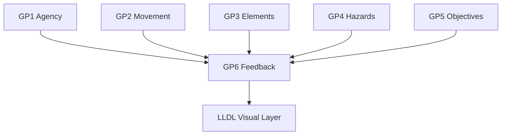
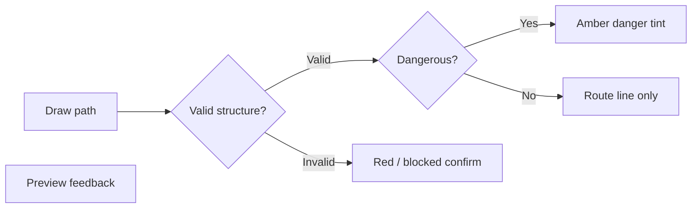
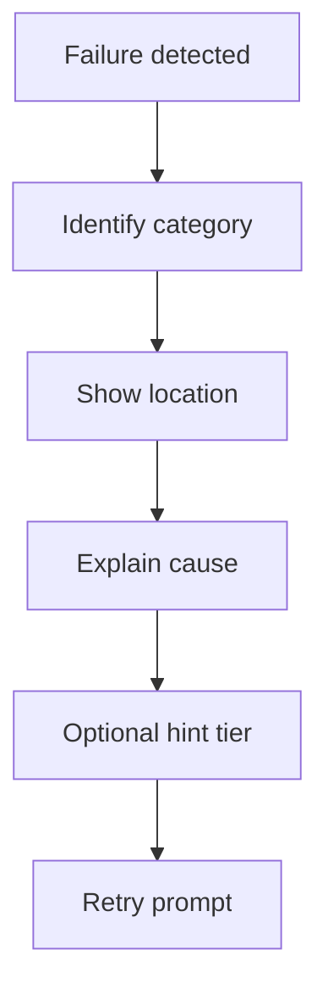
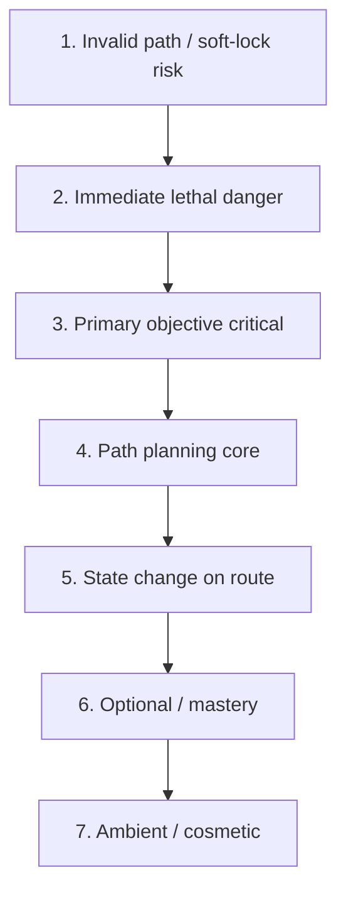

# Gameplay Feedback

| Field                 | Value                                                                                                                                                                                                                                                                                                                                                                                                                                   |
| --------------------- | --------------------------------------------------------------------------------------------------------------------------------------------------------------------------------------------------------------------------------------------------------------------------------------------------------------------------------------------------------------------------------------------------------------------------------------- |
| **Project**           | Labyrinth Legends                                                                                                                                                                                                                                                                                                                                                                                                                       |
| **Document Name**     | Gameplay Feedback                                                                                                                                                                                                                                                                                                                                                                                                                       |
| **Document ID**       | LLDS-DOC-01-GP6-001                                                                                                                                                                                                                                                                                                                                                                                                                     |
| **Series**            | GP6 — Gameplay Feature Specification                                                                                                                                                                                                                                                                                                                                                                                                    |
| **Version**           | 1.0.1                                                                                                                                                                                                                                                                                                                                                                                                                                   |
| **Status**            | Approved / Locked                                                                                                                                                                                                                                                                                                                                                                                                                       |
| **Owner**             | Apoorv                                                                                                                                                                                                                                                                                                                                                                                                                                  |
| **Prepared By**       | ChatGPT (specification) · Cursor (compiler)                                                                                                                                                                                                                                                                                                                                                                                             |
| **Last Updated**      | 2026-06-29                                                                                                                                                                                                                                                                                                                                                                                                                              |
| **Path**              | `docs/01_Game_Design/Gameplay/GP6_Gameplay_Feedback.md`                                                                                                                                                                                                                                                                                                                                                                                 |
| **Dependencies**      | [Vision](../../00_Project/Vision.md) · [Game Loop](../Game_Loop/Game_Loop.md) · [GP1 Player & Explorer](GP1_Player_Explorer.md) · [GP2 Movement System](GP2_Movement_System.md) · [GP7 Gameplay Rules](GP7_Gameplay_Rules.md) · [GP3.1](GP3/GP3.1_Puzzle_Taxonomy.md)–[GP3.5](GP3/GP3.5_Puzzle_Composition_Level_Design_Rules.md) · [GP4 Hazards & Failure](GP4_Hazards_Failure.md) · [GP5 Objectives & Completion](GP5_Objectives_Completion.md) |
| **Related Documents** | [Puzzle Elements](Puzzle_Elements.md) · [LLDL](../../02_Design_System/LLDL/LLDL.md) · [Gameplay.md](Gameplay.md)                                                                                                                                                                                                                                                                                                                          |

## Navigation

| ← Previous                                                    | Next →                                        | Index                                                      |
| ------------------------------------------------------------- | --------------------------------------------- | ---------------------------------------------------------- |
| [GP5 — Objectives & Completion](GP5_Objectives_Completion.md) | [GP7 — Gameplay Rules](GP7_Gameplay_Rules.md) | [Gameplay Specs](README.md) · [LLDS Home](../../README.md) |

---

## Version History

| Version | Date       | Author           | Summary                                  |
| ------- | ---------- | ---------------- | ---------------------------------------- |
| 1.0.1   | 2026-06-29 | Apoorv           | Approved and locked after Gameplay Phase 2 review |
| 1.0.0   | 2026-06-29 | ChatGPT / Cursor | GP6 — Gameplay feedback operating manual |

## Change Log

| Version | Change                                                                              |
| ------- | ----------------------------------------------------------------------------------- |
| 1.0.1   | Approved and locked after Gameplay Phase 2 review                                   |
| 1.0.0   | Initial specification: feedback families, MVP scope, priority, accessibility, hints |

---

## Purpose

This document defines how **gameplay feedback**, **readability**, **teaching**, **warnings**, **confirmation**, **failure explanation**, **success celebration**, **objective clarity**, **hazard communication**, and **player learning** work across Labyrinth Legends.

GP6 is the **gameplay feedback operating manual** — not a UI screen specification. It defines how the Player understands planning, execution, danger, objectives, failure, success, and mastery while preserving puzzle agency.

### What GP6 Defines

| Domain                             | Coverage                                    |
| ---------------------------------- | ------------------------------------------- |
| Feedback families                  | Twelve families with MVP forms              |
| Planning & execution communication | Path, commit, run                           |
| Hazard & objective presentation    | GP4/GP5 requirements at player-facing layer |
| Failure & success explanation      | Cause, retry, celebration                   |
| Hint philosophy                    | Teach rules — not solutions                 |
| Accessibility expectations         | Gameplay-level multichannel rules           |
| MVP feedback scope                 | One simple form per family                  |

### What GP6 Does Not Define

| Excluded                   | Authority                                   |
| -------------------------- | ------------------------------------------- |
| Final UI layouts / screens | `docs/03_Screens/`*                         |
| Visual design tokens       | [LLDL](../../02_Design_System/LLDL/LLDL.md)      |
| Movement / path rules      | [GP2](GP2_Movement_System.md)               |
| Hazard failure rules       | [GP4](GP4_Hazards_Failure.md)               |
| Objective completion rules | [GP5](GP5_Objectives_Completion.md)         |
| Rule precedence            | [GP7 Gameplay Rules](GP7_Gameplay_Rules.md) |
| Monetization / economy     | Product docs                                |

### Design Intent

Feedback makes the Player feel **intelligent, informed, and in control** — without over-explaining the puzzle.

---

## Intended Audience

| Role              | Use this document to…                                                                      |
| ----------------- | ------------------------------------------------------------------------------------------ |
| Level Designers   | Specify what players must read per chamber                                                 |
| UX / UI Designers | Implement LLDL-compliant feedback (GP6 = requirements)                                     |
| Engineers         | Wire feedback to game state deterministically                                              |
| QA Engineers      | Verify feedback coverage per family                                                        |
| AI Coding Agents  | Generate or modify feedback-related documentation/content while respecting authority rules |

## Table of Contents

1. [Purpose](#purpose)
2. [Relationship to Core Gameplay](#1-relationship-to-core-gameplay-documents)
3. [Gameplay Feedback Philosophy](#2-gameplay-feedback-philosophy)
4. [Feedback Families](#3-feedback-families)
5. [MVP Feedback Scope Rule](#4-mvp-feedback-scope-rule)
6. [Affordance Feedback](#5-affordance-feedback)
7. [Path Planning Feedback](#6-path-planning-feedback)
8. [Commitment Feedback](#7-commitment-feedback)
9. [Execution Feedback](#8-execution-feedback)
10. [State Change Feedback](#9-state-change-feedback)
11. [Hazard Feedback](#10-hazard-feedback)
12. [Objective Feedback](#11-objective-feedback)
13. [Failure Feedback](#12-failure-feedback)
14. [Success Feedback](#13-success-feedback)
15. [Mastery & Replay Feedback](#14-mastery--replay-feedback)
16. [Hint Feedback Philosophy](#15-hint-feedback-philosophy)
17. [Tutorial Feedback](#16-tutorial-feedback)
18. [Accessibility & Multichannel Feedback](#17-accessibility--multichannel-feedback)
19. [Feedback Priority & Noise Control](#18-feedback-priority--noise-control)
20. [Feedback Quality Metrics](#19-feedback-quality-metrics)
21. [Anti-Patterns](#20-anti-patterns)
22. [Designer Checklist](#21-designer-checklist)
23. [MVP Summary Table](#22-mvp-summary-table)
24. [Locked Decisions](#23-locked-decisions)

---

## 1. Relationship to Core Gameplay Documents

| Document                                                    | GP6 relationship                                   |
| ----------------------------------------------------------- | -------------------------------------------------- |
| [Vision](../../00_Project/Vision.md)                        | Premium, calm, ancient-adventure tone              |
| [Game Loop](../Game_Loop/Game_Loop.md)                                | Plan → commit → execute → learn → retry            |
| [GP1 Player & Explorer](GP1_Player_Explorer.md)             | Feedback supports planning; execution observe-only |
| [GP2 Movement System](GP2_Movement_System.md)               | Path preview, validation presentation              |
| [GP7 Gameplay Rules](GP7_Gameplay_Rules.md)                 | Execution order for simultaneous feedback          |
| [GP3.1–GP3.5](GP3/GP3.1_Puzzle_Taxonomy.md)                 | Element readability requirements                   |
| [GP4 Hazards & Failure](GP4_Hazards_Failure.md)             | Hazard telegraphing & failure explanation          |
| [GP5 Objectives & Completion](GP5_Objectives_Completion.md) | Objective clarity & seal presentation              |
| **GP6 (this document)**                                     | How all of the above are **communicated**          |

### Design Intent

GP6 is the **communication layer** — mechanics live upstream; screens implement downstream.

---

## 2. Gameplay Feedback Philosophy

| Principle                        | Meaning                                                                                                        |
| -------------------------------- | -------------------------------------------------------------------------------------------------------------- |
| **Clarity before decoration**    | Readability over spectacle                                                                                     |
| **Feedback before punishment**   | Warn before lethal ([GP4](GP4_Hazards_Failure.md))                                                             |
| **Teach through interaction**    | Play teaches; text supports ([GP3.5 teaching methodology](GP3/GP3.5_Puzzle_Composition_Level_Design_Rules.md)) |
| **Warn before failure**          | Telegraph danger                                                                                               |
| **Explain after consequence**    | Failure has cause                                                                                              |
| **Celebrate meaningful success** | Seals, not noise ([GP5](GP5_Objectives_Completion.md))                                                         |
| **Preserve puzzle agency**       | Inform — don't solve                                                                                           |
| **Communicate state clearly**    | Every important change perceptible                                                                             |
| **Avoid solving the puzzle**     | No auto-path hints                                                                                             |

### Feedback Should Help the Player Understand

What can be done · What is being planned · What happens on commit · What happened during execution · Why failure occurred · Why success occurred · What remains incomplete · How mastery can improve

### Design Intent

Feedback is **respectful intelligence** — the game explains itself without stealing the "aha."

---

## 3. Feedback Families

Twelve major feedback families. Each has MVP Basic form required for ship.

| #   | Family            | Purpose                     |
| --- | ----------------- | --------------------------- |
| 1   | **Affordance**    | What can be interacted with |
| 2   | **Path Planning** | What the drawn path means   |
| 3   | **Commitment**    | Confirm execution           |
| 4   | **Execution**     | Explorer following path     |
| 5   | **State Change**  | World updates               |
| 6   | **Hazard**        | Danger warn/explain         |
| 7   | **Objective**     | Progress toward goals       |
| 8   | **Failure**       | Why attempt ended           |
| 9   | **Success**       | Completion celebration      |
| 10  | **Mastery**       | Replay improvement          |
| 11  | **Hint**          | Graduated learning aid      |
| 12  | **Accessibility** | Multichannel readability    |

### Family Summary Table

| Family        | MVP Basic                        | MVP Advanced               | Post-MVP                 | Readability     |
| ------------- | -------------------------------- | -------------------------- | ------------------------ | --------------- |
| Affordance    | Distinct floor/wall/interactable | Icon language per category | Biome skins              | Consistent LLDL |
| Path Planning | Route line + invalid highlight   | Danger segment tint        | Dependency preview       | GP2 aligned     |
| Commitment    | Confirm/Cancel + invalid block   | Risk summary               | Irreversible warn        | GP1 commitment  |
| Execution     | Step-by-step movement            | Trigger callouts           | Cinematic cam            | GP7 order       |
| State Change  | Local state flip VFX             | Remote link pulse          | Chain highlight          | Cause visible   |
| Hazard        | Active hazard read               | Cycle indicator            | Guardian path ghost      | GP4 fair        |
| Objective     | Primary goal label               | Seal progress              | World tracker            | GP5 clear       |
| Failure       | Cause + location                 | Category icon              | Hint offer               | GP4 fair        |
| Success       | Escape Seal + summary            | Seal breakdown             | Lore beat                | GP5 meaning     |
| Mastery       | Missed optional list             | Ideal path hint            | Leaderboard-free compare | No grind tone   |
| Hint          | Tutorial callout                 | Repeat-fail nudge          | Adaptive (post-MVP)      | No solution     |
| Accessibility | Shape + color redundancy         | Motion options             | Full a11y suite          | Not color-only  |

### Design Intent

Twelve families = **complete feedback vocabulary** for MVP.

---

## 4. MVP Feedback Scope Rule

### Human Owner Scope Decision

**All major feedback families are MVP** — one simple, readable, testable form each.

| Class                  | Meaning                                      |
| ---------------------- | -------------------------------------------- |
| **MVP Basic**          | Required per family                          |
| **MVP Advanced**       | Allowed if stable                            |
| **Post-MVP Expansion** | Polish, adaptive hints, cinematics           |
| **Idea**               | Backlog                                      |
| **Rejected**           | Puzzle-solving hints, monetized hints in GP6 |

> MVP = all **families** represented — not all polish layers.

### Design Intent

Ship **readable feedback**, not **final animation polish**.

---

## 5. Affordance Feedback

### Coverage

Walkable tiles · Blocked tiles · Interactives · Switches · Doors · Keys · Collectibles · Hazards · Exits · Optional paths · Suspicious areas

### Rules

| Rule                                 | Requirement        |
| ------------------------------------ | ------------------ |
| Readable without trial-and-error     | Core affordances   |
| Not only tiny details                | Shape/icon support |
| Consistent visual language           | LLDL components    |
| Optional subtler than required       | Hierarchy          |
| Required not hidden without teaching | GP3.5 fairness     |

### Design Intent

Affordances are **the alphabet** — Player reads the labyrinth before drawing.

---

## 6. Path Planning Feedback

### Coverage

Selected route · Direction · Length · Invalid segments · Dangerous segments · Objective-relevant segments · Collectible preview · Key/gate preview · Hazard warning · Edit/cancel

### Rules

| Rule                          | Requirement                            |
| ----------------------------- | -------------------------------------- |
| Reinforce draw-and-commit     | Core identity                          |
| Unsafe paths drawable         | Player choice                          |
| Danger previewable            | Warn, don't block (unless GP2 invalid) |
| Invalid ≠ risky               | Clear distinction                      |
| Preview must not solve puzzle | No auto-solution                       |

### Design Intent

Path preview is **the Player's mirror** — reflects plan, doesn't replace thinking.

---

## 7. Commitment Feedback

### Coverage

Confirm path · Cancel · Edit · Route risk warning · Missing objective warning · Optional objective warning · Irreversible consequence warning · Execution start

### Rules

| Rule                       | Requirement              |
| -------------------------- | ------------------------ |
| Respect GP1/GP2            | Commitment model         |
| Player understands lock-in | Pre-confirm clarity      |
| Warnings inform, not nag   | Except GP2 invalid block |
| Not annoying on repeat     | Tone down after literacy |

### Design Intent

Confirm is a **deliberate ritual** — feedback makes commitment feel meaningful.

---

## 8. Execution Feedback

### Coverage

Explorer movement · Tile progression · Triggers · Pickups · Switches · Doors · Hazards · Environmental changes · Objective updates · Failure/completion interrupt

### Rules

| Rule                           | Requirement                  |
| ------------------------------ | ---------------------------- |
| Cause and effect readable      | Step clarity                 |
| Understandable order           | [GP7](GP7_Gameplay_Rules.md) |
| Simultaneous events clear      | No hidden merges             |
| Important consequences visible | Never silent critical        |

### Design Intent

Execution is **the proof** — Player watches their plan unfold legibly.

---

## 9. State Change Feedback

### Coverage

Switches · Doors · Bridges · Water · Fire · Guardians · Environmental systems · Objective state

### Rules

| Rule                             | Requirement            |
| -------------------------------- | ---------------------- |
| Important change communicated    | Visual/audio/motion    |
| Linked cause understandable      | Switch → door          |
| Distant changes signaled         | Pulse/camera restraint |
| Permanent vs temporary distinct  | Visual language        |
| Reversible vs irreversible clear | Iconography            |

Aligned with the interaction feedback expectations in [GP3.3 Interactive Elements](GP3/GP3.3_Interactive_Elements.md) and environmental state communication expectations in [GP3.4 Environmental & Dynamic Systems](GP3/GP3.4_Environmental_Dynamic_Systems.md).

### Design Intent

State feedback answers **"what changed?"** immediately.

---

## 10. Hazard Feedback

### Coverage

Static hazard read · Conditional states · Dynamic timing · Collapse warning · Guardian detection · Trap triggers · Hidden clues · Resource warnings · Puzzle-state danger

### Rules

| Rule                           | Requirement                                                           |
| ------------------------------ | --------------------------------------------------------------------- |
| GP4 fairness satisfied         | Visible/taught/hinted                                                 |
| Lethal > corrective intensity  | Severity match                                                        |
| Dynamic rhythm communicated    | Cycle cue                                                             |
| Hidden hazards have clues      | [GP4 visibility and information hazard rules](GP4_Hazards_Failure.md) |
| Not color-only                 | Accessibility                                                         |
| No unfair hidden instant death | [GP4 fairness rules](GP4_Hazards_Failure.md)                          |

### Design Intent

Hazard feedback implements **GP4 readability** at player-facing layer.

---

## 11. Objective Feedback

### Coverage

Primary · Optional · Mastery · Discovery · World · Progress · Complete · Failed · Impossible · Level summary

### Rules

| Rule                             | Requirement                                                 |
| -------------------------------- | ----------------------------------------------------------- |
| Required objectives clear        | Always                                                      |
| Optional fairly discoverable     | Subtler OK                                                  |
| Mastery explicit when relevant   | Post-clear or challenge                                     |
| Objective failure understandable | [GP5 objective failure rules](GP5_Objectives_Completion.md) |
| Deterministic visible state      | [GP5 completion state rules](GP5_Objectives_Completion.md)  |
| Does not redefine GP5            | Reference only                                              |

### Seal Presentation ([GP5 completion mark / seal system](GP5_Objectives_Completion.md))

| Seal     | Feedback moment     |
| -------- | ------------------- |
| Escape   | Primary complete    |
| Treasure | Secondary threshold |
| Relic    | Discovery found     |
| Mastery  | Criteria met        |

### Design Intent

Objective feedback answers **"what am I trying to do?"** and **"what did I earn?"**

---

## 12. Failure Feedback

### Coverage

Cause · Location · Rule triggered · Category (hazard/timing/resource/objective/state/path) · Avoidability · Next-attempt change · Retry entry

### Rules

| Rule                        | Requirement    |
| --------------------------- | -------------- |
| Concise explanation         | No essay       |
| Teach without shame         | Fair tone      |
| Fair feel                   | GP4 philosophy |
| Stronger hints after repeat | Escalation     |
| No full solution early      | Agency         |
| No silent soft-lock         | GP4/GP5        |

Implements the failure feedback requirements defined by [GP4 Hazards & Failure](GP4_Hazards_Failure.md) and the objective failure communication requirements defined by [GP5 Objectives & Completion](GP5_Objectives_Completion.md).

### Design Intent

Failure feedback turns **"unfair?"** into **"I see — next time."**

---

## 13. Success Feedback

### Coverage

Primary complete · Treasure · Relic · Mastery · Discovery · World progress · Seals · Replay invites

### Rules

| Rule                                     | Requirement                                             |
| ---------------------------------------- | ------------------------------------------------------- |
| Celebrate meaningful progress            | Not noise                                               |
| Results clear                            | Seal breakdown                                          |
| Missed optional shown without punishment | Curiosity invite                                        |
| Mastery invites replay                   | [GP5 replayability rules](GP5_Objectives_Completion.md) |
| Uses GP5 meaning                         | No redefinition                                         |

### Design Intent

Success feels like **escape accomplished** — optional layers invite return.

---

## 14. Mastery & Replay Feedback

### Coverage

Missed treasure · Missing relic · Undiscovered chamber · Incomplete mastery · Better route · Hazard avoidance · World progress · Seal gaps

### Rules

| Rule                                | Requirement      |
| ----------------------------------- | ---------------- |
| Encourage curiosity                 | Not grind        |
| No grind pressure                   | Vision           |
| Hidden content hinted carefully     | Post-first-clear |
| More info after first completion OK | Learning curve   |
| Improvement without full solution   | Agency           |

### Design Intent

Replay feedback whispers **"there's more here"** — not **"you failed perfection."**

---

## 15. Hint Feedback Philosophy

### Coverage

Tutorial · Repeat-fail · Objective · Hazard · Discovery · Mastery · Non-verbal · Environmental

### Rules

| Rule                        | Requirement                                                   |
| --------------------------- | ------------------------------------------------------------- |
| Teach rules, not solutions  | Core                                                          |
| Escalate gradually          | Tier 1 → 2 → 3                                                |
| Respect agency              | Player draws path                                             |
| Not required for basics     | Readable design first                                         |
| Stronger after repeat fail  | [GP4 retry and recovery expectations](GP4_Hazards_Failure.md) |
| Optional hints subtle       | Discovery                                                     |
| No hint monetization in GP6 | Product elsewhere                                             |

### Hint Escalation Model

| Tier  | Content                                                        |
| ----- | -------------------------------------------------------------- |
| **1** | Environmental/readable design only                             |
| **2** | Rule reminder ("Spikes activate when…")                        |
| **3** | Directional nudge ("Check the side chamber") — never full path |

### Design Intent

Hints are **teachers**, not **walkthroughs**.

---

## 16. Tutorial Feedback

Aligned with the [GP3.5 mechanic introduction pattern](GP3/GP3.5_Puzzle_Composition_Level_Design_Rules.md): Show → Teach → Confirm → Vary → Combine → Master.

| Stage            | Feedback intensity     |
| ---------------- | ---------------------- |
| First exposure   | More explicit callouts |
| Safe interaction | Highlight affordance   |
| Confirmation     | Celebrate correct use  |
| Variation        | Reduced text           |
| Combination      | Minimal                |
| Mastery          | Ambient only           |

### Rules

| Rule                          | Requirement     |
| ----------------------------- | --------------- |
| Interactive over text walls   | Play teaches    |
| Text supports                 | Doesn't replace |
| Early explicit → later subtle | Literacy curve  |
| Align GP3.5 methodology       | Consistent      |

### Design Intent

Tutorial feedback **fades** as literacy grows.

---

## 17. Accessibility & Multichannel Feedback

### Coverage

Color independence · Shape/icon · Motion clarity · Sound as support · Text clarity · Contrast (gameplay level) · Danger indicators · Objective indicators

### Rules

| Rule                              | Requirement             |
| --------------------------------- | ----------------------- |
| Critical feedback not color-only  | Shape/motion redundancy |
| Audio not sole required channel   | Visual primary          |
| Important state visually readable | Default                 |
| Consistent symbols                | LLDL                    |
| Premium fairness                  | Accessibility = quality |

> Detailed tokens: LLDL. GP6 locks **gameplay requirements**.

### Design Intent

Accessibility is **readability for everyone** — not a separate mode bolted on later.

---

## 18. Feedback Priority & Noise Control

### Priority Stack (highest first)

| Rule                            | Specification    |
| ------------------------------- | ---------------- |
| Urgent danger > optional reward | Priority         |
| Invalid path > cosmetic         | Priority         |
| Completion > normal state       | Moment           |
| Simultaneous feedback ordered   | GP7 + this stack |
| Never obscure labyrinth         | Minimal overlay  |
| Avoid icon/popup spam           | Restraint        |

### Design Intent

Premium feel = **calm clarity** — not **notification avalanche**.

---

## 19. Feedback Quality Metrics

| Metric                          | Good signal                |
| ------------------------------- | -------------------------- |
| Readable before commitment      | Plan phase                 |
| Understandable during execution | Watch phase                |
| Clear after consequence         | Learn phase                |
| Deterministic                   | Same state → same feedback |
| Consistent across levels        | LLDL language              |
| Supports learning               | Rule retention             |
| Preserves agency                | No auto-solve              |
| Avoids clutter                  | Noise control              |
| Emotionally fair                | GP4/GP5 tone               |
| Premium tone                    | Vision                     |
| QA testable                     | Per family checklist       |

### Design Intent

Good feedback is **invisible when working** — noticed only when missing.

---

## 20. Anti-Patterns

| Anti-pattern                       | Why forbidden      |
| ---------------------------------- | ------------------ |
| Noisy instruction spam             | Clutter            |
| Feedback solves puzzle             | Agency             |
| Hidden rule only after unfair fail | GP4                |
| Color-only critical info           | Accessibility      |
| Random warnings                    | Determinism        |
| Excessive popups                   | Immersion          |
| Unclear state changes              | GP3 feedback rules |
| Disconnected cause/effect          | Learning break     |
| Silent objective failure           | GP5                |
| Silent soft-lock                   | GP4/GP5            |
| Over-celebration minor events      | Tone               |
| Generic arcade reward noise        | Vision             |
| Contradicts GP4/GP5                | Authority          |
| Hints undermine mastery            | GP5                |
| Monetized hints/retries in GP6     | Scope              |

### Design Intent

Reject feedback that **shouts** or **cheats**.

---

## 21. Designer Checklist

| #   | Question                                   | Pass |
| --- | ------------------------------------------ | ---- |
| 1   | What must Player understand here?          |      |
| 2   | Required info visible or fairly learnable? |      |
| 3   | Before commit, during execution, or after? |      |
| 4   | Deterministic?                             |      |
| 5   | Explains cause and effect?                 |      |
| 6   | Hazard feedback satisfies **GP4**?         |      |
| 7   | Objective feedback satisfies **GP5**?      |      |
| 8   | Path feedback respects **GP2**?            |      |
| 9   | Supports learning without solving?         |      |
| 10  | Can become noisy/repetitive?               |      |
| 11  | Critical info color/sound/motion only?     |      |
| 12  | Respects **Vision** & **Game Loop**?       |      |
| 13  | Respects **GP1–GP5 and GP7 authority**?    |      |

### Design Intent

Per-chamber feedback review before ship.

---

## 22. MVP Summary Table

| Feedback Family   | MVP Basic Form                 | MVP Advanced Allowed? | Post-MVP Expansion | Primary Purpose  | Readability Requirement |
| ----------------- | ------------------------------ | --------------------- | ------------------ | ---------------- | ----------------------- |
| **Affordance**    | Distinct tile/element types    | Category icons        | Biome variants     | Read labyrinth   | LLDL consistent         |
| **Path Planning** | Route line + invalid highlight | Danger tint           | Dependency arrows  | Plan route       | Invalid ≠ risky         |
| **Commitment**    | Confirm/Cancel + invalid gate  | Risk summary          | Irreversible warn  | Commit ritual    | GP1 clear               |
| **Execution**     | Step movement                  | Trigger callout       | Camera punch       | Observe plan     | GP7 order               |
| **State Change**  | Local flip VFX                 | Remote pulse          | Chain FX           | See consequences | Linked cause            |
| **Hazard**        | Active hazard read             | Cycle timer           | Guardian path      | Fair danger      | GP4 compliant           |
| **Objective**     | Primary goal display           | Seal tracker          | World map          | Know goals       | GP5 compliant           |
| **Failure**       | Cause + location               | Category label        | Hint tier          | Learn            | Fair tone               |
| **Success**       | Escape + summary               | Seal breakdown        | Lore sting         | Celebrate        | GP5 seals               |
| **Mastery**       | Missed optional list           | Improvement hint      | Compare ghost      | Replay invite    | No grind                |
| **Hint**          | Tutorial callout               | Repeat-fail nudge     | Adaptive AI        | Teach rules      | No solution             |
| **Accessibility** | Shape + color                  | Motion prefs          | Full a11y          | Fair read        | Not color-only          |

### Design Intent

Twelve rows = **MVP feedback manifest**.

---

## 23. Locked Decisions

### Locked Decisions

| ID      | Decision                                                                  | Source               |
| ------- | ------------------------------------------------------------------------- | -------------------- |
| GP6-L01 | GP6 is gameplay feedback operating manual                                 | GP6 workshop         |
| GP6-L02 | All major feedback families MVP                                           | Human Owner scope    |
| GP6-L03 | MVP = one simple form per family                                          | Human Owner scope    |
| GP6-L04 | Feedback supports clarity, planning, hazard fairness, objectives, mastery | GP6 workshop         |
| GP6-L05 | Inform without solving puzzle                                             | GP6 · GP1            |
| GP6-L06 | Critical feedback not color-only                                          | GP6 · LLDL direction |
| GP6-L07 | Failure feedback explains cause clearly                                   | GP6 · GP4            |
| GP6-L08 | Success feedback reflects GP5 completion meaning                          | GP6 · GP5            |
| GP6-L09 | Hazard feedback satisfies GP4 fairness                                    | GP6 · GP4            |
| GP6-L10 | Premium calm tone — avoid arcade clutter                                  | GP6 · Vision         |
| GP6-L11 | Hints teach rules, escalate gradually                                     | GP6 workshop         |
| GP6-L12 | LLDL implements visual layer; GP6 defines gameplay requirements           | GP6 workshop         |

### Future Decisions (Deferred)

| Topic                           | Target              |
| ------------------------------- | ------------------- |
| Exact UI layout                 | Screen specs · LLDL |
| Animation language              | LLDL · art          |
| Audio cue system                | Audio direction     |
| Adaptive hints in MVP           | GP6-Q02             |
| Mastery info before first clear | GP6-Q03             |
| Accessibility options           | LLDL · platform     |
| Iconography                     | Components.md       |
| Failure message wording         | Localization        |
| Completion summary screen       | Victory screen spec |

### Open Questions

| ID      | Question                                                           | Owner            | Status |
| ------- | ------------------------------------------------------------------ | ---------------- | ------ |
| GP6-Q01 | Danger path tint: always on or toggle in settings?                 | ChatGPT / Apoorv | Open   |
| GP6-Q02 | Adaptive hints in MVP or post-MVP?                                 | ChatGPT / Apoorv | Open   |
| GP6-Q03 | Show mastery criteria before first clear on challenge levels only? | ChatGPT / Apoorv | Open   |
| GP6-Q04 | Repeat-fail hint threshold: 2 or 3 attempts?                       | ChatGPT / Apoorv | Open   |

### Design Intent

GP6 completes **feature spec layer** before GP7 integration — LLDL and screens implement next.

---

## Cross References

- Core: [GP1 Player & Explorer](GP1_Player_Explorer.md) · [GP2 Movement System](GP2_Movement_System.md) · [GP7 Gameplay Rules](GP7_Gameplay_Rules.md)
- GP3: [GP3.1](GP3/GP3.1_Puzzle_Taxonomy.md)–[GP3.5](GP3/GP3.5_Puzzle_Composition_Level_Design_Rules.md)
- Siblings: [GP4 Hazards & Failure](GP4_Hazards_Failure.md) · [GP5 Objectives & Completion](GP5_Objectives_Completion.md)
- Visual: [LLDL](../../02_Design_System/LLDL/LLDL.md) · [Components](../../02_Design_System/Components.md)
- Integration: [Gameplay.md](Gameplay.md) · [Puzzle Elements](Puzzle_Elements.md)
- Governance: [Vision](../../00_Project/Vision.md) · [Decisions](../../00_Project/Decisions.md)

---

## Navigation

| ← Previous                                                    | Next →                                        | Index                                                      |
| ------------------------------------------------------------- | --------------------------------------------- | ---------------------------------------------------------- |
| [GP5 — Objectives & Completion](GP5_Objectives_Completion.md) | [GP7 — Gameplay Rules](GP7_Gameplay_Rules.md) | [Gameplay Specs](README.md) · [LLDS Home](../../README.md) |

