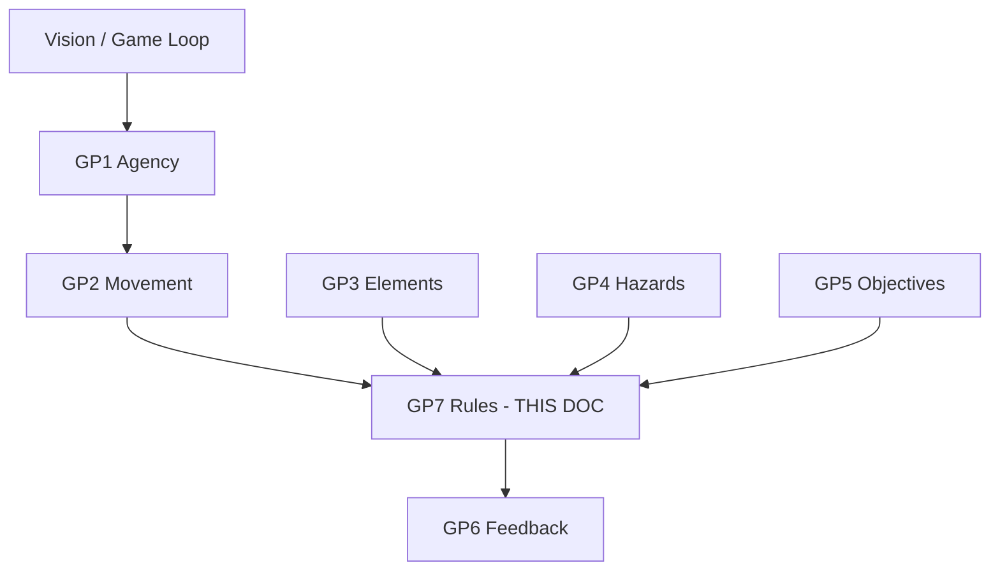
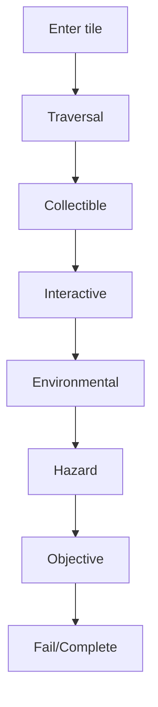

# Gameplay Rules

| Field                 | Value                                                                                                                                                                                                                                                                                                                                                                                                                                         |
| --------------------- | --------------------------------------------------------------------------------------------------------------------------------------------------------------------------------------------------------------------------------------------------------------------------------------------------------------------------------------------------------------------------------------------------------------------------------------------- |
| **Project**           | Labyrinth Legends                                                                                                                                                                                                                                                                                                                                                                                                                             |
| **Document Name**     | Gameplay Rules                                                                                                                                                                                                                                                                                                                                                                                                                                |
| **Document ID**       | LLDS-DOC-01-GP7-001                                                                                                                                                                                                                                                                                                                                                                                                                           |
| **Series**            | GP7 — Core Gameplay Specification                                                                                                                                                                                                                                                                                                                                                                                                             |
| **Version**           | 1.0.1                                                                                                                                                                                                                                                                                                                                                                                                                                         |
| **Status**            | Approved / Locked                                                                                                                                                                                                                                                                                                                                                                                                                             |
| **Owner**             | Apoorv                                                                                                                                                                                                                                                                                                                                                                                                                                        |
| **Prepared By**       | ChatGPT (specification) · Cursor (compiler)                                                                                                                                                                                                                                                                                                                                                                                                   |
| **Last Updated**      | 2026-06-29                                                                                                                                                                                                                                                                                                                                                                                                                                    |
| **Path**              | `docs/01_Game_Design/Gameplay/GP7_Gameplay_Rules.md`                                                                                                                                                                                                                                                                                                                                                                                          |
| **Dependencies**      | [Vision](../../00_Project/Vision.md) · [Game Loop](../Game_Loop.md) · [GP1 Player & Explorer](GP1_Player_Explorer.md) · [GP2 Movement System](GP2_Movement_System.md) · [GP3.1](GP3/GP3.1_Puzzle_Taxonomy.md)–[GP3.5](GP3/GP3.5_Puzzle_Composition_Level_Design_Rules.md) · [GP4 Hazards & Failure](GP4_Hazards_Failure.md) · [GP5 Objectives & Completion](GP5_Objectives_Completion.md) · [GP6 Gameplay Feedback](GP6_Gameplay_Feedback.md) |
| **Related Documents** | [Puzzle Elements](Puzzle_Elements.md) · [Gameplay.md](../Gameplay.md)                                                                                                                                                                                                                                                                                                                                                                         |

## Navigation

| ← Previous                                          | Next →                                | Index                                                      |
| --------------------------------------------------- | ------------------------------------- | ---------------------------------------------------------- |
| [GP6 — Gameplay Feedback](GP6_Gameplay_Feedback.md) | [Puzzle Elements](Puzzle_Elements.md) | [Gameplay Specs](README.md) · [LLDS Home](../../README.md) |

---

## Version History

| Version | Date       | Author           | Summary                                             |
| ------- | ---------- | ---------------- | --------------------------------------------------- |
| 1.0.1   | 2026-06-29 | Apoorv           | Approved and locked after Gameplay Phase 2 review   |
| 1.0.0   | 2026-06-29 | ChatGPT / Cursor | GP7 — Rule precedence and execution order authority |

## Change Log

| Version | Change                                                                                                |
| ------- | ----------------------------------------------------------------------------------------------------- |
| 1.0.1   | Approved and locked after Gameplay Phase 2 review                                                     |
| 1.0.0   | Initial specification: resolution model, step order, failure/completion precedence, conflict protocol |

---

## Purpose

This document defines **rule precedence**, **execution order**, **conflict resolution**, **gameplay determinism**, **interaction resolution**, and **system authority** for Labyrinth Legends.

GP7 is the **core gameplay rules authority** — not a mechanics catalogue. It explains how movement, puzzle elements, hazards, objectives, feedback, and level-state changes **resolve together** during planning, confirmation, execution, failure, and completion.

### What GP7 Defines

| Domain                | Coverage                      |
| --------------------- | ----------------------------- |
| Rule precedence       | Which system wins on conflict |
| Execution phases      | Planning → persistence        |
| Step resolution order | Per-tile event ordering       |
| Failure vs completion | Cause-order precedence        |
| Simultaneous events   | Same-step resolution          |
| Rule ownership        | Document authority matrix     |
| Testing expectations  | Reproducible outcomes         |

### What GP7 Does Not Define

| Excluded                    | Authority                                                   |
| --------------------------- | ----------------------------------------------------------- |
| Product vision              | [Vision](../../00_Project/Vision.md)                        |
| Player agency               | [GP1 Player & Explorer](GP1_Player_Explorer.md)             |
| Path validity rules         | [GP2 Movement System](GP2_Movement_System.md)               |
| Element definitions         | GP3.1–GP3.5                                                 |
| Hazard taxonomy             | [GP4 Hazards & Failure](GP4_Hazards_Failure.md)             |
| Objective taxonomy          | [GP5 Objectives & Completion](GP5_Objectives_Completion.md) |
| Feedback presentation       | [GP6 Gameplay Feedback](GP6_Gameplay_Feedback.md)           |
| UI / economy / architecture | Other docs                                                  |

> **Authority:** Feature documents (GP4–GP6) **reference** GP7. They **may not override** GP7 once approved. If GP7 conflicts with GP1/GP2/Vision/Game Loop, **higher authority wins** — report conflict.

### Design Intent

GP7 ensures every outcome is **predictable, fair, and testable** — from intention to final state.

---

## Intended Audience

| Role             | Use this document to…                                                                                                   |
| ---------------- | ----------------------------------------------------------------------------------------------------------------------- |
| Engineers        | Implement deterministic resolution pipeline                                                                             |
| Level Designers  | Understand consequence order                                                                                            |
| QA               | Write precedence test cases                                                                                             |
| AI Coding Agents | Generate or modify rule-related documentation/content while respecting authority rules and avoiding invented exceptions |
| Doc maintainers  | Route conflicts to correct owner                                                                                        |

## Table of Contents

1. [Purpose](#purpose)
2. [Relationship to Core Gameplay](#1-relationship-to-core-gameplay-documents)
3. [Gameplay Rule Philosophy](#2-gameplay-rule-philosophy)
4. [Gameplay Resolution Model](#3-gameplay-resolution-model)
5. [Planning Phase Rules](#4-planning-phase-rules)
6. [Path Validation Rules](#5-path-validation-rules)
7. [Commitment Phase Rules](#6-commitment-phase-rules)
8. [Execution Phase Rules](#7-execution-phase-rules)
9. [Step Resolution Rules](#8-step-resolution-rules)
10. [Interaction Resolution Rules](#9-interaction-resolution-rules)
11. [Hazard Resolution Rules](#10-hazard-resolution-rules)
12. [Objective Resolution Rules](#11-objective-resolution-rules)
13. [Failure vs Completion Precedence](#12-failure-vs-completion-precedence)
14. [Simultaneous Event Resolution](#13-simultaneous-event-resolution)
15. [State Change Rules](#14-state-change-rules)
16. [Determinism & Randomness Rules](#15-determinism--randomness-rules)
17. [Rule Ownership Model](#16-rule-ownership-model)
18. [Rule Conflict Protocol](#17-rule-conflict-protocol)
19. [Rule Testing Expectations](#18-rule-testing-expectations)
20. [Examples](#19-examples)
21. [Anti-Patterns](#20-anti-patterns)
22. [Designer / Developer Checklist](#21-designer--developer-checklist)
23. [MVP Summary Table](#22-mvp-summary-table)
24. [Locked Decisions](#23-locked-decisions)

---

## 1. Relationship to Core Gameplay Documents

| Document                                                    | GP7 relationship                                   |
| ----------------------------------------------------------- | -------------------------------------------------- |
| [Vision](../../00_Project/Vision.md)                        | Premium puzzle-adventure; determinism serves trust |
| [Game Loop](../Game_Loop.md)                                | Phases map to loop beats                           |
| [GP1 Player & Explorer](GP1_Player_Explorer.md)             | Agency, commitment — GP7 does not override         |
| [GP2 Movement System](GP2_Movement_System.md)               | Path validity — GP7 orders resolution around GP2   |
| [GP3.1–GP3.5](GP3/GP3.1_Puzzle_Taxonomy.md)                 | Element behaviour — GP7 orders when they resolve   |
| [GP4 Hazards & Failure](GP4_Hazards_Failure.md)             | Hazard meaning — GP7 orders hazard checks          |
| [GP5 Objectives & Completion](GP5_Objectives_Completion.md) | Objective meaning — GP7 orders completion checks   |
| [GP6 Gameplay Feedback](GP6_Gameplay_Feedback.md)           | Communicates outcomes — **does not decide** them   |
| **GP7 (this document)**                                     | **How all rules resolve together**                 |

### Design Intent

GP7 is the **conductor** — individual specs are the **instruments**.

---

## 2. Gameplay Rule Philosophy

| Principle                                   | Meaning                         |
| ------------------------------------------- | ------------------------------- |
| **Deterministic before dramatic**           | Same inputs → same outputs      |
| **Consistency before surprise**             | No puzzle-specific exceptions   |
| **Readability before complexity**           | Rules explainable to Player     |
| **Rule clarity before exception**           | Exceptions need Human approval  |
| **Authored intent before accident**         | Behaviour is designed           |
| **Player responsibility before punishment** | Failure ties to committed route |
| **System order before visual polish**       | GP6 reflects GP7 — not reverse  |
| **Testability before shortcuts**            | QA can reproduce                |

Every major outcome must be **answerable by rules**, not designer guesswork.

### Design Intent

If two engineers implement the same level differently, **GP7 is the tiebreaker**.

---

## 3. Gameplay Resolution Model

Eleven phases per attempt:

```mermaid
flowchart LR
  P1[1 Planning]
  P2[2 Validation]
  P3[3 Commitment]
  P4[4 Execution Start]
  P5[5 Step Resolution]
  P6[6 Interaction]
  P7[7 Hazard]
  P8[8 Objective]
  P9[9 Fail/Complete]
  P10[10 Feedback]
  P11[11 Persistence]
  P1 --> P2 --> P3 --> P4 --> P5
  P5 --> P6 --> P7 --> P8 --> P9 --> P10 --> P11
```

| Phase                       | Meaning               | Primary owner                 |
| --------------------------- | --------------------- | ----------------------------- |
| **1. Planning**             | Draw/edit path        | GP1, GP2, GP6                 |
| **2. Path Validation**      | Structural legality   | GP2                           |
| **3. Commitment**           | Confirm lock-in       | GP1, GP6                      |
| **4. Execution Start**      | Explorer begins route | GP2, GP1                      |
| **5. Step Resolution**      | Per-node pipeline     | **GP7**                       |
| **6. Interaction**          | GP3 triggers          | GP3, **GP7 order**            |
| **7. Hazard**               | GP4 checks            | GP4, **GP7 order**            |
| **8. Objective**            | GP5 checks            | GP5, **GP7 order**            |
| **9. Failure / Completion** | Terminal state        | GP4, GP5, **GP7 precedence**  |
| **10. Feedback / Summary**  | Present outcome       | GP6                           |
| **11. State Persistence**   | Save progress         | Data layer (out of GP7 scope) |

Phases 5–9 repeat **per step** until terminal state.

### Design Intent

One **resolution pipeline** — every level uses the same phases.

---

## 4. Planning Phase Rules

### Coverage

Route drawing · editing · invalid indication · risky indication · collectible/objective/hazard/dependency preview · optional warnings

### Rules

| Rule                             | Specification                                 |
| -------------------------------- | --------------------------------------------- |
| Warn, don't resolve              | No failure/completion in planning             |
| Unsafe paths drawable            | Player choice ([GP1](GP1_Player_Explorer.md)) |
| Invalid paths marked/rejected    | Per [GP2](GP2_Movement_System.md)             |
| Feedback supports, doesn't solve | [GP6](GP6_Gameplay_Feedback.md)               |
| No consequences awarded          | Planning is consequence-free                  |

### Design Intent

Planning is **rehearsal** — execution is **commitment**.

---

## 5. Path Validation Rules

**Owner:** [GP2](GP2_Movement_System.md) defines validity; **GP7** defines phase placement.

| Rule                              | Specification        |
| --------------------------------- | -------------------- |
| Valid but risky allowed           | Confirm permitted    |
| Invalid blocked or clearly marked | Cannot confirm (GP2) |
| Invalid ≠ gameplay failure        | Validation problem   |
| Correction before commitment      | Edit path            |

### Validation may check

Adjacency · traversability · blocked tiles · continuity · movement constraints · start/destination · traversal modifiers (GP2/GP3)

### Design Intent

Validation answers **"can this path exist?"** — not **"will you survive it?"**

---

## 6. Commitment Phase Rules

| Rule                             | Specification                            |
| -------------------------------- | ---------------------------------------- |
| Confirms explorer executes route | GP1 Player & Explorer commitment rules   |
| Player understands consequences  | [GP6](GP6_Gameplay_Feedback.md) warnings |
| Path locked per attempt          | Restart to replan                        |
| No silent path alteration        | Commitment is honest                     |
| Warnings may appear              | Inform, not nag (GP6)                    |

### Design Intent

Confirm is the **point of no return** for the drawn route.

---

## 7. Execution Phase Rules

| Rule                                     | Specification    |
| ---------------------------------------- | ---------------- |
| Explorer follows committed path in order | GP2              |
| No improvised route                      | GP1              |
| Step order deterministic                 | Sequential nodes |
| Simultaneous events use GP7 precedence   | §13–§14          |
| Important consequences not hidden        | GP6              |
| Terminal: complete, fail, or path end    | §12              |

### Design Intent

Execution is **playback of the plan** — not real-time steering.

---

## 8. Step Resolution Rules

**Standard per-step order** (GP7 authority):

| Step | Action                                  | Owner                           |
| ---- | --------------------------------------- | ------------------------------- |
| 1    | **Enter step**                          | GP2                             |
| 2    | **Validate current tile state**         | GP2/GP3                         |
| 3    | **Resolve traversal effect**            | GP2/GP3.2 (ice, conveyor, etc.) |
| 4    | **Resolve collectible pickup**          | GP3.2 / GP1 automatic           |
| 5    | **Resolve interactive trigger**         | GP3.3                           |
| 6    | **Resolve environmental state change**  | GP3.4                           |
| 7    | **Resolve hazard check**                | GP4                             |
| 8    | **Resolve objective check**             | GP5                             |
| 9    | **Resolve failure or completion check** | GP7 §12                         |
| 10   | **Emit required feedback**              | GP6                             |
| 11   | **Continue, stop, fail, or complete**   | GP7                             |

> Reviewed against GP1–GP6. Interactive before hazard so switch-disabled spikes resolve before spike check.

### Design Intent

Step order is **the engine contract** — implement once, test everywhere.

---

## 9. Interaction Resolution Rules

**Behaviour:** GP3 documents. **Order:** GP7 step 5–6.

| Rule                                               | Specification                                                  |
| -------------------------------------------------- | -------------------------------------------------------------- |
| Deterministic                                      | Same trigger → same effect                                     |
| Clear cause/effect                                 | GP3.3                                                          |
| Before dependent hazard/objective when appropriate | Switch before spike check                                      |
| No silent exceptions                               | Documented behaviour only                                      |
| Revisit policy                                     | [GP7-L11](GP3/GP3.3_Interactive_Elements.md) / GP2-Q01 aligned |

**Default revisit:** Toggle interactions re-fire each traversal unless authored one-time ([GP3.3](GP3/GP3.3_Interactive_Elements.md)).

### Design Intent

Interactions **change the board** before hazards judge the new state.

---

## 10. Hazard Resolution Rules

**Behaviour:** [GP4](GP4_Hazards_Failure.md). **When:** GP7 step 7.

| Rule                                                              | Specification                                |
| ----------------------------------------------------------------- | -------------------------------------------- |
| Active hazards use deterministic state                            | GP4                                          |
| Outcomes: fail, corrective, state change, objective impossibility | GP4                                          |
| No random lethal resolution                                       | GP4 fairness rules and GP7 determinism rules |
| GP4 behaviour not contradicted                                    | GP4 owns taxonomy                            |

**Guardian same-step rule:** Guardian collision on occupied tile → **capture/lethal failure** at step 7 before objective completion at step 8–9 unless guardian is corrective-only (authored).

### Design Intent

Hazards judge **the world after interactions** apply.

---

## 11. Objective Resolution Rules

**Behaviour:** [GP5](GP5_Objectives_Completion.md). **When:** GP7 step 8–9.

| Rule                                                 | Specification                                      |
| ---------------------------------------------------- | -------------------------------------------------- |
| Deterministic completion                             | GP5                                                |
| Required objectives before primary complete          | GP5 primary objective rules                        |
| Optional never blocks primary                        | GP5 optional objective rules                       |
| Mastery never blocks primary                         | GP5 mastery objective rules                        |
| No silent soft-lock                                  | Objective fail state (GP5 objective failure rules) |
| Completion cannot override unresolved lethal failure | GP7 §12                                            |

**Objective impossibility rule:** Objective impossibility is detected at step 8 when the current state makes a required objective unreachable; terminal objective failure resolves at step 9. If impossibility is only knowable at the exit attempt, it resolves at that exit attempt. Default: detect as soon as deterministically knowable after the causing step.

### Design Intent

Objectives judge **progress** after hazards judge **survival**.

---

## 12. Failure vs Completion Precedence

### Official precedence

| #   | Rule                                                                                                                  |
| --- | --------------------------------------------------------------------------------------------------------------------- |
| 1   | Structural invalidity → no commitment; **not failure**                                                                |
| 2   | During execution, **lethal/capture failure** at step 7 resolves before completion award at step 9 on **same step**    |
| 3   | If exit reached and no further steps, completion evaluates **after** that step's hazard check                         |
| 4   | **Objective impossibility** → failure when required objective unreachable                                             |
| 5   | Optional objective miss → **does not** block primary completion                                                       |
| 6   | Mastery miss → **does not** block primary completion                                                                  |
| 7   | Completion awarded only when required conditions + post-checks pass **and** no unresolved lethal failure on that step |

### Examples

| Scenario                                  | Result                               | Why                                                    |
| ----------------------------------------- | ------------------------------------ | ------------------------------------------------------ |
| Reach exit, no further steps              | **Complete**                         | Hazard checked on exit step first — if clear, complete |
| Step on exit + lethal spike same tile     | **Fail**                             | Hazard (7) before completion (9)                       |
| Collect key, fall in pit same step        | **Fail**                             | Pit at step 7; key collected at 4 but lethal ends step |
| Switch disables spikes, then cross        | **Continue**                         | Interaction (5) before hazard (7)                      |
| Bridge collapses after crossing, key safe | **Continue** if exit still reachable | State change; impossibility check at 8                 |
| Reach exit without key                    | **No complete**                      | GP5 primary unmet at step 8                            |
| Complete level, miss relic                | **Complete** + no Relic Seal         | Optional doesn't block                                 |
| Complete, miss mastery path length        | **Complete** + no Mastery Seal       | Mastery doesn't block                                  |

### Design Intent

**Cause order on the same step** decides ambiguous cases — not designer discretion.

---

## 13. Simultaneous Event Resolution

When multiple events occur on one step, apply **step order** (§8) first; then **intra-step precedence**:

| Conflict                      | Resolution principle                                                                       |
| ----------------------------- | ------------------------------------------------------------------------------------------ |
| Pickup + hazard               | Collectible (4) then hazard (7) — unless hazard blocks entry (tile impassable → fail at 2) |
| Switch + hazard               | Interactive (5) then hazard (7)                                                            |
| Door + movement               | Enter (1), interactive (5), continue                                                       |
| Guardian + explorer same tile | Hazard (7) — failure before objective (8)                                                  |
| Collapse + objective          | Environmental/interactive (5–6), then objective impossibility (8)                          |
| Environmental + exit          | Environmental (6), hazard (7), objective (8)                                               |
| Teleport + hazard             | Traversal (3) lands on tile, then full step order from (2)                                 |
| Resource expiry + completion  | Resource hazard (7), then completion (9)                                                   |

| Rule                          | Specification        |
| ----------------------------- | -------------------- |
| Stable precedence             | This document        |
| Testable same-step cases      | QA matrix required   |
| Explainable cause order       | GP6 failure feedback |
| Higher authority wins         | §16                  |
| No puzzle-specific exceptions | GP7 authority rules  |

### Design Intent

Same-step conflicts are **the hardest bugs** — GP7 names winners explicitly.

---

## 14. State Change Rules

| State type                  | Application                            |
| --------------------------- | -------------------------------------- |
| **Temporary**               | Plate hold, timed gate — may revert    |
| **Permanent (per attempt)** | Collapsed tile, consumed key           |
| **Reversible**              | Toggle switch — per GP3                |
| **Irreversible**            | One-time switch — stronger readability |
| **Level-local**             | Resets on Restart                      |
| **World-level**             | Persistence phase — downstream         |

| Rule                           | Specification  |
| ------------------------------ | -------------- |
| Deterministic transitions      | Authored rules |
| Communicated via GP6           | Feedback       |
| Irreversible needs strong read | GP3/GP4        |
| No silent objective invalidate | GP5/GP4 handle |

### Design Intent

State changes **stick** per authored rules — then next step reads new world.

---

## 15. Determinism & Randomness Rules

| Rule                                             | Specification                             |
| ------------------------------------------------ | ----------------------------------------- |
| Core puzzle resolution deterministic             | Mandatory                                 |
| No random lethal outcomes                        | GP4, GP7                                  |
| No random puzzle outcomes                        | GP3                                       |
| Procedural layouts OK                            | Must obey deterministic rules when played |
| Dynamic systems use fixed cycles                 | GP3.4                                     |
| Randomness never required to solve/fail/complete | Vision                                    |

### Design Intent

Randomness may **vary chambers** — never **resolve** them.

---

## 16. Rule Ownership Model

| Document                                                    | Owns                                              |
| ----------------------------------------------------------- | ------------------------------------------------- |
| [Vision](../../00_Project/Vision.md)                        | Product identity, pillars                         |
| [Game_Loop](../Game_Loop.md)                                | Loop architecture                                 |
| [GP1 Player & Explorer](GP1_Player_Explorer.md)             | Player agency, explorer identity, commitment      |
| [GP2 Movement System](GP2_Movement_System.md)               | Path validity, movement execution                 |
| **GP7 (this doc)**                                          | **Precedence, execution order, conflict routing** |
| [GP3.1–GP3.5](GP3/GP3.1_Puzzle_Taxonomy.md)                 | Element behaviour, composition                    |
| [GP4 Hazards & Failure](GP4_Hazards_Failure.md)             | Hazards, failure fairness                         |
| [GP5 Objectives & Completion](GP5_Objectives_Completion.md) | Objectives, completion, seals                     |
| [GP6 Gameplay Feedback](GP6_Gameplay_Feedback.md)           | Feedback presentation — **not outcomes**          |
| [Puzzle Elements](Puzzle_Elements.md)                       | Integration catalogue                             |
| [Gameplay.md](../Gameplay.md)                               | Integration summary                               |

**GP7 routes conflicts** to the owning document. GP6 **never** changes GP7 outcomes.

### Design Intent

Every rule has **one home** — GP7 owns **when**, not **what** (except precedence).

---

## 17. Rule Conflict Protocol

1. Identify affected gameplay outcome
2. Identify owning document
3. Compare authority level (Vision > Loop > GP1/GP2 > **GP7** > GP3 > GP4/GP5/GP6)
4. Preserve higher authority
5. Report conflict (review package / task summary)
6. Do not silently reinterpret
7. Record in [Decisions.md](../../00_Project/Decisions.md) if material
8. Update lower docs only after Human approval

### Design Intent

Conflicts are **governance events** — not implementation debates.

---

## 18. Rule Testing Expectations

| Test category              | Requirement           |
| -------------------------- | --------------------- |
| Path validation            | GP2 cases             |
| Step resolution order      | Full pipeline per §8  |
| Interaction + hazard order | Switch/spike matrix   |
| Objective completion       | GP5 primary/optional  |
| Failure vs completion      | §12 examples          |
| Simultaneous events        | §13 table             |
| State persistence          | Restart vs world save |
| Regression                 | Known conflict cases  |

| Rule                                  | Specification               |
| ------------------------------------- | --------------------------- |
| Reproducible outcomes                 | Mandatory                   |
| Critical precedence have examples     | §19                         |
| Independent of UI                     | Engine/domain tests         |
| QA describes expected result from GP7 | Test spec cites GP7 section |

### Design Intent

If it isn't **testable**, it isn't **shippable**.

---

## 19. Examples

### 1. Simple exit completion

| Field      | Value                           |
| ---------- | ------------------------------- |
| Setup      | Start → path → exit, no hazards |
| Commitment | Valid path confirmed            |
| Order      | Steps 1–8 pass; step 9 complete |
| Result     | **Escape Seal**                 |
| Fair       | Primary objective met           |

### 2. Exit without key

| Field      | Value                                                    |
| ---------- | -------------------------------------------------------- |
| Setup      | Locked exit, no key on path                              |
| Commitment | Valid path to exit                                       |
| Order      | Step 8: primary unmet                                    |
| Result     | **No completion** — door blocks / objective fail at exit |
| Fair       | GP5 taught key requirement                               |

### 3. Key pickup then trap

| Field  | Value                                 |
| ------ | ------------------------------------- |
| Setup  | Key then spike on route               |
| Order  | 4 pickup key, 7 lethal spike          |
| Result | **Fail** — key irrelevant after death |
| Fair   | Hazard on committed path              |

### 4. Switch disables spikes before cross

| Field  | Value                      |
| ------ | -------------------------- |
| Setup  | Switch then spike corridor |
| Order  | 5 switch ON, 7 spikes safe |
| Result | **Continue**               |
| Fair   | Interaction before hazard  |

### 5. Cracked tile after cross

| Field  | Value                                                |
| ------ | ---------------------------------------------------- |
| Setup  | Cross cracked tile, return needed                    |
| Order  | 6 collapse after enter; 8 check return path          |
| Result | **Continue** or **objective fail** if return blocked |
| Fair   | State change deterministic                           |

### 6. Guardian collision same step

| Field  | Value                                                             |
| ------ | ----------------------------------------------------------------- |
| Setup  | Path meets patrol on tile                                         |
| Order  | 7 capture fail before 8 objective                                 |
| Result | **Fail**                                                          |
| Fair   | Guardian collision follows GP7 hazard-before-objective resolution |

### 7. Treasure collected, primary failed

| Field  | Value                                   |
| ------ | --------------------------------------- |
| Setup  | Gem detour but no exit reached          |
| Order  | 4 gem; run ends without exit            |
| Result | **Fail** or incomplete — no Escape Seal |
| Fair   | Primary dominates                       |

### 8. Primary complete, mastery failed

| Field  | Value                                     |
| ------ | ----------------------------------------- |
| Setup  | Exit reached, over step ideal             |
| Order  | 9 primary complete; mastery eval post-run |
| Result | **Escape Seal** only                      |
| Fair   | GP5 mastery objective rules               |

### 9. Hidden path found, relic missed

| Field  | Value                                    |
| ------ | ---------------------------------------- |
| Setup  | Alt route to exit, relic on other branch |
| Result | **Complete**; optional relic not earned  |
| Fair   | Optional doesn't block                   |

### 10. Dynamic hazard cycle

| Field  | Value                                                                     |
| ------ | ------------------------------------------------------------------------- |
| Setup  | Jet cycles; path times OFF phase                                          |
| Order  | 7 hazard safe when timed correctly                                        |
| Result | **Complete** if planned phase matches                                     |
| Fair   | Deterministic cycle ([GP3.4](GP3/GP3.4_Environmental_Dynamic_Systems.md)) |

### Design Intent

Examples are **regression fixtures** — cite in tests.

---

## 20. Anti-Patterns

| Anti-pattern                                     | Why forbidden       |
| ------------------------------------------------ | ------------------- |
| Puzzle-specific rule exceptions                  | GP7 authority rules |
| Random resolution                                | Determinism         |
| Hidden precedence                                | Testability         |
| Completion overrides obvious failure             | §12                 |
| Failure overrides valid completion without cause | §12                 |
| Movement rules in feature docs                   | GP2 ownership       |
| Hazards redefine path validity                   | GP2 ownership       |
| Objectives redefine hazard failure               | GP4 ownership       |
| Feedback changes outcome                         | GP6 vs GP7          |
| UI state determines core rules                   | Engine domain       |
| Soft-lock without failure                        | GP4/GP5             |
| Contradictory docs                               | Governance          |
| Implementation bypassing GP7                     | Architecture debt   |

### Design Intent

**One pipeline, no exceptions** — unless Human approves and Decisions.md records it.

---

## 21. Designer / Developer Checklist

| #   | Question                                                      | Pass |
| --- | ------------------------------------------------------------- | ---- |
| 1   | What system **owns** this rule?                               |      |
| 2   | Movement, interaction, hazard, objective, feedback, or state? |      |
| 3   | Does **GP7** define **where** it resolves?                    |      |
| 4   | Outcome **deterministic**?                                    |      |
| 5   | Player can understand **cause**?                              |      |
| 6   | Conflict with GP1–GP6?                                        |      |
| 7   | **Silent soft-lock**? (must be No)                            |      |
| 8   | Failure/completion precedence **clear**?                      |      |
| 9   | **QA testable**?                                              |      |
| 10  | Respects **Vision** & **Game Loop**?                          |      |
| 11  | Avoids **puzzle-specific exceptions**?                        |      |

### Design Intent

New mechanic? **Map it to the pipeline first.**

---

## 22. MVP Summary Table

| Rule Area                | MVP Basic Requirement      | MVP Advanced Allowed?   | Post-MVP Expansion | Primary Owner | Testing Requirement     |
| ------------------------ | -------------------------- | ----------------------- | ------------------ | ------------- | ----------------------- |
| Planning                 | Warn only, no consequences | Risk preview            | Dependency arrows  | GP2/GP6       | No award on plan        |
| Path validation          | GP2 structural checks      | Danger vs invalid split | —                  | GP2           | Invalid block confirm   |
| Commitment               | Lock path on confirm       | Risk summary            | —                  | GP1/GP6       | Path immutable          |
| Execution                | Sequential steps           | —                       | —                  | GP2           | No route drift          |
| Step resolution          | Full §8 order              | —                       | —                  | **GP7**       | Pipeline unit tests     |
| Interactions             | GP3 behaviour in order     | Multi-trigger chains    | —                  | GP3/GP7       | Switch before spike     |
| Hazards                  | GP4 at step 7              | Guardian patrol         | —                  | GP4/GP7       | Lethal before complete  |
| Objectives               | GP5 at step 8–9            | Seal breakdown          | —                  | GP5/GP7       | Primary required        |
| Feedback                 | GP6 after step 9           | —                       | —                  | GP6           | Does not change outcome |
| Fail/complete precedence | §12 defaults               | —                       | —                  | **GP7**       | §19 examples            |
| Simultaneous events      | §13 table                  | —                       | Edge cases         | **GP7**       | Same-step matrix        |
| State persistence        | Restart resets level       | Checkpoint              | World save         | Data          | GP7 defines local       |
| Determinism              | No random resolve          | —                       | —                  | **GP7**       | Replay identical        |

### Design Intent

MVP ships with **full pipeline** — polish is optional, **order is not**.

---

## 23. Locked Decisions

### Locked Decisions

| ID      | Decision                                                                                                           | Source                             |
| ------- | ------------------------------------------------------------------------------------------------------------------ | ---------------------------------- |
| GP7-L01 | GP7 is authority for rule precedence and execution order                                                           | GP7 workshop                       |
| GP7-L02 | Gameplay outcomes must be deterministic                                                                            | GP7 · Vision                       |
| GP7-L03 | Valid but risky paths may be committed                                                                             | GP7 · GP1 · GP2                    |
| GP7-L04 | Invalid paths are validation problems, not gameplay failure                                                        | GP7 · GP2                          |
| GP7-L05 | Failure and completion resolve by cause order and §12 precedence                                                   | GP7 workshop                       |
| GP7-L06 | Optional objective failure does not block primary completion                                                       | GP7 · GP5 optional objective rules |
| GP7-L07 | Mastery failure does not block primary completion                                                                  | GP7 · GP5 mastery objective rules  |
| GP7-L08 | Feedback communicates outcomes but does not decide them                                                            | GP7 · GP6                          |
| GP7-L09 | Random lethal puzzle outcomes not allowed                                                                          | GP7 · GP4                          |
| GP7-L10 | Puzzle-specific rule exceptions forbidden unless Human approved                                                    | GP7 workshop                       |
| GP7-L11 | Per-step order: enter → traversal → collectible → interactive → environmental → hazard → objective → fail/complete | GP7 workshop                       |
| GP7-L12 | Lethal hazard on step resolves before completion award on same step                                                | GP7 workshop                       |
| GP7-L13 | Objective impossibility detected when deterministically knowable                                                   | GP7 · GP5 · GP4                    |
| GP7-L14 | Guardian collision on shared tile = failure at hazard step unless explicitly authored as corrective-only           | GP7 · GP4                          |

### Future Decisions (Deferred)

| Topic                          | Notes                       |
| ------------------------------ | --------------------------- |
| Checkpoint + precedence        | Level design                |
| Undo / rewind                  | Post-MVP unless approved    |
| Resource expiry exact tick     | GP4/GP5 overlap             |
| Teleport + hazard edge cases   | Extended §13 matrix         |
| Delayed hazard after exit step | Challenge levels only       |
| World collectible persistence  | Data layer                  |
| Adaptive hints                 | GP6 — no GP7 outcome change |

### Open Questions

| ID      | Question                                                        | Owner            | Status           |
| ------- | --------------------------------------------------------------- | ---------------- | ---------------- |
| GP7-Q01 | Ice slide: path includes slide extension or computed at step 3? | ChatGPT / Apoorv | Open — GP3.2-Q01 |
| GP7-Q02 | Multi-key door: validate key order at step 8 or only at door?   | ChatGPT / Apoorv | Open — GP3.2-Q02 |
| GP7-Q03 | Corrective hazard: stops step or ends attempt?                  | ChatGPT / Apoorv | Open             |
| GP7-Q04 | Post-exit environmental tick (chamber settling)?                | ChatGPT / Apoorv | Open — post-MVP  |

### Design Intent

GP7 **closes the gameplay spec stack** — engine implements this pipeline; integration docs synthesize.

---

## Cross References

- Core: [GP1 Player & Explorer](GP1_Player_Explorer.md) · [GP2 Movement System](GP2_Movement_System.md)
- GP3: [GP3.1 Puzzle Taxonomy](GP3/GP3.1_Puzzle_Taxonomy.md)–[GP3.5 Puzzle Composition & Level Design Rules](GP3/GP3.5_Puzzle_Composition_Level_Design_Rules.md)
- Features: [GP4 Hazards & Failure](GP4_Hazards_Failure.md) · [GP5 Objectives & Completion](GP5_Objectives_Completion.md) · [GP6 Gameplay Feedback](GP6_Gameplay_Feedback.md)
- Integration: [Puzzle_Elements](Puzzle_Elements.md) · [Gameplay.md](../Gameplay.md)
- Governance: [Vision](../../00_Project/Vision.md) · [Decisions](../../00_Project/Decisions.md)

---

## Navigation

| ← Previous                                          | Next →                                | Index                                                      |
| --------------------------------------------------- | ------------------------------------- | ---------------------------------------------------------- |
| [GP6 — Gameplay Feedback](GP6_Gameplay_Feedback.md) | [Puzzle Elements](Puzzle_Elements.md) | [Gameplay Specs](README.md) · [LLDS Home](../../README.md) |

