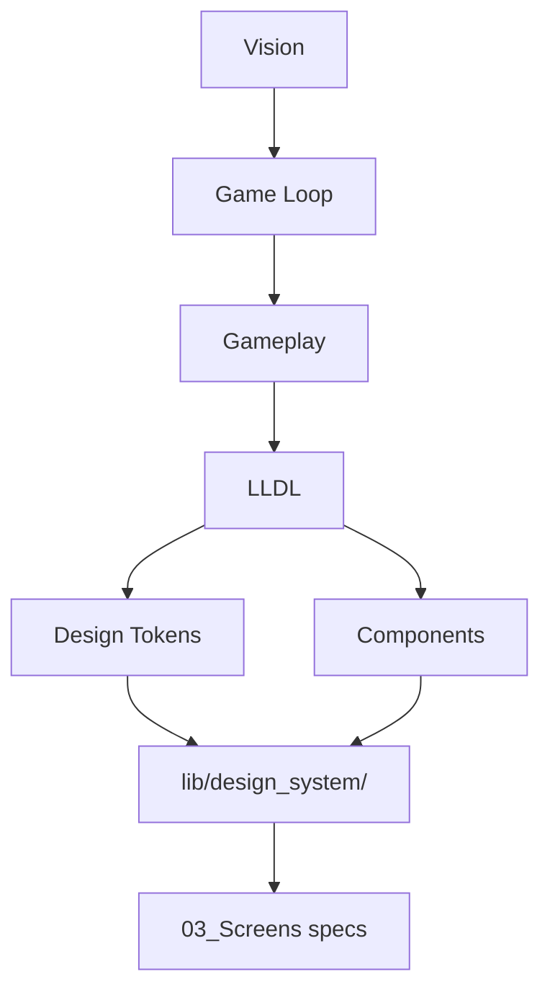

# LLDL — Labyrinth Legends Design Language

| Field | Value |
|-------|-------|
| **Document** | Labyrinth Legends Design Language (LLDL) |
| **Path** | `docs/02_Design_System/LLDL.md` |
| **Version** | 1.0.0 |
| **Status** | Draft — Awaiting ChatGPT Specification (implementation draft retained below) |
| **Last Updated** | 2026-06-28 |
| **Authoritative Source** | ChatGPT (product design) |
| **Compiler** | Cursor |
| **Phase** | Documentation Phase 1 — Knowledge Base |
| **Priority** | 4 of 5 (authoritative writing order) |
| **Mockup Reference** | `docs/assets/mockups/ui_board_master.png` |

## Navigation

| ← Previous | Next → | Index |
|------------|--------|-------|
| [Gameplay](../01_Game_Design/Gameplay.md) | [Game Bible](../01_Game_Design/Game_Bible.md) | [LLDS Home](../README.md) · [Design System Index](#related-documents) |

---

## Purpose

LLDL defines how Labyrinth Legends **looks, feels, and behaves** visually. It is the highest-priority design authority for all UI/UX work.

If code, a mockup sketch, or an AI suggestion conflicts with an **approved** LLDL — **LLDL wins** unless [Decisions](../00_Project/Decisions.md) records an explicit change.

## Scope

### In scope

- Visual identity and mood
- Color roles and semantic usage
- Typography, shape, and motion principles
- Component usage rules
- Anti-patterns and implementation constraints

### Out of scope

- Token hex values (see [Design_Tokens](Design_Tokens.md))
- Component API detail (see [Components](Components.md))
- Per-screen layout (see `docs/03_Screens/*`)
- Gameplay rules (see [Gameplay](../01_Game_Design/Gameplay.md))

## Dependencies

| Depends on | Notes |
|------------|-------|
| [Vision](../00_Project/Vision.md) | Thematic direction |
| [Game Bible](../01_Game_Design/Game_Bible.md) | Tone and fantasy alignment |

| Enables | Notes |
|---------|-------|
| [Design_Tokens](Design_Tokens.md) | Token definitions |
| [Components](Components.md) | Reusable UI catalog |
| `docs/03_Screens/*` | Screen specifications |
| `lib/design_system/` | Flutter implementation |

## Related Documents

| Document | Relationship |
|----------|--------------|
| [Design_Tokens](Design_Tokens.md) | Canonical token values |
| [Components](Components.md) | Component catalog |
| [Typography](Typography.md) | Type scale detail |
| [Colors](Colors.md) | Extended color guidance |
| [Animations](Animations.md) | Motion tokens |
| [Accessibility](Accessibility.md) | A11y requirements |
| [Vision](../00_Project/Vision.md) | Product north star |

## Design System Stack

## Documentation Priority

When documents conflict, **LLDL wins** over screen specs and feature prompts — see [LLDS Index](../README.md).

---

## 1. Identity Statement

> **Pending ChatGPT specification — implementation draft retained for reference.**

> Ancient Civilization × Mystical Technology × Premium Mobile Game

The UI is a **temple interface** — carved stone, engraved gold, cyan rune energy, portal light. Not a generic app. Not an arcade cabinet.

## 2. Mood Keywords

> **Pending ChatGPT approval of full mood matrix.**

| Use | Avoid |
|-----|-------|
| carved stone panels | flat Material cards |
| worn stone edges | sharp 4px default corners |
| engraved gold borders | plain gray borders |
| glowing cyan runes | cyberpunk neon pink |
| portal blue light | overly bright saturated UI |
| ancient gold accents | cartoon yellow |
| purple crystal highlights | random gradient buttons |
| dark temple backgrounds | white scaffold backgrounds |
| floating dust particles | busy particle overload |
| soft glows | harsh drop shadows |
| premium fantasy UI | childish rounded blobs |

## 3. Color Roles

> **Pending ChatGPT specification — token names authoritative in [Design_Tokens](Design_Tokens.md).**

| Role | Token | Usage |
|------|-------|-------|
| Primary action | `LLColor.ancientGold` | Play, Go, Confirm, main CTAs |
| Energy / path | `LLColor.energyCyan` | Drawn path, active runes, links |
| Portal | `LLColor.portalBlue` | Exit portals, magical focus |
| Crystal / gem | `LLColor.crystalPurple` | Gems, rare highlights |
| Background | `LLColor.templeBlack` | Screen base |
| Surface | `LLColor.stoneDark`, `stoneMid` | Panels, cards |
| Danger | `LLColor.dangerEmber` | Traps, errors, locks |

**Rule:** Primary actions are **gold**, not cyan. Cyan is for energy and paths.

## 4. Typography

> **Pending ChatGPT specification.**

| Style | Font | Usage |
|-------|------|-------|
| Title | Cinzel | Screen titles, world names |
| Body | Exo 2 | Descriptions, stats |
| Button | Exo 2 Semibold | Button labels, caps optional |

See [Typography](Typography.md) for sizes tied to `LLTextStyle.*`.

## 5. Shape Language

> **Pending ChatGPT specification.**

| Element | Guideline |
|---------|-----------|
| Panels | Chamfered or rounded panel radius — stone slab feel |
| Buttons | Button radius, gold gradient fill, engraved border |
| Icons | Thin gold strokes on dark stone |
| Maze tiles | Faux-isometric — logic 2D, presentation angled |

## 6. Motion

> **Pending ChatGPT specification.**

Calm, deliberate. Portal pulse, panel reveal, reward burst — see [Animations](Animations.md). No bouncy cartoon easing on core UI.

## 7. Components

> **Pending ChatGPT specification.**

All screens compose from [Components](Components.md) catalog. **No one-off styled buttons.**

## 8. Implementation Rules

When implementing Flutter:

1. Read this file + [Design_Tokens](Design_Tokens.md)
2. Use tokens from `lib/design_system/`
3. Never hardcode `Color(0xFF...)` in feature screens
4. Never use raw `ElevatedButton` / `Card` without LLDL wrapper

## 9. Anti-Patterns (forbidden)

| Anti-pattern | Reason |
|--------------|--------|
| Default Material 3 color scheme as-is | Breaks temple identity |
| Cyan primary buttons everywhere | Violates gold-primary rule |
| Generic `ListTile` without `LLPanel` | Breaks component system |
| Cyberpunk neon gradients | Off-brand |
| Cartoon mascots with thick outlines | Off-brand |
| Hardcoded padding magic numbers | Use `LLSpacing` tokens |

## 10. Review Criteria

> **Pending ChatGPT specification.**

Codex and human review check UI against this file before merge. See [Codex Review Checklist](../05_AI/Codex/Review_Checklist.md).

---

## Cross References

- Upstream: [Vision](../00_Project/Vision.md), [Game Bible](../01_Game_Design/Game_Bible.md)
- Downstream: [Gameplay](../01_Game_Design/Gameplay.md) (visual-only; no rules here)
- Implementation: [Design_Tokens](Design_Tokens.md), [Components](Components.md), `lib/design_system/`
- Governance: [Decisions](../00_Project/Decisions.md)

## Version History

| Version | Date | Author | Summary |
|---------|------|--------|---------|
| 1.0.0 | 2026-06-28 | Cursor | Phase 1 scaffold — metadata, navigation, cross-refs. Implementation draft retained; awaiting ChatGPT specification approval. |

## Open Items

| ID | Item | Owner | Status |
|----|------|-------|--------|
| LLDL-001 | Full identity and mood approval | ChatGPT | Open |
| LLDL-002 | Motion and animation principles | ChatGPT | Open |
| LLDL-003 | Component usage policy | ChatGPT | Open |

---

## Navigation

| ← Previous | Next → | Index |
|------------|--------|-------|
| [Gameplay](../01_Game_Design/Gameplay.md) | [Game Bible](../01_Game_Design/Game_Bible.md) | [LLDS Home](../README.md) |
