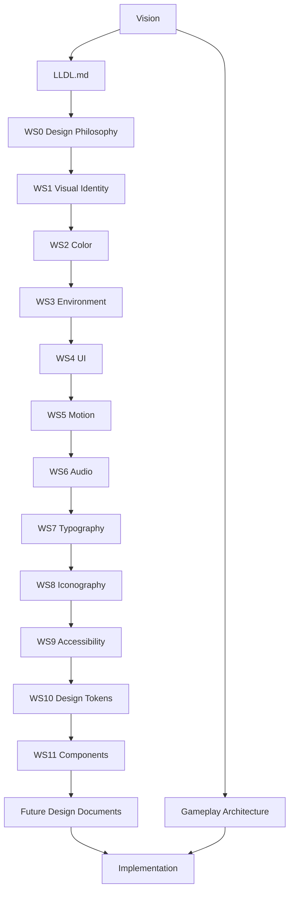

# LLDL — Labyrinth Legends Design Language

| Field | Value |
|-------|-------|
| **Project** | Labyrinth Legends |
| **Document Name** | Labyrinth Legends Design Language (LLDL) |
| **Document ID** | LLDL-DOC-ARCH-001 |
| **Path** | `docs/02_Design_System/LLDL/LLDL.md` |
| **Version** | 2.0.0 |
| **Status** | Approved |
| **Owner** | Apoorv |
| **Prepared By** | ChatGPT (architecture) · Cursor (compiler) |
| **Last Updated** | 2026-06-30 |
| **Phase** | Design System — Architecture Integration |
| **Priority** | Integration / Reference |
| **Dependencies** | [Vision](../../00_Project/Vision.md) · [Gameplay](../../01_Game_Design/Gameplay/Gameplay.md) · [WS0–WS11](WS0_Design_Philosophy.md) |
| **Related Documents** | [Design_Tokens](../Design_Tokens.md) · [Components](../Components.md) · [Decisions](../../00_Project/Decisions.md) · [Roadmap](../../00_Project/Roadmap.md) |

## Navigation

| ← Previous | Next → | Index |
|------------|--------|-------|
| [Gameplay](../../01_Game_Design/Gameplay/Gameplay.md) | [WS0 — Design Philosophy](WS0_Design_Philosophy.md) | [Documentation Home](../../README.md) · [Design System](#19-cross-references) |

---

## Version History

| Version | Date | Author | Summary |
|---------|------|--------|---------|
| 1.0.0 | 2026-06-28 | Cursor | Phase 1 scaffold — metadata, navigation, implementation draft retained for reference |
| 2.0.0 | 2026-06-30 | ChatGPT / Cursor | Permanent design architecture integration document — governance, hierarchy, workshop index; implementation draft removed |

## Change Log

| Version | Change |
|---------|--------|
| 2.0.0 | Replaced implementation draft with constitutional design architecture document; established workshop governance model parallel to Gameplay.md |
| 1.0.0 | Initial scaffold and provisional visual guidance pending workshop series |

---

## Document Authority

**LLDL.md is the consolidated design architecture reference for Labyrinth Legends.** It is subordinate only to [Vision](../../00_Project/Vision.md) on product intent.

| Conflict type | Authority |
|---------------|-----------|
| Product intent (why, pillars, audience, non-goals) | [Vision](../../00_Project/Vision.md) wins |
| Design philosophy within LLDL | [WS0 — Design Philosophy](WS0_Design_Philosophy.md) wins |
| Channel-specific design meaning (color, motion, type, etc.) | Respective WS workshop wins within its domain |
| Mechanical rules and outcome resolution | [Gameplay](../../01_Game_Design/Gameplay/Gameplay.md) wins |
| Design architecture, inheritance, and governance | **LLDL.md wins** |
| Token values, component APIs, screen layout | [Design_Tokens](../Design_Tokens.md) · [Components](../Components.md) · `docs/03_Screens/*` — must align with LLDL workshops |

`LLDL.md` **summarizes, connects, and indexes** the authoritative design workshop series — it does **not** replace them.

When any design document conflicts with Vision on **product intent**, Vision overrides until [Decisions](../../00_Project/Decisions.md) records an explicit, Human-approved exception.

---

## Intended Audience

| Role | Use this document to… |
|------|------------------------|
| Design System Leads | Understand governance before authoring downstream specs |
| UI/UX Designers | Find the correct workshop authority for any design question |
| Artists & Technical Artists | Align visual work with the unified design architecture |
| Animators | Locate motion authority without redefining workshop rules |
| Audio Designers | Locate audio authority within the design stack |
| Engineers | Understand inheritance before implementing `lib/design_system/` |
| Screen Spec Authors | Compose screens from approved authorities — not ad-hoc styling |
| Accessibility Reviewers | Trace inclusive defaults to WS9 and downstream implementation |
| AI Agents | Refuse design invention outside the approved architecture |
| Reviewers | Verify proposals inherit from the correct workshop layer |

---

## Table of Contents

1. [Purpose](#1-purpose)
2. [Scope](#2-scope)
3. [Relationship to Vision](#3-relationship-to-vision)
4. [Relationship to Gameplay Architecture](#4-relationship-to-gameplay-architecture)
5. [Design Architecture Philosophy](#5-design-architecture-philosophy)
6. [Workshop Structure](#6-workshop-structure)
7. [Workshop Overview](#7-workshop-overview)
8. [Design Language Hierarchy](#8-design-language-hierarchy)
9. [Authority Matrix](#9-authority-matrix)
10. [Governance](#10-governance)
11. [Inheritance Rules](#11-inheritance-rules)
12. [Architecture Review Process](#12-architecture-review-process)
13. [Future Documentation](#13-future-documentation)
14. [Maintaining Design Consistency](#14-maintaining-design-consistency)
15. [Summary](#15-summary)
16. [Design Document Map](#16-design-document-map)
17. [What LLDL.md Must Not Do](#17-what-lldlmd-must-not-do)
18. [Design Review Checklist](#18-design-review-checklist)
19. [Cross References](#19-cross-references)
20. [Approval Status](#20-approval-status)

---

## 1. Purpose

This document is the **permanent design architecture authority** for Labyrinth Legends. It answers:

> **What is the complete design language system, and where does each design decision live?**

The Labyrinth Legends Design Language (LLDL) exists to ensure that every visual, auditory, interactive, and experiential element belongs to the same cohesive world.

| Architecture | Defines |
|--------------|---------|
| [Gameplay](../../01_Game_Design/Gameplay/Gameplay.md) | **How the game works** — rules, agency, movement, puzzles, hazards, objectives, feedback |
| **LLDL** (this document and its workshops) | **How the game feels** — identity, presentation, communication, atmosphere, inclusivity |

Without LLDL, design quality becomes inconsistent across screens, features, artists, and production phases. LLDL preserves long-term consistency across the entire project by establishing a single architectural foundation that all future design work must inherit.

`LLDL.md` is the **map**, not the **terrain**. Readers use it to orient; they design, specify, and implement from WS0–WS11 and downstream design documents.

---

## 2. Scope

### In scope

- Design language purpose and architectural role
- Relationship to Vision and Gameplay Architecture
- Workshop organization and authority model
- Governance, inheritance, and conflict resolution
- Architecture review workflow
- Future documentation categories that inherit from LLDL
- Long-term consistency principles

### Out of scope

- Workshop content (see [WS0–WS11](WS0_Design_Philosophy.md))
- Token hex values and naming (see [Design_Tokens](../Design_Tokens.md) — governed by [WS10](WS10_Design_Tokens_Language.md))
- Component APIs and catalog detail (see [Components](../Components.md) — governed by [WS11](WS11_Components_Language.md))
- Per-screen layout (see `docs/03_Screens/*`)
- Gameplay rules and outcome resolution (see [Gameplay](../../01_Game_Design/Gameplay/Gameplay.md))
- Engine architecture, frameworks, or production workflows (see `docs/04_Technical/*`)
- Code, widget trees, or platform-specific implementation detail

---

## 3. Relationship to Vision

[Vision](../../00_Project/Vision.md) is the highest authority for **product intent**. LLDL translates that intent into a governed experiential architecture.

| Vision provides | LLDL provides |
|-----------------|---------------|
| Why the game exists | How the game should be experienced |
| Player fantasy and pillars | Visual, auditory, and interactive identity |
| Premium positioning and non-goals | Consistency rules that protect that positioning |
| Audience and emotional goals | Channel authorities that express those goals |

Vision does not prescribe color palettes, motion curves, or component families. LLDL does not redefine player pillars, genre positioning, or product non-goals.

Both architectures inherit directly from Vision. Neither overrides the other on its own domain.

```text
Vision.md
    ├── Gameplay Architecture  →  "What should happen?"
    └── Design Language      →  "How should it be experienced?"
```

When product intent and design presentation appear to conflict, **preserve Vision** and reconcile presentation through the appropriate workshop — or record an explicit exception in [Decisions](../../00_Project/Decisions.md).

---

## 4. Relationship to Gameplay Architecture

Gameplay and Design are **complementary but independent architectures**. They solve different questions and must remain separable so that rules can be tested without UI and presentation can evolve without rewriting mechanics.

| Question | Governing architecture |
|----------|------------------------|
| What should happen? | [Gameplay](../../01_Game_Design/Gameplay/Gameplay.md) and GP specifications |
| How should it be experienced? | LLDL and WS0–WS11 workshops |

### Complementary relationship

| Gameplay owns | Design owns |
|---------------|-------------|
| Player agency and commitment model | Visual identity and atmospheric presentation |
| Path validation and execution | UI philosophy and interface restraint |
| Puzzle element behaviour | Environmental construction language |
| Hazard and objective resolution | Motion, audio, and feedback temperament |
| Rule precedence (GP7) | Accessibility defaults and inclusive communication |
| Deterministic outcome logic | Token semantics and component inheritance |

Gameplay feedback ([GP6](../../01_Game_Design/Gameplay/GP6_Gameplay_Feedback.md)) describes **what** the player must understand. Design workshops describe **how** that understanding is communicated — without deciding outcomes.

### Full product stack

```text
Vision
    ↓
Gameplay Architecture          Design Language (LLDL)
    ↓                              ↓
GP1–GP7 · GP3 · GP4–GP6        WS0–WS11
    ↓                              ↓
Implementation                 Design_Tokens · Components · Screens
    ↓                              ↓
        lib/game_engine/    ·    lib/design_system/
                    ↓
              Player Experience
```

Neither architecture overrides the other. Implementation must satisfy both.

---

## 5. Design Architecture Philosophy

Labyrinth Legends is a **premium mobile puzzle adventure**. Its design language must feel like a **unified ancient magical temple interface** — not a generic mobile app, arcade cabinet, or disposable UI skin.

### Architectural principles

| Principle | Meaning |
|-----------|---------|
| **Single coherent world** | Every channel — color, type, motion, audio, iconography — expresses the same fantasy |
| **Philosophy before decoration** | WS0 intent governs all downstream channels |
| **Authority before preference** | Workshops outrank individual taste, mockup drift, and feature convenience |
| **Inheritance before invention** | New design work extends approved authorities; it does not fork parallel styles |
| **Consistency over novelty** | Repeated identity beats one-off spectacle |
| **Accessibility is architectural** | Inclusive defaults are designed in — not patched on |
| **Implementation independence** | Architecture remains valid regardless of engine, framework, or platform |

### Design intent

LLDL exists so that a designer joining in year three sees the same architectural logic as day one. The workshops are permanent — not provisional style notes.

---

## 6. Workshop Structure

The Labyrinth Legends Design Language is organized as a **workshop series** — permanent architecture documents, each owning a distinct design domain.

| Property | Rule |
|----------|------|
| **Permanence** | Approved workshops become locked design authorities |
| **Separation** | Each workshop owns one domain; domains do not bleed |
| **Sequence** | WS0 establishes philosophy; WS1–WS11 express channel and system authorities |
| **Non-redefinition** | Lower workshops and documents extend — never contradict — higher authorities |
| **Integration** | `LLDL.md` indexes and governs the series; it does not duplicate workshop prose |

### Workshop index

| ID | Document | Domain |
|----|----------|--------|
| WS0 | [Design Philosophy](WS0_Design_Philosophy.md) | Foundational design intent |
| WS1 | [Visual Identity](WS1_Visual_Identity_Artistic_Direction.md) | Artistic identity |
| WS2 | [Color Language](WS2_Color_Language.md) | Color meaning and application |
| WS3 | [Environment Language](WS3_Environment_Language.md) | Environmental identity and world construction |
| WS4 | [UI Language](WS4_UI_Language.md) | Interaction philosophy and interface identity |
| WS5 | [Motion Language](WS5_Motion_Language.md) | Movement, transitions, and animation philosophy |
| WS6 | [Audio Language](WS6_Audio_Language.md) | Music, ambience, sound design, and silence |
| WS7 | [Typography Language](WS7_Typography_Language.md) | Written communication and textual hierarchy |
| WS8 | [Iconography Language](WS8_Iconography_Language.md) | Symbolic communication and visual signs |
| WS9 | [Accessibility Language](WS9_Accessibility_Language.md) | Inclusive, readable, player-first design |
| WS10 | [Design Tokens Language](WS10_Design_Tokens_Language.md) | Semantic design decision systems |
| WS11 | [Components Language](WS11_Components_Language.md) | Reusable interface building blocks |

Every future design document must inherit from one or more of these authorities.

---

## 7. Workshop Overview

Concise architectural summaries only. Full authority lives in each workshop document.

### WS0 — Design Philosophy

Defines the fundamental philosophy that governs every design decision — why the visual language exists, what emotional experience it must deliver, and how design choices are evaluated.

### WS1 — Visual Identity

Defines the artistic identity of the game — materials, mood, premium positioning, and the Ancient Tech × Mystical Ruins visual direction.

### WS2 — Color Language

Defines the meaning and application of color — semantic roles, emphasis hierarchy, and channel-specific color behaviour.

### WS3 — Environment Language

Defines environmental identity and world construction — ruins, temples, spatial language, and environmental continuity.

### WS4 — UI Language

Defines interaction philosophy and interface identity — density, restraint, temple-interface presentation, and UI anti-patterns.

### WS5 — Motion Language

Defines movement, transitions, and animation philosophy — calm, deliberate, premium motion temperament.

### WS6 — Audio Language

Defines music, ambience, sound design, and silence philosophy — atmospheric identity and audio feedback boundaries.

### WS7 — Typography Language

Defines written communication and textual hierarchy — functional readability and ceremonial inscription treatment.

### WS8 — Iconography Language

Defines symbolic communication and visual signs — sigils, icons, and symbolic restraint.

### WS9 — Accessibility Language

Defines inclusive, readable, player-first design principles — multichannel communication and default accessibility posture.

### WS10 — Design Tokens Language

Defines semantic design decision systems — how workshop meaning becomes named, governed tokens.

### WS11 — Components Language

Defines reusable interface building blocks — component philosophy, inheritance, states, and governance.

---

## 8. Design Language Hierarchy

Authority flows **downward**. Lower-level documents inherit from higher-level documents.

```text
Vision.md
    ↓
LLDL.md                    ← Design architecture integration (this document)
    ↓
WS0 — Design Philosophy    ← Highest workshop authority
    ↓
WS1 – WS11                 ← Channel and system authorities
    ↓
Future Design Documents    ← Screens, catalogs, guides, themed specs
    ↓
Implementation             ← Design_Tokens, Components, design_system/, assets
```



### Layer roles

| Layer | Role |
|-------|------|
| **Vision** | Product north star |
| **LLDL.md** | Architecture map, governance, and workshop index |
| **WS0** | Philosophical intent for all design channels |
| **WS1–WS9** | Channel authorities — meaning within each sensory and communication domain |
| **WS10–WS11** | System authorities — tokens and components as governed design infrastructure |
| **Future documents** | Applied design specs that inherit workshop meaning |
| **Implementation** | Concrete values, APIs, assets, and code — must align with architecture |

---

## 9. Authority Matrix

| Design Area | Governing Document |
|-------------|-------------------|
| Product intent | [Vision](../../00_Project/Vision.md) |
| Design architecture & governance | **LLDL.md** (this document) |
| Philosophy | [WS0 — Design Philosophy](WS0_Design_Philosophy.md) |
| Visual Identity | [WS1 — Visual Identity](WS1_Visual_Identity_Artistic_Direction.md) |
| Color | [WS2 — Color Language](WS2_Color_Language.md) |
| Environment | [WS3 — Environment Language](WS3_Environment_Language.md) |
| UI | [WS4 — UI Language](WS4_UI_Language.md) |
| Motion | [WS5 — Motion Language](WS5_Motion_Language.md) |
| Audio | [WS6 — Audio Language](WS6_Audio_Language.md) |
| Typography | [WS7 — Typography Language](WS7_Typography_Language.md) |
| Iconography | [WS8 — Iconography Language](WS8_Iconography_Language.md) |
| Accessibility | [WS9 — Accessibility Language](WS9_Accessibility_Language.md) |
| Design Tokens | [WS10 — Design Tokens Language](WS10_Design_Tokens_Language.md) |
| Components | [WS11 — Components Language](WS11_Components_Language.md) |
| Token values | [Design_Tokens](../Design_Tokens.md) |
| Component catalog | [Components](../Components.md) |
| Gameplay rules | [Gameplay](../../01_Game_Design/Gameplay/Gameplay.md) |

Within-channel conflicts resolve to the workshop listed above. Cross-channel conflicts resolve through WS0 philosophy and explicit [Decisions](../../00_Project/Decisions.md) when required.

---

## 10. Governance

Permanent governance rules for the Labyrinth Legends Design Language.

### Constitutional rules

- **Workshops are permanent architecture.** Approved workshops are not informal guides — they are locked authorities.
- **Lower-level documents may extend but never contradict higher-level authorities.**
- **Vision wins on product intent.** No design document may silently redefine pillars, audience, or non-goals.
- **Gameplay wins on mechanical rules.** Presentation must support gameplay — never contradict outcome logic.
- **WS0 wins on design philosophy.** Channel workshops express philosophy; they do not replace it.
- **Channel workshops win within their domain.** Color meaning belongs to WS2; motion temperament belongs to WS5.
- **Design Tokens cannot redefine Color Language.** [WS10](WS10_Design_Tokens_Language.md) names and governs tokens; [WS2](WS2_Color_Language.md) owns color meaning.
- **Components cannot redefine Tokens.** [WS11](WS11_Components_Language.md) composes tokens and channels; [WS10](WS10_Design_Tokens_Language.md) owns token hierarchy.
- **Future design documents must inherit from approved workshops.** Screens, HUD specs, store UI, and character guides are applications — not parallel style systems.
- **Architectural changes require formal review.** Amendments follow the architecture review process; they are not drive-by edits.
- **Consistency is more important than individual preference.** Personal taste, mockup drift, and feature convenience do not override architecture.
- **Exceptions require explicit recording.** Material deviations belong in [Decisions](../../00_Project/Decisions.md) with Human approval.

### Conflict protocol

When a lower-level document appears to contradict a higher-level authority:

1. **Preserve** the higher-level document
2. **Report** the conflict in a review package or escalation
3. **Recommend** the required documentation update
4. **Do not** invent a new interpretation

---

## 11. Inheritance Rules

### Extension rule

Lower-level documents **extend** higher-level authorities. They may add specificity — token values, component APIs, screen layouts, asset examples — but may not redefine workshop meaning.

### Inheritance chain examples

| Document | Inherits from |
|----------|---------------|
| [Design_Tokens](../Design_Tokens.md) | WS10 · WS2 · WS5 · WS7 · related channel workshops |
| [Components](../Components.md) | WS11 · WS4 · WS10 · channel workshops as needed |
| `docs/03_Screens/*` | WS4 · WS11 · relevant channel workshops |
| [Typography](../Typography.md) | WS7 · WS10 |
| [Icons](../Icons.md) | WS8 · WS10 |
| [Animations](../Animations.md) | WS5 · WS10 |
| [Accessibility](../Accessibility.md) | WS9 · WS10 · WS11 |
| `lib/design_system/` | Design_Tokens · Components · screen specs |

### Prohibited inheritance patterns

| Pattern | Why forbidden |
|---------|---------------|
| Screen spec invents new color meaning | Bypasses WS2 |
| Component hardcodes raw values | Bypasses WS10 and Design_Tokens |
| Feature UI creates one-off button style | Bypasses WS11 |
| Mockup becomes authority without workshop alignment | Bypasses entire architecture |
| Gameplay spec defines visual tokens | Violates architecture separation |

---

## 12. Architecture Review Process

The official workflow for design architecture documents.

```text
Workshop Discussion
        ↓
Master Prompt
        ↓
Markdown Generation
        ↓
Architecture Review
        ↓
Revision
        ↓
Approval
        ↓
LOCKED
```

| Stage | Outcome |
|-------|---------|
| **Workshop Discussion** | Domain intent explored; conflicts surfaced early |
| **Master Prompt** | Architectural scope and constraints defined |
| **Markdown Generation** | Cursor compiles specification into LLDS format |
| **Architecture Review** | Codex, ChatGPT, and Human verify governance and alignment |
| **Revision** | Conflicts resolved; links and hierarchy validated |
| **Approval** | Document status set to Approved |
| **LOCKED** | Document becomes permanent authority; changes require formal amendment |

Approved workshops become permanent design authorities. `LLDL.md` itself follows this process and remains locked after approval unless a workshop materially changes or Human Owner authorizes revision.

Review packages live in [`docs/99_Reviews/`](../../99_Reviews/README.md). See [Cursor Workflow](../../05_AI/Cursor/Workflow.md) and [Codex Review Checklist](../../05_AI/Codex/Review_Checklist.md).

---

## 13. Future Documentation

Future design documentation inherits from LLDL workshops. These categories are **examples only** — they are not defined here.

| Category | Typical inheritance |
|----------|---------------------|
| Screens | WS4 · WS11 · relevant channels |
| HUD | WS4 · WS11 · WS5 · WS9 |
| Menus | WS4 · WS11 · WS7 |
| Store UI | WS4 · WS11 · WS2 · WS0 |
| Settings | WS4 · WS11 · WS9 |
| Rewards | WS11 · WS5 · WS6 · WS2 |
| Inventory & Artifacts | WS11 · WS1 · WS8 |
| Characters | WS1 · WS3 · WS5 |
| Enemies & Hazards (visual) | WS1 · WS3 · WS2 · GP4 presentation alignment |
| VFX | WS1 · WS5 · WS2 |
| Branding & Marketing Assets | WS1 · WS0 |
| Illustration Guides | WS1 · WS3 |
| Loading Screens | WS4 · WS5 · WS6 |
| Tutorials | WS4 · WS7 · WS9 · GP6 alignment |
| Accessibility Implementation | WS9 · WS10 · WS11 |
| Theme Guides | WS0 · WS1 · channel workshops |
| Platform Adaptations | WS9 · WS4 · WS10 — without redefining identity |

New documents must declare their workshop dependencies and follow the inheritance rules in [§11](#11-inheritance-rules).

### Planned future artifact

| Document | Description | Authority |
|----------|-------------|-----------|
| `Asset_Bible.md` | Future production handbook for visual assets, icons, App Store artwork, marketing images, AI prompt libraries, export standards, naming conventions, and asset versioning. It inherits from LLDL and does not redefine design philosophy. | LLDL.md → Asset_Bible.md → Production assets |

---

## 14. Maintaining Design Consistency

Long-term consistency is an architectural obligation — not a polish pass.

### Consistency practices

| Practice | Application |
|----------|-------------|
| **Start from the map** | Open `LLDL.md` to find the owning workshop before designing |
| **Compose, don't invent** | Build from [Components](../Components.md) and tokens — not raw widgets |
| **Channel fidelity** | Apply color, motion, type, and audio through their workshops |
| **Cross-review gameplay alignment** | Confirm presentation supports GP6 feedback without deciding outcomes |
| **Reject drift early** | Flag mockups and implementations that bypass workshops |
| **Record material exceptions** | Use [Decisions](../../00_Project/Decisions.md) — not silent overrides |
| **Review at integration boundaries** | New screens, store flows, and major features require architecture check |

### Anti-patterns (architectural)

| Anti-pattern | Correct response |
|--------------|------------------|
| Generic mobile app UI | Return to WS0 and WS4 |
| Cyberpunk / neon arcade styling | Return to WS1 and WS2 |
| Cartoonish UI blobs | Return to WS1 and WS11 |
| One-off feature styling | Extend WS11 component families |
| Hardcoded visual constants in features | Route through WS10 and Design_Tokens |
| Accessibility as late overlay | Return to WS9 defaults |
| Design inventing gameplay outcomes | Return to Gameplay architecture |

Detailed channel anti-patterns live in their respective workshops — not in this document.

---

## 15. Summary

The Labyrinth Legends Design Language is a **governed architectural system** that ensures every experiential element belongs to one cohesive world.

| Statement | Truth |
|-----------|-------|
| **Vision** defines why the game exists | Product intent authority |
| **Gameplay** defines how the game works | Mechanical authority |
| **LLDL** defines how the game feels | Experiential authority |
| **WS0–WS11** own design meaning within their domains | Workshop authorities |
| **LLDL.md** connects the workshops into one architecture | Integration authority |
| **Implementation** expresses architecture — it does not replace it | Design_Tokens · Components · design_system |

This document is the primary entry point for every designer, artist, UI/UX designer, technical artist, animator, audio designer, and developer working on Labyrinth Legends. All future design work inherits from this foundation.

---

## 16. Design Document Map

| Document | ID | Authority Layer | Owns | Does Not Own |
|----------|-----|-----------------|------|--------------|
| [Vision.md](../../00_Project/Vision.md) | — | Product | North star, pillars, player fantasy, premium positioning | Color roles, component APIs, movement rules |
| **LLDL.md** (this doc) | LLDL-INT | Integration | Architecture map, governance, workshop index, inheritance | Channel meaning, token values, screen layouts |
| [WS0 — Design Philosophy](WS0_Design_Philosophy.md) | WS0 | Workshop | Design philosophy and decision framework | Token hex values, component trees |
| [WS1 — Visual Identity](WS1_Visual_Identity_Artistic_Direction.md) | WS1 | Workshop | Artistic identity and visual direction | UI density rules, gameplay feedback |
| [WS2 — Color Language](WS2_Color_Language.md) | WS2 | Workshop | Color meaning and application | Token naming tables |
| [WS3 — Environment Language](WS3_Environment_Language.md) | WS3 | Workshop | Environmental construction language | Level puzzle composition |
| [WS4 — UI Language](WS4_UI_Language.md) | WS4 | Workshop | UI philosophy and interface identity | Per-screen layout |
| [WS5 — Motion Language](WS5_Motion_Language.md) | WS5 | Workshop | Motion and animation philosophy | Animation curve implementation |
| [WS6 — Audio Language](WS6_Audio_Language.md) | WS6 | Workshop | Audio identity and sound philosophy | Audio middleware configuration |
| [WS7 — Typography Language](WS7_Typography_Language.md) | WS7 | Workshop | Typographic hierarchy and roles | Font file licensing |
| [WS8 — Iconography Language](WS8_Iconography_Language.md) | WS8 | Workshop | Symbolic communication | Icon SVG assets |
| [WS9 — Accessibility Language](WS9_Accessibility_Language.md) | WS9 | Workshop | Accessibility philosophy and defaults | Platform accessibility API detail |
| [WS10 — Design Tokens Language](WS10_Design_Tokens_Language.md) | WS10 | Workshop | Token hierarchy and governance | Hex values |
| [WS11 — Components Language](WS11_Components_Language.md) | WS11 | Workshop | Component philosophy and governance | Widget implementation |
| [Design_Tokens](../Design_Tokens.md) | — | Implementation spec | Canonical token values | Color meaning redefinition |
| [Components](../Components.md) | — | Implementation spec | Component catalog and APIs | Component philosophy redefinition |
| `docs/03_Screens/*` | — | Applied spec | Per-screen layout and composition | New design language invention |

---

## 17. What LLDL.md Must Not Do

This document must **not**:

- Redefine workshop content — link to WS0–WS11 instead
- Prescribe implementation technology, frameworks, or engine choices
- Define component APIs, token hex values, or screen layouts
- Define gameplay rules, hazard logic, or objective resolution
- Include code, widget trees, or production workflows
- Duplicate channel anti-patterns that belong in WS1–WS11
- Resolve product-intent conflicts without Vision or Decisions
- Override Gameplay architecture on mechanical questions
- Silently approve design drift because a mockup looks acceptable

If detailed guidance is needed, **direct readers to the owning workshop or downstream spec**.

---

## 18. Design Review Checklist

Use before approving new design documentation, major UI features, or architecture amendments.

| Check | Question |
|-------|----------|
| ☐ Vision alignment | Does this support Vision pillars without redefining product intent? |
| ☐ Gameplay separation | Does this present outcomes without deciding them? |
| ☐ Workshop inheritance | Does every design decision trace to WS0–WS11? |
| ☐ Correct authority | Is the owning workshop identified for each channel? |
| ☐ No redefinition | Does this extend — not contradict — higher authorities? |
| ☐ Token discipline | Are values routed through WS10 and Design_Tokens? |
| ☐ Component discipline | Are UI blocks routed through WS11 and Components? |
| ☐ Accessibility defaults | Does WS9 govern inclusive communication? |
| ☐ Consistency | Would this look like the same game in a different feature? |
| ☐ Exception recorded | Are material deviations logged in Decisions? |
| ☐ Review package | Is a review package created for major architectural changes? |

---

## 19. Cross References

### Product & gameplay

- [Vision.md](../../00_Project/Vision.md)
- [Gameplay.md](../../01_Game_Design/Gameplay/Gameplay.md)
- [Game Loop.md](../../01_Game_Design/Game_Loop/Game_Loop.md)
- [Game Bible.md](../../01_Game_Design/Game_Bible.md)

### Design workshops (WS0–WS11)

- [WS0 — Design Philosophy](WS0_Design_Philosophy.md)
- [WS1 — Visual Identity](WS1_Visual_Identity_Artistic_Direction.md)
- [WS2 — Color Language](WS2_Color_Language.md)
- [WS3 — Environment Language](WS3_Environment_Language.md)
- [WS4 — UI Language](WS4_UI_Language.md)
- [WS5 — Motion Language](WS5_Motion_Language.md)
- [WS6 — Audio Language](WS6_Audio_Language.md)
- [WS7 — Typography Language](WS7_Typography_Language.md)
- [WS8 — Iconography Language](WS8_Iconography_Language.md)
- [WS9 — Accessibility Language](WS9_Accessibility_Language.md)
- [WS10 — Design Tokens Language](WS10_Design_Tokens_Language.md)
- [WS11 — Components Language](WS11_Components_Language.md)

### Implementation & applied specs

- [Design_Tokens](../Design_Tokens.md)
- [Components](../Components.md)
- [Typography](../Typography.md)
- [Icons](../Icons.md)
- [Colors](../Colors.md)
- [Animations](../Animations.md)
- [Audio](../Audio.md)
- [Accessibility](../Accessibility.md)
- `docs/03_Screens/*`
- `lib/design_system/`

### Governance

- [Decisions.md](../../00_Project/Decisions.md)
- [Roadmap.md](../../00_Project/Roadmap.md)
- [99_Reviews](../../99_Reviews/README.md)
- [Cursor Workflow](../../05_AI/Cursor/Workflow.md)
- [Codex Review Checklist](../../05_AI/Codex/Review_Checklist.md)

---

## 20. Approval Status

**Status: Approved**

`LLDL.md` is the design architecture integration document for the LLDL workshop series.

| Ready for | Status |
|-----------|--------|
| Codex engineering review | ✅ |
| ChatGPT product review | ✅ |
| Human approval | ✅ |

### Workshop series status

| Workshop | Status |
|----------|--------|
| WS0 — Design Philosophy | Approved |
| WS1 — Visual Identity | Approved |
| WS2 — Color Language | Approved |
| WS3 — Environment Language | Approved |
| WS4 — UI Language | Approved |
| WS5 — Motion Language | Approved |
| WS6 — Audio Language | Approved |
| WS7 — Typography Language | Approved |
| WS8 — Iconography Language | Approved |
| WS9 — Accessibility Language | Approved |
| WS10 — Design Tokens Language | Approved |
| WS11 — Components Language | Approved |

The Labyrinth Legends Design Language workshop series is complete and approved.

LLDL.md is now the permanent design architecture integration authority for Labyrinth Legends.

Future design documents must inherit from LLDL.md and WS0–WS11, and must not contradict them without formal architecture review.

---

## Navigation

| ← Previous | Next → | Index |
|------------|--------|-------|
| [Gameplay](../../01_Game_Design/Gameplay/Gameplay.md) | [WS0 — Design Philosophy](WS0_Design_Philosophy.md) | [Documentation Home](../../README.md) · [Design System](#19-cross-references) |
