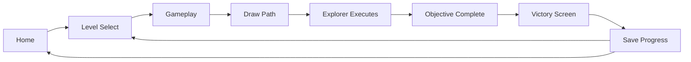
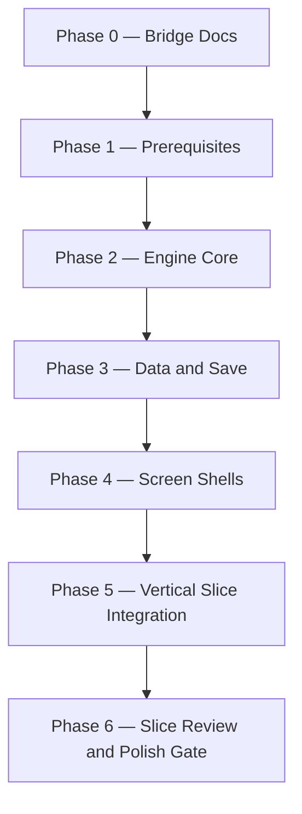

# Technical Implementation Plan

| Field | Value |
|-------|-------|
| **Project** | Labyrinth Legends |
| **Document Name** | Technical Implementation Plan |
| **Document ID** | LLDS-DOC-04-TIP-001 |
| **Path** | `docs/04_Technical/Technical_Implementation_Plan.md` |
| **Version** | 1.0.0 |
| **Status** | Approved |
| **Owner** | Apoorv |
| **Prepared By** | Cursor (compiler) |
| **Last Updated** | 2026-07-02 |
| **Phase** | Pre-Implementation — Vertical Slice Bridge |
| **Dependencies** | [Vision](../00_Project/Vision.md) · [Game Loop](../01_Game_Design/Game_Loop/Game_Loop.md) · [Gameplay](../01_Game_Design/Gameplay/Gameplay.md) · [LLDL](../02_Design_System/LLDL/LLDL.md) · [Asset Bible](../06_Asset_Bible/Asset_Bible.md) · [Architecture](Architecture.md) |
| **Related Documents** | [Folder_Structure](Folder_Structure.md) · [State_Management](State_Management.md) · [Save_System](Save_System.md) · [Roadmap](../00_Project/Roadmap.md) · [Prototype Status](../00_Project/Prototype_Status.md) · [AGENTS.md](../../AGENTS.md) |

## Navigation

| ← Previous | Next → | Index |
|------------|--------|-------|
| [Asset Bible](../06_Asset_Bible/Asset_Bible.md) | [Architecture](Architecture.md) | [Technical README](README.md) · [LLDS Home](../README.md) |

---

## Version History

| Version | Date | Author | Summary |
|---------|------|--------|---------|
| 1.0.0 | 2026-07-02 | Cursor | Initial bridge document — first playable vertical slice roadmap |
| 1.0.1 | 2026-07-02 | ChatGPT | ChatGPT review completed — approved after minor hygiene fixes |

---

## Table of Contents

1. [Purpose](#1-purpose)
2. [Source-of-Truth Hierarchy](#2-source-of-truth-hierarchy)
3. [Technical Readiness Assessment](#3-technical-readiness-assessment)
4. [Current Technical Document Status](#4-current-technical-document-status)
5. [Architecture Assumptions](#5-architecture-assumptions)
6. [Proposed Flutter Folder Structure](#6-proposed-flutter-folder-structure)
7. [Vertical Slice Scope](#7-vertical-slice-scope)
8. [Required Systems](#8-required-systems)
9. [Explicitly Out-of-Scope Systems](#9-explicitly-out-of-scope-systems)
10. [Implementation Phases](#10-implementation-phases)
11. [Review Gates](#11-review-gates)
12. [Risks and Open Questions](#12-risks-and-open-questions)
13. [Cursor Implementation Rules](#13-cursor-implementation-rules)
14. [Technical Docs to Expand Before Coding](#14-technical-docs-to-expand-before-coding)
15. [Recommended First Coding Milestone](#15-recommended-first-coding-milestone)

---

## 1. Purpose

This document is the **implementation bridge** between approved LLDS design authority and the first playable Flutter build.

It answers:

> **What must be built, in what order, and under which constraints, to deliver the first vertical slice without redefining design or over-engineering infrastructure?**

### What this document does

- Translates approved product, gameplay, design, and asset documentation into a **practical engineering roadmap**
- Defines the **first vertical slice** end-to-end flow and its minimum systems
- Records **architecture assumptions** for a solo Flutter developer using AI-assisted workflows
- Identifies **gaps in technical documentation** that must be closed before coding
- Establishes **review gates** and **implementation phases**

### What this document does not do

- Redefine [Gameplay](../01_Game_Design/Gameplay/Gameplay.md), GP1–GP7, or puzzle element behaviour
- Redefine [LLDL](../02_Design_System/LLDL/LLDL.md) or visual language
- Redefine [Asset Bible](../06_Asset_Bible/Asset_Bible.md) production rules
- Specify Firebase, analytics, procedural generation, monetization, or LiveOps
- Replace [Architecture](Architecture.md) — it **extends** it with slice-specific sequencing

### Target vertical slice

```text
Home
  → Level Select
    → Gameplay
      → Draw Path
        → Explorer Executes Path
          → Objective Complete
            → Victory Screen
              → Save Progress
```

This slice proves the **Draw Your Fate** core loop in a shippable-quality shell — not the full MVP content catalogue.

---

## 2. Source-of-Truth Hierarchy

When documents conflict during implementation, **the higher authority wins**. This plan is subordinate to all design authority and must not silently override it.

```text
Vision.md
    ↓
Game_Loop.md
    ↓
Gameplay Core Specifications — GP1, GP2, GP7
    ↓
GP3 Puzzle Element Series — GP3.1–GP3.5
    ↓
Gameplay Feature Specifications — GP3 Integration, GP4–GP6
    ↓
Gameplay.md
    ↓
LLDL.md + WS0–WS11 workshops
    ↓
Asset Bible (AB0–AB6) + Asset_Bible.md
    ↓
Screen specs — docs/03_Screens/*
    ↓
Technical Documentation — docs/04_Technical/*
    ↓
Technical_Implementation_Plan.md (this document)
    ↓
Implementation — lib/, test/, assets/
```

| Question type | Authoritative source |
|---------------|---------------------|
| Product intent, pillars, non-goals | [Vision](../00_Project/Vision.md) |
| Player flow across time scales | [Game Loop](../01_Game_Design/Game_Loop/Game_Loop.md) |
| Mechanical rules, precedence, movement | [Gameplay](../01_Game_Design/Gameplay/Gameplay.md) + GP1–GP7 |
| Visual identity, tokens, components | [LLDL](../02_Design_System/LLDL/LLDL.md) + [Design_Tokens](../02_Design_System/Design_Tokens.md) + [Components](../02_Design_System/Components.md) |
| Screen layout and UX composition | `docs/03_Screens/*` |
| Asset production standards | [Asset Bible](../06_Asset_Bible/Asset_Bible.md) |
| Engineering structure, persistence, state | `docs/04_Technical/*` |
| **Build order and slice scope** | **This document** |

### Conflict protocol

1. **Preserve** the higher-authority document
2. **Report** the conflict in a review package and/or [Decisions](../00_Project/Decisions.md)
3. **Do not** invent a workaround that redefines gameplay or design

---

## 3. Technical Readiness Assessment

### Summary

| Area | Status | Notes |
|------|--------|-------|
| Product vision | ✅ Ready | Vision v2.1.0 — Approved — Locked |
| Game loop architecture | ✅ Ready | Game Loop v2.1.0 — Approved — Locked |
| Gameplay specifications | ✅ Ready | GP1–GP7 + Gameplay.md approved; Puzzle_Elements.md draft |
| Design language | ✅ Ready | LLDL v2.0.0 approved; WS0–WS11 authored |
| Asset production | ✅ Ready | Asset Bible AB0–AB6 approved |
| Screen specifications | ⚠️ Partial | Home, Level Select, Gameplay, Victory exist; shells not rebuilt |
| Technical architecture | ⚠️ Partial | Core principles documented; level schema not formalized |
| Flutter design system | ⚠️ Partial | `lib/design_system/` exists; prototype screens still reference legacy paths |
| Game engine | ⚠️ Partial | Prototype engine exists; must rebuild against GP7 pipeline |
| Local persistence | ⚠️ Partial | Save_System.md defines intent; repository not aligned to spec |
| Level content | ✅ Ready | Schema v1.0.1 in Level_Format.md (Approved); levels 001–003 include `schemaVersion` |
| Automated tests | ❌ Not ready | Prototype tests stale; engine tests required before UI wiring |
| Stub technical docs | ⏸️ Deferred | Firebase, Analytics, Maze_Generator, Procedural_Generation |

### Readiness verdict

**Documentation is sufficient to plan the vertical slice.**  
**Implementation should not begin until §14 prerequisite technical docs are expanded.**

The highest-risk gap is **engine rebuild against GP7** — M0 prerequisites are complete; M1 engine coding may proceed per review package `M0_3_Architecture_Readiness_Review.md`.

### Prototype code status

Existing `lib/` code is **reference only** per [Prototype Status](../00_Project/Prototype_Status.md). Do not extend `ruins_*`, `app_colors`, or prototype theme. Rebuild through `design_system/` and a testable `game_engine/`.

---

## 4. Current Technical Document Status

| Document | Status | Authority for implementation? | Notes |
|----------|--------|------------------------------|-------|
| [Architecture.md](Architecture.md) | **Partial** | ✅ Yes — principles | Layers, flows, testing policy; level format in Level_Format.md |
| [Folder_Structure.md](Folder_Structure.md) | **Partial** | ✅ Yes — structure | Target layout; prototype diverges |
| [State_Management.md](State_Management.md) | **Partial** | ✅ Yes — Riverpod patterns | Provider types defined; gameplay refactor noted |
| [Save_System.md](Save_System.md) | **Partial** | ✅ Yes — local MVP | SharedPreferences model; cloud deferred |
| [Technical_Implementation_Plan.md](Technical_Implementation_Plan.md) | **Approved** | ✅ Yes — sequencing | This document |
| [Level_Format.md](Level_Format.md) | **Approved** | ✅ Yes — M0.1 complete | Hand-authored level JSON schema |
| [Firebase.md](Firebase.md) | **Stub** | ❌ No | Placeholder only — not in vertical slice |
| [Analytics.md](Analytics.md) | **Stub** | ❌ No | Placeholder only — not in vertical slice |
| [Maze_Generator.md](Maze_Generator.md) | **Stub** | ❌ No | Placeholder only — hand-authored levels only |
| [Procedural_Generation.md](Procedural_Generation.md) | **Stub** | ❌ No | Placeholder only — not in vertical slice |
| [Coding_Standards.md](Coding_Standards.md) | **Approved** | ✅ Yes — M0.2 complete | Engineering rulebook for Phase 2 |
| [Engine_Architecture.md](Engine_Architecture.md) | **Approved & Locked** | ✅ Yes — M1 prerequisite | Pure Dart engine architecture contract |

### Missing technical documents (recommended)

| Document | Priority | Purpose |
|----------|----------|---------|
| `Level_Format.md` | **P0 — Approved** | Formal JSON schema — see [Level_Format.md](Level_Format.md) |
| `Coding_Standards.md` | **P0 — Approved** | Engineering standards — see [Coding_Standards.md](Coding_Standards.md) |
| `Engine_Architecture.md` | **P0 — Approved & Locked** | Engine architecture contract — see [Engine_Architecture.md](Engine_Architecture.md) |
| `Engine_Session.md` | **P1 — recommended** | Proven implementation reference; after first stable M1 engine (non-blocking per M0.3) |
| `Navigation.md` | **P2 — before screen wiring** | go_router route table and deep-link policy |

These are **not** stubs — they should be authored as part of Phase 1 prerequisites (§10).

---

## 5. Architecture Assumptions

These assumptions apply to the vertical slice unless [Decisions](../00_Project/Decisions.md) records an explicit exception.

### Platform and stack

| Assumption | Rationale |
|------------|-----------|
| **Flutter** (iOS + Android) | Project standard |
| **Riverpod** (`flutter_riverpod`) | Documented in State_Management.md |
| **go_router** | Route management for vertical-slice navigation; align with `lib/app/router.dart` from `Folder_Structure.md` |

### Layering (from Architecture.md)

```text
features/       → UI screens; render state; forward input only
design_system/  → LLDL tokens and components; no game rules
data/           → repositories, models, providers; orchestration
game_engine/    → pure Dart rules, session, path, resolution
core/           → service interfaces, env, utils
```

**Game logic never in widgets.** Path validation and GP7 resolution must be unit-testable without Flutter.

### Data and content

| Assumption | Rationale |
|------------|-----------|
| **Hand-authored level JSON only** | Tutorial arc 001–005; no procedural generation |
| Levels in `assets/levels/{worldId}/level_NNN.json` | Existing asset layout |
| **One world for slice** — `world_1` (Crumbling Temple) | MVP scope per Worlds.md |
| **3–5 levels in first playable build** | Tutorial band sufficient for slice proof |

### Persistence

| Assumption | Rationale |
|------------|-----------|
| **Local save only** — SharedPreferences | Save_System.md MVP |
| `ProgressRepository` as sole write path | No widget writes |
| Persist: completed levels, stars, attempts, settings | Slice minimum |

### Services

| Assumption | Rationale |
|------------|-----------|
| **No Firebase SDK** in vertical slice | Stub doc; post-MVP |
| **No analytics SDK** | Stub doc; post-MVP |
| **Mock service interfaces** for ads/IAP/remote config if referenced | Interface-first; no real SDK wiring |
| Shop, Daily Challenge routes may exist as **disabled or stub screens** | Avoid scope creep |

### Design implementation

| Assumption | Rationale |
|------------|-----------|
| All UI uses `lib/design_system/` | LLDL mandatory |
| Screen specs in `docs/03_Screens/*` govern layout | No ad-hoc Material styling |
| Asset Bible governs art production; placeholder art acceptable in slice | AB2 for game assets |

### Simplicity principle

Prefer **working, testable, readable code** over premature abstraction. One repository implementation, one world, one resolution pipeline — expand only when the slice proves the loop.

---

## 6. Proposed Flutter Folder Structure

Target structure for the vertical slice. Aligns with [Folder_Structure.md](Folder_Structure.md); annotations note slice-specific scope.

```text
lib/
  main.dart
  app/
    app.dart                    # MaterialApp + LLDL theme
    router.dart                 # go_router — slice routes only

  design_system/                # LLDL — extend existing
    tokens/
    components/
    theme/
    showcase/                   # dev-only component reference

  core/
    env/
    services/                   # interfaces + mocks only (no Firebase)
    utils/

  game_engine/                  # pure Dart — rebuild for GP7
    models/
      level_definition.dart
      maze_grid.dart
      grid_position.dart
      gameplay_phase.dart
    path/
      path_validator.dart
      path_executor.dart
    session/
      gameplay_session.dart
      step_resolver.dart        # GP7 per-step pipeline
    objectives/
      objective_evaluator.dart  # GP5 — exit completion for slice
    rewards/
      reward_calculator.dart    # stars from path node count

  data/
    models/
      player_progress.dart
      level_progress.dart
    repositories/
      level_repository.dart
      progress_repository.dart
    local/
      local_progress_store.dart
    providers.dart

  features/
    home/
    level_select/               # world_1 levels only
    gameplay/
      presentation/
        gameplay_screen.dart
        maze_board.dart         # painter — input forward only
    level_complete/             # Victory screen
    settings/                   # minimal — optional in slice

assets/
  levels/
    world_1/
      level_001.json            # slice minimum
      level_002.json
      level_003.json
      ...                       # 004–005 for full tutorial band

test/
  game_engine/                  # required before UI wiring
  data/
  integration/                  # smoke: Home → Victory
```

### Import rules (unchanged)

| Layer | May import |
|-------|------------|
| `features/` | `design_system`, `data`, `game_engine` models for display |
| `game_engine/` | Nothing from Flutter UI |
| `data/` | `game_engine`, `core` |
| `design_system/` | Flutter only — no game rules |

### Prototype retirement

Remove or stop extending: `lib/core/widgets/ruins_*`, `lib/core/constants/app_colors.dart`, `lib/app/theme.dart`, `lib/game_engine/generation/`.

---

## 7. Vertical Slice Scope

### Player flow



### Screen scope

| Screen | Route | Slice requirement |
|--------|-------|-------------------|
| Home | `/` | LLDL shell; Play → Level Select |
| Level Select | `/worlds/world_1/levels` | Show levels 001–005; lock/unlock from save |
| Gameplay | `/play/:levelId` | Draw path, confirm, execute, outcome |
| Victory | `/complete/:levelId` | Stars, rewards summary, Next / Retry / Level Select |
| Settings | `/settings` | Optional minimal — audio toggle stub acceptable |
| Pause | overlay | Retry + resume — per Pause.md if time permits |

**Deferred from navigation:** Shop, Daily Challenge, Profile, multi-world select.

### Gameplay scope (mechanical)

Aligned with [Gameplay.md §14](../01_Game_Design/Gameplay/Gameplay.md#14-mvp-gameplay-scope-summary) — **minimal forms only**:

| System | Vertical slice form | Authority |
|--------|---------------------|-----------|
| Planning / commitment | Draw, undo, erase, confirm (Go) | GP1, GP2 |
| Path validation | Orthogonal node path; invalid blocks confirm | GP2, GP7 |
| Execution | Deterministic step-by-step traversal | GP2 |
| Step resolution | GP7 pipeline — **subset for tutorial elements only** | GP7 |
| Objectives | **Exit reach** (level 001); add gems (002), key+lock (003) as band progresses | GP5 |
| Hazards | **None in level 001**; one simple family when level justifies it | GP4 |
| Feedback | Validation messages, execution phase HUD hide, win/lose states | GP6, WS4 |
| Rewards | Star thresholds from path node count | GP5, Level_Design.md, Level_Format.md §14 |
| Save | Completion flag, stars, attempts per level | Save_System.md |

### Content scope

| Content | In slice | Notes |
|---------|----------|-------|
| World 1 | ✅ | Crumbling Temple only |
| Levels 001–003 | ✅ Minimum | Prove draw → exit → save |
| Levels 004–005 | ⚠️ Stretch | Fog + relic — after core loop stable |
| Levels 006–020 | ❌ | Existing JSON may remain; not required for slice |
| Procedural chambers | ❌ | Hand-authored only |

### Visual scope

| Element | Slice expectation |
|---------|-------------------|
| LLDL tokens + core components | Required |
| Maze rendering | Functional painter — walls, floor, start, exit, player token |
| Art assets | Placeholder or minimal AB2-compliant sprites acceptable |
| Motion / particles / audio | Stub or minimal — not blocking slice |
| Victory celebration | LLDL-compliant layout; polish can follow |

---

## 8. Required Systems

Systems **must exist** for the vertical slice to be considered playable.

### 8.1 Application shell

| System | Responsibility |
|--------|----------------|
| App bootstrap | `main.dart`, ProviderScope, theme |
| Router | go_router routes for slice screens |
| Environment | Dev vs prod flags; no Firebase init |

### 8.2 Design system

| System | Responsibility |
|--------|----------------|
| Tokens | LLColor, LLSpacing, LLRadius, LLTextStyle, etc. |
| Components | LLButton, LLPanel, LLScreenBackground, LLTopBar, LLCurrencyChip |
| Theme | app_theme.dart — single LLDL entry point |

### 8.3 Level data

| System | Responsibility |
|--------|----------------|
| Level JSON loader | Load from assets; parse to LevelDefinition |
| Level repository | Cache loaded levels; expose by id |
| Schema validation | Reject malformed JSON at load time |

### 8.4 Game engine (pure Dart)

| System | Responsibility |
|--------|----------------|
| Maze grid model | Cells, walls, start, exit, elements |
| Path validator | GP2 structural legality |
| Gameplay session | Phase state: drawing → executing → won/lost |
| Path executor | Step-by-step traversal |
| Step resolver | GP7 order for supported elements |
| Objective evaluator | Exit reached → complete |
| Reward calculator | Stars from path node count vs thresholds |

### 8.5 Gameplay UI

| System | Responsibility |
|--------|----------------|
| MazeBoard | Render grid; accept draw input; forward to session |
| Phase-aware HUD | WS4 progressive HUD — hide during execution |
| Control bar | Undo, Erase, Go — drawing phase only |
| Execution presentation | Animate explorer along path |

### 8.6 Meta screens

| System | Responsibility |
|--------|----------------|
| Home screen | Entry point; navigate to level select |
| Level select | List levels; show lock/star state |
| Victory screen | Display outcome; navigation actions |

### 8.7 Persistence

| System | Responsibility |
|--------|----------------|
| LocalProgressStore | SharedPreferences read/write |
| ProgressRepository | recordCompletion, getLevelProgress, isLevelUnlocked |
| Provider invalidation | Refresh UI after save |

### 8.8 Testing

| System | Responsibility |
|--------|----------------|
| Engine unit tests | Path validation, execution, exit completion |
| Repository tests | Save/load round-trip |
| Integration smoke | Optional — full flow with test harness |

---

## 9. Explicitly Out-of-Scope Systems

Do **not** implement these in the vertical slice unless Human explicitly approves scope expansion.

### Infrastructure

| System | Reason |
|--------|--------|
| Firebase (Auth, Firestore, Remote Config) | Stub doc; local-only slice |
| Analytics (Firebase, custom) | Stub doc |
| Cloud save / sync | Save_System.md future section |
| Crashlytics | Post-MVP |
| Push notifications | Post-MVP |

### Content generation

| System | Reason |
|--------|--------|
| Maze generator | Stub doc; hand-authored JSON only |
| Procedural generation | Stub doc |
| Daily challenge generation | Requires generator + LiveOps |

### Product systems

| System | Reason |
|--------|--------|
| Monetization (IAP, ads) | Vision non-goals for slice; mock interfaces only |
| Shop economy | Economy not locked for implementation |
| LiveOps / events | Roadmap Phase 5 |
| Multi-world progression | One world sufficient |
| Profile / social / leaderboard | Post-MVP |

### Gameplay breadth

| System | Reason |
|--------|--------|
| Full GP3 element catalogue | One simple form per family over time; not all in slice |
| Full GP4 hazard families | Add when level design requires |
| Adaptive hints | GP6 open question — post-MVP |
| Checkpoint retry | GP4 open question — defer |
| Discovery/fog engine | Level 004+ — stretch goal |

### Polish

| System | Reason |
|--------|--------|
| Final art pass | Placeholder acceptable |
| Full audio suite | WS6 — post-slice |
| Haptics | Post-slice |
| Cinematic transitions | Post-slice |

---

## 10. Implementation Phases

Phases are **sequential**. Do not skip review gates (§11).



### Phase 0 — Bridge documentation (current)

**Goal:** Establish implementation roadmap without writing game code.

| Deliverable | Status |
|-------------|--------|
| Technical_Implementation_Plan.md | This document |
| docs/04_Technical/README.md | Index |
| Review package | docs/99_Reviews/Releases/ |

### Phase 1 — Technical prerequisites

**Goal:** Close documentation gaps that block safe coding.

| Task | Output |
|------|--------|
| Author `Level_Format.md` | JSON schema, validation rules, element encoding — **Approved (M0.1)** |
| Expand `Coding_Standards.md` | Naming, imports, test policy, review expectations — **Approved (M0.2)** |
| M0.3 Architecture Readiness Review | Validate architecture sufficient for M1 — **Approved (M0 complete)** |
| Author `Engine_Architecture.md` | Engine architecture contract EA-001–EA-008 — **Approved & Locked (v1.0.1)** |
| Extend `Architecture.md` | Level load flow, GP7 class mapping summary |
| Author `Engine_Session.md` (recommended) | Session lifecycle, phase transitions — after first stable M1 engine |
| Audit tutorial levels 001–003 | `schemaVersion` aligned; optional `tutorial` blocks remain |

**Exit criteria:** M0 complete — M1 engine coding may proceed.

### Phase 2 — Engine core

**Goal:** Testable pure Dart engine — no UI.

| Task | Output |
|------|--------|
| Rebuild models | LevelDefinition, MazeGrid, GameplayPhase |
| PathValidator | GP2 rules; unit tests |
| GameplaySession | Draw, confirm, execute lifecycle |
| StepResolver | GP7 pipeline for floor/start/exit/gem/key/lock |
| ObjectiveEvaluator | Exit completion |
| RewardCalculator | Star thresholds |

**Exit criteria:** `flutter test test/game_engine/` passes for levels 001–003 scenarios.

### Phase 3 — Data and save

**Goal:** Load levels and persist progress locally.

| Task | Output |
|------|--------|
| LevelRepository | Asset bundle loading |
| LocalProgressStore | SharedPreferences |
| ProgressRepository | Completion, stars, unlock chain |
| Riverpod providers | AsyncNotifier for progress |

**Exit criteria:** Repository tests pass; level 002 unlocks after completing 001.

### Phase 4 — Screen shells

**Goal:** LLDL-compliant navigation skeleton with mock/session wiring.

| Task | Output |
|------|--------|
| Router | Slice routes |
| Home, Level Select, Victory | Per screen specs |
| Gameplay shell | MazeBoard placeholder + control bar |
| Design system audit | No ruins_* in touched files |

**Exit criteria:** Navigate all routes; LLDL tokens only; `/dev/design-system` updated if new components added.

### Phase 5 — Vertical slice integration

**Goal:** End-to-end playable loop with real engine and save.

| Task | Output |
|------|--------|
| Wire GameplayScreen → GameplaySession | Riverpod StateNotifier |
| Path drawing on MazeBoard | Input → engine |
| Execution animation | Phase transitions |
| Win → Victory → Save → Level Select | Full loop |
| Integration smoke test | Optional automated flow |

**Exit criteria:** Human can complete level 001 on device/simulator; progress persists after restart.

### Phase 6 — Slice review and polish gate

**Goal:** Review package approval before expanding content.

| Task | Output |
|------|--------|
| Tutorial levels 004–005 | If stable |
| LLDL polish pass | HUD, Victory, transitions |
| Performance check | 60fps on target devices |
| Review package | Vertical slice handoff |

**Exit criteria:** Codex + ChatGPT + Human approve slice review package.

---

## 11. Review Gates

Every **major phase** requires a review package in `docs/99_Reviews/` before the next phase begins.

| Gate | Trigger | Reviewers | Blocking? |
|------|---------|-----------|-----------|
| **G0 — Bridge approval** | This document complete | Codex, ChatGPT, Human | Yes — before Phase 1 coding |
| **G1 — Prerequisites** | Level_Format.md + Coding_Standards.md | Codex | Yes — before engine coding |
| **G2 — Engine core** | Unit tests green | Codex | Yes — before UI wiring |
| **G3 — Screen shells** | LLDL compliance check | ChatGPT, Codex | Yes — before integration |
| **G4 — Vertical slice** | Playable demo | All three | Yes — before content expansion |
| **G5 — Human sign-off** | Slice approved | Human | Yes — before Phase 4 Roadmap work |

### Review package requirements

```bash
./scripts/new_review_package.sh <Category> <topic_slug> --phase "..." --update-index
```

Fill all v2 sections per [Review_Template.md](../99_Reviews/Review_Template.md).

### Automated checks (when code exists)

```bash
fvm flutter pub get
fvm flutter analyze --no-fatal-infos
fvm flutter test
```

---

## 12. Risks and Open Questions

### Technical risks

| Risk | Impact | Mitigation |
|------|--------|------------|
| Prototype engine diverges from GP7 | Wrong gameplay feel; rework | Rebuild engine; do not patch prototype |
| Level JSON schema undocumented | Fragile loader; content bugs | Phase 1 Level_Format.md |
| Scope creep into Firebase/monetization | Delayed slice | This document §9; reject in review |
| UI contains game rules | Untestable logic | Architecture enforcement; Codex review |
| Open GP questions block element implementation | Engine stalls on edge cases | Implement tutorial subset first; defer open items |
| Solo dev + AI drift from LLDS | Inconsistent visuals | Mandatory LLDL reads; design_system only |
| Existing levels 6–20 unsolvable or inconsistent | Confusion if loaded | Slice loads 001–005 only |

### Gameplay open questions affecting implementation

Sourced from [Gameplay.md §18](../01_Game_Design/Gameplay/Gameplay.md#18-open-questions--deferred-items) — **do not resolve in this document**:

| ID | Question | Slice impact |
|----|----------|--------------|
| GP4-Q01 | Checkpoint retry in MVP? | Defer — full restart for slice |
| GP4-Q02 | Step limit vs torch canonical hazard? | Defer — no resource hazard in 001–003 |
| GP2-Q01 | Revisit interaction default? | Defer until interactive elements |
| GP3.2-Q01 | Ice slide path model? | Out of slice |
| GP6-Q02 | Adaptive hints in MVP? | Defer — static hints only if any |

Unresolved questions must be **escalated to Apoorv** via review package — not silently decided in code.

### Product open questions

| Question | Owner | Default for slice |
|----------|-------|-------------------|
| Skip world select — go straight to world_1? | Human | Yes — simplify Home → Level Select |
| Minimum star display on Victory | ChatGPT / LLDL | Show 1–3 stars per Level_Design.md |
| Hint button in tutorial 001? | ChatGPT | Hide until level design requires |

---

## 13. Cursor Implementation Rules

These rules apply to all Cursor tasks executing this plan.

### Before coding

1. Read [AGENTS.md](../../AGENTS.md) required reading for the task type
2. Read this document for scope boundaries
3. Read authoritative GP/screen/LLDL docs — **do not invent mechanics or visuals**
4. Confirm prerequisite docs from §14 exist before starting dependent work

### During implementation

| Rule | Source |
|------|--------|
| Game logic in `game_engine/` only | Architecture.md, AGENTS.md |
| UI renders state; forwards input only | AGENTS.md §10 |
| Use LLDL tokens — no hardcoded colors/spacing | LLDL, Components.md |
| Primary actions = gold; cyan = paths/energy only | LLDL WS2 |
| Reusable UI from `design_system/` | Components.md |
| Riverpod providers orchestrate — no path validation in widgets | State_Management.md |
| Repositories sole write path for progress | Save_System.md |
| Hand-authored JSON levels only | This document |
| Local save only | Save_System.md |
| Do not extend prototype `ruins_*` or `app_colors` | Prototype_Status.md |

### After implementation

- Add unit tests for every engine behaviour change
- Update LLDS docs when behaviour or architecture changes
- Create review package after every major task
- Log material decisions in [Decisions.md](../00_Project/Decisions.md)
- Report conflicts upward — do not silently reinterpret design

### Do not do the following

- Redefine Gameplay, LLDL, or Asset Bible
- Introduce Firebase, analytics, or procedural generation
- Implement monetization, LiveOps, or multi-world meta
- Add engine-invented GP7 exceptions
- Mark a major phase complete without review package

### Task sizing for solo dev + AI

| Preference | Guidance |
|------------|----------|
| Small PRs | One system or screen per task |
| Engine before UI | Reduces rework |
| Test first | Write failing test, then implement |
| Document alongside code | Same session, not later |

---

## 14. Technical Docs to Expand Before Coding

The following must be expanded **before** their dependent implementation phase begins. Stub docs listed here are **not** authoritative until expanded.

### P0 — Block engine work

| Document | Action | Owner phase |
|----------|--------|-------------|
| **`Level_Format.md`** | Define JSON schema: grid, cells, objectives, starThresholds, element encoding, discovery mode | Phase 1 — **Approved (M0.1)** |
| **`Coding_Standards.md`** | Dart style, file naming, import rules, test requirements, `fvm` usage | Phase 1 — **Approved (M0.2)** |
| **`Architecture.md`** | Add level load diagram, engine class map, GP7 pipeline reference | Phase 1 |

### P1 — Block UI wiring

| Document | Action | Owner phase |
|----------|--------|-------------|
| **`Engine_Session.md`** (create) | Session phases, state machine, immutable snapshots | After M1 engine stabilizes (recommended, non-blocking) |
| **`State_Management.md`** | GameplaySession provider pattern with immutable state examples | Phase 2–3 |
| **`Save_System.md`** | Confirm key names, migration version field, unlock rules | Phase 3 |

### P2 — Block slice integration

| Document | Action | Owner phase |
|----------|--------|-------------|
| **`Navigation.md`** (create) | Route table, params, back-stack behaviour | Phase 4 |
| **`Folder_Structure.md`** | Mark deprecated prototype paths; confirm slice folders | Phase 4 |

### Explicitly not required for vertical slice

| Document | Status |
|----------|--------|
| Firebase.md | Stub — do not expand yet |
| Analytics.md | Stub — do not expand yet |
| Maze_Generator.md | Stub — do not expand yet |
| Procedural_Generation.md | Stub — do not expand yet |

---

## 15. Recommended First Coding Milestone

### Milestone M1 — Engine Core: Level 001 Exit Completion

**Phase:** 2 (after Phase 1 prerequisites approved)

**Objective:** Pure Dart engine loads `level_001.json`, validates a player path, executes deterministically, and awards exit completion with star calculation — **with unit tests and no UI**.

**Status:** Complete — approved and locked through review packages `0043`–`0049` on 2026-07-03.

### Why this milestone first

| Reason | Detail |
|--------|--------|
| Highest technical risk | GP7 pipeline and path validation are the product core |
| Testable without UI | Matches Architecture.md principles |
| Unblocks all downstream work | UI, save, and screens consume engine snapshots |
| AI-friendly | Clear inputs/outputs; easy to verify with tests |
| Design authority already approved | GP1, GP2, GP7 locked |

### M1 deliverables

```text
docs/04_Technical/Engine_Architecture.md    — engine contract (M1 prerequisite)
docs/04_Technical/Level_Format.md          — schema (Phase 1 prerequisite)
lib/game_engine/models/*                   — LevelDefinition, MazeGrid
lib/game_engine/path/path_validator.dart   — GP2 validation
lib/game_engine/session/gameplay_session.dart
lib/game_engine/session/step_resolver.dart — GP7 subset: floor, start, exit
lib/game_engine/objectives/objective_evaluator.dart
lib/game_engine/rewards/reward_calculator.dart
test/game_engine/level_001_test.dart       — draw path → execute → win
```

### M1 acceptance criteria

- [x] `Level_Format.md` approved and level_001.json validates against schema v1
- [x] Invalid path cannot be confirmed (GP2)
- [x] Valid path executes node-by-node deterministically (GP2)
- [x] Reaching exit marks objective complete (GP5 primary)
- [x] Stars computed from path node count vs starThresholds
- [x] All tests pass: `fvm flutter test test/game_engine/`
- [x] No Flutter UI imports in `game_engine/`
- [x] Review package: `docs/99_Reviews/Releases/` for technical phase gates, unless the change is gameplay-spec related.

### After M1

```text
M2 — Production Gameplay UI Integration
M3 — LevelRepository + LocalProgressStore production loop
M4 — Victory + save + full vertical slice
M5 — Tutorial content expansion and polish
```

---

## Cross References

- [Vision](../00_Project/Vision.md)
- [Game Loop](../01_Game_Design/Game_Loop/Game_Loop.md)
- [Gameplay](../01_Game_Design/Gameplay/Gameplay.md)
- [Level Design](../01_Game_Design/Level_Design.md)
- [Worlds](../01_Game_Design/Worlds.md)
- [LLDL](../02_Design_System/LLDL/LLDL.md)
- [Asset Bible](../06_Asset_Bible/Asset_Bible.md)
- [Roadmap](../00_Project/Roadmap.md)
- [Prototype Status](../00_Project/Prototype_Status.md)
- [Architecture](Architecture.md)
- [Cursor Workflow](../05_AI/Cursor/Workflow.md)

---

## Navigation

| ← Previous | Next → | Index |
|------------|--------|-------|
| [Asset Bible](../06_Asset_Bible/Asset_Bible.md) | [Architecture](Architecture.md) | [Technical README](README.md) · [LLDS Home](../README.md) |
