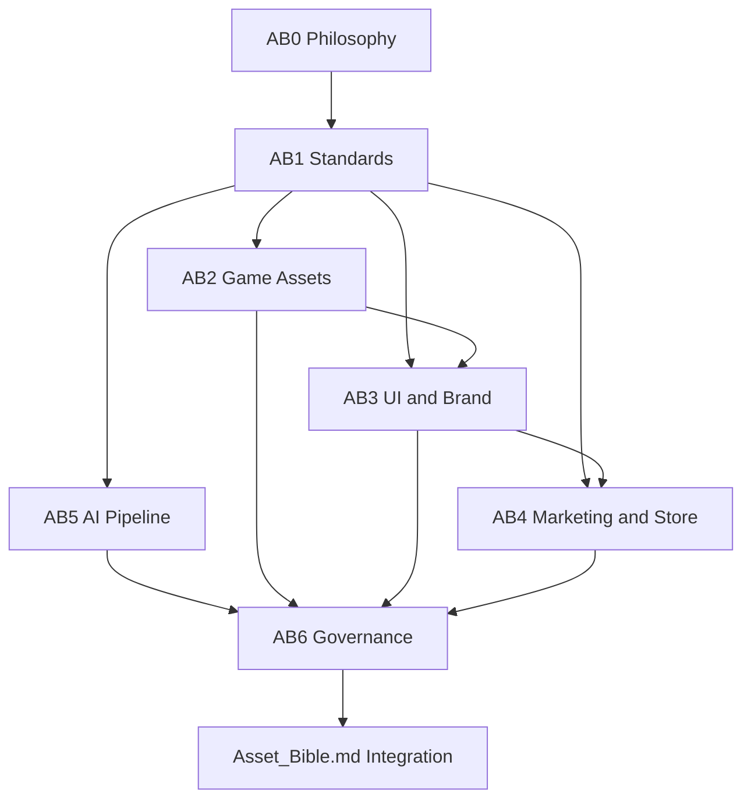

# Asset Bible

| Field | Value |
|-------|-------|
| **Project** | Labyrinth Legends |
| **Document Name** | Asset Bible |
| **Document ID** | Asset_Bible |
| **Series** | Labyrinth Legends Asset Bible — Integration |
| **Version** | 1.0.1 |
| **Status** | Approved |
| **Owner** | Apoorv |
| **Prepared By** | ChatGPT (specification) · Cursor (compiler) |
| **Last Updated** | 2026-07-02 |
| **Path** | `docs/06_Asset_Bible/Asset_Bible.md` |
| **Parent** | [AB0](AB0_Asset_Philosophy_Production_Principles.md) · [AB1](AB1_Production_Standards.md) · [AB2](AB2_Game_Assets.md) · [AB3](AB3_UI_Brand_Assets.md) · [AB4](AB4_Marketing_Store_Assets.md) · [AB5](AB5_AI_Production_Pipeline.md) · [AB6](AB6_Review_Asset_Lifecycle.md) |
| **Children** | [Technical Documentation](../04_Technical/Architecture.md) |
| **Dependencies** | [Vision](../00_Project/Vision.md) · [Gameplay](../01_Game_Design/Gameplay/Gameplay.md) · [LLDL](../02_Design_System/LLDL/LLDL.md) · AB0–AB6 *(locked workshops)* |
| **Related Documents** | [Asset Bible README](README.md) · [AGENTS.md](../../AGENTS.md) · [99_Reviews](../99_Reviews/README.md) |

## Navigation

| ← Previous | Next → | Index |
|------------|--------|-------|
| [AB6 — Review & Asset Lifecycle](AB6_Review_Asset_Lifecycle.md) | [Architecture](../04_Technical/Architecture.md) | [Asset Bible README](README.md) · [Documentation Home](../README.md) |

---

## Version History

| Version | Date | Author | Summary |
|---------|------|--------|---------|
| 1.0.0 | 2026-07-02 | ChatGPT / Cursor | Initial integration document — entry point for locked AB0–AB6 workshops |
| 1.0.1 | 2026-07-02 | Cursor | Status hygiene pass — lifecycle aligned across Asset_Bible.md, Asset Bible README, and review package 0035 after Codex review |

## Change Log

| Version | Change |
|---------|--------|
| 1.0.0 | Initial integration: architecture, workshop summaries, flow, ownership map, lifecycle reference, usage guide |
| 1.0.1 | Codex review hygiene — document status, index, and review package lifecycle states aligned; ChatGPT review notes recorded in 0035 |

---

## Document Authority

**This document is the integration guide and single entry point for the Labyrinth Legends Asset Bible.**

| Conflict type | Authority |
|---------------|-----------|
| Product intent | [Vision](../00_Project/Vision.md) wins |
| Mechanical meaning | [Gameplay](../01_Game_Design/Gameplay/Gameplay.md) wins |
| Visual language | [LLDL](../02_Design_System/LLDL/LLDL.md) wins |
| Workshop content (philosophy, standards, domains, collaboration, governance) | **AB0–AB6 win** — this document summarizes and links only |
| Production knowledge integration and navigation | **Asset_Bible.md wins** |
| Implementation (code, engine, services) | [Technical Documentation](../04_Technical/Architecture.md) wins |

This document **integrates** locked workshops. It does **not** extend, modify, or replace them. If integration prose appears to conflict with any workshop, the workshop wins until [Decisions](../00_Project/Decisions.md) records an explicit Human-approved exception.

---

## Table of Contents

1. [Introduction](#1-introduction)
2. [Asset Bible Architecture](#2-asset-bible-architecture)
3. [Workshop Overview](#3-workshop-overview)
4. [Production Knowledge Flow](#4-production-knowledge-flow)
5. [Dependency Architecture](#5-dependency-architecture)
6. [Ownership Model](#6-ownership-model)
7. [Asset Bible Lifecycle](#7-asset-bible-lifecycle)
8. [How To Use The Asset Bible](#8-how-to-use-the-asset-bible)
9. [Relationship To Technical Documentation](#9-relationship-to-technical-documentation)
10. [Conclusion](#10-conclusion)

---

## 1. Introduction

### 1.1 What Is the Asset Bible?

The **Asset Bible** is the production knowledge system for Labyrinth Legends — how visual, interface, marketing, and AI-assisted assets are conceived, produced, reviewed, and maintained in alignment with [Vision](../00_Project/Vision.md), [Gameplay](../01_Game_Design/Gameplay/Gameplay.md), and [LLDL](../02_Design_System/LLDL/LLDL.md).

It is not a single monolithic specification. It is **seven locked workshops** (AB0–AB6) plus this **integration document** — compiled so every production decision traces to one authoritative source.

### 1.2 Why Does It Exist?

[LLDL](../02_Design_System/LLDL/LLDL.md) defines *how the game should look and feel*. The Asset Bible defines *how production honors that language at scale* — across artists, AI tools, vendors, documentation, and years of iteration.

Without the Asset Bible, production drifts: parallel visual dialects, unreviewed AI output, misleading marketing, and documentation that contradicts gameplay truth.

### 1.3 Who Should Read This Document?

| Reader | Start here to… |
|--------|----------------|
| **New contributors** | Orient before diving into workshops |
| **Artists & designers** | Find which workshop governs their work |
| **Engineers & technical artists** | Understand where production knowledge ends and implementation begins |
| **Producers** | See how workshops compose a production system |
| **AI agents** | Discover required reading before generating assets or docs |
| **Reviewers** | Understand authority chain and lock order |

Readers who need **depth** on a topic open the linked workshop — not this integration summary.

### 1.4 How Should It Be Used?

1. **Orient** — read this document once for architecture and flow
2. **Route** — use [§6 Ownership Model](#6-ownership-model) to find the correct workshop
3. **Execute** — follow the workshop specification for production work
4. **Govern** — follow [AB6](AB6_Review_Asset_Lifecycle.md) for review, lock, and lifecycle
5. **Implement** — cross into [Technical Documentation](../04_Technical/Architecture.md) only after production knowledge is approved

### 1.5 Relationship to Vision, Gameplay, and LLDL

```text
Vision.md      — why the game exists
Gameplay.md    — how the game works
LLDL.md        — how the game looks, feels, and communicates
    ↓
Asset Bible (AB0–AB6) — how production honors the above
    ↓
Technical Documentation — how approved knowledge is built and shipped
```

The Asset Bible **never redefines** Vision, Gameplay, or LLDL. It extends LLDL into **production behavior** only.

---

## 2. Asset Bible Architecture

The Asset Bible consists of **seven complementary workshops** — each with one primary responsibility, explicit boundaries, and a defined place in the production knowledge stack.

```text
AB0 — Philosophy        Why production discipline exists
AB1 — Standards         How production operates universally
AB2 — Game Assets       What playable-world assets are
AB3 — UI & Brand        What in-product interface experiences are
AB4 — Marketing & Store What public brand communication is
AB5 — AI Pipeline       How humans and AI collaborate
AB6 — Review & Lifecycle How knowledge stays trustworthy
        ↓
Asset_Bible.md (this document) — integration and entry point
```

| Workshop | Layer | One-line role |
|----------|-------|---------------|
| [AB0](AB0_Asset_Philosophy_Production_Principles.md) | Foundation | Production philosophy and beliefs |
| [AB1](AB1_Production_Standards.md) | Foundation | Universal operating standards |
| [AB2](AB2_Game_Assets.md) | Domain | Playable-world asset systems |
| [AB3](AB3_UI_Brand_Assets.md) | Domain | Interface and in-product brand |
| [AB4](AB4_Marketing_Store_Assets.md) | Domain | Public brand communication |
| [AB5](AB5_AI_Production_Pipeline.md) | Operations | Collaborative AI-assisted production |
| [AB6](AB6_Review_Asset_Lifecycle.md) | Governance | Knowledge review, lifecycle, preservation |

Workshops are **locked** (`Approved — Locked`). Changes require version bump, review package, and Human approval per [AB6](AB6_Review_Asset_Lifecycle.md).

This integration document introduces **no new production systems** — it explains how locked workshops fit together.

---

## 3. Workshop Overview

Each subsection summarizes one workshop. For specifications, open the workshop document.

### 3.1 AB0 — Asset Philosophy & Production Principles

| Field | Summary |
|-------|---------|
| **Purpose** | Philosophical foundation for all asset production |
| **Primary responsibility** | Why production discipline exists; beliefs about quality, AI, lifecycle, collaboration |
| **Governs** | Production philosophy, AI posture, lifecycle beliefs, governance culture |
| **Does not govern** | Specifications, formats, naming syntax, domain asset definitions |
| **Relationship** | Parent to AB1–AB6; subordinate to Vision, Gameplay, LLDL |

→ Full specification: [AB0_Asset_Philosophy_Production_Principles.md](AB0_Asset_Philosophy_Production_Principles.md)

### 3.2 AB1 — Production Standards

| Field | Summary |
|-------|---------|
| **Purpose** | Universal production operating standards for the studio |
| **Primary responsibility** | How production behaves — governance culture, collaboration, sustainability, asset state model |
| **Governs** | Universal standards, ownership culture, approval philosophy, state model foundation |
| **Does not govern** | Domain asset specs, formal gate metrics (AB6), AI operating detail (AB5) |
| **Relationship** | Inherits AB0; parent standard for AB2–AB6 |

→ Full specification: [AB1_Production_Standards.md](AB1_Production_Standards.md)

### 3.3 AB2 — Game Assets

| Field | Summary |
|-------|---------|
| **Purpose** | Production specification for playable-world visual systems |
| **Primary responsibility** | Seven in-maze asset systems — explorer, environment, puzzle, collectible, props, feedback, supporting |
| **Governs** | In-maze visuals, readability in gameplay context, system reuse within the labyrinth |
| **Does not govern** | UI chrome (AB3), marketing imagery (AB4), gameplay rules |
| **Relationship** | Inherits AB0–AB1; boundary with AB3 at maze vs interface chrome |

→ Full specification: [AB2_Game_Assets.md](AB2_Game_Assets.md)

### 3.4 AB3 — UI & Brand Assets

| Field | Summary |
|-------|---------|
| **Purpose** | Production specification for player-facing interface and in-product brand |
| **Primary responsibility** | Six interface experiences — brand, entry, navigation, gameplay UI, progression, system |
| **Governs** | Menus, HUD, splash, loading, in-product logo masters, ceremonial UI framing |
| **Does not govern** | In-maze world assets (AB2), public store/marketing (AB4), LLDL token meaning |
| **Relationship** | In-product brand is authoritative; AB4 extends to public surfaces |

→ Full specification: [AB3_UI_Brand_Assets.md](AB3_UI_Brand_Assets.md)

### 3.5 AB4 — Marketing & Store Assets

| Field | Summary |
|-------|---------|
| **Purpose** | Production specification for public-facing brand communication |
| **Primary responsibility** | Five communication systems — identity, store presence, campaigns, community, brand evolution |
| **Governs** | Store screenshots, campaign key art, press kits, public logo variants |
| **Does not govern** | Marketing strategy, ASO, budgets, in-product UI (AB3) |
| **Relationship** | Extends AB3 brand to public touchpoints; must amplify reality honestly |

→ Full specification: [AB4_Marketing_Store_Assets.md](AB4_Marketing_Store_Assets.md)

### 3.6 AB5 — AI Production Pipeline

| Field | Summary |
|-------|---------|
| **Purpose** | Operating model for collaborative AI-assisted production |
| **Primary responsibility** | Five collaborative systems — philosophy, roles, workflow, quality, evolution |
| **Governs** | Human vs AI ownership, documentation-first context, tool-independent workflows |
| **Does not govern** | Prompt libraries, vendor manuals, domain asset design, formal gate metrics (AB6) |
| **Relationship** | Operationalizes AB0 AI philosophy and AB1 governance for all domains |

→ Full specification: [AB5_AI_Production_Pipeline.md](AB5_AI_Production_Pipeline.md)

### 3.7 AB6 — Review & Asset Lifecycle

| Field | Summary |
|-------|---------|
| **Purpose** | Governance for production knowledge stewardship |
| **Primary responsibility** | Five governance systems — governance, lifecycle, change management, improvement, preservation |
| **Governs** | Review gates, documentation lifecycle, lock order, status hygiene, traceability |
| **Does not govern** | Asset design, AI workflows, git/CI/CD, integration prose (this document) |
| **Relationship** | Formalizes AB1 state model; governs all workshops including this integration doc |

→ Full specification: [AB6_Review_Asset_Lifecycle.md](AB6_Review_Asset_Lifecycle.md)

---

## 4. Production Knowledge Flow

Production knowledge accumulates in dependency order. Each layer assumes the layers above are truthful.



| Stage | Workshop | Question answered |
|-------|----------|-----------------|
| **Philosophy** | AB0 | *Why do we produce this way?* |
| **Standards** | AB1 | *How does production operate?* |
| **Playable world** | AB2 | *What do in-maze assets communicate?* |
| **Interface** | AB3 | *How does chrome support the adventure?* |
| **Public brand** | AB4 | *How do we present the game honestly off-device?* |
| **Collaboration** | AB5 | *How do humans and AI produce together?* |
| **Governance** | AB6 | *How does knowledge stay trustworthy?* |
| **Integration** | Asset_Bible.md | *How does it all connect?* |

Domain workshops (AB2–AB4) may be **read in parallel** after AB1 — but **lock order** remains sequential: AB0 → AB1 → AB2 → AB3 → AB4 → AB5 → AB6.

---

## 5. Dependency Architecture

Authority flows **downward** — never upward.

```text
Vision.md
    ↓
Game_Loop.md
    ↓
Gameplay.md
    ↓
LLDL.md
    ↓
AB0 → AB1 → AB2 → AB3 → AB4 → AB5 → AB6
    ↓
Asset_Bible.md (integration — navigation only)
    ↓
Technical Documentation (docs/04_Technical/*)
    ↓
Implementation (lib/, test/, assets/)
```

| Layer | Controls | Asset Bible relationship |
|-------|----------|--------------------------|
| **Vision** | Product intent | All workshops must align |
| **Gameplay** | Mechanical truth | AB2/AB3 must not contradict rules |
| **LLDL** | Visual language | All asset workshops extend — never redefine |
| **AB0–AB6** | Production knowledge | Authoritative specifications |
| **Asset_Bible.md** | Integration | Summarizes and routes — does not override |
| **Technical docs** | How to build | Consumes approved production knowledge |
| **Implementation** | What ships | Must comply with LLDL + Asset Bible |

**Conflict protocol:** preserve higher authority → report in review package → escalate to Human Owner → log in [Decisions](../00_Project/Decisions.md) if material.

---

## 6. Ownership Model

When you need an answer, go to the **owning document** — not this integration summary.

| Question type | Read |
|---------------|------|
| Why does this game exist? Product pillars? | [Vision](../00_Project/Vision.md) |
| How does Draw Your Fate work? Puzzle rules? | [Gameplay](../01_Game_Design/Gameplay/Gameplay.md) |
| What color means gold vs cyan? UI tone? | [LLDL](../02_Design_System/LLDL/LLDL.md) |
| Why is production disciplined? AI beliefs? | [AB0](AB0_Asset_Philosophy_Production_Principles.md) |
| Universal approval, ownership, asset states? | [AB1](AB1_Production_Standards.md) |
| Maze tiles, explorer, puzzle device visuals? | [AB2](AB2_Game_Assets.md) |
| HUD, menus, splash, in-product brand? | [AB3](AB3_UI_Brand_Assets.md) |
| Store screenshots, campaigns, press kit? | [AB4](AB4_Marketing_Store_Assets.md) |
| Human–AI collaboration, review discipline? | [AB5](AB5_AI_Production_Pipeline.md) |
| Lock order, review gates, doc lifecycle? | [AB6](AB6_Review_Asset_Lifecycle.md) |
| How workshops connect? Where to start? | **Asset_Bible.md** (this document) |
| Flutter architecture, engine, save system? | [Architecture](../04_Technical/Architecture.md) |
| Screen layout and widgets? | `docs/03_Screens/*` + [Components](../02_Design_System/Components.md) |

### Domain boundaries (quick reference)

| Boundary | Rule |
|----------|------|
| **AB2 / AB3** | In-maze stays AB2; chrome and overlays stay AB3 |
| **AB3 / AB4** | In-product brand authoritative; public extends AB3 |
| **AB5 / AB6** | AB5 defines collaboration; AB6 defines gates and lifecycle |
| **Asset Bible / Technical** | Production knowledge before implementation knowledge |

---

## 7. Asset Bible Lifecycle

Workshop and integration document lifecycle is defined in **[AB6 — Review & Asset Lifecycle](AB6_Review_Asset_Lifecycle.md)**. This section references AB6 only — it does not redefine it.

### Documentation states (summary)

| State | Meaning |
|-------|---------|
| **Draft** | Active authorship |
| **Approved** | Reviewer acceptance |
| **Approved — Locked** | Human-locked; changes require version bump and review |

AB0–AB6 are **Approved — Locked**. This integration document (`Asset_Bible.md`) follows the same lifecycle until Human lock.

### Lock order

```text
AB0 → AB1 → AB2 → AB3 → AB4 → AB5 → AB6 → Asset_Bible.md
```

### Review packages

Major changes require a review package in [docs/99_Reviews/](../99_Reviews/README.md) per [AGENTS.md](../../AGENTS.md) and [AB6 §4](AB6_Review_Asset_Lifecycle.md#4-governance-system).

For full lifecycle diagrams, asset gate formalization, change management, and preservation rules → [AB6](AB6_Review_Asset_Lifecycle.md).

---

## 8. How To Use The Asset Bible

### Recommended reading order

**Everyone (first visit):**

1. This document — `Asset_Bible.md`
2. [AB0](AB0_Asset_Philosophy_Production_Principles.md) — production philosophy
3. [AB1](AB1_Production_Standards.md) — universal standards

**By role (after foundation):**

| Role | Additional reading |
|------|-------------------|
| **Environment / character artists** | [AB2](AB2_Game_Assets.md) |
| **UI / UX designers** | [AB3](AB3_UI_Brand_Assets.md) · [WS4 UI Language](../02_Design_System/LLDL/WS4_UI_Language.md) |
| **Brand / marketing artists** | [AB4](AB4_Marketing_Store_Assets.md) · [AB3 Brand Experience](AB3_UI_Brand_Assets.md#4-brand-experience) |
| **Producers** | [AB1](AB1_Production_Standards.md) · [AB6](AB6_Review_Asset_Lifecycle.md) |
| **AI workflow operators** | [AB5](AB5_AI_Production_Pipeline.md) · [AB0 §5 AI Philosophy](AB0_Asset_Philosophy_Production_Principles.md#5-ai-philosophy) |
| **Engineers / technical artists** | Role-relevant AB2/AB3 workshop · [Architecture](../04_Technical/Architecture.md) |
| **Reviewers** | [AB6](AB6_Review_Asset_Lifecycle.md) · relevant workshop · review package |
| **Future contributors** | This document → AB0 → AB1 → role path above |

### Rules for all contributors

- Do not invent visual language outside [LLDL](../02_Design_System/LLDL/LLDL.md)
- Do not ship unreviewed AI output — per [AB5](AB5_AI_Production_Pipeline.md)
- Do not integrate assets without approval state — per [AB1](AB1_Production_Standards.md) and [AB6](AB6_Review_Asset_Lifecycle.md)
- When in doubt, cite the owning workshop — not this integration summary

---

## 9. Relationship To Technical Documentation

The Asset Bible ends where **production knowledge** ends. **Implementation knowledge** begins in technical documentation.

| Asset Bible (production) | Technical documentation (implementation) |
|--------------------------|------------------------------------------|
| What assets must communicate | How assets are loaded and rendered |
| Approval and lifecycle gates | Folder structure, build integration |
| Domain production specifications | Engine architecture, state management |
| AI collaboration operating model | Coding standards, test strategy |
| Review and governance | CI, save system, Firebase, analytics |

```text
Production Knowledge (AB0–AB6, Asset_Bible.md)
        ↓
Approved assets + documented specs
        ↓
Implementation Knowledge (docs/04_Technical/*)
        ↓
lib/ · test/ · shipped builds
```

**Entry point for implementation:** [Architecture.md](../04_Technical/Architecture.md)

Technical docs must **align with** Asset Bible workshops. They do not override AB0–AB6 on production meaning, approval, or governance.

---

## 10. Conclusion

### Why the Asset Bible exists

Labyrinth Legends targets **premium craft at indie scale** — sustained across worlds, screens, marketing surfaces, AI-assisted workflows, and years of development. The Asset Bible makes that craft **governed** rather than heroic.

### How the seven workshops work together

- **AB0–AB1** establish philosophy and universal standards
- **AB2–AB4** specify domain production — world, interface, public brand
- **AB5** operationalizes human–AI collaboration across all domains
- **AB6** keeps knowledge trustworthy through review, lifecycle, and preservation

### How this supports long-term production quality

Every production decision traces to a **locked workshop**. This integration document makes that system **discoverable** — so new contributors, reviewers, and AI agents enter through one door, then read the authoritative specification for their work.

The Asset Bible is complete when workshops are locked and this guide is approved. Implementation follows — it does not precede — production knowledge.

---

## Related Documents

### Locked workshops

- [AB0 — Asset Philosophy](AB0_Asset_Philosophy_Production_Principles.md)
- [AB1 — Production Standards](AB1_Production_Standards.md)
- [AB2 — Game Assets](AB2_Game_Assets.md)
- [AB3 — UI & Brand Assets](AB3_UI_Brand_Assets.md)
- [AB4 — Marketing & Store Assets](AB4_Marketing_Store_Assets.md)
- [AB5 — AI Production Pipeline](AB5_AI_Production_Pipeline.md)
- [AB6 — Review & Asset Lifecycle](AB6_Review_Asset_Lifecycle.md)

### LLDS

- [Asset Bible README](README.md)
- [Vision](../00_Project/Vision.md)
- [Gameplay](../01_Game_Design/Gameplay/Gameplay.md)
- [LLDL](../02_Design_System/LLDL/LLDL.md)
- [Architecture](../04_Technical/Architecture.md)
- [AGENTS.md](../../AGENTS.md)
