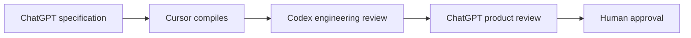
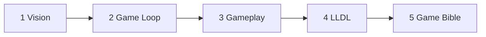

# Labyrinth Legends Documentation System (LLDS)

**Source of truth** for Labyrinth Legends product, gameplay, design language, UI architecture, and technical architecture.

> **Documentation Phase 1** — Foundation complete. Governance, review workflow, and AI workflow are frozen as **Version 1**. From this point, ChatGPT is the authoritative source for game design; Cursor compiles specifications into production documentation.

## Documentation Compiler Workflow

Every major document follows this process:



**Do not bypass this workflow.**

| Role | Responsibility |
|------|----------------|
| **ChatGPT** | Authoritative game design and product specifications |
| **Cursor** | Structure, format, integrate — **not** invent gameplay |
| **Codex** | Validate engineering implications |
| **Human** | Final approval |

## Authoritative Writing Order (Priority 1–5)

Develop in dependency order. **Do not substantially expand lower-priority documents until these five are approved.**

| # | Document | Status |
|---|----------|--------|
| 1 | [Vision](00_Project/Vision.md) | Approved — Locked (v2.1.0) |
| 2 | [Game Loop](01_Game_Design/Game_Loop/Game_Loop.md) · [WS1–WS5](01_Game_Design/Game_Loop/README.md) | Approved — Locked (v2.1.0) |
| 3 | [Gameplay](01_Game_Design/Gameplay/Gameplay.md) | Approved — Locked (v2.1.0) |
| 4 | [LLDL](02_Design_System/LLDL/LLDL.md) | Approved — Locked (v2.0.0) |
| 5 | [Game Bible](01_Game_Design/Game_Bible.md) | Draft — Future document |



Downstream documentation areas such as `docs/04_Technical/`, `docs/06_Asset_Bible/`, and `docs/07_UI/` extend these approved foundations once their upstream authority is established.

## Documentation Priority (conflict resolution)

Authority follows the model defined in [`AGENTS.md`](../AGENTS.md) §6. When documents conflict, the **higher-authority document wins:**

```text
Vision.md
    ↓
Game_Loop.md
    ↓
Gameplay Core Specifications — GP1, GP2, GP7
    ↓
GP3 Puzzle Element Series — GP3.1–GP3.5
    ↓
Gameplay Feature Specifications — GP3 Integration, GP4–GP6
    ↓
Gameplay.md
    ↓
LLDL.md
    ↓
Asset Bible
    ↓
Engineering Architecture / Technical Contracts
    ↓
UI Architecture Documents (`docs/07_UI/`)
    ↓
UI Specification Documents (`docs/07_UI/`)
    ↓
Implementation
```

Lower-level documents may **extend** higher-level documents but may **never redefine** them.

| Domain | Authority |
|--------|-----------|
| Product intent | **Vision** wins |
| Mechanical rules | **Gameplay** wins |
| Design language / visual expression | **LLDL** wins |
| Asset production / lifecycle | **Asset Bible** wins |
| UI-specific architecture and implementation-facing UI specs | **`docs/07_UI/` wins** once approved |
| Runtime architecture / engineering boundaries | **Engineering Architecture / Technical Contracts** win |
| Repository governance | **AGENTS.md** defines it |

If a conflict exists, **preserve the higher-authority document and report the conflict** — do not silently reinterpret the design.

## Quick Start

| I need to… | Read |
|------------|------|
| Understand the game | [Vision](00_Project/Vision.md), [Game Bible](01_Game_Design/Game_Bible.md) |
| Build UI | [LLDL](02_Design_System/LLDL/LLDL.md), [UI Docs](07_UI/README.md), [Components](02_Design_System/Components.md), relevant `03_Screens/` |
| Produce assets | [Asset Bible](06_Asset_Bible/Asset_Bible.md), [LLDL](02_Design_System/LLDL/LLDL.md) |
| Build engine | [Architecture](04_Technical/Architecture.md), [Gameplay](01_Game_Design/Gameplay/Gameplay.md), [Gameplay Specs (GP series)](01_Game_Design/Gameplay/README.md) |
| Start a Cursor task | [Cursor Workflow](05_AI/Cursor/Workflow.md) |
| Review a PR | [Codex Review Checklist](05_AI/Codex/Review_Checklist.md) |
| Hand off a milestone | [99_Reviews](99_Reviews/README.md) |

## Structure

```text
docs/
├── 00_Project/       Vision, roadmap, decisions
├── 01_Game_Design/   Rules, economy, worlds, Gameplay/ (GP1–GP2, GP3/, GP4–GP7)
├── 02_Design_System/ LLDL, tokens, components
├── 03_Screens/       Existing per-screen specs
├── 04_Technical/     Architecture, Firebase, save
├── 05_AI/            Cursor + Codex workflows
├── 06_Asset_Bible/   Asset production standards, AI pipeline, store/marketing assets
├── 07_UI/            UI architecture, UI principles, layout rules, component and screen specifications
├── 99_Reviews/       Milestone review packages (handoff artifacts)
└── assets/           Mockups and references (not Flutter bundles)
```

## UI Documentation Area

`docs/07_UI/` is the authoritative documentation area for **UI architecture**, **UI principles**, **UI design-system application**, **UI layout rules**, **UI component specifications**, **screen specifications**, **animation guidelines**, **responsive behavior**, and **UI asset usage**.

Its authority is:

```text
Vision / Gameplay / LLDL / Asset Bible / Engineering Architecture
    ↓
docs/07_UI/
    ↓
Flutter UI implementation
```

LLDL remains the authoritative **design architecture** reference. `docs/07_UI/` governs **UI-specific architecture** and **implementation-facing UI specifications** that apply LLDL, Asset Bible guidance, and engineering boundaries to Flutter UI work.

## Document Standards

Every priority document includes:

- Purpose, Scope, Dependencies, Related Documents
- Version, Status, Last Updated
- Cross References and Version History
- Mermaid diagrams and tables where appropriate
- Placeholders until ChatGPT specification is compiled

Avoid duplicate information — link to authoritative documents.

## Future Documentation

Planned first-class artifacts not yet authored:

| Document | Description | Authority |
|----------|-------------|-----------|
| [Game Bible](01_Game_Design/Game_Bible.md) | Narrative and world detail integrated with Vision and Game Loop. | Vision.md → Game Bible |

The **Asset Bible** is authored: workshops [AB0–AB6](06_Asset_Bible/README.md) are **Approved — Locked**; integration entry point is [Asset_Bible.md](06_Asset_Bible/Asset_Bible.md).

## Archive

`docs/second-brain/` — superseded by LLDS. See [second-brain/README.md](second-brain/README.md). **Not authoritative** for new work.

## Prototype Code

Existing `lib/` code is reference-only until design system rebuild. See [Prototype Status](00_Project/Prototype_Status.md).

## Governance (frozen v1)

- Review packages: [99_Reviews/README.md](99_Reviews/README.md)
- Agent roles: `AGENTS.md`
- Cursor rules: `.cursor/rules/labyrinth-legends.mdc`
