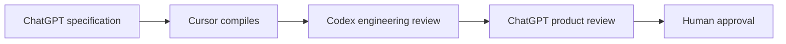
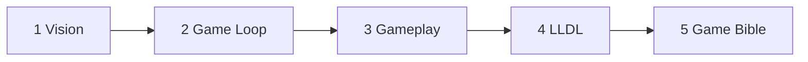

# Labyrinth Legends Documentation System (LLDS)

**Source of truth** for Labyrinth Legends design, screens, and technical architecture.

> **Documentation Phase 1** — Foundation complete. Governance, review workflow, and AI workflow are frozen as **Version 1**. From this point, ChatGPT is the authoritative source for game design; Cursor compiles specifications into production documentation.

## Documentation Compiler Workflow

Every major document follows this process:



**Do not bypass this workflow.**

| Role | Responsibility |
|------|----------------|
| **ChatGPT** | Authoritative game design and product specifications |
| **Cursor** | Structure, format, integrate — **not** invent gameplay |
| **Codex** | Validate engineering implications |
| **Human** | Final approval |

## Authoritative Writing Order (Priority 1–5)

Develop in dependency order. **Do not substantially expand lower-priority documents until these five are approved.**

| # | Document | Status |
|---|----------|--------|
| 1 | [Vision](00_Project/Vision.md) | Draft — Pending Review (v2.0.0) |
| 2 | [Game Loop](01_Game_Design/Game_Loop.md) · [WS1–WS5](01_Game_Design/Game_Loop/README.md) | Draft — v2.0.0 architecture, pending review |
| 3 | [Gameplay](01_Game_Design/Gameplay.md) | Draft for Review — GP integration (v2.0.0) |
| 4 | [LLDL](02_Design_System/LLDL.md) | Draft — Awaiting ChatGPT |
| 5 | [Game Bible](01_Game_Design/Game_Bible.md) | Draft — Awaiting ChatGPT |



## Documentation Priority (conflict resolution)

When documents conflict, **higher number wins:**

1. `02_Design_System/LLDL.md`
2. `02_Design_System/Design_Tokens.md`
3. `03_Screens/*`
4. `01_Game_Design/*`
5. `04_Technical/*`
6. `.cursor/rules/labyrinth-legends.mdc`
7. Current Cursor task prompt

## Quick Start

| I need to… | Read |
|------------|------|
| Understand the game | [Vision](00_Project/Vision.md), [Game Bible](01_Game_Design/Game_Bible.md) |
| Build UI | [LLDL](02_Design_System/LLDL.md), [Components](02_Design_System/Components.md), relevant `03_Screens/` |
| Build engine | [Architecture](04_Technical/Architecture.md), [Gameplay](01_Game_Design/Gameplay.md), [Mechanics](01_Game_Design/Mechanics.md) |
| Start a Cursor task | [Cursor Workflow](05_AI/Cursor/Workflow.md) |
| Review a PR | [Codex Review Checklist](05_AI/Codex/Review_Checklist.md) |
| Hand off a milestone | [99_Reviews](99_Reviews/README.md) |

## Structure

```text
docs/
├── 00_Project/       Vision, roadmap, decisions
├── 01_Game_Design/   Rules, economy, worlds, Gameplay/ (GP1–GP2, GP3/, GP4–GP7)
├── 02_Design_System/ LLDL, tokens, components
├── 03_Screens/       Per-screen specs
├── 04_Technical/     Architecture, Firebase, save
├── 05_AI/            Cursor + Codex workflows
├── 99_Reviews/       Milestone review packages (handoff artifacts)
└── assets/           Mockups and references (not Flutter bundles)
```

## Document Standards

Every priority document includes:

- Purpose, Scope, Dependencies, Related Documents
- Version, Status, Last Updated
- Cross References and Version History
- Mermaid diagrams and tables where appropriate
- Placeholders until ChatGPT specification is compiled

Avoid duplicate information — link to authoritative documents.

## Archive

`docs/second-brain/` — superseded by LLDS. See [second-brain/README.md](second-brain/README.md). **Not authoritative** for new work.

## Prototype Code

Existing `lib/` code is reference-only until design system rebuild. See [Prototype Status](00_Project/Prototype_Status.md).

## Governance (frozen v1)

- Review packages: [99_Reviews/README.md](99_Reviews/README.md)
- Agent roles: `AGENTS.md`
- Cursor rules: `.cursor/rules/labyrinth-legends.mdc`
